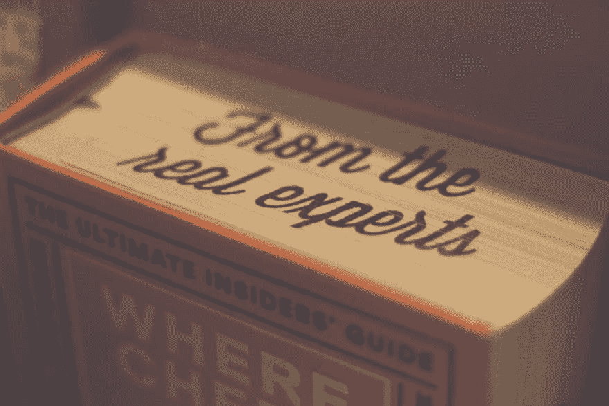

# 编程书籍值你的钱吗？

> 原文：<https://dev.to/roelofjanelsinga/are-programming-books-worth-your-money-2b0j>

[T2】](https://res.cloudinary.com/practicaldev/image/fetch/s--7xCpzStw--/c_limit%2Cf_auto%2Cfl_progressive%2Cq_auto%2Cw_880/https://thepracticaldev.s3.amazonaws.com/i/ywqtd0k5ocmsmcfdvbc9.jpg)

# 编程书籍值你的钱吗？

你们都在网上或者书店里看到过编程的书。但我们大多数人都知道，这些书通常不再相关，大多数都过时了。那么该不该买呢？我认为你应该，但是有几个条件。

## 成熟的语言

语言的成熟度对于这本书的相关性非常重要。这里我用两个例子。我给 AngularJS 买了一本学习语言的书。当时它已经有几年的历史了，所以这本书经过了一些修改，更加符合 AngularJS 的实际工作方式。快进两年，我买了一本 Angular 2 的书。Angular 2 此时仍处于测试阶段，并且在不断变化。我根本用不了这本书，因为它是在 Angular CLI 存在之前写的，这使得这本书毫无用处。我唯一能用它来弄清楚语言的概念是什么，但是实际的编码例子是不相关的。

## 应用书籍&个人技能

关于使用 Apache Spark 进行数据分析的书籍确实很有趣，但是如果您不知道如何设置服务器或使用数据库，您将无法使用它们。你应该得到帮助你提高技能的书，而不是对你自己的技能水平来说太复杂的书。你最终会感到愚蠢和没有动力。通过练习和更多的练习，你会达到那个水平。从你自己的水平开始，或者理想情况下，比你的水平高一点来提高你的技能。如果你刚开始，买一些普通的知识书籍。它们将帮助你开始理解一门语言或技术是如何工作的，并且帮助你建立一个建立技能的基础。如果你从一开始就得到非常具体的书籍，比如“Python 的机器学习”，而不是从“Python:初学者指南”开始，你就不会理解为什么程序的某些部分会有这样的行为。

## 现实生活应用

我是一名 PHP 和 Javascript 程序员，这就是为什么从头开始学习 Python 没有什么意义。它不会帮助我更好地完成我的工作。然而，从另一种语言中了解一些东西绝对不是一件坏事。也许你需要开发一个新的应用程序，而你目前的编程语言太局限了，无法完成这个任务。嗯，那你就有很好的理由使用另一种更适合这项任务的语言。这个项目将帮助你开发新的技能，建立一个比你在学习这门新语言之前更好的应用程序。我要说的是，如果你是一名 Javascript 开发人员，不要开始学习 C++之类的东西。这不会给你带来立竿见影的效果，而且很可能会耗费你大量的时间。我的建议是慢慢走向语言，不要在那里冲刺。

书籍可能是学习一门新编程语言的绝佳途径，但请记住，这门新语言应该是你可以实现的。让体验开阔眼界，富有挑战性，但不要让它成为不可能完成的任务。当你挑战自己时，你会很快学会新的语言。如果你让它变得不可能，你就再也碰不到这本书了。确保你决定买书的语言是你最终会用很多时间的，否则你会把它忘得一干二净，你会浪费你的时间。

你有没有发现帮助你学习一门新语言的令人惊叹的编程书籍？在 [Twitter](https://twitter.com/RJElsinga) 上与我分享吧！