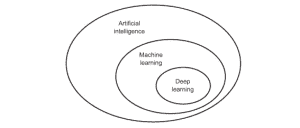

# 人工智能——我相信数学

> 原文：<https://dev.to/apium_hub/artificial-intelligence--in-math-i-trust-5fhl>

人工智能从 70 年代甚至更早就开始塑造我们的世界。对人工智能的投资有三个重要时刻，它们是:

1.  神经元网络——统计机器学习算法，它受到大脑一般信息处理策略的启发，在本文后面我们将对此进行更多讨论。
2.  专家系统，成为第一批真正成功的人工智能(AI)软件。这是一个基于知识的系统的例子，它由两个子系统组成:知识库和推理机。知识库代表了世界的事实。推理机是一个自动推理系统，它评估知识库的当前状态，应用相关规则，然后将新知识加入知识库。主要思想是智能系统从他们拥有的知识中获得力量，而不是从他们使用的特定形式和推理方案中获得力量。
3.  “次优”方法，例如遗传算法、支持向量机/聚类、具有相关学习算法的监督学习模型，其分析用于分类和回归分析的数据。

它始于 1950 年，当时来自计算机科学新兴领域的少数先驱开始询问是否可以让计算机“思考”——什么是机器学习？Manning.com- 。

如今，电视和媒体上展示的大多数当前的人工智能对我们的人口是有害和危险的(试图摧毁地球的疯狂机器人或追求接管地球的终结者)。尽管如此，远离未来的场景，我将讨论人工智能的一些实际应用，以及这种新的机器智能的核心是什么。

**人工智能的内脏**

A.我只不过是将智能注入机器，它是由神经网络中的**激发的**，但实际上它们是非常复杂的数学插值。这些单元之间的联系是以一种非常松散的方式受到生物大脑工作方式的启发。然而，神经科学家总是试图避免这个术语，因为它可能会造成混乱。人工智能是通过改变连接强度来从经验中学习，因此定义了神经元相互影响的强烈程度。它经历三个阶段:学习、执行和自我修正。它基本上是给计算机插入了“经验”这个因素，所以每次做出某个动作，计算机都可以从中学习和改进。

为了做到这一点，A.I .使用了一种称为机器学习的过程，这种过程使计算机能够在没有显式编程的情况下进行学习，以及深度学习，这是人工神经网络领域架构的子集。

让我们从内心开始，走向大局。

**深度学习**

目前，它是最广泛的人工智能领域，因为它是使机器学习和生物型思维更接近的工具。深度学习是深度结构化学习或分层学习，它是基于学习数据表示的更广泛的机器学习方法家族的一部分，与特定于任务的算法相反。它模仿生物的大脑神经网络，以便通过两种方式做出一定数量的模式:*大数据和大量的计算机能力。* [深度神经网络、深度信念网络、递归神经网络等深度学习架构](https://en.wikipedia.org/wiki/Deep_learning)已经应用于包括计算机视觉、语音识别、自然语言处理、音频识别、社交网络过滤、机器翻译、生物信息学等领域。希望提高效率、比竞争对手更快创新的公司对它的需求越来越大。

历史上，计算机方法在识别模式或相互关系方面非常糟糕，有了神经网络，这变得简单得多。它把复杂的关系分解成简单的关系。

当我们处理少量数据时，像 SVM ( [支持向量机](https://en.wikipedia.org/wiki/Support_vector_machine))这样的方法可能是一个不错的选择。然而，随着当前 I.O.T(物联网)的趋势，一切都在数字化，公司开始随时处理越来越多的数据集。为了能够管理这些数量的数据，我们必须在我们的战略中实施深度学习。

图片看起来会像这样:

[T2】](https://apiumhub.com/wp-content/uploads/2018/01/ai.png)

*什么是机器学习？Manning.com-*

**机器学习**

最大的公司使用机器学习来宣布他们的最新创新。总而言之，这是一个经过算法训练的软件，允许它从过去的信息中学习，从人类的经验中学习，并从他们遇到的数据中产生洞察力，并将其应用于未来的决策。机器学习是预测分析领域众所周知的。机器学习允许研究人员、数据科学家、工程师和分析师产生可靠的、可重复的决策和结果，并通过从数据的历史关系和趋势中学习来揭示隐藏的见解。

举个例子，

*   计算机程序被认为从关于一些任务 T 的经验 E 中学习，并且如果它在任务 T 中的性能(由 P 测量)随着经验 E 而提高，则执行测量 P。

↓

*   如果一个计算机程序可以根据过去的经验提高某个类的性能，那么你可以说它已经学会了。

我们通常将机器学习分为三种不同的名称:*监督学习、非监督学习和强化学习。*

监督学习–从分析已知的训练集开始，算法开发一个函数来预测输出值。–*Expertsystem.com*

无监督学习-它探索数据，并可以从数据集得出推论，以描述未标记数据的隐藏结构。–*专家系统*。com

强化学习——这种方法是通过扮演角色和寻找错误或奖励来与环境互动。它允许系统在其环境中找到最佳行为，以最大化其性能。–*专家系统*。com

**当前形势**

许多哲学家认为生命是机械的 ***“生命就像一个钟表机构”——笛卡尔。*T3】**

在人类的历史中，一直需要理解人类的思维方式，以及生物思维从一开始就是最强大的机器。

品牌和公司一直在努力以更好的方式理解、拥有和管理我们一直在使用的大量信息。现在，可能所有你日常使用的仪器、工具和东西都是基于数字功能的。这在大量数据中发展，告诉公司关于我们的一切，我们喜欢什么，我们说什么，持续多长时间，我们愿意改变什么，什么是我们碰不到的。人工智能帮助这些公司管理和控制这些信息，提高流程的效率。

五大巨头——苹果、谷歌、微软、脸书和亚马逊——正在通过使用深度学习神经网络来实现他们的商业市场和产品。

2015 年，谷歌推出了它来提高他们的语音识别能力，亚马逊推出了他们的人工智能产品 Alexa，苹果推出了 Quicktype。回到谷歌，2016 年，谷歌数据科学家中所有推理计算能力的 30%用于 LSTM。

LSTMs(长短期记忆网络)是深度学习算法使用的神经元网络。因为他们，现在在 2017 年，脸书每天改进超过 45 亿次翻译。

## **人工智能——案例分析**

前几天我参加了一个会议，发言的人提到他是亚马逊的忠实粉丝。他喜欢它的一切！从它的商业模式，技术，他们是如何成长的，特别是通过给他们的客户提供更好的服务来解决和消除市场上每一个竞争者的策略。此外，如果我们看他们的标志，你会看到亚马逊和一个从第一个 A 开始指向 Z 的箭头。从 A 到 Z，他们拥有一切，他们拥有市场。你能想到的一切你都能在亚马逊找到。

他详细介绍了亚马逊推出的一款特殊产品，纯人工智能——Alexa。这是对整个知识容量的另一个参考(亚历山大图书馆)。Alexa 是苹果 Siri 的现代升级版。Alexa 是你的生命。它可以控制你的冰箱，告诉你啤酒快用完了，只需点击一下应用程序，Amazon Go 就可以在不到一个小时的时间内，在你家开始供应啤酒。

另一个例子，Alexa 有语音识别功能，这意味着它可以教育你的孩子。当你的孩子让 Alexa 买甜甜圈时，它可以给出父母之前计算的建议，例如:“你为什么不出去跑步”/“如果我们买苹果呢”？

所有这些都是通过使用人工智能来完成的。我相信，在亚马逊与微软最近的合作之后，还会有更多的事情发生。他们将所有这些神经元类型的系统放入算法中，将“经验因素”添加到等式中。

有些人认为，除了人工智能本身会给社会带来的积极影响之外，它还会破坏社会，消除生产过程中的一些人为因素。最具灾难性的观点甚至声称，它很可能会把我们视为智慧较低的生物，并将我们消灭掉。我的观点很接近那些兴奋的人，就像工业革命一样，它将改变社会，使社会发展，很可能改变一些现有的工作。

我同意尼尔·德格拉斯·泰森的说法:“机器人取代了我们的工作，聪明点，创造出新的东西”。

最后，我想和你们分享尼尔关于人工智能和恐惧的另一个非常好的说法:“如果你现在想的都是工作，并且你预测未来，也许有一天机器人会接管我们的每一份工作……今天！！！但这不是未来。我们社会中有创新的人，他们开发新的东西，我们进化。正如我之前提到的，我们一直都在这样做，我们的工作需要管理这些机器，发明它们，构思它们或者设计它们。尼尔·德格拉斯·泰森

如果你喜欢这篇关于人工智能的文章，你可能也会喜欢:

*   [大数据和体育](https://dev.to/apium_hub/big-data--application-into-sports-industry-aif)

*   [虚拟现实与技术](https://apiumhub.com/tech-blog-barcelona/virtual-reality-technology/)

*   [游戏化](https://dev.to/apium_hub/gamification-apps--embracing-the-power-of-a-play-bep)

*   [NewCo 2017](https://dev.to/apium_hub/newco-some-of-the-leading-startups-in-barcelona-960)

*   [加泰罗尼亚和公投带来的经济影响](https://dev.to/apium_hub/newco-some-of-the-leading-startups-in-barcelona-960)

帖子[人工智能——我相信数学](https://apiumhub.com/tech-blog-barcelona/artificial-intelligence/)首先出现在 [Apiumhub](https://apiumhub.com) 上。