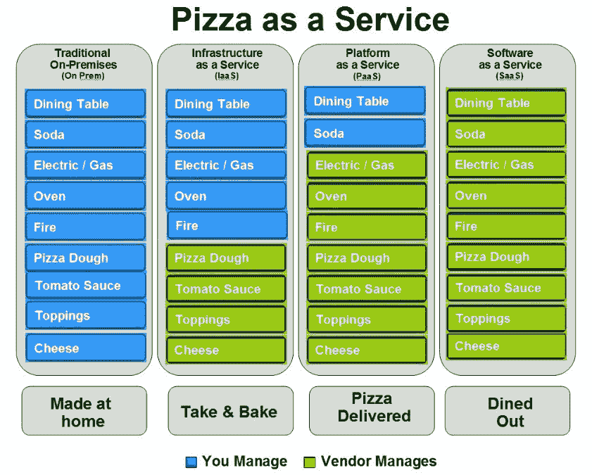

# 作为一项服务

> 原文：<https://dev.to/funkysi1701/as-a-service-4fa2>

在云计算中，有很多术语以“即服务”或“即服务”结尾。在我开始写这个列表之前，大多数我都没听说过。

任何通过互联网交付的服务，而不是本地托管在您的网络或 PC 上的服务，理论上都可以称为“即服务”。

[T2】](https://res.cloudinary.com/practicaldev/image/fetch/s--J9WfN20N--/c_limit%2Cf_auto%2Cfl_progressive%2Cq_auto%2Cw_880/https://storageaccountblog9f5d.blob.core.windows.net/blazor/wp-content/uploads/2015/05/19656ee.jpg%3Fw%3D841%26ssl%3D1)

**平台即服务平台**

这是其中一个大的。微软 Azure 提供了我所熟悉的平台即服务。平台即服务是指提供商提供一个平台，您可以在其中构建应用程序或网站。

**SaaS 软件即服务**

另一个流行的。“软件即服务”可以像一个网站运行客户想要使用的服务一样简单，我为一家提供 SaaS 产品的公司工作。

**IaaS 基础设施即服务**

最后一个大的。Iaas 的一个很好的例子是虚拟机，它可以托管在某个地方的服务器(私有云)上，也可以通过 Azure(公共云)等公司托管在互联网上。Pizza as a Service 图说明了 Saas、PaaS 和 IaaS 之间的区别。

**NaaS 网络即服务**

这只是一种专门提供网络的 IaaS。任何提供网络连接的东西都可以包括在这个类别中。

**CaaS 通信即服务**

IaaS 的另一个子类型这次专门研究通信，这可能包括 IP 语音或其他类似技术。

**monas 监控即服务**

如果您有 SaaS、PaaS 或 IaaS，您很可能希望监控它是否正常工作，我当然也是这样。这通常包含在您的 IaaS 或 PaaS 包中。Azure 有各种监控工具，这可以包括在这个类别中。

**BaaS 备份即服务**

随着云存储的增长及其成本的降低，备份到云是一个非常有吸引力的选择。任何允许您从 internet 备份和恢复的服务都可以包含在此类别中。您的提供商需要管理您的备份，使其成为真正的 BaaS，而不仅仅是存储文件的另一个地方。

**DaaS 桌面即服务**

这是您的桌面被可视化并存储在云中的地方。我对此知之甚少，因为我从来没有使用过它，但我想你需要一个强大的互联网连接，它才能可靠地工作。

**DBaaS 数据库即服务**

这是一个简单的问题，如果你的数据库像 Azure SQL 数据库一样存储在云中，那么它就属于这一类。如果您在虚拟机上运行自己的 sql server 安装，那么它不属于这一类别，因为您仍然自己管理它，并且是 IaaS

**哈斯硬件即服务**

HaaS 这是 IaaS 的另一个子类，专注于硬件。

**IDaaS 身份即服务**

这就是在云中管理你是谁的地方。如果一个网站重定向到一个特定的 IDaaS，确定你是否是你所说的那个人，就可以实现单点登录。Azure Active Directory 就是一个例子。

**SaaS 存储即服务**

您现在明白了，在远程云产品上存储文件是存储即服务的一个例子。DropBox 或 OneDrive 就是很好的例子。

**FoaaS F Off As a Service**

。NetRocks 在几周前提到了这一点，是一个作为服务的笑话。http://foaas.herokuapp.com/的想法是，你可以用这项服务告诉人们走开。

写这篇博文让我对所有现存的 aaS 有了更好的理解。我确信我没有很好地解释其中的一些，毫无疑问我漏掉了一些。