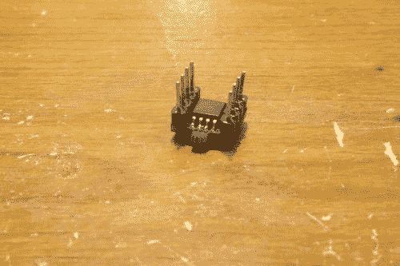
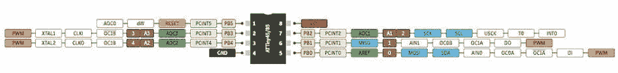
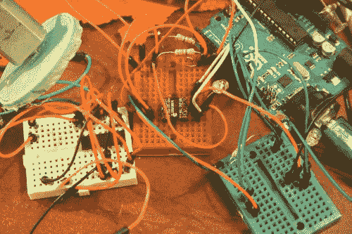
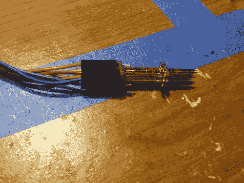
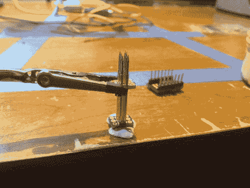
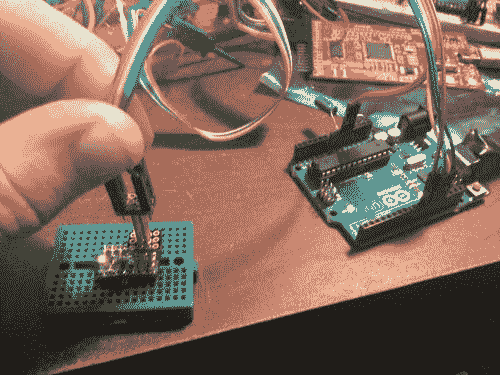

# 阿蒂尼冒险——84/85 年阿蒂尼的 I2C

> 原文：<https://dev.to/ladvien/attiny-adventure-i2c-on-attiny-8485-26ka>

[代码](///files/Arduino_to_ATtiny_85__through_I2C_2_4.zip)

[https://www.youtube.com/embed/gxLbelXcy1I](https://www.youtube.com/embed/gxLbelXcy1I)

更新:增加了制作 SPI 编程夹具的信息(让生活变得更容易)。

更新:增加了 ATtiny 84 的信息(尽管这篇文章是为 ATtiny 85 准备的)。

我对非传统的微控制器有点好奇。然后，我必须为一些真正便宜的愚蠢的东西(一些用于 LiPo 充电器电路的 SOT-23 N-Channels)下一个 Digi-Key 订单，我想，“管他呢，让我们订购一些 ATTiny 85s 吧。”像我这样的小气鬼，我点了 SMD:

*   阿蒂尼 85 号-SOIC 8 号(每个 1.25 美元)

然后我跑到 OSHPark，为它做了一个小小的突破:

*   [ATTiny 85 - SOIC-8 分线板](http://www.oshpark.com/shared_projectss/lcmVFzMW)(3 个 0.85 美元，每个 0.28 美元)
*   [ATtiny 84 - SOIC-14 分线板，带弹簧针接头](http://www.oshpark.com/shared_projectss/MBPvF8Qb)(3 个 1.85 美元)。

这使得一块 ATTiny 85 主板的价格达到了每块 1.53 美元。这很棒，因为 ATTiny 85 有一个高达 8mhz 的内部振荡器，允许它在没有任何无源的情况下运行**。**

[T2】](https://res.cloudinary.com/practicaldev/image/fetch/s--f9DyDrL5--/c_limit%2Cf_auto%2Cfl_progressive%2Cq_auto%2Cw_880/https://ladvien.cimg/IMG_9166.jpg)

他们来的那天我很兴奋。我把它们焊接在一起，在上面加了一些头，然后把它们扔进了面包板。我切换到 Goggle，搜索如何给这些小家伙编程。我找到的第一篇文章是我最终使用的，我只是警告你，亲爱的读者，请仔细阅读，不要错过忽略错误的部分。就我个人而言，就像我这个笨蛋一样，在我发现指令中的警告之前，我对我的第一个小 ATtiny 85 编程了一百次，认为它不起作用:

**"应给出以下错误两次:avrdude:请在 ATtiny 85 的配置文件中定义 PAGEL 和 BS2 信号"**

这个错误意味着你编程成功。

但是你们可能都知道。

*   [用 Arduino 对 ATtiny 85 进行编程](http://www.instructables.com/id/Program-an-ATtiny-with-Arduino/)
*   [用 Arduino 对 ATtiny 84 进行编程](http://www.instructables.com/id/Using-the-Arduino-Uno-to-program-ATTINY84-20PU/)

让 I2C 使用 ATtiny 85 最简单的方法是使用 Arduino 的 TinyWireS 和 TinyWireM [库。](http://playground.arduino.cc/Code/USIi2c)

*   (这是兰博的库，他用 onRequest，onReceive 函数更新了原来的库)
*   [TinyWireM](http://playground.arduino.cc/uploads/Code/TinyWireM.zip)

要使 ATtiny 84 正常工作，您需要增加支持:

*   [TineWireS](https://github.com/svoisen/TinyWire) (支持 ATtiny 84)

它们被开发成可与 Arduino 的电线库相媲美。要安装它们，只需将它们解压缩并放在 Arduino libraries 文件夹中(例如，C:\ Program Files \ Arduino \ libraries)。

[T2】](https://res.cloudinary.com/practicaldev/image/fetch/s--JdOxLMCA--/c_limit%2Cf_auto%2Cfl_progressive%2Cq_auto%2Cw_880/https://ladvien.cimg/attiny_pinout.jpg)

[(这是 ATtiny 84](http://www.ledsandchips.com/upload/cards/attiny.jpg) 的引脚排列)

I2C 的关系非常直接:

*   **Arduino SDA** < - 4.7k 电阻接 5v - > **ATtiny 85 - PB0**
*   **Arduino SCL** < - 4.7k 电阻接 5v - > **ATtiny 85 - PB3**
*   **阿提尼 85 - PB1** < - 330 电阻 LED - > **GND**

以下代码旨在展示这个项目的目的。它将 ATtiny 85 设定为 I2C 奴隶。它通过 I2C 线接收数据，将其解析为一个整数，然后将该整数值写入引脚 1 (PB1)。

```
// the 7-bit address (remember to change this when adapting this example)
#define I2C_SLAVE_ADDRESS 0x4 
// Get this from https://github.com/rambo/TinyWire
#include <TinyWireS.h>  
// The default buffer size, Can't recall the scope of defines right now
#ifndef TWI_RX_BUFFER_SIZE
#define TWI_RX_BUFFER_SIZE ( 16 )
#endif 
//Character variable used to echo data back.
char chrSendData;

//Variables used in getting and parsing data.
char rxChrData; //Receives the data.
char rxString[12];  //Varbiable for holding one string of data.
int rxIndex = 0; //Used to index rxString.

//Integer for holding the pwm value received from master.
int pwmValA;

void requestEvent(){  
  TinyWireS.send(chrSendData);
}

//Handles receiving i2c data.
void receiveEvent(uint8_t howMany)
{
    if (TinyWireS.available()){  
      if (howMany < 1)
      {   // Sanity-check
          return;
      }
      if (howMany > TWI_RX_BUFFER_SIZE)
      {   // Also insane number
          return;
      }

      howMany--;
      if (!howMany)
      {   // This write was only to set the buffer for next read
          return;
      }
      while(howMany--)
      {   //Gets i2c data.
          rxChrData = TinyWireS.receive();
          //Places the characters in an array one at a time.
          rxString[rxIndex] = char(rxChrData);
          //Increment the data array.
          rxIndex++;
          //If a stop character is read, parse the char array and convert it to a single integer. 
          if (rxChrData == ':'){
              //This is a low memory form of parsing the char array into an intger
              pwmValA = int(100*rxString[2]+10*rxString[3]+rxString[4]);
              //Prints the parsed value.
              Serial.println(pwmValA);
              //Writes the parsed value to pin 1 (PB1).
              analogWrite(1, pwmValA);
              //Resets the char array index.
              rxIndex = 0;  
         }
      }
    }
}

void setup()
{
    Serial.begin(9600);
    pinMode(1, OUTPUT); // OC1A, also The only HW-PWM -pin supported by the tiny core analogWrite
    TinyWireS.begin(I2C_SLAVE_ADDRESS);
    //Sets up the onReceive function (what we do if we get stuff).
    TinyWireS.onReceive(receiveEvent);
    //Sets up the onRequest function (what we do if asked to send something).
    TinyWireS.onRequest(requestEvent);
}

void loop()
{
//Detects a stop sending command.
TinyWireS_stop_check();

//Puts the data we got into a variable to send back for error checking.
chrSendData = char(rxChrData);

} 
```

Enter fullscreen mode Exit fullscreen mode

我还包括了我在我的 Arduino Mega 上使用的代码，它被设置为主程序。

您的设置**不应该是这样的:P**

[T2】](https://res.cloudinary.com/practicaldev/image/fetch/s--06tzcILK--/c_limit%2Cf_auto%2Cfl_progressive%2Cq_auto%2Cw_880/https://ladvien.cimg/IMG_9163.jpg)

我有几个想法，我想尝试这个设置。但是，这有点傻。I2C 把 85 针减少到 4 针。但其中一个是复位引脚(PB5)，所以实际上只有 3 个可用引脚。

在我开始与 tiny 一起工作之前，我潜伏在 shoutbox 并监督 proto wrx 聊天，谈论如何将 Tiny 制作成一个串行控制的电机驱动器。于是，我着手去做。我选择了 I2C，因为我想做一个像 [DRV8830](http://dlnmh9ip6v2uc.cloudfront.net/datasheets/BreakoutBoards/drv8830.pdf) (Spark fun 有一个[突破](https://www.sparkfun.com/products/11890))那样的设置。当然，像我这样的笨蛋，在花数小时与芯片交互之前，我不会做简单的数学运算。

大多数 H 桥 IC 要求一个电机有三个引脚。两个数字引脚用于方向，一个用于 PWM。即使降低成本，两个电机使用一个 PWM 引脚，仍然是五个。_ 和...ATtiny 85 有 8 个引脚。1 根电源、1 根接地、2 根 I2C 线，这样我们就有了.... **4 个大头针。**哦等等！其中一个是重置引脚，如果没有 AVR 编程器(我有，但真的很麻烦)，就无法使用它。所以！简而言之，与 ATtiny 接口后，有 3 个可用的引脚。如果我[记得一首 80 年代的经典歌曲](http://www.youtube.com/watch?v=O5ROhf5Soqs)，我就帮了自己一个忙。

尽管如此，我还是想尝试这样做: [2 引脚 HBridge 控件](http://forum.arduino.cc/index.php?topic=133833.0)。只是将 PWM 线路连接在一起。现在运气不太好(只花了大约 20 分钟，想在我忘记废话之前把这个打出来)。

另一个想法是使用软件串行来通过串行线[发送单向通信](http://www.ernstc.dk/arduino/tinycom.html)。但这没有多大意义，因为根据我的意图，4 针并不比 3 针好多少。

好的。总之，我不确定我为什么这么做。除了冒险之外，这真的没什么意义。我确信这是我现在正在做的事情之一，直到很久以后我才会发现它的用处。真正的杀手锏是如何花 3.45 美元在易贝上买一个完整的 Arduino Pro Mini。比 ATtiny 85 贵一倍多一点，但引脚和效用是它的三倍。诶！

**制作 ATtiny 夹具:**

我讨厌面包板。让我承认。主要是，到处都是电线，我小小的阅读障碍大脑跟不上。当我第一次开始使用 ATtiny uCs 时，我发现不得不在完整电路和 SPI 编程电路之间移动小 ATtiny 是一件痛苦的事情。所以，我想，“为什么不做一个 SMD 编程垫和夹具接口？”

好吧，这就是那个粗鲁的混蛋:

[](https://res.cloudinary.com/practicaldev/image/fetch/s--0D4C6U6E--/c_limit%2Cf_auto%2Cfl_progressive%2Cq_auto%2Cw_880/https://ladvien.cimg/IMG_0309.jpg) 这没什么花里胡哨的，但却是省时的。

我把接口板和夹具都放在我的 Eagle 库中。

**POGO_PIN_JIG_SPI**

**POGO_PIN_SPI_PAD**

[拉德维安鹰库](https://github.com/Ladvien/Eagle_Library)

这是我的 ATtiny 84，带有焊盘和夹具 PCB:

[夹具](http://www.oshpark.com/shared_projectss/BjydrnT8)(0.60 美元

[戊二酸 84 多氯联苯](http://www.oshpark.com/shared_projectss/MBPvF8Qb)(1.85 美元)

这些是我用过的弹簧针:

[P100-B1-1.36 毫米直径](http://www.ebay.com/itm/151107292577?ssPageName=STRK:MEWNX:IT&_trksid=p3984.m1439.l2649)

[T2】](https://res.cloudinary.com/practicaldev/image/fetch/s--_yViolRn--/c_limit%2Cf_auto%2Cfl_progressive%2Cq_auto%2Cw_880/https://ladvien.cimg/IMG_0307.jpg)

组装起来并不太难，我是这样设置的。然后，这是所有关于添加助焊剂的引脚满足 PCB 和焊接喜欢你通常的标题引脚。

[](https://res.cloudinary.com/practicaldev/image/fetch/s--SkndViSu--/c_limit%2Cf_auto%2Cfl_progressive%2Cq_auto%2Cw_880/https://ladvien.cimg/IMG_0312.jpg) 又来了。它让我大吃一惊，完全按照我想要的那样工作。

我确信我最终会在两块电路板之间加一些稳定杆，也许还会加一个导销来防止我把销压错孔:(

不过，这比把它从试验板上拉下来并移到新电路上要容易得多。让我开心。