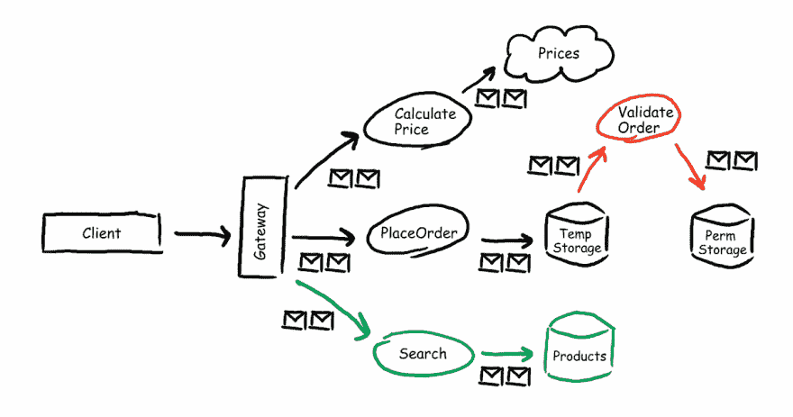

# Azure 函数提示:将函数分组到函数应用中

> 原文：<https://dev.to/xpirit/azure-functions-tips-grouping-functions-into-function-apps-2ki9>

[T2】](https://res.cloudinary.com/practicaldev/image/fetch/s--TT3DgFPV--/c_limit%2Cf_auto%2Cfl_progressive%2Cq_auto%2Cw_880/https://blog.marcduiker.nl/assets/2017/11/21/serverless-architecture.png)

## 功能应用指南

今天早些时候，我读了一篇推文，其中一名开发人员不确定何时将几个 Azure 功能分组到一个功能应用中。Azure 功能工程师迅速做出了回应，他们将很快在官方文档中加入这方面的一些指南。我认为这是一个非常有趣的话题，所以让我们从我自己的一些想法开始。

Azure 函数托管在一个函数应用中。以下是在 [Azure 文档](https://docs.microsoft.com/en-us/azure/azure-functions/functions-reference#function-app)中写的关于某功能 App 的内容:

*“功能应用由一个或多个单独的功能组成，这些功能由 Azure 应用服务共同管理。功能应用中的所有功能共享相同的定价方案、持续部署和运行时版本。用多种语言编写的函数都可以共享同一个函数 app。将功能应用视为组织和集体管理您的功能的一种方式。”*

到目前为止还不错，但是你应该把你所有的功能都放在一个功能应用程序里吗？还是应该把每个功能放在自己的功能 App 里面？

您现在面临着无服务器架构的挑战。让我们来看看所涉及的一些方面，以便对如何组织你的职能做出明智的决定。

### 无服务器架构方面

以下是在决定无服务器架构时起重要作用的几个方面:

*   单一责任原则
*   工作量分配
*   DevOps 实践
*   弹性

### 单一责任原则

我希望这个原则不是什么新东西，而是实实在在的。引自[维基百科]((https://en.wikipedia.org/wiki/Single_responsibility_principle)%7B:target=%22_blank%22%7D):

单一责任原则是一种计算机编程原则，它规定每个模块或类都应该对软件提供的功能的单一部分负责，并且这种责任应该完全由类来封装

在我看来，在这个无服务器时代，一组功能(Function App)相当于引用中描述的一个模块或类。

我在某处听到或读到过以下与此原理相关的*“一起变化的就应该一起生活”*。我对此做了一点调整，更喜欢**“有什么变化一起部署”**。因此，如果一项新的业务功能需要更改两个功能，这意味着这两个功能应该存在于同一个功能应用程序中。

### 工作量分配

您的功能的工作量也决定了它们应该如何分组。让我们考虑一个场景，其中有三个功能:A、B 和 c。所有这些功能的工作负载均匀分布，所有这些功能的内存消耗低于功能应用程序的最大可用内存(目前消耗计划中为 1.5 GB)。在这种情况下，您可以在同一个功能应用程序中运行所有功能。

现在让我们考虑另一个场景:函数 A 比 B 和 C 接收到更高的工作负载，并且需要大量的可用内存。在这种情况下，您应该考虑将功能 A 移动到一个单独的功能应用程序，以便它可以在工作负载非常高时独立扩展。低工作负荷功能 B 和 C 可以保留在另一个功能应用程序中，现在不会受到功能 a 的影响。

### DevOps

如果你有多个团队开发、部署和测试功能，那么让每个团队负责一个或多个功能应用中的一组功能是有意义的。每个团队都可以独立开发自己的功能应用，如果功能松散耦合(例如，使用消息队列和商定的接口)，跨团队的部署甚至不需要同步。

附注:我还建议每个功能应用都有一个代码库，这样你就可以使用内置的[持续部署](https://docs.microsoft.com/en-us/azure/azure-functions/functions-continuous-deployment)选项快速启动并运行。它不像 VSTS 的一个完整的 CI/CD 管道那样完整，但绝对比什么都没有强。

### 恢复力

停机从来都不是好事，对吧？因此，当您设计无服务器架构时，您需要考虑到一些组件最终会出现故障。应用程序服务可能有一个 hick-up 或者一些“坏代码”不知何故通过了你的 CI/CD 管道，现在运行在生产中。为了最小化这个问题的影响，你应该考虑将你的功能拆分成几个功能应用，使它们**独立部署**，从而**独立失效**。

我再次建议在函数之间使用消息队列(或者在单独的存储帐户中，或者使用 Azure Service Bus ),这样当一个函数应用关闭时(无论是通过故障还是常规部署),状态都不会丢失。作为另一种选择，[持久函数](https://docs.microsoft.com/en-us/azure/azure-functions/durable-functions-overview)提供了一个存储状态的内置机制，看起来很有前途。

### 结论:看情况

关于如何将你的功能归入功能应用，并没有单一的答案。但是从所描述的方面(远非详尽)可以得出结论，让你的功能应用程序精简到只有几个密切相关的功能通常是个好主意。