# 机器学习的基础数学

> 原文：<https://dev.to/rohitpatil5/basic-mathematics-for-machine-learning-d2a>

[*编辑:——对于微积分去看看我关于矩阵微积分的帖子。*T3】](https://medium.com/@rohitrpatil/the-matrix-calculus-you-need-for-deep-learning-notes-from-a-paper-by-terence-parr-and-jeremy-4f4263b7bb8)

数学对于机器学习的重要性有很多原因。其中一些如下:

1.  选择正确的算法，包括考虑准确性、训练时间、模型复杂性、参数数量和特征数量。
2.  选择参数设置和验证策略。
3.  通过理解偏差-方差权衡来识别欠拟合和过拟合。
4.  估计正确的置信区间和不确定性。

[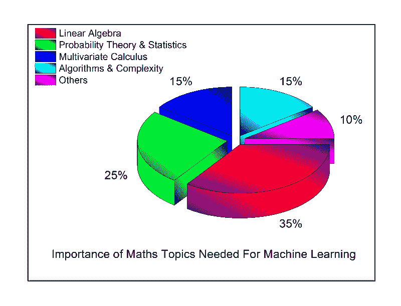](https://res.cloudinary.com/practicaldev/image/fetch/s--VJtCYYCN--/c_limit%2Cf_auto%2Cfl_progressive%2Cq_auto%2Cw_880/https://cdn-images-1.medium.com/max/800/1%2AeUYIqyg9aomn55O-Q5XRVg.png) 

<figcaption>到底是用什么！</figcaption>

### **最好的学习资源是什么？**

[T2】](https://res.cloudinary.com/practicaldev/image/fetch/s--D0vz6psG--/c_limit%2Cf_auto%2Cfl_progressive%2Cq_auto%2Cw_880/https://cdn-images-1.medium.com/max/856/1%2AODJPbEcabUyMrMPnCeOYKg.jpeg)

我试图总结以上两种资源中教授的数学。所以让我们开始吧！

### **标量、向量、矩阵和张量:**

*   * *标量** :标量只是一个单一的数字。
*   **Vectors **:vector 是一个数字数组。这些数字是按顺序排列的。我们可以通过其在该顺序中的索引来识别每个单独的数字。 *x=[x1 x2 x3 …xn】。*我们可以将向量视为空间中的识别点，每个元素给出了沿 different 轴的坐标。有时我们需要索引一组向量的元素。在这种情况下，我们定义一个包含索引的集合，并将该集合写为下标。例如，为了访问 *x1、x3 和 x6* ，我们定义了集合 *S* ={1，3，6}并写入 *xs。*
*   * *矩阵** :矩阵是一个二维数字阵列，因此每个元素由两个索引标识，而不是一个。

[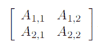](https://res.cloudinary.com/practicaldev/image/fetch/s--Z4pEN0OO--/c_limit%2Cf_auto%2Cfl_progressive%2Cq_auto%2Cw_880/https://cdn-images-1.medium.com/max/166/1%2AYIZqGzeRxmfiFW-fj8qp-Q.png) 

<figcaption>当我们需要显式识别一个矩阵的元素时，我们把它们写成一个用方括号括起来的数组</figcaption>

矩阵的**转置**是矩阵在一条对角线上的镜像，这条对角线称为主对角线，从左上角开始向右下方延伸。

[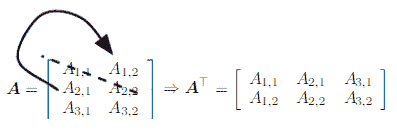](https://res.cloudinary.com/practicaldev/image/fetch/s--6YGbQPcc--/c_limit%2Cf_auto%2Cfl_progressive%2Cq_auto%2Cw_880/https://cdn-images-1.medium.com/max/397/1%2AIfvcwFO2FLdr-xsE--BRCw.png) 

<figcaption>矩阵的转置</figcaption>

我们可以将矩阵相互相加，只要它们的形状相同，只需将它们对应的元素相加即可:C = A + B 其中 *Ci，j = Ai，j+ Bi，j.*

我们允许矩阵和一个向量相加，产生另一个矩阵:C=A+b，其中 *Ci，j = Ai，j +bj* 。换句话说，向量 b 被添加到矩阵的每一行。这种简写消除了在做加法之前定义矩阵并将 b 复制到每一行的需要。这种将 b 隐式复制到多个位置的行为称为 ***广播*** 。

*   **张量:**排列在一个有可变轴数的规则网格上的一组数字称为张量。

### 矩阵和向量相乘:

矩阵 A 和 B 的矩阵乘积是第三个矩阵 c。为了定义这个乘积，A 的列数必须与 B 的行数相同。如果 A 的形状是 m × n，B 的形状是 n × p，那么 C 的形状是 m × p。

产品操作由以下因素定义

[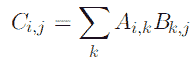T2】](https://res.cloudinary.com/practicaldev/image/fetch/s--1MPXwn73--/c_limit%2Cf_auto%2Cfl_progressive%2Cq_auto%2Cw_880/https://cdn-images-1.medium.com/max/195/1%2AUwUwRGXR4K2ulM7yLLaVfg.png)

与标量乘法不同，矩阵乘法是分配的、结合的，但不是交换的(条件 AB =BA 并不总是成立)。

要了解更多，你可以通过麻省理工学院课件提供的课程(吉尔伯特斯特朗教授)。

[线性代数](https://ocw.mit.edu/courses/mathematics/18-06-linear-algebra-spring-2010/)

### 概率论:

概率论是表示不确定陈述的数学框架。它提供了一种量化不确定性的方法以及导出新的不确定性陈述的公理。

让我们理解概率论中使用的一些术语:-

*   * *随机变量** :随机变量是可以随机取 different 值的变量。它们可以是连续的或离散的。离散随机变量是指具有有限个或可数个状态的变量。一个连续的随机变量与一个实值相关联。
*   **概率分布**:概率分布是对一个随机变量或一组随机变量呈现其每种可能状态的可能性的描述。离散变量的概率分布可以用 P( *x* )表示的**概率质量函数(PMF)** 来描述。当处理连续随机变量时，我们使用由 *p(x)* 表示的**概率密度函数(PDF)** 来描述概率分布。概率密度函数 *p(x)* 不会直接给出特定状态的概率；相反，落在体积为δx 的无限区域内的概率由 *p(x)* δx 给出。
*   条件概率(Conditional Probability):在很多情况下，我们感兴趣的是某个事件发生的概率，假设其他某个事件已经发生。这叫做条件概率。我们将 y = *y* 给定 x = *x* 的条件概率表示为 P(y= *y* | x= *x* )。

 

<figcaption>条件概率仅在 P(x=x) > 0</figcaption>

时定义

*   **条件概率链规则:**许多随机变量的任何联合概率分布可以分解成仅一个变量的条件分布

[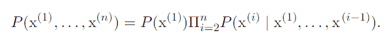](https://res.cloudinary.com/practicaldev/image/fetch/s--YW_YuIVb--/c_limit%2Cf_auto%2Cfl_progressive%2Cq_auto%2Cw_880/https://cdn-images-1.medium.com/max/650/1%2Aj9BZZVw55hnb2jI0_aKM3A.png) 

<figcaption>链式法则或概率积法则</figcaption>

*   **期望**:关于概率分布 P( *x* )的某个函数 *f(x)* 的期望或期望值，是从 P 中抽取 *x* 时 *f* 所取的平均值

[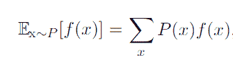](https://res.cloudinary.com/practicaldev/image/fetch/s--sdmYab-U--/c_limit%2Cf_auto%2Cfl_progressive%2Cq_auto%2Cw_880/https://cdn-images-1.medium.com/max/335/1%2AoSXW9vM5TjP5ihdhGqCfow.png) 

<figcaption>对于离散变量，这可以通过求和来计算</figcaption>

*   **方差:**方差给出了当我们从概率分布中抽取 *x* 的 different 值时，随机变量 x 的函数值变化多少的度量。

[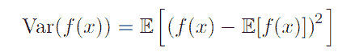T2】](https://res.cloudinary.com/practicaldev/image/fetch/s--imyGkViA--/c_limit%2Cf_auto%2Cfl_progressive%2Cq_auto%2Cw_880/https://cdn-images-1.medium.com/max/418/1%2A0AQxWEY6sE5H09wtRiiJaw.png)

*   方差的平方根被称为**标准差**。
*   **协方差**:协方差给出了两个值之间的线性相关程度，以及这些变量的范围:

[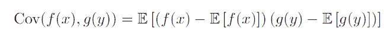T2】](https://res.cloudinary.com/practicaldev/image/fetch/s--QnG8nRkW--/c_limit%2Cf_auto%2Cfl_progressive%2Cq_auto%2Cw_880/https://cdn-images-1.medium.com/max/648/1%2A9bqZmpDeghnAE_8-Gt6fGg.png)

**协方差**的高绝对值意味着这些值变化很大，并且同时远离它们各自的平均值。如果**协方差**的符号为正，那么两个变量倾向于同时呈现相对较高的值。如果**协方差**的符号是负的，那么一个变量倾向于在另一个变量呈现相对低值的时候呈现相对高的值，反之亦然。

*   **贝叶斯法则**:贝叶斯定理是一个公式，描述了当给定证据时，如何更新假设的概率。它简单地遵循条件概率的公理，但可以用于对涉及信念更新的广泛问题进行强有力的推理。我们经常发现自己处于已知 P(y | x)而需要知道 P(x | y)的情况。幸运的是，如果我们也知道 P(x ),我们可以计算出所需的数量

[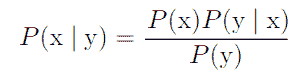T2】](https://res.cloudinary.com/practicaldev/image/fetch/s--ufQZ5JZ6--/c_limit%2Cf_auto%2Cfl_progressive%2Cq_auto%2Cw_880/https://cdn-images-1.medium.com/max/292/1%2AHBBtRBuXKvtQ6LGm7bRLMw.png)

### 常见概率分布:-

机器学习中使用的一些常见概率分布如下

*   **伯努利分布**:是单个二元随机变量的分布。它由单个参数φ ∈ [0，1]控制，该参数给出随机变量等于 1 的概率。

[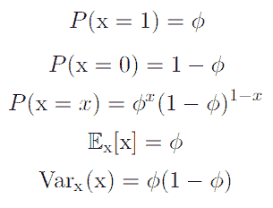](https://res.cloudinary.com/practicaldev/image/fetch/s--Z8-rgZ56--/c_limit%2Cf_auto%2Cfl_progressive%2Cq_auto%2Cw_880/https://cdn-images-1.medium.com/max/305/1%2Ao_yH8xdu93G68_SAbnV8PQ.png) 

<figcaption>伯努利分布的性质</figcaption>

*   **多内核分布**:多内核分布，或分类分布，是一个具有 *k* different 状态的单个离散变量的分布，其中 *k* 是有限的。多项分布通常用于指对象类别的分布。
*   **高斯分布**:实数上最常用的分布是正态分布，也称为高斯分布。

[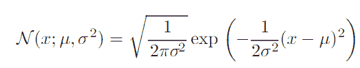T2】](https://res.cloudinary.com/practicaldev/image/fetch/s--BjphSg9c--/c_limit%2Cf_auto%2Cfl_progressive%2Cq_auto%2Cw_880/https://cdn-images-1.medium.com/max/521/1%2AmPhKrBsFbbH9L8kHpSNRQQ.png)

*   两个参数∈ R 和 *σ* ∈ (0，∞)控制正态分布。参数*T5 给出了中央峰值的坐标。这也是分布的**均值**:E[x]=*。分布的**标准差**由 *σ* 给出，方差由 *σ* 给出。**

 *[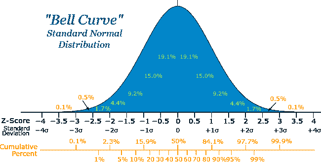](https://res.cloudinary.com/practicaldev/image/fetch/s--mFHW6Hwz--/c_limit%2Cf_auto%2Cfl_progressive%2Cq_auto%2Cw_880/https://cdn-images-1.medium.com/max/650/1%2AHRj-NCJWQyfZTGa_835ylg.png) 

<figcaption>正态分布密度函数图</figcaption>

可汗学院有非常好的统计和概率课程。

[统计与概率|可汗学院](https://www.khanacademy.org/math/statistics-probability)

我会在这里打包。希望这篇文章能帮助你复习高中时学过的一些概念。😄感谢您的阅读！

[T2】](https://res.cloudinary.com/practicaldev/image/fetch/s--N1dv4LsS--/c_limit%2Cf_auto%2Cfl_progressive%2Cq_66%2Cw_880/https://cdn-images-1.medium.com/max/375/1%2ADnDyYN3E9t50nn4Iu30bZw.gif)

你可以在 Twitter @Rohitpatil5 上找到我，或者在 [LinkedIn 上联系我。](https://www.linkedin.com/in/rohitrpatil/)

* * **