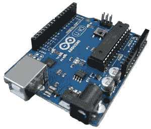

# 学习如何编码的最佳语言

> 原文：<https://dev.to/lpasqualis/best-languages-to-learn-how-to-code-35d>

这篇文章最初发表在 [CoderHood](https://coderhood.com) 上，被认为是[学习如何编码的最佳语言](https://www.coderhood.com/best-languages-to-learn-coding/)。CoderHood 是一个致力于软件工程人类层面的博客。

[T2】](https://www.coderhood.com/best-languages-to-learn-coding/)

## 英国、基安蒂酒、C 国和旧社会

当我发现计算机的存在时，我住在一个以艺术、食物、基安蒂酒和手势闻名于世的地方；对技术来说没那么多。我喜欢在托斯卡纳长大。冬天阳光明媚，清爽宜人，夏天炎热而慵懒，秋天宜人而清新，春天是我能想到的最接近天堂的地方。我在 1984 年必须学习计算机编程的资源是美国书籍的意大利语译本、几本月刊杂志、适量的好奇心和热情，以及抵御中学恶霸的厚脸皮。现在想来，对那些人来说，武术训练帮助更大。

我唯一知道的人类语言是意大利语。我知道的唯一一个英语单词是“黄色”——别问了，出于我不记得的原因，我哥哥认为我是那个单词——我对此非常自豪。我一点也不知道，在学习计算机语言时，我会学到更多像“如果”、“那么”和“否则”这样的词。Basic、C 和 Pascal 对我来说是唾手可得的，我知道这些只是因为我在当地的图书馆和书店花了大量的时间。

用 C. C 编写的严肃程序员是一种简洁的语言，可以直接切入正题。奇妙的底层，它仍然是操作系统和编译器等软件的支柱。在我的职业生涯中，我广泛使用 C 和 c++(C 的面向对象版本)，今天我仍然在一些个人项目中使用它。所有严肃的专业开发人员，在他们职业生涯的早期，必须至少学会理解 C 和 C++。

Basic 是一种非常简单的解释语言，因比尔·盖茨和保罗·艾伦而出名，并从微软成立之初就作为 MS-DOS 的一部分发行。Basic 也包含在低成本家用电脑中，如 Commodore 产品线。如果你想了解更多关于这一迷人的技术历史领域，我强烈建议你阅读《创新者:一群黑客、天才和极客如何创造了数字革命》。今天，除了一些有争议的例外，Basic 基本上已经死了。

Pascal 是在 1968-1969 年设计的，后来被 Borland 用一个叫做 Turbo Pascal 的梦幻产品普及开来。这是一种美丽的语言，使用起来令人愉快，而且易于阅读和学习。在 20 世纪 80 年代和 90 年代初，我写了几十万行 Pascal 和 Delphi(Pascal 的面向对象版本)。和 Basic 一样，Pascal 也失势了，它不再是受欢迎的选择。

## 今天你有很多选择

今天，计算机语言的前景更加多样化。有许多有用的语言和技术可供选择。这个决定可能很难。这些年来，有很多人问我从什么语言开始比较合适。答案很重要，这取决于你的目标是什么。对一个特定项目的具体建议必须以你心中的一系列问题开始。我不会这样做，因为如果你想学好编码，你需要获得强大的基础，而不是担心一个特定的项目。出于这个原因，我会给你一个指示性的方向——引导你走向一条可靠的道路——我知道从长远来看，这条路会对你有好处。

我的建议是这样的:学一门面向对象的编译语言，一门脚本语言，至少玩一个微控制器。

## 开始学习 Java 基础知识

Java 是一种面向对象的编译语言。编译是指被称为“编译器”的软件程序读取你编写的 Java 代码(人类可读)，并将其转换为可执行的字节码(机器可读)。在 Java 中，字节码不是一种特定的 CPU 机器语言(像在 C 中)，而是一种 Java 虚拟机(JVM)语言。您可以将 JVM 视为虚拟 CPU 的软件模拟。

编译器生成的字节码可以在任何装有 JVM 的计算机上执行。市面上几乎每一台电脑、操作系统、物联网设备上都有 JVMs 因此，如果你有一台计算机，你可能有运行 Java 程序的硬件。你可以从 java.com 官方网站免费下载 Java 开发工具包。

Java 是一项成熟的技术，有一个活跃的社区，并成功地用于大型系统。这是一种运行真正软件的好语言，并且表现得出奇的好。许多开发人员专门研究 Java，在软件行业中有大量的工作机会给 Java 开发人员。在 [DreamBox Learning](http://www.dreambox.com/) ，一家我过去十年工作过的令人惊叹的公司，Java 是我们使用的主要语言之一。

一些至少部分由 Java 驱动的流行网站的例子有:

*   商务化人际关系网
*   [亚马逊](http://highscalability.com/amazon-architecture)
*   [脸书](https://www.quora.com/What-is-Facebooks-architecture)
*   通过易趣网购买
*   谷歌的许多服务。
*   [推特](https://www.quora.com/Why-did-Twitter-switch-to-a-Java-based-front-end-after-successfully-using-Ruby-on-Rails-with-200-million-users)

Java 通常支持消费设备上的软件。例如，如果你有一个蓝光播放器，大部分的软件都是用 Java 编写的。再比如 Android 应用框架，也是用 Java 写的(OS 本身是 Linux，大部分是用 C 写的)。

Java VM 也可以用来运行不是用 Java 编写的代码；几种现代语言编译成 JVM 字节码。对于开发人员来说，这样做的好处是，一旦他们熟悉了 Java，他们就可以使用许多基于相同技术的语言，很容易与 Java 代码集成。基于 JVM 的语言的例子有:

*   Clojure ，一种功能性 [Lisp](https://en.wikipedia.org/wiki/Lisp_(programming_language)) 方言
*   Groovy 是一种动态编程和脚本语言
*   [Scala](https://en.wikipedia.org/wiki/Scala_(programming_language)) ，一种静态类型的面向对象的函数式编程语言。
*   [JRuby](https://en.wikipedia.org/wiki/JRuby) ，一个 [Ruby](https://en.wikipedia.org/wiki/Ruby_(programming_language)) 的实现
*   [Jython](https://en.wikipedia.org/wiki/Jython) ，一个 [Python](https://en.wikipedia.org/wiki/Python_(programming_language)) 的实现

## Java 中的 Hello World

下面是一个简单的 Java 程序示例，它只在控制台上打印“Hello World ”:

```
public  class  HelloWorld  {
      public static void main(  String[]  args  )  {
            System.out.println("Hello World!!!");
      }
} 
```

Enter fullscreen mode Exit fullscreen mode

下面是如何从 Linux 命令行编译和执行它:

```
$  cat HelloWorld.java
public  class  HelloWorld  {
    public static void main(  String[]  args  )  {
        System.out.println("Hello World!!!");
    }
}
$  javac helloworld.java
$  java HelloWorld
Hello World!!! 
```

Enter fullscreen mode Exit fullscreen mode

## Java 开发工具

首先，请前往 www.jetbrains.com 下载 IntelliJ 社区版。它是最好的 Java 开发环境之一，而且是免费的。

## 学习一门脚本语言

脚本语言不需要编译器:它直接由解释器执行。在一个基本的化身中，解释器是一个软件程序，它一行一行地读取人类可读的脚本，并运行它。就像人类翻译员将现场演讲从一种语言翻译成另一种语言一样，语言翻译员将运行代码翻译成机器可执行指令，现场运行它们。

许多脚本语言在软件开发领域越来越受欢迎。我推荐学习 Python:一种在软件行业广泛使用的流行且强大的语言。一些至少部分是用 Python 编写的网站示例:

*   油管（国外视频网站）
*   DropBox
*   调查猴子
*   谷歌的一部分
*   Quora
*   一点点
*   Reddit
*   雅虎地图

## Python 中的 Hello world

下面是 Python 中 hello world 的一个例子:

```
print("Hello, World!!") 
```

Enter fullscreen mode Exit fullscreen mode

下面是你如何执行它:

```
$  cat helloworld.py
print  "Hello World!!!"
$  python helloworld.py
Hello World!!! 
```

Enter fullscreen mode Exit fullscreen mode

## Python 开发工具

有很多方法可以创作 Python，但是我知道的最好的工具是 PyCharm。免费社区版是一个很好的起点。去 www.jetbrains.com 免费下载。

## 玩微控制器和物联网

过去几年最激动人心的创新之一是开发廉价的微控制器板。这种板的一个流行的例子是 Arduino。

[T2】](https://res.cloudinary.com/practicaldev/image/fetch/s--fDnW0xBv--/c_limit%2Cf_auto%2Cfl_progressive%2Cq_auto%2Cw_880/https://thepracticaldev.s3.amazonaws.com/i/z1fcusz2qhyspzkux4m8.jpg)

这个小小的技术奇迹价格约为 18 美元，可以运行用 C/C++编写的代码。它没有内置显示器，也没有视频连接器。要对它进行编程，你需要通过 USB 线把它连接到电脑上。

[开发环境是免费的](https://www.arduino.cc/en/Main/Software)，通过一些简单的在线教程，您将能够编写代码并在这个令人难以置信的硬件上运行。

## 用 Arduino Hello world

以下是为 Arduino 编写的 hello world 示例:

```
void  setup()
{
    Serial.begin(115200);
    Serial.print("Hello World!");
}

void  loop()
{
} 
```

Enter fullscreen mode Exit fullscreen mode

关于此链接后面的完整示例[。](https://www.arduino.cc/en/Tutorial/HelloWorld)

## 物联网充满乐趣，触手可及

通过一些基本的电子技能，你也可以创造出令人惊叹的 Arduino 驱动设备。我不是一个硬件爱好者，但是我用 Arduino 建造了一个设备，当它感应到一个人的存在时，它可以无线打开任意数量的无焰蜡烛，当这个人离开时，它会关闭蜡烛。我把它安装在我家的入口通道上，每天我回家时都会受到活泼的烛光的欢迎。

我推荐玩 Arduino，因为它让你接触到两个重要的元素，这将使你成为一个更强的开发人员:物联网设备和 C 编程。它便宜，有趣，功能强大。

另一个受欢迎的选择是树莓派，这是一个令人惊叹的小设备。Raspberry Pi 是一个完整的 Linux 机器，感觉不像是一个有限的物联网设备。你把它连接到一个键盘和一个显示器上，用 Linux 启动它，你可以运行任何你可以在任何 Linux 机器上运行的东西，包括 x。如果你不能使用 Linux 机器，Pi 是一个很好的方法，只需要 35 美元。要学习更多的低级编程，我会坚持使用 Arduino。它会迫使你进入一个不同的范式，我相信这对一个开发人员的成长很重要。

* * *

### 如果你喜欢这篇文章，请保持联系！

*   在 CoderHood 上找到我所有的帖子。
*   在 LinkedIn 上加入我的职业网络。
*   在推特上关注我。
*   加入我的脸书主页。
*   最后，请在 dev.to 上关注我！