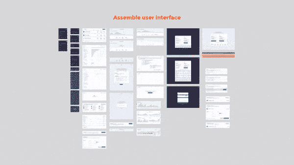
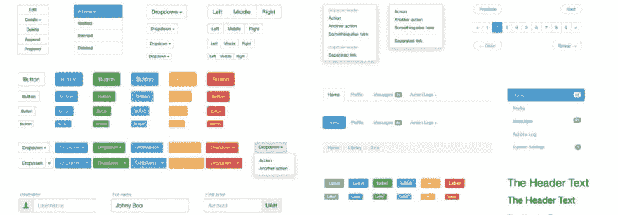
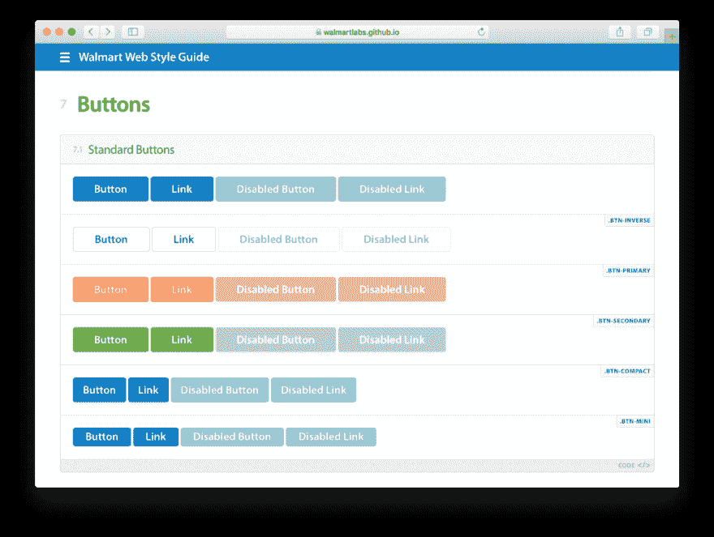
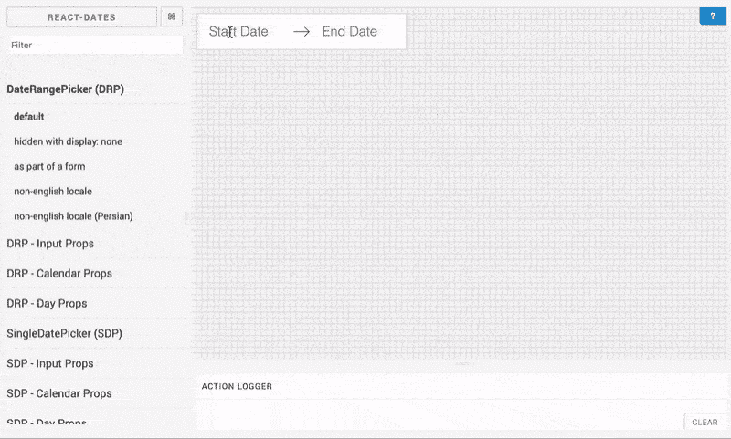
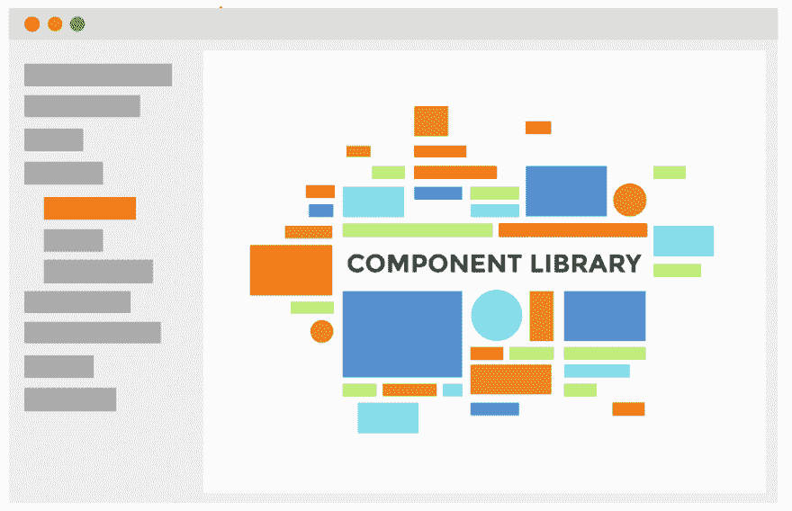
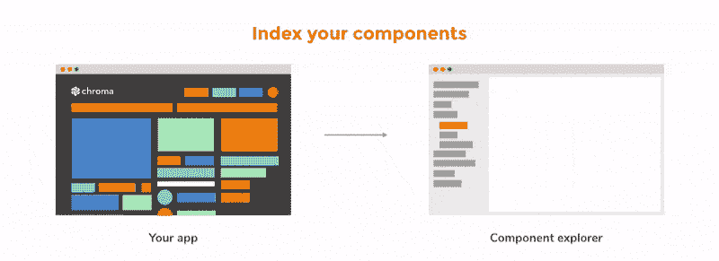
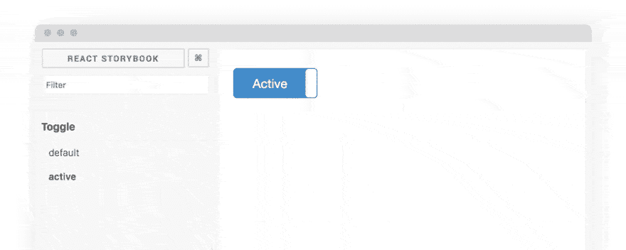
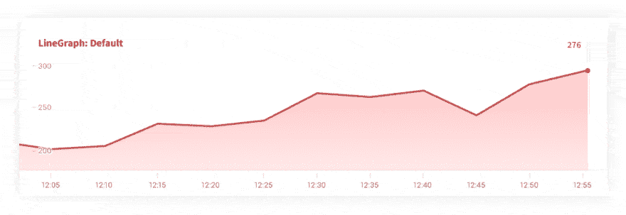
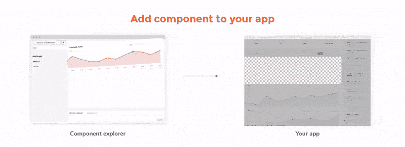

# 超越引导——从 UI 工具包到组件库

> 原文：<https://dev.to/chroma/beyond-bootstrap-moving-from-ui-toolkit-to-component-library>

[](https://res.cloudinary.com/practicaldev/image/fetch/s--TdlrMxNa--/c_limit%2Cf_auto%2Cfl_progressive%2Cq_auto%2Cw_880/https://cdn-images-1.medium.com/max/986/1%2AUMdYa8Cvv7nncxtz6CwB-w.jpeg) 

<figcaption>形象:[豪斯-拉克-科](http://www.spatialagency.net/database/haus-rucker-co)</figcaption>

第一家工厂比工业革命早了几百年。威尼斯的兵工厂率先用标准化零件组装军舰。当时的工程师发现，*将复杂的东西从它们的组成部分组装成*比*从头开始建造*更快更容易。今天，我们看到这种预制和组装的想法在不同的工程领域扎根:构建用户界面。

用户界面越来越多地由标准化部件组装而成。像 [Bootstrap](https://getbootstrap.com) 这样的 UI 工具包是第一批为 web UIs 提供通用组件的。这些工具包使开发人员能够轻松地在他们的应用程序中找到并应用模式。

公司也认识到拥有自己的 UI 工具包的价值。他们创造了**生活方式指南**来匹配他们品牌的外观和感觉。然而，建立一个风格指南需要大量的资源，所以只有大型团队倾向于投资。

随着 **UI** **组件**的出现，该行业发生了重大变化，这些组件是类似于乐高积木的用户界面构建模块。组件简化了定制 UI 工具包的构建，因为它们将设计模式封装在模块化的标准化单元中。

这种范式转变允许任何规模的团队创建适合他们确切需求和品牌的"**组件库**。今天，我将介绍一下我们是如何走到这一步的，以及创建自己的组件库的过程。

## 用户界面组装

前端开发人员一遍又一遍地构建相同的用户界面。它们之间没有太多的*功能*差异。你通常会发现页眉、侧边栏、列表和表单的标准组合。

[T2】](https://res.cloudinary.com/practicaldev/image/fetch/s--_bmx-_c9--/c_limit%2Cf_auto%2Cfl_progressive%2Cq_66%2Cw_880/https://cdn-images-1.medium.com/max/600/1%2AHUUqhC5phoYZFWR4n8VDWg.gif)

纵观历史，人们已经发现，如果人们用现有零件组装新产品，效率会更高。用户界面工程也不例外。用现有的 UI 部件组成新的视图比从头开始构建要快。

起初，这些模式采用临时代码片段的形式。它们存在于开发者机器上的文本文件中(Github 出现之前)。虽然不太容易共享，但这些 UI 代码对前端开发人员来说非常有用。

## 引导和 UI 工具包

Bootstrap 出现了，它将这些 UI 代码整合成一个完整的集合。UI 工具包的关键思想是提供一个通用/通用设计模式(附带代码)的清单。

[](https://res.cloudinary.com/practicaldev/image/fetch/s--XATO2UTI--/c_limit%2Cf_auto%2Cfl_progressive%2Cq_auto%2Cw_880/https://cdn-images-1.medium.com/max/1024/1%2AKG74W9pMhj29IfkNoCZAwA.jpeg) 

<figcaption>Bootstrap 的设计模式</figcaption>

当时，工作流程的简单性是革命性的。您复制粘贴了标记，得到了可用的用户界面。UI 工具包使得搭建简单的网站和业务线应用变得很简单。

UI 工具包的概念对设计和开发产生了巨大的影响。它证明了设计者可以在整个开发过程中确保用户界面的一致性。它还强调了开发人员使用工具包创建 ui 是多么容易。

## 生活方式指南

生活风格指南是特定于组织的 UI 工具包。团队看到了 UI 工具包的内在价值，但是通常有特定的外观和感觉需求。他们不能仅仅采用引导、基础或语义。

像 Bootstrap 这样的东西的典型缺点是，您必须坚持其规定的习惯用法和风格。依赖流行工具包的网站看起来都一样。你可能会明白为什么这对于一家希望在市场中脱颖而出的公司来说并不理想。

像 Bootstrap 一样，living styleguides 提供了类似的设计模式和代码清单，但是这些模式反映了公司品牌和设计的细节。

[T2】](https://walmartlabs.github.io/web-style-guide/#buttons)

在 [Yelp](https://www.yelp.com/styleguide#buttons) 、[沃尔玛](https://walmartlabs.github.io/web-style-guide/#buttons)或[美国政府](http://codeforamerica.clearleft.com/)的规模下，重用现有的设计模式产生了巨大的效率收益。生活风格指南让大公司可以轻松地在他们的网站上创建一致的外观和感觉。

然而，创建一个生活方式指南是一项重要的任务——通常需要自上而下的协调。有无数的 UI 排列需要设计、构建和维护，伴随着从团队中的每个人那里获得认同的艰巨任务。实际上，奢侈的生活方式指南只保留给大型团队。

## 组件库

组件库是大型团队和小型团队的一种实用方法，可以简化引导、定制生活风格指南以及现代视图层技术的灵活性。

React、Angular 和 Vue 等视图层的广泛采用迫使团队将 ui 分解成简单的组件。这些组件充当应用程序的构建模块；组件的集合是组件库的基础。

[](https://res.cloudinary.com/practicaldev/image/fetch/s--sJqXbGNf--/c_limit%2Cf_auto%2Cfl_progressive%2Cq_66%2Cw_880/https://cdn-images-1.medium.com/max/800/1%2AUsivbxsBxiiltJ2dYjniqA.gif) 

<figcaption>一个独立的[日期选择器](http://airbnb.io/react-dates/)组件</figcaption>

### 组件:自带功能

作为一种构造，组件比原始代码更强大*和*更容易使用抽象。它们是功能的独立部分，具有定义明确的输入和输出。

自包含鼓励开发人员在组件级别上确定功能、标记和样式(这一领域正在迅速发展)。不需要依赖工具包级别的 JavaScript 或样式表，有了 UI 组件，所有这些都可以封装在组件中。

### 小团队可以构建组件库

对组件的关注——相当于乐高积木的用户界面——使得小团队和个人可以很容易地开始构建他们自己的定制设计模式清单。由于您逐渐积累了 UI 组件，组件库的启动成本比构建一个活的样式指南要低(这通常需要大量的预先考虑和规划)。

此外，灵活性是组件库所固有的。可以添加、更新或替换每个组件，而不会影响库的完整性。这意味着您不必一次只使用一个 UI 工具包，您可以根据需要混合、匹配和定制 web 上的组件。

## 我如何入门？

无论你是已经有了一个组件的应用程序，还是正在重新构建一个，开始享受组件库的好处都是很容易的。由于您可以单独添加组件，并且默认情况下构建库的工具倾向于只用于开发，所以尝试组件库的成本接近于零。让我们看看如何通过 4 个步骤开始。

#### 1。找个地方“储存你的组件”。

组件通常隐藏在应用程序中。这并不理想，因为人们必须浏览目录和屏幕才能看到运行中的组件。你需要的是一个集中的地方来编目和可视化你的组件。您可以在[组件浏览器](https://blog.hichroma.com/the-crucial-tool-for-modern-frontend-engineers-fb849b06187a)中找到这些类似库的特性。

[T2】](https://res.cloudinary.com/practicaldev/image/fetch/s--8di_cD_w--/c_limit%2Cf_auto%2Cfl_progressive%2Cq_auto%2Cw_880/https://cdn-images-1.medium.com/max/992/1%2AjTl0e2sNMfJQX3znZULmEA.png)

##### 组件浏览器

*   **反应:** [故事书](https://github.com/storybooks/storybook)，[宇宙](https://github.com/react-cosmos/react-cosmos)，[全权委托](https://github.com/carteb/carte-blanche)， [Styleguidist](https://react-styleguidist.js.org/)
*   **棱角分明:** [UI 故事书](https://github.com/ui-storybook/sb)，[游乐场](http://www.angularplayground.it/)
*   **视图:** [视图播放](https://github.com/vue-play/vue-play)
*   **余烬:** [自由式](https://chrislopresto.github.io/ember-freestyle/)
*   **Clojure:** [Devcards](https://github.com/bhauman/devcards)
*   **流星:** [半音阶](https://github.com/meteor/chromatic/)

#### 2。索引现有组件

一旦你有了一个组件浏览器，是时候索引你的应用程序的现有组件了，这样就可以找到它们了。

[T2】](https://res.cloudinary.com/practicaldev/image/fetch/s--MfBc3LOi--/c_limit%2Cf_auto%2Cfl_progressive%2Cq_66%2Cw_880/https://cdn-images-1.medium.com/max/800/1%2AzmoiFngqTlycnY7k4IK-VQ.gif)

首先在组件文件的顶部导入组件资源管理器工具(组件资源管理器之间的确切语法有所不同——为了便于阅读，我进行了简化)。

`import { specsOf } from ‘@component-explorer/explorer’;`

接下来，将您的第一个“测试状态”写为规格。例如，切换组件可能有默认和活动状态。

```
specsOf(‘Toggle’) 
  .add(‘default’, () => <Toggle active={false} />) 
  .add(‘active’, () => <Toggle active={true} />) 
```

然后通过组件浏览器检查运行中的组件。重复此过程以索引其他组件并扩大您的库。

[](https://res.cloudinary.com/practicaldev/image/fetch/s--Jpi5nAtz--/c_limit%2Cf_auto%2Cfl_progressive%2Cq_66%2Cw_880/https://cdn-images-1.medium.com/max/900/1%2AAw8z6q9HDZVQRNWcq8GK4A.gif) 

<figcaption>故事书里的一个切换组件</figcaption>

#### 3。浏览数以千计的开源组件

像 [Salesforce](https://medium.com/u/e7b0f31549dd) 、[airbneng](https://medium.com/u/ebe93072cafd)和 [Google](https://medium.com/u/991272e72e68) 这样的组织提供了大量现成的 UI 组件。像 Bootstrap 和 Foundation 这样熟悉的 UI 工具包也被转换成 UI 组件。对于像图形这样的复杂组件，我建议在从头开始构建之前先浏览已经可用的内容。

#### 4。将开源组件添加到您的库中。

一旦你找到了你喜欢的东西，就该把它放到组件浏览器中了(就像我们在步骤 2 中做的那样)。这给了你一个独立的平台，让你在把现成的组件集成到你的应用程序之前调整它。

让我们模拟一下将示例 LineGraph 组件添加到库中的过程。

通过 NPM 安装:`npm install linegraph`

创建一个新文件来导入组件，即组件浏览器，并将测试状态记录为规范。

```
import { specsOf } from ‘@component-explorer/explorer’;
import LineGraph from 'linegraph'; 
```

添加几个测试状态来调整您的组件资源管理器的外观。下面是组件在默认和活动状态下的样子:

```
specsOf('LineGraph')  
  .add('Default', () => 
    <LineGraph data={latencies.map(latency => ({    
      latency,
      count: 5000 + Math.random() * 15000,  
  }))} />)

.add('Active', () => 
    <LineGraph active={true} data={latencies.map(latency => ({    
      latency,
      count: 5000 + Math.random() * 15000,  
  }))} />) 
```

[T2】](https://res.cloudinary.com/practicaldev/image/fetch/s--YDIvDOjF--/c_limit%2Cf_auto%2Cfl_progressive%2Cq_66%2Cw_880/https://cdn-images-1.medium.com/max/980/1%2AoCsBsPX1QtvQPSWKaBnrLQ.gif)

一旦您调整了规格以满足您的需求，就可以很容易地将组件添加到应用程序中您需要的任何位置，并使用类似的规格来实现预期的外观。

[T2】](https://res.cloudinary.com/practicaldev/image/fetch/s--LJSrWWY8--/c_limit%2Cf_auto%2Cfl_progressive%2Cq_66%2Cw_880/https://cdn-images-1.medium.com/max/800/1%2ADTzw9Ci4Q2_aM_gWNzwtXw.gif)

## 超越自举

Bootstrap 率先使用现成的用户界面。人们可以从架子上取下界面元素来快速构建 ui。然而，它需要坚持规定的习惯用法和风格。

Living styleguides 允许组织提供与 Bootstrap 相同的快速开发体验，并提供定制的外观和感觉。挑战在于这些风格指南需要付出巨大的努力。

组件库是一个实用的中间地带，它支持快速开发和定制，而不需要太多的组织动力。在 Chroma，我们是组件库的大力支持者，因为它们倾向于引导团队实现重用和 UI 一致性，而不是独裁。

[https://medium . com/media/c 066 cf 834200d 80 e 25 b 62 a6 de 730 a4 a 6/href](https://medium.com/media/c066cf834200d80e25b62a6de730a4a6/href)

**了解有关 UI 组件的更多信息:**

*   [为什么您应该独立构建 UI 组件—](https://blog.hichroma.com/prefabricated-components-2932bfc992ba)
*   [创建模块化前端的 5 步指南—](https://blog.hichroma.com/ui-component-playbook-fd3022d00590)

* * *

*本帖最初发表于[blog.hichroma.com](https://blog.hichroma.com/beyond-bootstrap-moving-from-ui-toolkit-to-component-library-f0a34f05e98b)T3】*