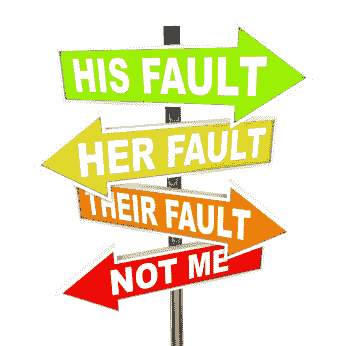

# 责备

> 原文：<https://dev.to/funkysi1701/blame-3hap>

最近，我忙碌了一天回到家，妻子责备我让我们 18 个月大的儿子够到了一些油漆，弄得地毯上到处都是。她把注意力集中在他能够到颜料这一事实上，而不是她出色地把颜料从地毯上弄了下来这一事实上。

[T2】](https://res.cloudinary.com/practicaldev/image/fetch/s--0v0l0ZXD--/c_limit%2Cf_auto%2Cfl_progressive%2Cq_auto%2Cw_880/https://storageaccountblog9f5d.blob.core.windows.net/blazor/wp-content/uploads/2017/04/blame-shifting.jpg%3Fresize%3D300%252C300%26ssl%3D1)

我被责备的本能是否认，或者开始责备她。有可能是我把颜料放在他够得着的地方，也有可能是别人。

责怪别人是很容易的。例如，查看 git 历史记录来找出谁修改了特定的文件，只需点击几次鼠标。

但是责备一个人有用吗？把我们的精力集中在解决眼前的问题上不是更好吗？

在商业世界里，很容易从责备他人发展到拥有一种责备文化。当你有一种责备文化时，每个人都开始为自己着想，这样就不是他们受到责备，生产力也会受到影响。

我认为更重要的是建立流程，尽量减少问题的再次发生。如果部署导致停机，不要问是谁的错，解雇他们。相反，我们能做些什么来降低它再次发生的几率呢？

作为一个对 DevOps 感兴趣的人，我经常打破东西，我不想因此受到指责，我确实想改进我的流程，这样我就不会总是打破同样的东西。

你怎么看待责备？我们能以不同方式做的事情总是比谁做的更好吗？