# 蓝莓派-我如何设置我的树莓派作为一个机器人基地

> 原文：<https://dev.to/ladvien/blueberry-pi-how-i-setup-my-raspberry-pi-as-a-robot-base-2e17>

这篇文章是具体的:我个人将如何设置我的树莓派作为机器人基地。但是，我要说清楚，这是第 n 种可能的设置之一。一个棋盘有 64 个方格，但是那些在棋盘上工作的人有无数的可能性。

除此之外，我们开始吧:

## 获取 Berryboot

[Berryboot](http://www.berryterminal.com/doku.php/berryboot) 将允许你下载几个树莓 Pi 图片。

[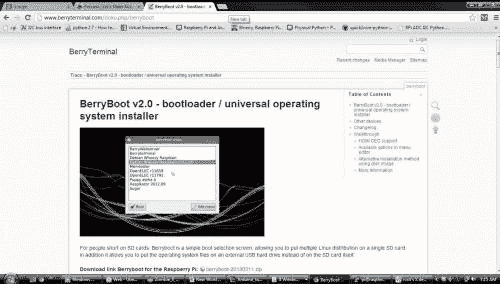T2】](https://res.cloudinary.com/practicaldev/image/fetch/s--h8BCAQ2L--/c_limit%2Cf_auto%2Cfl_progressive%2Cq_auto%2Cw_880/https://ladvien.cimg/BerryBoot.jpg)

现在将压缩文件解压到一张空白的 SD 卡上。

[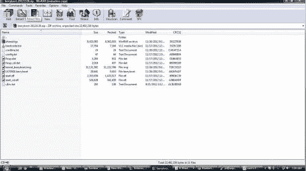T2】](https://res.cloudinary.com/practicaldev/image/fetch/s--6pIUQAQf--/c_limit%2Cf_auto%2Cfl_progressive%2Cq_auto%2Cw_880/https://ladvien.cimg/BerryBootExtract.jpg)

将 BerryBoot SD 卡放入您的 Pi 并启动它。

## 设置 RPi

使用 [Raspbian 喘息声](http://www.raspberrypi.org/downloads)设置 RPi(第一选项)。

[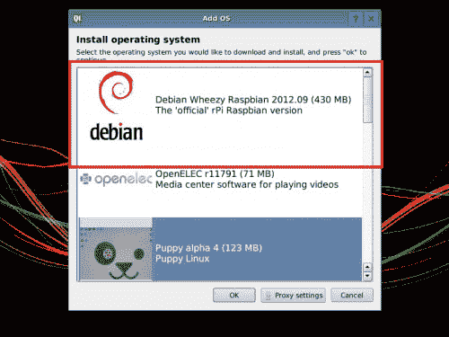T2】](https://res.cloudinary.com/practicaldev/image/fetch/s--L_rQrjEH--/c_limit%2Cf_auto%2Cfl_progressive%2Cq_auto%2Cw_880/https://ladvien.cimg/berryboot-install-distro2.png)

## 设置您的 WiFi

[设置您的 WiFi 加密狗。](http://neville-wright.com/setup-your-raspberry-pi-wireless-network/)我相信 BerryBoot 现在会在初始启动时设置您的 WiFi 加密狗，它为我做了(甚至给了我通过 WiFi 下载图像的选项)。但是，在启动 Raspbian Wheezy 后，我很难启动我的 WiFi 加密狗。

如果你手动设置 WiFi 加密狗有困难，你可以试试[这个视频](http://www.youtube.com/watch?v=5AsSFq42pxI)。

最后，如果你正在寻找一个便宜的 WiFi 加密狗，具有良好的范围，并且使用非常少的 mah(Pi 只能通过 USB 端口提供大约 700mAhs)。你可以试试这款 6.17 美元的。

## 设置您的油灰

在台式电脑上安装 PuTTY。[关注此视频。](https://www.youtube.com/watch?v=k-ao1ZktuzI)这将允许您开始登录 Pi。这样你就不用像我一样看着小小的 RCA 屏幕了。对于那些不熟悉 SSH 的人(就像我在这个视频之前一样)，视频会解释它。冒着过于简化的风险，它允许你通过你的桌面访问你的 Raspberry Pi 命令行。

[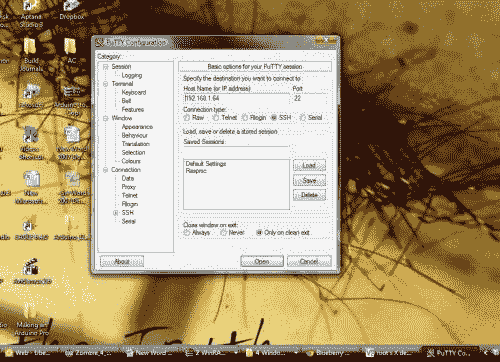T2】](https://res.cloudinary.com/practicaldev/image/fetch/s--2_X6Ll6T--/c_limit%2Cf_auto%2Cfl_progressive%2Cq_auto%2Cw_880/https://ladvien.cimg/Putty1.jpg)

你必须插入你的 Pi 的网络号码。您可以通过调出您的无线集线器的配置页面来找到这一点。您应该看到您的 Pi 列在哪个地址。出于某种奇怪的原因，如果它没有列出设备名称，只需在 Pi 打开时查看页面，然后拔掉您的 Pi 并刷新无线集线器配置页面。消失的设备就是你的 Pi。我从来没有改变端口号，但请注意，您可能需要根据您的设置。

如果你想知道你是否有正确的信息，尝试登录，如果你得到一个这样的屏幕，你的好。

[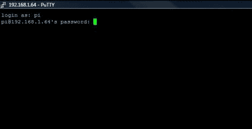T2】](https://res.cloudinary.com/practicaldev/image/fetch/s--x6RQdoBo--/c_limit%2Cf_auto%2Cfl_progressive%2Cq_auto%2Cw_880/https://ladvien.cimg/Putty2.jpg)

您的用户名和密码默认为:pi，raspberry

记住！在树莓派的情况下，总是分享你的密码，因为每个人都有它:)

设置好 PuTTY 后，您应该能够调出 Pi 命令行，如下所示:

[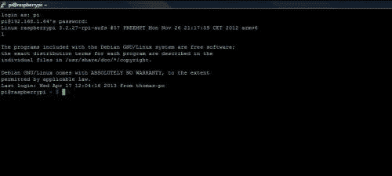T2】](https://res.cloudinary.com/practicaldev/image/fetch/s--101I-sGW--/c_limit%2Cf_auto%2Cfl_progressive%2Cq_auto%2Cw_880/https://ladvien.cimg/Putty3.jpg)

## [设置 VNX 服务器](#setup-vncserver)

在您的 Raspberry Pi 上设置 VNCServer。[关注此视频。](https://www.youtube.com/watch?v=c5QCoh8S0N4)(或者这个[穿越](http://gettingstartedwithraspberrypi.tumblr.com/post/24142374137/setting-up-a-vnc-server))。Putty 将允许您访问 Pi 的命令行，但是设置 VNC 实际上将允许您从 PC 访问 Pi 的桌面 GUI，方式与 Putty 相同。

## 设置 VNC 客户端

在您的桌面计算机上安装 VNC 客户端。真正的 VNC。有许多不同的程序，我碰巧最后用的是皇家 VNC。

一旦在两台机器上都安装了 VNC，就可以使用 Pi 并启动 VNC 服务器。

```
sudo vncserver 
```

Enter fullscreen mode Exit fullscreen mode

[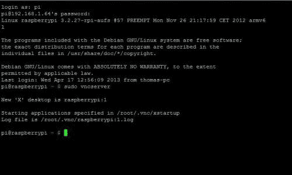T2】](https://res.cloudinary.com/practicaldev/image/fetch/s--3SMp9I87--/c_limit%2Cf_auto%2Cfl_progressive%2Cq_auto%2Cw_880/https://ladvien.cimg/RealVNC5.jpg)

这里有两个注意事项，如果您在视频说明方面做得比我好，您的 vncserver 将在引导时自动启动。不幸的是，我每次都必须键入它(我懒得弄清楚它的引导部分)。因此，如果不使用$sudo vncserver，在 VNC 中运行某些 Python 脚本会有问题

[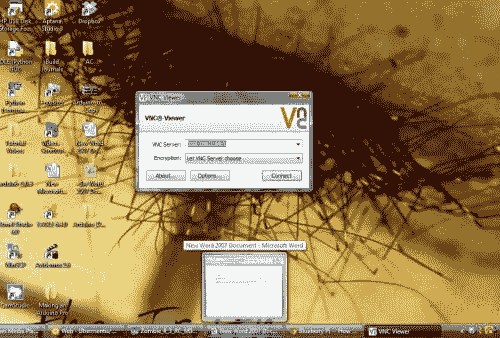T2】](https://res.cloudinary.com/practicaldev/image/fetch/s---S20Lytf--/c_limit%2Cf_auto%2Cfl_progressive%2Cq_auto%2Cw_880/https://ladvien.cimg/RealVNC.jpg)

您将输入您的 Pi 地址，但 port 应该是 1(如果我没记错视频说明)。

[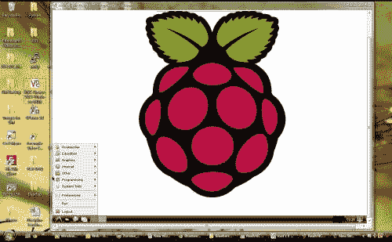T2】](https://res.cloudinary.com/practicaldev/image/fetch/s--J3HZ83LS--/c_limit%2Cf_auto%2Cfl_progressive%2Cq_auto%2Cw_880/https://ladvien.cimg/RealVNC3.jpg)

你最终会得到一个窗口版本的 Raspberry Pi 桌面。还有一点，在视频的某个地方，它让你设置 VNC 桌面的“几何图形”。您在那里设置的限制将会反映在您在窗口中看到的桌面的质量上。本质上，如果你输入`640x480`，这就是这个桌面最终的分辨率。所以，请利用 Pi 的 GPU。

使用类似这样的东西，`-geometry 1024x728 -depth 24`

## 调整 SD 卡大小

[调整 SD 卡的大小](http://elinux.org/RPi_Resize_Flash_Partitions)以使用其所有空间。(注意，这应该已经由 BerryBoot 完成了。但是其他的 diskimages 会把你的 SD 卡限制在 2GB，不管它的实际大小)。

Git manager 将允许您从 git hubs 中提取代码(同样，这应该已经安装了，但只是以防万一)。

[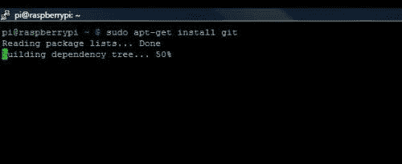T2】](https://res.cloudinary.com/practicaldev/image/fetch/s--vkmyfzy7--/c_limit%2Cf_auto%2Cfl_progressive%2Cq_auto%2Cw_880/https://ladvien.cimg/gitinstall.jpg)

安装 git 管理器:

在 Raspberry Pi 提示符下:

```
sudo apt-get install git 
```

Enter fullscreen mode Exit fullscreen mode

使用方法是这样的，

在 Raspberry Pi 提示符下:

```
sudo git clone https://github.com/adafruit/Adafruit-Raspberry-Pi-Python-Code.git 
```

Enter fullscreen mode Exit fullscreen mode

## SMBus

安装 SMBus。这是专门针对我的设置的，因为我将使用 I2C 总线在 Pi 和 Arduino 之间进行通信。

在 Raspberry Pi 提示符下:

```
sudo apt-get install python-smbus 
```

Enter fullscreen mode Exit fullscreen mode

您可能喜欢的任何其他 Python 模块。

对于按键、GUI 和其他接口需求非常有用:

[Pygame(应该和 Raspbian 一起来)](http://www.pygame.org/news.html)。

```
sudo apt-get install pygame 
```

Enter fullscreen mode Exit fullscreen mode

阿达女士的 I2C 传感器阵列的 Python 代码:

[阿达果 I2C 图书馆](https://github.com/adafruit/Adafruit-Raspberry-Pi-Python-Code)

从基于网络的图形用户界面访问您的 Raspberry Pi:

[PiUi](http://www.raspberrypi.org/archives/tag/piui)

控制串行设备:

[pySerial](http://pyserial.sourceforge.net/)

```
sudo apt-get install python3-pyserial 
```

Enter fullscreen mode Exit fullscreen mode

## 安装 Arduino IDE(可选)

在树莓 Pi 上安装 Arduino IDE。这将允许你直接从你的 Pi 编程 Arduino 如果你遵循我的设计，你将能够不用离开你的台式电脑就能这样做。你可以通过打开 VNC 服务器，打开远程桌面上的 Arduino IDE，选择你想要上传的草图，只要你的 Arduino 通过 USB 连接，你就可以从你坐的地方上传你的草图。这允许快速更改 Arduino 代码，而无需切换线路。此外，我认为 Kariloy 正在寻找一种通过 GPIO 引脚上传草图的方法。这将使设计更加简洁。

## 安装 WinSCP

[安装 WinSCP](http://winscp.net/eng/download.php) 。这将允许您在桌面和 Pi 之间传输文件。我发现这有助于编程管理。我是个乱七八糟的文件归档员。如果我申请的话。

[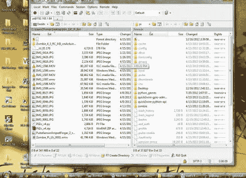T2】](https://res.cloudinary.com/practicaldev/image/fetch/s--e7JSnpjp--/c_limit%2Cf_auto%2Cfl_progressive%2Cq_auto%2Cw_880/https://ladvien.cimg/winscp.jpg)

## I2C 光电管

按照这些说明制作我的 I2C 电镀太阳能板。

[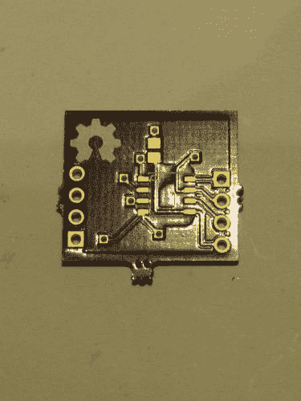T2】](https://res.cloudinary.com/practicaldev/image/fetch/s--Z5YZb5nT--/c_limit%2Cf_auto%2Cfl_progressive%2Cq_auto%2Cw_880/https://ladvien.cimg/IMG_0602.jpg)

同样，有许多商业电路板将提供相同的功能。此外，你可以用一根 [USB 线](http://www.doctormonk.com/2012/04/raspberry-pi-and-arduino.html)、[串行引脚到 GPIO](http://justpushbuttons.com/blog/?p=376) 或 [RF](http://www.cooking-hacks.com/index.php/documentation/tutorials/raspberry-pi-xbee) 连接来做同样的事情——基本上任何让 Arduino 和 Pi 以合理的速度交谈的方式。速度限制当然取决于你的需要。我怀疑许多方法将适合运行一个反应灵敏的四轴飞行器。但对我来说，我的 Pi 是中枢神经系统，Arduino 是自主神经系统。Pi 将发送指令，但是由 Arduino 通过响应执行器来显示它们。我之所以选择这款光隔离器，是因为我不想在致动器上施加电压约束，也不想担心烧坏我的 Pi。

一旦你设置好电路板，你就可以运行:

```
sudo i2cdetect -y -a 1 
```

Enter fullscreen mode Exit fullscreen mode

这将弹出一个活动的 I2C 寄存器列表。您*应该*在您的 Arduino 代码中设置的任何地址找到您的 Arduino。

[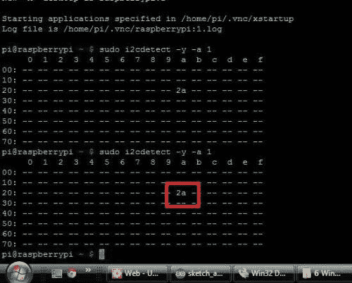T2】](https://res.cloudinary.com/practicaldev/image/fetch/s--uBv5okfR--/c_limit%2Cf_auto%2Cfl_progressive%2Cq_auto%2Cw_880/https://ladvien.cimg/i2cshowsup2.jpg)

现在，我已经读了这个家伙的文章关于树莓派 I2C 引脚实际上可以耐受 5v 电压。(注意，由于它们的上拉电阻，这仅是 I2C 引脚的*。)*

 *因此，理论上，您可以完全跳过光隔离器。但那是*你*，我会坚持我的光隔离。

## 抓取代码

下载[我的代码](http://www.ubermentis.com/files/piI2c_v4.zip)——或者某个更酷的人的。

注意，我的代码只是机器人的基础。现在，我的 it 只不过是一个非常非常复杂的遥控汽车无线电控制器。但是总有一天，我会做一个真正的机器人:)

## 大喊

如果有什么不对劲就冲我吼。或者我可以帮忙。*