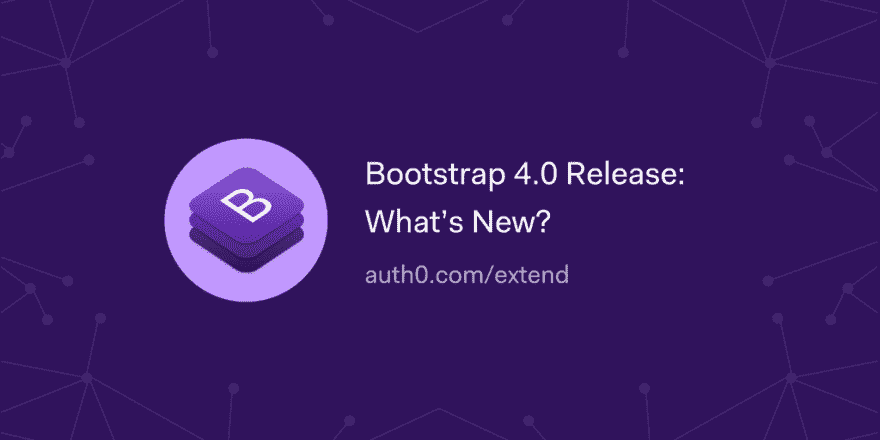

# Bootstrap 4.0 版本:新增功能？

> 原文：<https://dev.to/auth0/bootstrap-40-release-whats-new-5fpd>

Bootstrap 是用于设计 web 和移动网站的事实上的设计前端组件库。在本文中，我们将介绍 Bootstrap 4.0 中的新特性以及其他一些变化和弃用之处！

[读读🖌](https://auth0.com/blog/whats-new-in-bootstrap4/?utm_source=dev&utm_medium=sc&utm_campaign=new_bootstrap4)

[T2】](https://res.cloudinary.com/practicaldev/image/fetch/s--KLuoAbBi--/c_limit%2Cf_auto%2Cfl_progressive%2Cq_auto%2Cw_880/https://thepracticaldev.s3.amazonaws.com/i/5wyj58mydo7f3go5izwl.png)