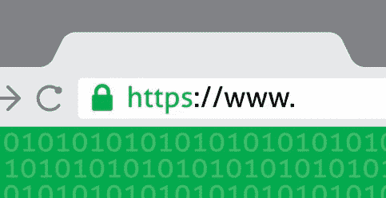

# https 如何工作的简要说明

> 原文：<https://dev.to/ruidfigueiredo/briefish-explanation-of-how-https-works>

当学习如何使用 [OpenSSL](https://www.openssl.org/) 创建自签名证书时，我清楚地认识到，大多数在线信息都假设您知道什么是证书，以及它们如何适合 HTTPS。

我决定试着解释一下 HTTPS，解释一下通信是如何变得安全的，也就是 Diffie-Hellman 密钥交换和数字证书是如何工作的。以下是我对此的看法。

[T2】](https://res.cloudinary.com/practicaldev/image/fetch/s--hucxmbwU--/c_limit%2Cf_auto%2Cfl_progressive%2Cq_auto%2Cw_880/https://thepracticaldev.s3.amazonaws.com/i/9y0l15qkptogoo5zqn52.jpg)

HTTPS 允许我们在不安全的信道上安全地通信(例如在机场的开放 wifi 网络上)，在那里有人很容易[监听所有网络流量](https://wiki.wireshark.org/CaptureSetup/WLAN)。与 HTTPS 的通信是安全的，因为它们是加密的。

使用[对称密钥加密](https://en.wikipedia.org/wiki/Symmetric-key_algorithm)对通信进行加密。这种特殊类型的加密要求发送方和接收方具有相同的密钥(即，使用相同的密钥来加密和解密数据)。

但是，如果发送方和接收方需要通过不安全的通道相互发送密钥，这难道不会使整个过程变得毫无意义吗？

这只有在发送方和接收方有办法互相发送密钥的情况下才能起作用，即使有人在监听通信(并且没有人能够知道密钥是什么)。

这就是 Diffie Hellman 密钥交换发挥作用的地方。

## 迪菲-海尔曼

Diffie-Hellman 允许双方在不泄露秘密的情况下创建共享的秘密密钥，同时“公开地”进行，即，即使有人可以访问双方交换的所有信息，他们仍然不能发现秘密密钥是什么。

听起来很神奇，对吧？不，这只是数学。

这里有一个简单的例子来说明它是如何工作的。首先挑选两个数字，它们通常被称为 *p* 和 *g* 。 *p* 是质数的简称， *g* 是发电机的简称。

一个质数是一个大于 1 的自然数，它除了 1 和它自己之外没有其他因子。

质数 *p* 的生成器 *g* 是一个数，使得 x 在 1 和 p-1 之间的 g^x 模 p 将“生成”从 1 到 p-1 的所有数。

*mod*(modulo 的缩写)是一个返回整除的余数的函数，例如 5 mod 3 是 2，因为 5 除以 3 的整除是 1，其余数是 2 (3 * 1 + 2 = 5)。

现在我们知道了什么是 mod，这里有一个质数发生器的例子。3 是 7 的生成器，因为:

```
- 3^1 mod 7 = 3
- 3^2 mod 7 = 2
- 3^3 mod 7 = 6
- 3^4 mod 7 = 4
- 3^5 mod 7 = 5
- 3^6 mod 7 = 1 
```

Enter fullscreen mode Exit fullscreen mode

如果我们对得到的结果进行排序:1，2，3，4，5，6，我们可以看到它们都是从 1 到 p-1 的数，这使得 *g* = 3 成为 *p* = 7 的生成元。

我们知道“手动”完成 Diffie-Hellman 的所有部分。

举个例子，想象一下爱丽丝和鲍勃想要给对方写信。不幸的是，有人正在阅读他们的信件，所以他们决定使用迪菲-赫尔曼能够秘密沟通。

爱丽丝挑选了 g 和 T2，例如 g = 3 和 p = 7，并用它们给鲍勃发了一封信。
爱丽丝也会挑选一个小于 *p* 的秘密数字，比如 2。
一旦鲍勃收到 *p* 和 *g* ，他就挑选一个小于 *p* 的秘密数字，比如 5。

鲍勃然后计算这个:g^secretBob mod p，在这种情况下 3^5 mod 7 = 5。鲍勃将这个号码发送给爱丽丝，我们称这个号码为 *numberBobSent* 。

与此同时，爱丽丝计算 g^secretAlice 模 p，在这种情况下，3^2 模 7 = 2，并将其发送给鲍勃，让我们称这个数字为 *numberAliceSent* 。

爱丽丝收到了鲍勃的 5 号信。然后她计算 numberBobSent^secretAlice mod p，在这种情况下，5^2 mod 7 = 4。

鲍勃收到了爱丽丝的信，并做了同样的事情:numberAliceSent^secretBob mod p，在这种情况下，2^5 mod 7 = 4。

他们共享的秘密是 4。谁读这些信，谁就能读 p，g，numberAliceSent 和 numberBobSent。然而，他们不知道爱丽丝和鲍勃的秘密号码，也不知道他们共享的秘密。Alice 和 Bob 现在可以使用他们的共享秘密来加密和解密他们的通信。

这是可行的，因为对于大素数来说，利用窃听者可以访问的信息(p、g 和 numberBobSent 和 numberAliceSent)来计算共享秘密的代价是极其昂贵的。

## 数字证书

我们现在知道，web 服务器和浏览器客户端可以利用 Diffie-Hellman 建立一个密钥来加密通信，即使有人可以访问所有交换的信息。

这解决了在不安全的介质上进行安全通信的问题，对吗？不完全是。

回到 Alice 和 Bob 的例子，想象一下，无论是谁在阅读他们的信件，比如说 Eve，都扮演了一个更主动的角色。伊芙会拿走爱丽丝的信，换成她自己的，也会拿走鲍勃的信。

她将能够与 Alice 和 Bob 建立秘密密钥。爱丽丝会认为她与鲍勃通信，鲍勃与爱丽丝通信，而他们都与夏娃通信。

然后，她只需接收爱丽丝的信件，用她与爱丽丝建立的密钥解密，阅读，用她与鲍勃建立的密钥加密，然后发送给他。

爱丽丝和鲍勃不可能知道他们的交流不是私密的。

这就是所谓的“人在中攻”。

那么如何才能解决这个问题呢？

这就是数字证书发挥作用的地方，但是在我们讨论非对称密钥加密之前。

### 非对称密钥加密

对于非对称密钥，有两个密钥，一个私钥和一个公钥。两者都可以加密和解密，但是如果你用其中一个加密，你只能用另一个解密。

私钥永远不应该被发送，而公钥可以自由地发送给任何人。因为任何用私钥加密的东西只能用公钥解密，如果有人给你发送加密的东西，你可以用公钥解密，你知道只有私钥的持有者才能加密发送的东西。

证书只是一个与私钥持有者信息捆绑在一起的公钥(如通常包含网站域名的主题名称，如 blinkingcaret.com)。

使证书可信的是它是由认证机构数字签名的(一个例子是[赛门铁克](https://www.symantec.com/ssl-certificates/)，以前的 Verisign)。但是首先，什么是数字签名？

### 数字签名

数字签名的目的是证明信息发送者的身份，以及信息在发送过程中没有被更改。

数字签名分两步执行。首先创建要签名的内容的[散列](https://en.wikipedia.org/wiki/Hash_function)(散列函数将任意数量的数据转换成固定数量)。然后使用私钥对其进行加密。加密的散列与信息捆绑在一起。加密的散列就是签名。

当某人收到一条带有加密散列的信息时，他们可以自己创建该信息的散列(使用相同类型的散列函数，例如 [md5](https://en.wikipedia.org/wiki/MD5) )，使用公钥解密签名并比较两个散列。如果它们匹配，这意味着信息不仅没有被更改，而且是由私钥所属的人创建的。

如果你想知道为什么我们不加密所有的信息，而是使用哈希函数，那是因为哈希要小得多，并且仍然具有我们需要的所有属性，以保证信息不被篡改。

### 认证机构

证书颁发机构是签署证书的实体。要签署证书，证书颁发机构需要一个私钥，以及一个公钥，公钥也包含在证书中。

不过，证书颁发机构的证书很特殊。它们是自签名的，这意味着它们是用与证书中的公钥配对的私钥签名的。此外，您计算机的操作系统安装了多个证书颁发机构的证书。

当有人给我们一个证书时，如果该证书是由我们信任的证书颁发机构(任何我们在计算机中安装了证书的证书颁发机构)签署的，则我们信任该证书(这时您会在浏览器中看到绿色地址栏)。

所以，回到爱丽丝和鲍勃的例子，我们应该改变这里的故事，因为字母的隐喻有点中断。

想象一下，鲍勃和爱丽丝将亲手把信交给对方。

同样，想象一下爱丽丝和鲍勃从未见过面，他们不知道另一个人长什么样。

虽然更复杂，但在这种情况下，中间人攻击仍然是可能的。想象某人，让我们说乔将使他自己经过鲍勃并且遇见爱丽丝，然后另一个人，例如简，将使他自己经过爱丽丝并且遇见鲍勃。约翰和简可以在他们之间进行协调，这样即使爱丽丝和鲍勃试图使用迪菲-赫尔曼，他们最终也会在不知情的情况下与简和约翰交谈。

然而，现在想象一下，鲍勃和爱丽丝有一张由政府颁发的极难伪造的身份证。

爱丽丝可以向鲍勃要他的身份证。这张卡上有鲍勃的名字和他的照片，并且是由一个爱丽丝认为值得信任的政府发行的，爱丽丝确信鲍勃就是他所说的那个人。鲍勃可以对爱丽丝做同样的事情。

在 HTTPS，id 卡是证书，颁发者是认证机构。此外，在 HTTPS，通常只有 web 服务器提供证书。然而，尽管使用证书对用户进行不常见的认证也是可能的。

我希望这能让你更好地了解所有这些部分是如何组合在一起以实现 HTTPS 的。请务必查看我的[博客](http://www.blinkingcaret.com)了解更多相关内容，例如[如何创建自己的认证中心，安装它并使用 OpenSSL](http://www.blinkingcaret.com/2017/02/01/using-openssl-to-create-certificates/) 创建签名证书。