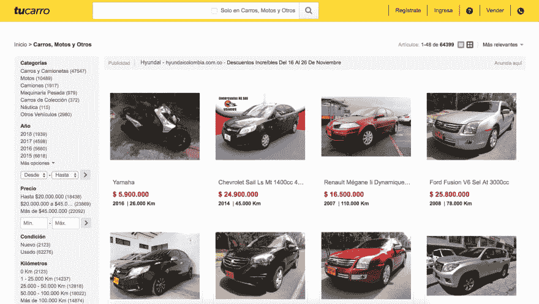
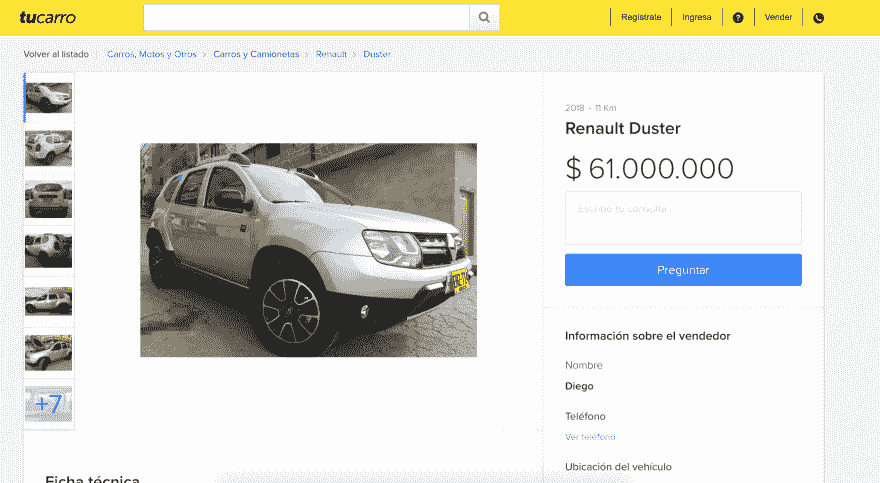

# 使用木偶师构建汽车价格刮刀优化器

> 原文：<https://dev.to/lexmartinez/build-a-car-price-scraper-optimizer-using-puppeteer-38p>

*原发表于我的[博客](https://redknot.io/articles/build-car-price-scraper-puppeteer)*

Puppeteer 是一个很棒的 Node.js 库，它为我们提供了很多命令来控制一个无头(或无头)chromium 实例，并且用很少的几行代码实现导航自动化。在这篇文章中，我们将使用木偶师的超能力，为二手车目录建立一个汽车信息刮刀工具，并选择最佳选项。

几天前，我和我的队友兼好友**[@ mafeserenaarbole](https://twitter.com/mafesernaarbole)**一起阅读关于网络抓取和她个人项目所需的不同在线工具。查看不同的文章和资源库，我们发现了 **[木偶师](https://github.com/GoogleChrome/puppeteer)** ，这是一个通过 DevTools 协议控制无头 Chrome 的*高级 API。这个伟大的工具唤醒了我们的兴趣，尽管最终它对她来说没有用，但我们都说“当然！我们得做点什么！!"。几天后，我告诉她，木偶师将是我博客第一篇文章的一个很好的主题...我在这里。我希望你喜欢它。*

## 我们的学习案例

这个想法很简单，在我们国家哥伦比亚有一个二手车目录，是。基本上给出了汽车的品牌和型号，tucarro.com.co*为你提供了一份全国出售的二手车清单。问题是，潜在客户必须一个接一个地搜索结果，并分析哪一个是最佳选择。*

因此，我们的重点是创建一个小的 **Node.js** 应用程序，用于导航目录网站，像人类一样进行搜索，然后我们将获取结果的第一页，抓取其信息(特别是汽车年份、行驶公里数和价格...当然还有广告网址)。最后，有了这些信息，并使用一些优化算法，我们将根据价格和行驶公里数为客户提供最佳选择。

> 声明:本练习仅为学术目的，非商业利益。我们不存储任何提取的数据，这些数据属于**tucarro.com.co**。该应用程序的源代码是在麻省理工学院的许可下分发的，免除了我们对衍生作品的任何责任。我们强烈建议负责任地使用它。

## 初始设置

我们将要创建一个 **Node.js** 应用程序，所以第一步当然是在一个新目录中创建一个新的`npm`项目。使用`-y`参数，package.json 将用默认值创建:

```
$ npm init -y 
```

Enter fullscreen mode Exit fullscreen mode

并将**木偶师**依赖项添加到您的项目
中

```
$ npm install --save puppeteer

# or, if you prefer Yarn:
$ yarn add puppeteer 
```

Enter fullscreen mode Exit fullscreen mode

最后，在我们的 package.json 文件中，添加以下脚本:

```
"scripts":  {  "start":  "node index.js"  } 
```

Enter fullscreen mode Exit fullscreen mode

这个脚本简化了我们应用程序的运行——现在我们只需用`npm start`命令就能做到

> 重要提示:您很快就会看到，**木偶师**需要来自 **Node.js** 核心的`async`和`await`函数，所以我们需要一个支持这些函数的最新版本的 Node(对于本文，我们使用的是`v9.2.0`版本，但是由于`v7.6`两个函数都被支持)

## 让我们摇滚吧

随着我们的`npm`项目成功配置，下一步是，是的，编码，让我们创建我们的`index.js`文件。这是我们**木偶师**应用
的骨架

```
'use strict'

const puppeteer = require('puppeteer')
async function run() {

 const browser = await puppeteer.launch()
 const page = await browser.newPage()

 browser.close()

}
run(); 
```

Enter fullscreen mode Exit fullscreen mode

基本上，我们在*行 2* 处导入一个`puppeteer`依赖，然后我们打开一个`async`函数来包装所有浏览器/木偶师的交互，在下面几行中，我们得到 chromium 浏览器的一个实例，然后打开一个新标签(页面)...在最后几行的末尾，我们关闭了浏览器(及其进程),最后运行了`async`函数。

#### 导航到我们的目标地点

使用我们的选项卡实例(`page`)访问特定网站是一项简单的任务。我们只需要使用`goto`方法:

```
 await page.goto('https://www.tucarro.com.co/') 
```

Enter fullscreen mode Exit fullscreen mode

以下是网站在浏览器中的外观

[T2】](https://res.cloudinary.com/practicaldev/image/fetch/s--E1wnaoGP--/c_limit%2Cf_auto%2Cfl_progressive%2Cq_auto%2Cw_880/https://raw.githubusercontent.com/lexmartinez/car-price-scraper/master/screenshots/screenshot.png)

#### 搜索

我们的目标是在没有任何过滤器的情况下找到并抓取结果的第一页。要做到这一点，我们只需要与网站交互并点击`Buscar`按钮，我们可以使用`page`实例的`click`方法来实现。

```
 await page.waitForSelector('.nav-search-submit')
 await page.click('button[type=submit]'); 
```

Enter fullscreen mode Exit fullscreen mode

注意，第一行允许我们的脚本等待特定元素的加载。我们用它来确保`Buscar`按钮被渲染以便点击它，第二个按钮只是点击按钮并触发下面的屏幕

[T2】](https://res.cloudinary.com/practicaldev/image/fetch/s--Znh8Oo1n--/c_limit%2Cf_auto%2Cfl_progressive%2Cq_auto%2Cw_880/https://raw.githubusercontent.com/lexmartinez/car-price-scraper/master/screenshots/screenshot2.png)

这里令人惊讶的是，摩托车是在那里装载的，所以我们将需要使用车辆和卡车的类别链接`Carros y Camionetas`,当然使用相同的点击功能，首先验证链接是否被呈现。

```
 await page.waitForSelector('#id_category > dd:nth-child(2) > h3 > a')
 await page.click('#id_category > dd:nth-child(2) > h3 > a'); 
```

Enter fullscreen mode Exit fullscreen mode

好了，现在我们有了汽车结果页面...来刮吧！

> *注意:*本节中使用的选择器是在浏览交付给浏览器的站点 html 和/或使用`copy selector`选项时发现的

#### 刮吧！

对于我们的结果页面，我们只需要迭代`DOM`节点并提取信息。幸运的是，木偶师 T2 也能帮助我们。

```
 await page.waitForSelector('.ch-pagination')
const cars = await page.evaluate(() => {
  const results = Array.from(document.querySelectorAll('li.results-item'));
  return results.map(result => {
     return {
       link: result.querySelector('a').href,
       price: result.querySelector('.ch-price').textContent,
       name: result.querySelector('a').textContent,
       year: result.querySelector('.destaque > strong:nth-child(1)').textContent,
       kms: result.querySelector('.destaque > strong:nth-child(3)').textContent
     }
   });
  return results
 });

 console.log(cars) 
```

Enter fullscreen mode Exit fullscreen mode

在上面的脚本中，我们使用`evaluate`方法进行结果检查，然后使用一些查询选择器迭代结果列表，以便提取每个节点的信息，为每个商品/汽车
生成如下输出

```
{ link: 'https://articulo.tucarro.com.co/MCO-460314674-ford-fusion-2007-_JM',
    price: '$ 23.800.000 ',
    name: ' Ford Fusion V6 Sel At 3000cc',
    year: '2007',
    kms: '102.000 Km' } 
```

Enter fullscreen mode Exit fullscreen mode

哦耶！我们得到了信息，并且有了`JSON`结构，但是如果我们想要优化它，我们需要规范化数据——毕竟所有的计算都有点复杂，有了那些`Kms`和`$`符号，不是吗？...所以我们要像这样改变我们的结果图片段

```
 return results.map(result => {
     return {
       link: result.querySelector('a').href,
       price: Number((result.querySelector('.ch-price').textContent).replace(/[^0-9-]+/g,"")),
       name: result.querySelector('a').textContent,
       year: Number(result.querySelector('.destaque > strong:nth-child(1)').textContent),
       kms: Number((result.querySelector('.destaque > strong:nth-child(3)').textContent).replace(/[^0-9-]+/g,""))
     }
   }); 
```

Enter fullscreen mode Exit fullscreen mode

当然，拯救世界，我们需要数字的地方就有数字。

## 优化时间！！

在这一点上，我们已经尝到了木偶师的味道，这是我们这篇文章的主要目标，在这最后一节中，我们将使用一个简单的启发式方法，根据收集到的数据来选择最佳的汽车。基本上，我们将创建一个启发式函数来计算一些`score`，允许我们对每辆车进行评级并选择最佳选项。为此，我们考虑以下几点:

*   对于每个变量，我们根据潜在客户的重要性分配一个权重(价格为 4，年份和 kms 各为 3)。
*   鉴于 kms 和价格应该最小化，我们将使用其值作为分数分母
*   为了便于计算，我们对变量的数字因子进行了归一化，因此，每个价格将在 100 万年和 1000 万公里之间除以 1000

这是最终的公式*免责声明:这是一个假设的公式，为了完成这个练习，所以它在现实生活中缺乏任何数学或科学价值*

```
score = 4 (1/price) + 3 (year) + 3 (1/kms) 
```

Enter fullscreen mode Exit fullscreen mode

这个公式的代码片段

```
 let car = {score: 0}
 for (let i = 0; i < cars.length; i++) {
    cars[i].score = (4 * (1/(cars[i].price/1000000))) + (3 * (cars[i].year/1000)) + (3 * (1/(cars[i].kms/1000)))
    if(cars[i].score > car.score){
      car = cars[i]
    }
 }
 console.log(car) 
```

Enter fullscreen mode Exit fullscreen mode

最后，我们用**木偶师**访问结果链接并截图

```
 await page.goto(car.link)
 await page.waitForSelector('.gallery__thumbnail')
 await page.screenshot({path: 'result.png', fullPage: true}); 
```

Enter fullscreen mode Exit fullscreen mode

[T2】](https://res.cloudinary.com/practicaldev/image/fetch/s--a2j3vCeg--/c_limit%2Cf_auto%2Cfl_progressive%2Cq_auto%2Cw_880/https://raw.githubusercontent.com/lexmartinez/car-price-scraper/master/screenshots/screenshot3.png)

#### 就是这样！

> *   **Puppet API** documentation can be found here in [!](https://github.com/GoogleChrome/puppeteer/blob/master/docs/api.md)
> *   The complete source code of this exercise can be found in this [**GitHub Repo**](https://github.com/lexmartinez/car-price-scraper)
>     *   Find it! Yeah! The optimization part must be improved by some machine learning techniques or optimization algorithms, but that's the fabric of another T-shirt.
> *   Thanks for reading! Welcome comments, suggestions and [DMS](https://twitter.com/lex0316) !