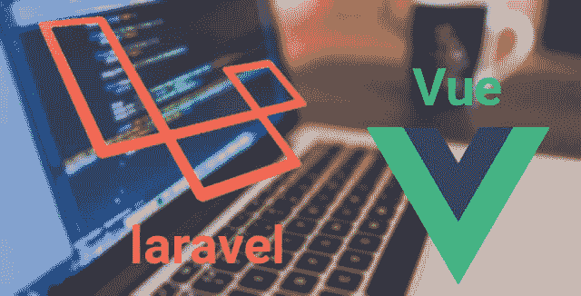
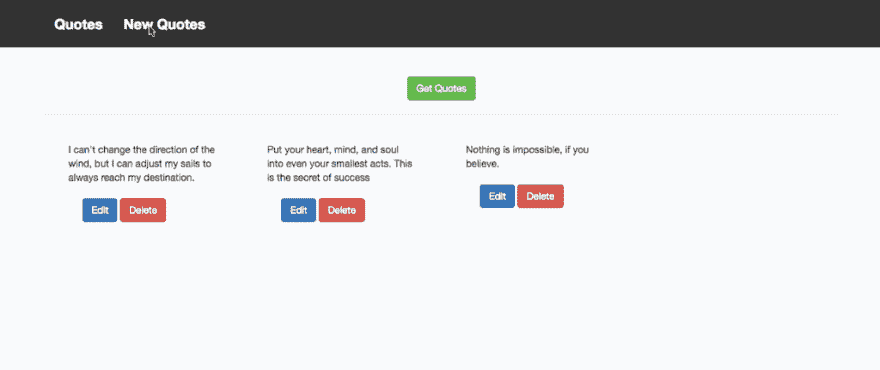
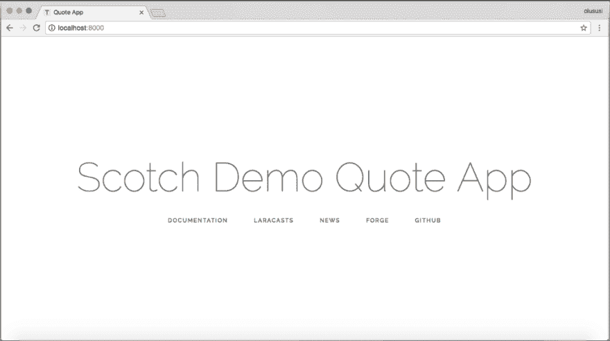
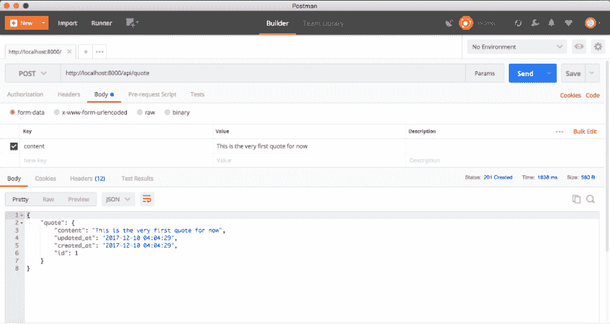
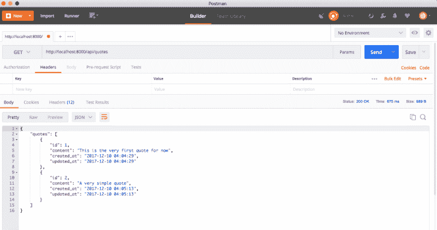
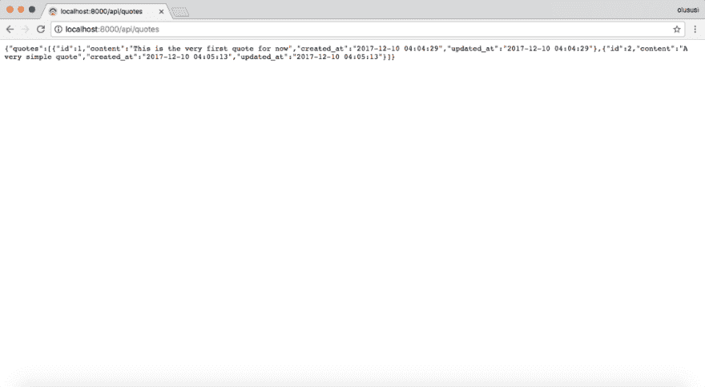

# 使用 Laravel 和 Vue 构建报价应用程序:第 1 部分

> 原文：<https://dev.to/yemiwebby/build-a-quote-application-using-laravel-and-vue-part-1-3apg>

[](https://res.cloudinary.com/practicaldev/image/fetch/s--3T1uCODb--/c_limit%2Cf_auto%2Cfl_progressive%2Cq_auto%2Cw_880/https://cdn-images-1.medium.com/max/640/1%2Am5oBrqMwPIdQk7blG8lrPQ.png) 

<figcaption>【幼虫和鸟】</figcaption>

你有没有想过最好的方法来构建你的应用程序，并把你的后端和前端分成不同的域？那么你就来对地方了，这个教程就是为你准备的！

我们正处于构建 web 应用程序的客户端-服务器模型架构的时代，后端构建为 API，前端构建为消费它。

在本教程中，我们将构建一个应用程序，在这个应用程序中，我们将确保一个单独的域中的后端(API)和前端(Vue)之间的顺利通信。Laravel 将用于暴露一些 API 端点或 URL，Vue 应用程序可以连接到这些端点或 URL，并执行不同的操作或请求。

本教程假设您对 PHP 和 javaScript 的面向对象编程有基本的了解。尽管我们将学习 Laravel 和 Vue.js 的基础知识，但还是建议对它们的概念有一个基本的了解。既然我们已经清楚了这一点，让我们一起建造一些令人敬畏的东西。

```
Consuming web services are where JavaScript library like Vue really shines. 
```

[**Vue**](http://vuejs.org) 是一个用于在 web 上构建用户界面的渐进式 JavaScript 框架。它可以很容易地用于构建单页面应用程序(SPA ),也可以扩展用于大型企业应用程序。

另一方面，Laravel 是一个功能强大的 MVC PHP web 应用程序框架，具有丰富、优雅的语法，它是为需要一个简单、优雅的工具包来创建全功能 web 应用程序的开发人员而设计的。

有两种不同的方式将 Laravel 连接到像 Vue 这样的库。

1.  您可以简单地向 Laravel 应用程序添加一些小部件，也就是说，您仍然可以使用 Laravel 呈现一些视图，但是使用 Vue 来支持 DOM，这增强了在运行时编辑 DOM 的能力

2.  在不同的域上构建 Laravel 后端和 Vue，并通过 HTTP 调用将它们相互连接。

出于本教程的考虑，我们将选择第二个选项。

由于 Vue 不能用来连接服务器以获得动态的网络体验，我们将使用 Laravel 作为我们的后端应用程序。这里不会使用 Laravel 来呈现多个视图，但是它将提供 API，Vue 将通过 Ajax HTTP 请求连接到该 API。这涵盖了任何应用程序后端所需的所有请求。

### **我们要建什么**

为了更好地展示 Vue 和 Laravel 之间的联系，我们将一起构建一个简单的报价应用程序。Vue 将被用来发布一个报价到后端以保存它，并获取报价，以显示在主页上。你可以在这里查看演示。

[T2】](https://res.cloudinary.com/practicaldev/image/fetch/s--SIGKgpGl--/c_limit%2Cf_auto%2Cfl_progressive%2Cq_66%2Cw_880/https://cdn-images-1.medium.com/max/1024/1%2AFivIY_jsF9gMZahKTbkumw.gif)

这将是一个完全由 Vue 支持的单页面应用程序，能够在页面之间切换，并根据从后端获取的数据重新呈现页面上的内容。

### 我们开始吧

如前所述，我们的 Laravel 后端将提供一些最终将被 Vue 使用的 API 端点。为此，我们将首先构建与我们的前端应用程序交互所需的所有 API 端点。

### 设置后端

Laravel 利用 [Composer](https://getcomposer.org/) 来管理它的依赖项。所以在使用 Laravel 之前，确保你的机器上已经安装了 Composer。

您可以通过以下方式下载并安装 Laravel:

1.  Laravel 安装程序
2.  作曲家创作-项目。

我们将首先创建一个名为“后端报价应用程序”的新 Laravel 项目

```
composer create-project --prefer-dist laravel/laravel backend-quote-app 
```

如果您的计算机上已经安装了 [Laravel 安装程序](https://laravel.com/docs/5.5#installing-laravel)，您可以简单地继续运行下面的命令

```
laravel new backend-quote-app 
```

现在将目录切换到新创建的项目文件夹 backend-quote-app，并启动 PHP 内置的开发服务器来为应用程序提供服务，如下所示:

```
## change directory
cd backend-quote-app

## start the server
php artisan serve 
```

现在，您应该已经设置好了 Laravel 应用程序。

[T2】](https://res.cloudinary.com/practicaldev/image/fetch/s--75x7ILvw--/c_limit%2Cf_auto%2Cfl_progressive%2Cq_auto%2Cw_880/https://cdn-images-1.medium.com/max/1024/1%2A5bFIUo6j9PG0p3fDA2R7lw.png)

如果你在本地服务器上打开你的 Laravel 应用程序，你的主页看起来应该和上面的相似。我所做的不同是编辑 resources/views/welcome . blade . PHP，如下所示。

```
<!-- resources/views/welcome.blade.php -->
<!doctype html>
<html lang="{{ app()->getLocale() }}">
    <head>
      ...
            <div class="content">
                <div class="title m-b-md">
                   // this was edited
                    Scotch Demo Quote App
                </div>

<div class="links">
                   ...
                </div>
            </div>
        </div>
    </body>
</html> 
```

### 设置您的路线

对于一个普通的 Laravel 应用程序，我们通常使用 routes/web.php 文件来设置我们的路由，但是在本教程中，我们将使用 routes/api.php。routes/api.php 中的路由是无状态的，被分配给 api 中间件组。对于这个示例应用程序，我们需要下面的路线

```
<?php

Route::post('/quote',[
        'uses' => 'QuoteController@postQuote',
        'as' => 'post-quote'
    ]);

Route::get('/quotes',[
        'uses' => 'QuoteController@getQuotes',
        'as' => 'get-quotes'
    ]);

Route::put('/quote/{id}',[
        'uses' => 'QuoteController@putQuote',
        'as' => 'update-quote'
    ]);

Route::delete('/quote/{id}',[
        'uses' => 'QuoteController@deleteQuote',
        'as' => 'delete-quote'
]); 
```

我们基本上使用 HTTP 动词 POST、GET、PUT 和 DELETE 来分别发布、获取、更新和删除数据库中的报价。

### 创建模型和控制器

通过运行以下命令，创建一个模型以访问报价(即在数据库中获取和存储报价):

```
php artisan make:model Quote -m 
```

这将创建一个模型报价和一个迁移文件来构建应用程序的数据库模式。

既然我们已经准备好了模型和迁移文件。我们不会向 app\Quote.php 添加太多内容，但是我们需要编辑 database\migrations 目录中迁移文件的内容，以反映我们的数据库模式:

```
<?php

use Illuminate\Support\Facades\Schema;
use Illuminate\Database\Schema\Blueprint;
use Illuminate\Database\Migrations\Migration;

class CreateQuotesTable extends Migration
{

    public function up()
    {
        Schema::create('quotes', function (Blueprint $table) {
            $table->increments('id');
            $table->text('content');
            $table->timestamps();
        });
    }

    public function down()
    {
        Schema::dropIfExists('quotes');
    }

} 
```

### 数据库设置

打开。env 文件并添加您的数据库细节

```
DB_CONNECTION=mysql

DB_HOST=127.0.0.1

DB_PORT=3306

DB_DATABASE=Your-database-name

DB_USERNAME=Your-database-username

DB_PASSWORD=Your-database-password 
```

### 迁移并创建表格

您可以继续运行迁移:

```
php artisan migrate 
```

如果您在尝试运行迁移命令时遇到此错误，

```
[PDOException]                                                               
  SQLSTATE[42000]: Syntax error or access violation: 1071 Specified key was too long; max key length is 767 bytes 
```

这是因为您运行的是旧版本的 MySQL。你可以在这里阅读更多相关信息[。但是一个快速的解决方法是删除数据库并重新创建它。然后，您必须编辑 AppServiceProvider 文件，并在 boot 方法中设置默认字符串长度:](https://laravel-news.com/laravel-5-4-key-too-long-error)

```
use Illuminate\Support\Facades\Schema;

public function boot()
{
    Schema::defaultStringLength(191);
} 
```

您现在可以重新运行迁移命令，现在一切都应该正常了。

### 创建控制器

下一步是创建控制器，并为我们的应用程序快速设置所需的逻辑

```
php artisan make:controller QuoteController 
```

上面的命令将创建一个名为 QuoteController.php 的新文件，存储在 app/Http/Controllers 中。在这里，我们希望能够处理 postQuote、getQuotes、putQuote 和 deleteQuote 请求。我们需要为所有这些请求创建几个函数:

```
<?php

namespace App\Http\Controllers;

use App\Quote;
use Illuminate\Http\Request;

class QuoteController extends Controller
{

    public function postQuote(Request $request)
    {
       ...
    }

public function getQuotes()
    {
       ...
    }

public function putQuote(Request $request, $id)
    {
        ...
    }

public function deleteQuote($id)
    {
        ...
    }
} 
```

既然已经创建了函数，我们需要开始实现它们的功能。

```
public function postQuote(Request $request)
    {
        $quote = new Quote();
        $quote->content = $request->input('content');
        $quote->save();
        return response()->json(['quote' => $quote], 201);
    } 
```

首先，为了创建新的报价并持久化到数据库中，我们实例化报价模型，使用 Laravel 的 input()方法从输入字段内容中检索传入的值，然后保存它。还返回了一个响应，其中包含新创建的报价和状态代码 [201](https://httpstatuses.com/201) 。

```
public function getQuotes()
    {
        $quotes = Quote::all();
        $response = [
            'quotes' => $quotes
        ];
        return response()->json($response, 200);
    } 
```

创建的报价需要获取并返回，以便显示给用户，上面的方法处理了这个问题。它从数据库中检索所有报价，并以 json 格式返回。

```
public function putQuote(Request $request, $id)
    {
        $quote = Quote::find($id);

// check if quote is not found
        if(!$quote)
        {
            return response()->json(['message' => 'Quote not found'], 404);
        }

$quote->content = $request->input('content');

$quote->save();
        return response()->json(['quote' => $quote], 200);
    } 
```

我们添加了另一个功能来更新应用程序中创建的任何报价。这个方法接受一个额外的参数，这是我们希望更新的报价的 id。它检索报价，更新报价，然后保存到数据库中。

```
public function deleteQuote($id)
    {
        $quote = Quote::find($id);
        $quote->delete();
        return response()->json(['message' => 'Quote deleted'], 200);
    } 
```

为了最终完成 CRUD(创建、读取、更新和删除)操作，deleteQuote($id)使用 find()方法获取报价，然后删除。

仔细看看这个控制器中的所有函数，你会发现自始至终都使用了 json()方法。这是一个 Laravel helper 方法，它接受两个参数，第一个参数是一个关联数组，将由 Laravel 转换为 json 格式，第二个参数是一个状态代码。这种方法在开发特别是基于微服务的应用程序时非常方便和有用。

一切就绪。太好了！！。

您可以使用名为 Postman 的工具快速测试 API 端点。

[](https://res.cloudinary.com/practicaldev/image/fetch/s--fsixWHG_--/c_limit%2Cf_auto%2Cfl_progressive%2Cq_auto%2Cw_880/https://cdn-images-1.medium.com/max/1024/1%2A9FLmcV55GRveJPCsv4cIow.png) 

<figcaption>贴出报价</figcaption>

[](https://res.cloudinary.com/practicaldev/image/fetch/s--Mb-iyxF5--/c_limit%2Cf_auto%2Cfl_progressive%2Cq_auto%2Cw_880/https://cdn-images-1.medium.com/max/1024/1%2A6pLOhHUViWJXNTkZsNvzhw.png) 

<figcaption>获取行情</figcaption>

[](https://res.cloudinary.com/practicaldev/image/fetch/s--kkOgzycx--/c_limit%2Cf_auto%2Cfl_progressive%2Cq_auto%2Cw_880/https://cdn-images-1.medium.com/max/1024/1%2AecdfPHu6mo-ZqrFPjIJoow.png) 

<figcaption>使用浏览器获取报价</figcaption>

如果你一直坚持到现在，你应该庆祝一下

[T2】](https://res.cloudinary.com/practicaldev/image/fetch/s--ywoDT-qg--/c_limit%2Cf_auto%2Cfl_progressive%2Cq_66%2Cw_880/https://cdn-images-1.medium.com/max/644/1%2AN2dboiW9YZabgqfozzoSxQ.gif)

恭喜你！您已经成功地为我们的报价应用程序设置了后端。

### 结论

到目前为止，我们已经能够设置报价应用程序所需的后端。在下一部分，我们将使用 Vue 构建前端，这将消耗创建的 API。为了确保前端和后端之间的顺利沟通，我们还将启用 CORS(跨源资源共享)。到时候见。

第二部分:[此处](https://dev.to/yemiwebby/build-a-quote-application-using-laravel-and-vue-part-2-56kj)