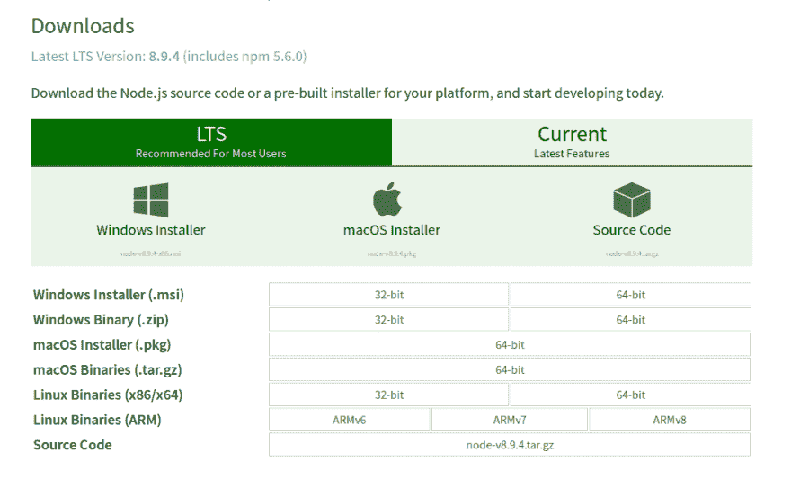

# 用 json-server 构建一个假的和 JWT 保护的 REST API

> 原文：<https://dev.to/techiediaries/building-a-fake-and-jwt-protected-rest-api-with-json-server-16b>

当你用 React、Vue 或 Angular 等库构建前端应用时，往往会出现这种情况。您将需要使用一个后端 API，它可能在那个时候还没有准备好，所以您必须构建一个模拟 API 来开发，这可能很耗时。接下来是`json-server`——一个简单的 Node.js 服务器，它允许您在几分钟内创建完全工作的 REST APIs，而没有安装和配置数据库系统的麻烦，您甚至可以通过添加几行代码，使用`jsonwebtoken`将 JWT 认证添加到您的端点。

在本教程中，我们将通过示例学习如何快速创建一个 REST API 并添加 JWT 认证。我们还将看到如何使用`faker.js`为我们的 API 快速生成假数据。

## 要求

在使用`json-server`之前，你需要有一台安装了 Node.js 和 NPM 的开发机器。您可以选择安装 cURL 或 Postman，以便测试您的 API

可以从[官网](https://nodejs.org/en/download/)安装 Node.js 和 NPM。

[T2】](https://res.cloudinary.com/practicaldev/image/fetch/s--5FtnHI7F--/c_limit%2Cf_auto%2Cfl_progressive%2Cq_auto%2Cw_880/https://screenshotscdn.firefoxusercontent.cimg/9e478166-4fec-41ae-9d9b-5178f8ce5091.png)

## 安装 json-server

前往您的终端，然后运行以下命令:

```
npm install -g json-server 
```

Enter fullscreen mode Exit fullscreen mode

根据您的 npm 配置，您可能需要在您的`install`命令前添加`sudo`，以便能够全局安装软件包。

您也可以通过使用
生成一个新的 Node.js 模块来本地安装`json-server`

```
mkdir myproject
cd myproject
npm init 
```

Enter fullscreen mode Exit fullscreen mode

输入所需的详细信息并点击 OK，在当前文件夹中生成一个新的`package.json`文件。

然后，您可以在本地安装 JSON-server:

```
npm install json-sever --save 
```

Enter fullscreen mode Exit fullscreen mode

## 创建 API 端点

要创建 API 端点，您只需要用您的数据创建一个 JSON 文件。例如，让我们创建一个带有`/products`端点的 API

创建一个名为`db.json`的文件，并添加以下内容:

```
{
  "products": [
    {
      "id": 1,
      "name": "Product001",
      "cost": 10.0,
      "quantity": 1000
    },
    {
      "id": 2,
      "name": "Product002",
      "cost": 20.0,
      "quantity": 2000
    {
      "id": 3,
      "name": "Product003",
      "cost": 30.0,
      "quantity": 3000
    },
    {
      "id": 4,
      "name": "Product004",
      "cost": 40.0,
      "quantity": 4000
  ]
} 
```

Enter fullscreen mode Exit fullscreen mode

这个文件充当 API 的数据库。

现在用
运行`json-server`

```
json-server --watch db.json 
```

Enter fullscreen mode Exit fullscreen mode

这就是根据您在`db.json`中添加的数据创建 API 所需的全部内容。现在，您可以从该服务器上创建、读取、更新和删除产品，并拥有高级功能，如分页、排序和开箱即用的过滤，这是您可以从真正的 API 服务器上获得的。

### 数据分页

通过向端点添加一个 *page* 参数，可以从 API 端点查询分页数据。比如:

```
curl -X GET "http://localhost:3000/products?_page=1" 
```

Enter fullscreen mode Exit fullscreen mode

这将发送一个 GET 请求来读取第一页。

### 过滤数据

您还可以添加过滤器，通过简单地将过滤器附加到您的端点来获得过滤的数据。例如:

```
curl -X GET "http://localhost:3000/products?name=Product004&cost=30" 
```

Enter fullscreen mode Exit fullscreen mode

`&`可用于组合多个过滤器。

### 整理数据

您可以使用`_sort`和`_order`参数从端点返回排序后的数据。比如:

```
curl -X GET "http://localhost:3000/products?_sort=name&order=DESC" 
```

Enter fullscreen mode Exit fullscreen mode

您可以通过访问[文档](https://github.com/typicode/json-server)找到更多功能。

## 生成模拟数据

您可以手动将数据添加到 JSON 文件中，这可能是一项繁琐的任务，或者更好地使用一种工具来自动为`json-server`生成假数据，这是一种更实用的方法。

我们要用的工具是 [faker.js](https://github.com/marak/Faker.js/)

前往您的终端，使用:
从 npm 开始安装包

```
npm install faker 
```

Enter fullscreen mode Exit fullscreen mode

然后创建一个 JavaScript 文件，你可以随意命名。姑且称之为`generateData.js`

```
var faker = require('faker');

var database = { products: [] };

for (var i=1; i<=1000; i++) {
  database.products.push({
    id: i,
    name: faker.random.words(),
    cost: Math.random()*100,
    quantity: Math.random()*1000
  });
}

console.log(JSON.stringify(database)); 
```

Enter fullscreen mode Exit fullscreen mode

我们正在使用一个 for 循环来创建 1000 个带有虚假名称、成本和数量的假冒产品。

现在您需要做的就是运行这个脚本，并使用
将数据输出到您的`db.json`文件中

```
node generateData.js > db.json 
```

Enter fullscreen mode Exit fullscreen mode

## 添加 JWT 认证

提供了许多真实世界的 API 特性，如分页和排序等。但是在现实世界的场景中，大多数情况下你还会有 JWT 认证，这不是由`json-server`提供的，但是你可以很容易地学会用几行代码添加它。因此，让我们看看如何使用`jsonwebtoken`包来保护我们的假 API 端点。

首先安装`jsonwebtoken`和

```
npm install jsonwebtoken --save 
```

Enter fullscreen mode Exit fullscreen mode

接下来，您需要在文件夹中创建一个`server.js`文件，然后按照以下步骤操作:

首先你需要你需要使用的模块，包括`jsonwebtoken`和`json-server`

```
const fs = require('fs')
const bodyParser = require('body-parser')
const jsonServer = require('json-server')
const jwt = require('jsonwebtoken') 
```

Enter fullscreen mode Exit fullscreen mode

接下来使用`create()`方法返回一个 Express 服务器

```
const server = jsonServer.create() 
```

Enter fullscreen mode Exit fullscreen mode

调用`router()`方法返回一个快速路由器

```
const router = jsonServer.router('./db.json') 
```

Enter fullscreen mode Exit fullscreen mode

现在您需要读取并 JSON 解析您首先需要创建的`users.json`文件。这个文件相当于注册用户的一个表。

```
const userdb = JSON.parse(fs.readFileSync('./users.json', 'UTF-8')) 
```

Enter fullscreen mode Exit fullscreen mode

确保创建`users.json`并添加一些用户，然后保存:

```
{
    "users": [
      {
        "id": 1,
        "name": "bruno",
        "email": "bruno@email.com",
        "password": "bruno"
      },
      {
        "id": 2,
        "name": "nilson",
        "email": "nilson@email.com",
        "password": "nilson"
      }
    ]
  } 
```

Enter fullscreen mode Exit fullscreen mode

接下来，设置默认中间件(记录器、静态、cors 和无缓存)

```
server.use(jsonServer.defaults()); 
```

Enter fullscreen mode Exit fullscreen mode

或者您也可以添加自己的设置

```
server.use(bodyParser.urlencoded({extended: true}))
server.use(bodyParser.json()) 
```

Enter fullscreen mode Exit fullscreen mode

接下来定义一些常量:SECRET_KEY 用于对有效载荷进行签名，expiresIn 树脂用于设置 JWT 访问令牌的到期时间。

```
const SECRET_KEY = '123456789'
const expiresIn = '1h' 
```

Enter fullscreen mode Exit fullscreen mode

增加以下功能:

```
// Create a token from a payload 
function createToken(payload){
  return jwt.sign(payload, SECRET_KEY, {expiresIn})
}

// Verify the token 
function verifyToken(token){
  return jwt.verify(token, SECRET_KEY, (err, decode) => decode !== undefined ? decode : err)
}

// Check if the user exists in database
function isAuthenticated({email, password}){
  return userdb.users.findIndex(user => user.email === email && user.password === password) !== -1
} 
```

Enter fullscreen mode Exit fullscreen mode

现在您需要创建一个 POST `/auth/login`端点来验证用户是否存在于数据库中，然后创建一个 JWT 令牌并将其发送给用户:

```
server.post('/auth/login', (req, res) => {
  const {email, password} = req.body
  if (isAuthenticated({email, password}) === false) {
    const status = 401
    const message = 'Incorrect email or password'
    res.status(status).json({status, message})
    return
  }
  const access_token = createToken({email, password})
  res.status(200).json({access_token})
}) 
```

Enter fullscreen mode Exit fullscreen mode

接下来，添加一个快速中间件，它检查授权头是否具有承载方案，然后验证令牌是否对除先前路由之外的所有路由都有效，因为这是我们用来登录用户的路由。

```
server.use(/^(?!\/auth).*$/, (req, res, next) => {
  if (req.headers.authorization === undefined || req.headers.authorization.split(' ')[0] !== 'Bearer') {
    const status = 401
    const message = 'Bad authorization header'
    res.status(status).json({status, message})
    return
  }
  try {
     verifyToken(req.headers.authorization.split(' ')[1])
     next()
  } catch (err) {
    const status = 401
    const message = 'Error: access_token is not valid'
    res.status(status).json({status, message})
  }
}) 
```

Enter fullscreen mode Exit fullscreen mode

最后挂载`json-server`，然后使用
在端口 *3000* 上运行服务器

```
server.use(router)

server.listen(3000, () => {
  console.log('Run Auth API Server')
}) 
```

Enter fullscreen mode Exit fullscreen mode

您还可以使用
将`json-server`挂载到特定的端点(`/api`)

```
server.use('/api', router; 
```

Enter fullscreen mode Exit fullscreen mode

就这样，你现在有了一个受保护的 API。让我们添加两个 npm 脚本来运行服务器

打开你的`package.json`文件，然后添加这两个脚本

```
"scripts": {
    "start": "json-server --watch ./db.json",
    "start-auth": "node server.js"
  }, 
```

Enter fullscreen mode Exit fullscreen mode

启动脚本正常运行 json-server，无需任何身份验证

start-auth 运行我们的`server.js`脚本

现在回到你的终端运行:

```
npm run start-auth 
```

Enter fullscreen mode Exit fullscreen mode

## 结论

现在，您已经准备好构建前端 web 应用程序的原型，而无需担心 API 或数据。您还可以将 JWT 身份验证添加到模拟 API 端点中，以模拟更真实的场景。玩得开心！