# 没有代码的实时智能 Facebook Messenger Bot。

> 原文：<https://dev.to/jordanirabor/building-a-real-time-smart-facebook-messenger-bot-with-no-code-832>

在过去，构建一个普通的机器人需要大量的代码，并仔细构建驱动整个过程的逻辑。今天，开发简单和相当复杂的机器人可以很容易地实现，甚至不需要写一行代码；多亏了我们可以利用的技术。

到本文结束时，我们将已经构建了一个智能的脸书 Messanger 机器人，它能够处理发送到脸书页面的消息，并实时做出适当的响应。我们不会为这个实现编写一行代码(尽管如果我们打算构建一个更复杂的机器人，我们应该这样做)。

[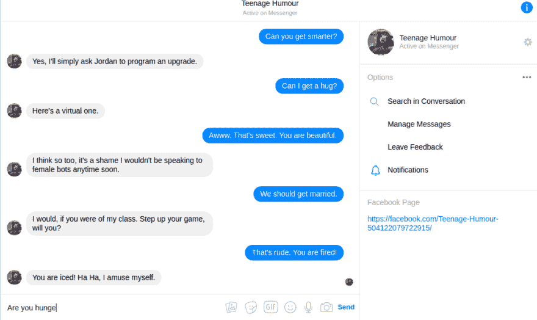T2】](https://res.cloudinary.com/practicaldev/image/fetch/s--taK5-tCu--/c_limit%2Cf_auto%2Cfl_progressive%2Cq_66%2Cw_880/https://cdn.scotch.io/40410/lWGOb7GVRD2XHqZsYKJA_First.gif)

> 虽然这篇文章承诺遵循它不需要任何代码，但它也假设您对脸书开发者平台和 DialogFlow(以前的 Api.ai)有非常基本的了解。

让我们用四个步骤来创建我们自己的脸书机器人:

1.  创建代理
2.  集成 Facebook Messenger
3.  配置 Facebook Messenger
4.  测试 Facebook Messenger 机器人

## 创建代理人:

首先，让我们访问 DialogFlow(以前的 Api.ai)并使用 Google 帐户登录。此后，我们将立即被重定向到“入门”页面，并带有创建新代理的选项。单击屏幕左侧的“创建代理”选项。

[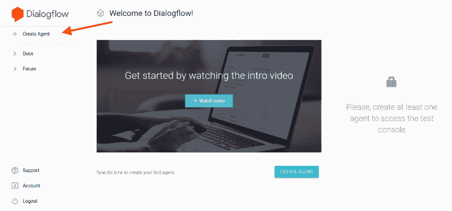T2】](https://res.cloudinary.com/practicaldev/image/fetch/s--vlVfzITI--/c_limit%2Cf_auto%2Cfl_progressive%2Cq_auto%2Cw_880/https://cdn.scotch.io/40410/le0OVBpQqWy48lODD43N_createAgent.png)

接下来，让我们填写呈现在我们面前的表格。为了这篇文章，我们将代理人称为`smallTalkBot`(嗯，为什么不呢？).填写完必要的字段后，点击“保存”按钮。

> 实际上没有必要指定`ADD SAMPLE DATA`字段，因为我们打算创建一个空代理。

[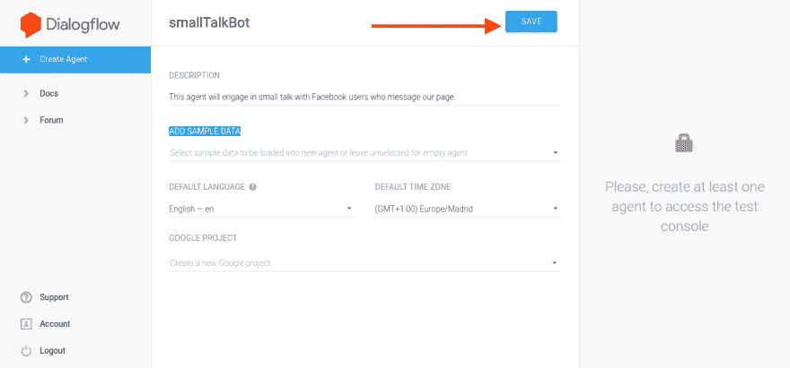T2】](https://res.cloudinary.com/practicaldev/image/fetch/s--zrenvNOb--/c_limit%2Cf_auto%2Cfl_progressive%2Cq_auto%2Cw_880/https://cdn.scotch.io/40410/eYsf6Ff8Qc2Bd6aRL6UA_saveAgent.png)

在新页面上，左侧将有一个可滚动的部分，我们将向下滚动一点，这样我们就可以找到写着“闲聊”的选项，单击它。

[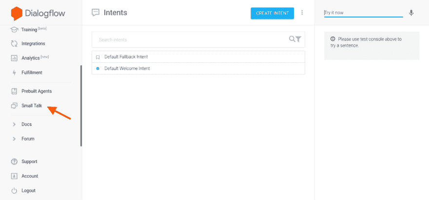T2】](https://res.cloudinary.com/practicaldev/image/fetch/s--i6bEk3tH--/c_limit%2Cf_auto%2Cfl_progressive%2Cq_auto%2Cw_880/https://cdn.scotch.io/40410/H5Pny8gqSwaadVhc5bmV_smallTalk.png)

很好，现在我们在`Small Talk`仪表板上，这里将完成大部分逻辑，所以让我们从启用`Small Talk`功能开始。

[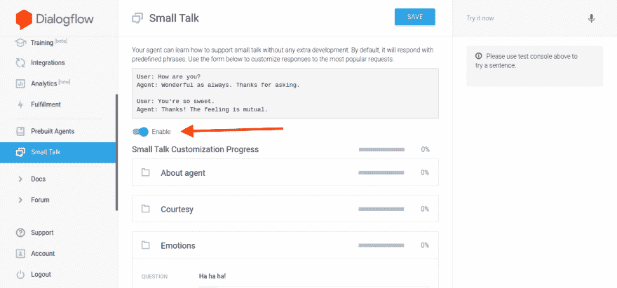T2】](https://res.cloudinary.com/practicaldev/image/fetch/s--fWYSa76S--/c_limit%2Cf_auto%2Cfl_progressive%2Cq_auto%2Cw_880/https://cdn.scotch.io/40410/IDkMhQ2hT6i2umuIFbMu_enableSmalltalk.png)

在`Small Talk`仪表盘上，我们可以训练我们的代理如何参与小型对话，并根据收到的信息做出适当的回应。让我们开始教代理如何回答`About Agent`类别下的问题。

> 让代理(机器人)看起来更聪明的一个好方法是输入几个不同的答案，这将帮助代理对类似的问题做出不同的回答。

[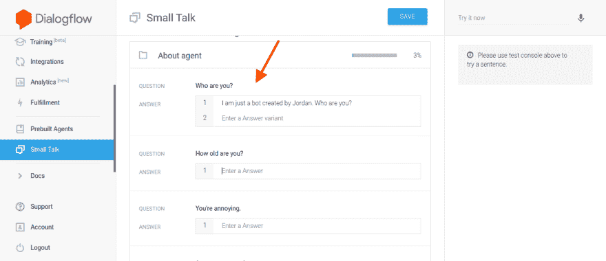T2】](https://res.cloudinary.com/practicaldev/image/fetch/s--98GODMgm--/c_limit%2Cf_auto%2Cfl_progressive%2Cq_auto%2Cw_880/https://cdn.scotch.io/40410/BuHU6rLiSzGEtKS5Qt2b_enterAnswers.png)

尽管您不必填写所有内容，但为了本文的目的，我们将在 small talk 仪表板中提供所有建议问题的答案。完成后点击`Save`选项。

[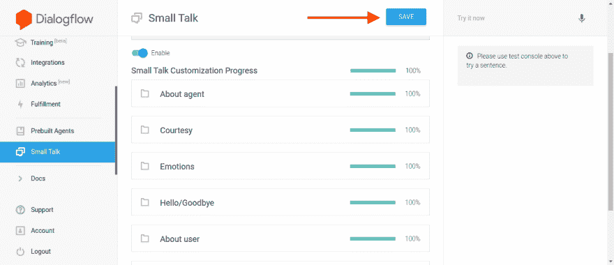T2】](https://res.cloudinary.com/practicaldev/image/fetch/s--na-mdqxY--/c_limit%2Cf_auto%2Cfl_progressive%2Cq_auto%2Cw_880/https://cdn.scotch.io/40410/6cgrJRXJRZyAH5X0Yu7v_saveFinal.png)

太棒了。我们已经完成了第一步。

## 整合 Facebook Messenger

在代理仪表板的左侧，有一个选项，上面写着`Integrations`，点击它。太好了，现在我们有了一个写着`One-click integrations`的页面主体。该页面也有许多集成选项，让我们通过点击图标下方的“设置”来修改“Facebook Messenger”集成的设置。

[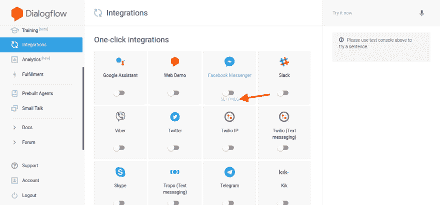T2】](https://res.cloudinary.com/practicaldev/image/fetch/s--Qn0II3xF--/c_limit%2Cf_auto%2Cfl_progressive%2Cq_auto%2Cw_880/https://cdn.scotch.io/40410/sa4zytfPQfqUXBDjDYN8_enableMessenger.png)

我们得到一个包含三个字段的弹出窗口，在开始填写字段之前，我们需要启用 Facebook Messenger 集成，就这样做吧。

[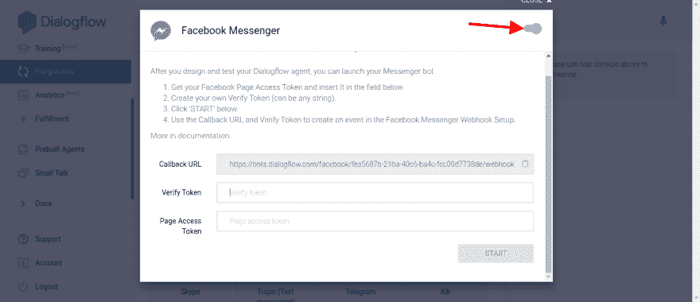T2】](https://res.cloudinary.com/practicaldev/image/fetch/s--dlZ-5TRM--/c_limit%2Cf_auto%2Cfl_progressive%2Cq_auto%2Cw_880/https://cdn.scotch.io/40410/gjYHycBR6mq7x5JajKWA_newEnableMessenger.png)

这三个字段是:

> 这是每当我们的页面收到消息时，facebook 将向其发送数据的 URL。
> 
> 我们需要在这里指定一个自定义令牌(当我们创建应用程序时，我们将在脸书上指定相同的令牌，所以编写一个您能记住的令牌)。
> 
> 在我们创建一个应用程序后，脸书会给我们这个令牌。

[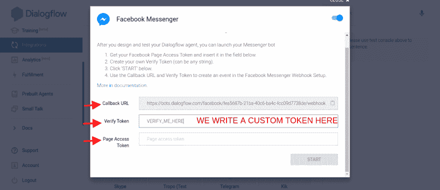T2】](https://res.cloudinary.com/practicaldev/image/fetch/s--lNhtt_lR--/c_limit%2Cf_auto%2Cfl_progressive%2Cq_auto%2Cw_880/https://cdn.scotch.io/40410/JjtB71xDTnmofgNOVG3V_tokenHere.png)

此时，我们不能继续设置集成，直到我们创建了将链接到`smallTalkBot`的脸书应用程序。原因是我们需要`Page Access Token`来继续。让我们前往[脸书开发者平台](https://developers.facebook.com/)(在一个新标签页中)并创建一个应用程序。

[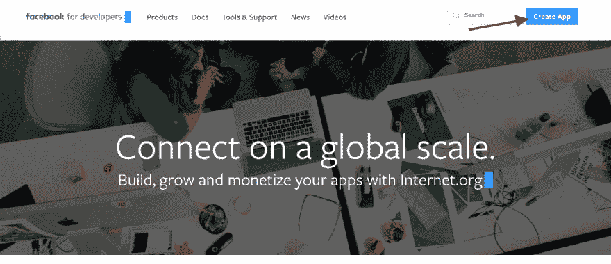T2】](https://res.cloudinary.com/practicaldev/image/fetch/s--YKKjXwdP--/c_limit%2Cf_auto%2Cfl_progressive%2Cq_auto%2Cw_880/https://cdn.scotch.io/40410/TWZjdQvFSFiC6qpKonOr_createApp.png)

既然我们已经在这里，让我们填写一个新的脸书应用程序的细节。一旦完成，我们将自动被重定向到应用程序的仪表板。屏幕上还显示`Select A Product`，所以让我们选择 messenger 选项并点击`Set up`。

[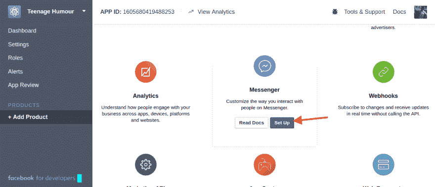T2】](https://res.cloudinary.com/practicaldev/image/fetch/s--0bwnK2XV--/c_limit%2Cf_auto%2Cfl_progressive%2Cq_auto%2Cw_880/https://cdn.scotch.io/40410/lGXzVnDRSWJE4GaxVejU_setUpMessenger.png)

现在，我们向下滚动一点，直到到达`Token Generation`部分。我们需要为我们的应用程序选择一个页面并生成一个令牌。

[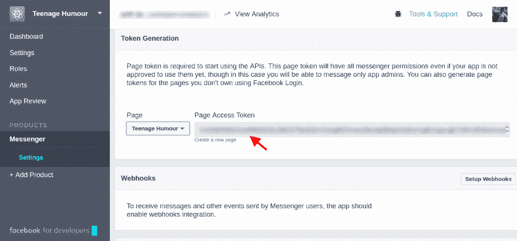T2】](https://res.cloudinary.com/practicaldev/image/fetch/s--UVJz4yO6--/c_limit%2Cf_auto%2Cfl_progressive%2Cq_auto%2Cw_880/https://cdn.scotch.io/40410/m3O5M15YRZmf6gJc53oO_generateTokens.png)

生成的令牌是我们来到这里的原因，让我们简单地回到 DialogFlow(在另一个选项卡中)并做三件简单的事情:

> 1.  Paste the token from Facebook into the `Page Access Token` field.
> 2.  Copy the callback URL (Facebook needs this URL, so it knows where to send data)
> 3.  Click the `Start` option to run our bot!

[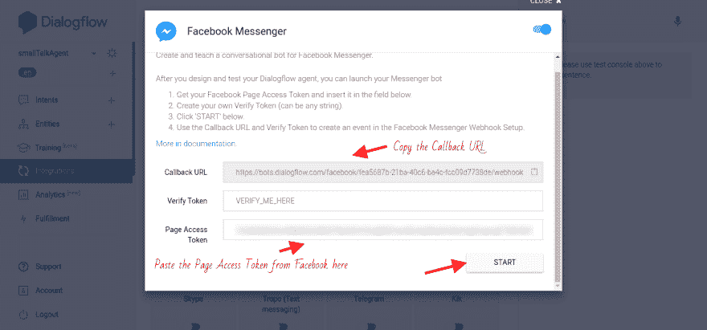T2】](https://res.cloudinary.com/practicaldev/image/fetch/s--aprsnmxH--/c_limit%2Cf_auto%2Cfl_progressive%2Cq_auto%2Cw_880/https://cdn.scotch.io/40410/9GkGTi34RNmYwcg2KemI_pasteCallBack.png)

万岁！我们的机器人现在正在运行，但我们还不要高兴，我们需要做更多的事情，才能开始在脸书上空与我们的创作交换疯狂的文本。

## [T1】配置 Facebook Messenger](#configuring-facebook-messenger)

现在，回到 Facebook Messenger 平台，就在我们为 DialogFlow 生成令牌的地方的下面，有一个写着`Webhooks`的部分。点击`Setup Webhooks`选项。

[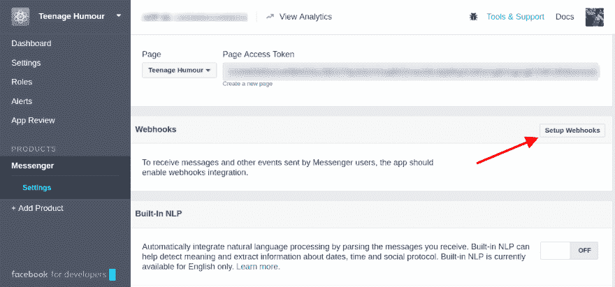T2】](https://res.cloudinary.com/practicaldev/image/fetch/s--YLCHR0JO--/c_limit%2Cf_auto%2Cfl_progressive%2Cq_auto%2Cw_880/https://cdn.scotch.io/40410/9RfnWzfKQNylaTskFzcR_setupWebhook.png)

干得好！现在出现了一个弹出窗口，其中有两个字段和几个复选框，让我们用正确的数据填充字段:

> 1.  `Callback URL`-This one is quite obvious. Remember the callback URL we copied from DialogFlow? Paste it here.
> 2.  `Verify Token`-Here, let's enter the same custom `Verify Token` that we entered for DialogFlow. My situation is `VERIFY_ME_HERE`.
> 3.  Check box-We can ignore most check boxes, we only need to subscribe to two events, so let's check `messages` & `messaging_postbacks`.

太好了！现在点击`Verify and Save`，我们就可以开始了！

[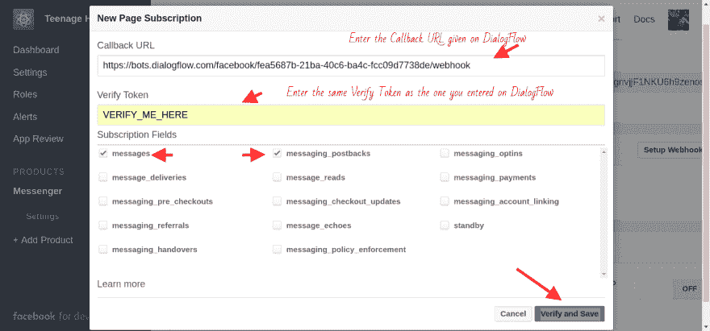T2】](https://res.cloudinary.com/practicaldev/image/fetch/s--NuSQWwj2--/c_limit%2Cf_auto%2Cfl_progressive%2Cq_auto%2Cw_880/https://cdn.scotch.io/40410/DxUre3GQbC4gxtSxQgFj_verifyAndSave.png)

恭喜，我们已经成功设置了机器人。

## 测试 Facebook 信使机器人

要测试这个机器人，只需向链接的脸书页面发送消息，然后等待闪电回应。

[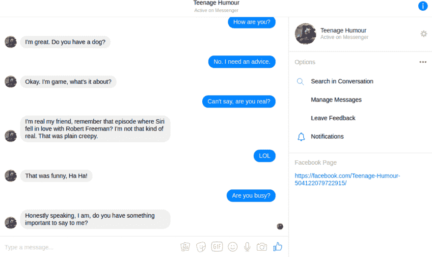T2】](https://res.cloudinary.com/practicaldev/image/fetch/s--Xv3uCzgP--/c_limit%2Cf_auto%2Cfl_progressive%2Cq_66%2Cw_880/https://cdn.scotch.io/40410/CwQSGyJiQvevVCoiv3yQ_Number.gif)

## 结论

正如本文开头所承诺的那样，我们已经成功地构建了一个(看起来聪明且讽刺的)机器人，它能够根据收到的文本的意图(这主要是 NLP 技术)来响应发送到脸书页面的消息。当你测试你的机器人时，你会意识到它并不像看起来那么聪明，原因是:它只使用我们在创建`smallTalkBot`时提供的预定义文本来响应消息。

使用 DialogFlow 提供的`Small Talk`功能仅仅是使用`DialogFlow`可以完成的令人惊叹的事情的一部分，例如，您可以训练您的机器人更准确地响应它接收到的消息！

虽然我们还没有完全探索`DialogFlow`的复杂性，但如果你想建造一个不会一直给出相同响应的令人敬畏的机器人，你可以在这里阅读文档[。](https://dialogflow.com/docs/getting-started/basics)