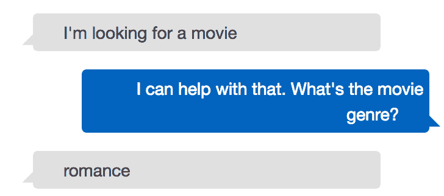
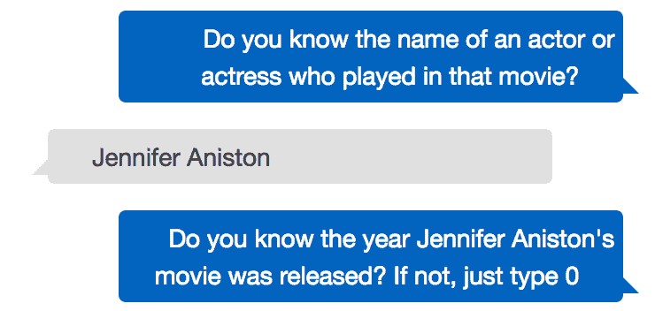
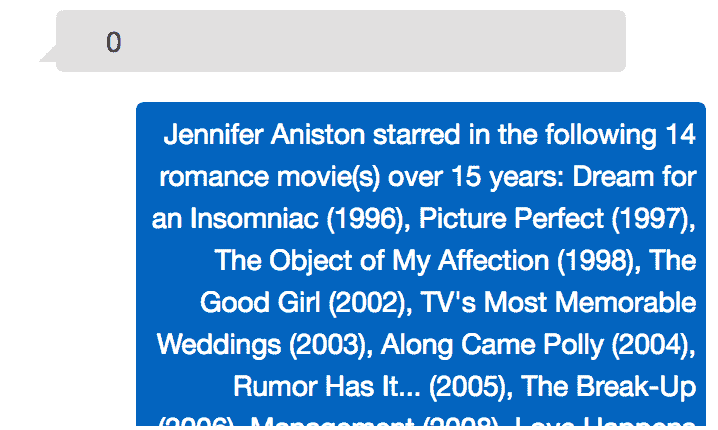
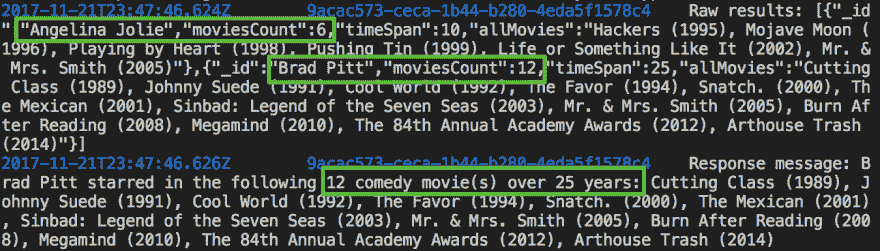
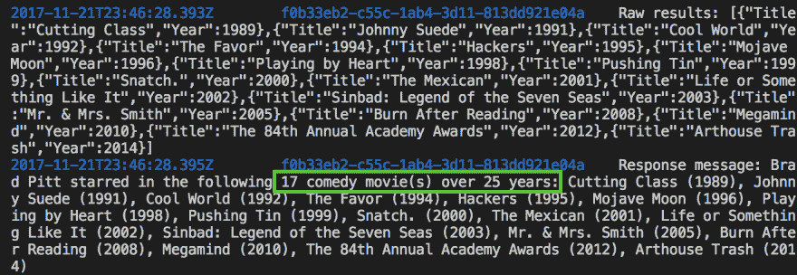
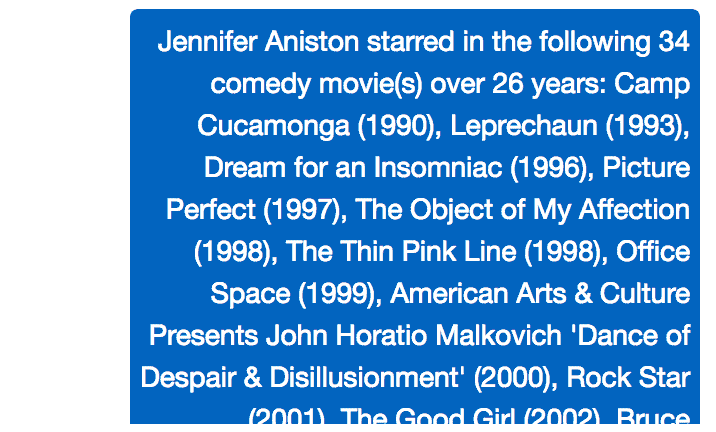

# 构建一个由 Amazon Lex、Lambda 和 MongoDB Atlas 支持的声控电影搜索应用程序——第 3 部分

> 原文：<https://dev.to/mongodb/building-a-voice-activated-movie-search-app-powered-by-amazon-lex-lambda-and-mongodb-atlas---part--3-2lca>

### 简介

这是我们亚马逊 Lex 博客文章系列的第 3 部分。本教程分为 3 个部分:

[第 1 部分:Lex 概述、演示场景和数据层设置](https://www.mongodb.com/blog/post/aws-lex-lambda-mongodb-atlas-movie-search-app-part-1?utm_medium=dev-synd&utm_source=dev&utm_content=lex3&jmp=dev-ref)

[第 2 部分:设置和测试 Amazon Lex bot](https://www.mongodb.com/blog/post/aws-lex-lambda-mongodb-atlas-movie-search-app-part-2?utm_medium=dev-synd&utm_source=dev&utm_content=lex3&jmp=dev-ref)

第 3 部分:部署一个 Lambda 函数作为我们的 Lex bot 实现(这篇博文)

在这最后一篇博文中，我们将使用 AWS 命令行界面部署我们的 Lambda 函数，并验证 bot 是否完全按照预期工作。然后我们将回顾组成 Lambda 函数的代码，并解释它是如何工作的。

### 让我们部署我们的 AWS Lambda 函数

请遵循 GitHub 库中的部署步骤。我已经选择使用亚马逊的 [SAM Local](https://github.com/awslabs/aws-sam-local) 工具来展示如何使用 [Docker](https://www.docker.com/) 在本地测试你的 Lambda 函数，以及打包它并将其部署到一个 AWS 帐户，只需要几个命令。然而，如果你想将它手动部署到 AWS 控制台，你总是可以使用[这个 zip 脚本](https://github.com/rlondner/mongodb-awslex-searchmovies/blob/master/code/zip.sh)来部署它，就像我在这个 [MongoDB Atlas with Lambda 教程](https://www.mongodb.com/blog/post/serverless-development-with-nodejs-aws-lambda-mongodb-atlas?utm_medium=dev-synd&utm_source=dev&utm_content=lex3&jmp=dev-ref)中所做的那样。

### 让我们测试一下我们的 Lex bot(端到端)

既然我们的 Lambda fulfillment 函数已经部署好了，让我们在 Amazon Lex 控制台中再次测试我们的 bot，并验证我们得到了预期的响应。例如，我们可能想要搜索詹妮弗·安妮斯顿主演的所有爱情电影，我们可以用下面的机器人对话来测试这种情况:

[T2】](https://res.cloudinary.com/practicaldev/image/fetch/s--6IE9x5kT--/c_limit%2Cf_auto%2Cfl_progressive%2Cq_auto%2Cw_880/https://webassets.mongodb.com/_com_assets/cms/Amazon_Lex_Bot_Prompt1-s3mh080kx8.png)

[T2】](https://res.cloudinary.com/practicaldev/image/fetch/s--d9eocGBA--/c_limit%2Cf_auto%2Cfl_progressive%2Cq_auto%2Cw_880/https://webassets.mongodb.com/_com_assets/cms/Amazon_Lex_Bot_Prompt2-dwb1k7ezzg.png)

[T2】](https://res.cloudinary.com/practicaldev/image/fetch/s--jQUPIH_g--/c_limit%2Cf_auto%2Cfl_progressive%2Cq_auto%2Cw_880/https://webassets.mongodb.com/_com_assets/cms/Amazon_Lex_Bot_Prompt3-wf8n3qlx9x.png)

正如上面的截图所证明的，Lex bot 通过我们的 Lambda 函数从我们的 movies MongoDB 数据库中检索到了 Jennifer Aniston 的浪漫电影的完整列表。但是我们的 Lambda 函数如何处理这个请求呢？我们将在下一节更深入地研究我们的 [Lambda 函数代码](https://github.com/rlondner/mongodb-awslex-searchmovies/blob/master/code/lambda.js)。

### 让我们深入了解 Lambda 函数代码

我们的 Lambda 函数总是接收一个 JSON 有效负载，其结构符合 Amazon Lex' [输入事件格式](http://docs.aws.amazon.com/lex/latest/dg/lambda-input-response-format.html#using-lambda-input-event-format)(如这个 [event.json](https://github.com/rlondner/mongodb-awslex-searchmovies/blob/master/code/event.json) 文件所示):

```
{
  "messageVersion": "1.0",
  "invocationSource": "FulfillmentCodeHook",
  "userId": "user-1",
  "sessionAttributes": {},
  "bot": {
    "name": "SearchMoviesBot",
    "alias": "$LATEST",
    "version": "$LATEST"
  },
  "outputDialogMode": "Text",
  "currentIntent": {
    "name": "SearchMovies",
    "slots": {
      "castMember": "jennifer aniston",
      "year": "0",
      "genre": "Romance"
    }
  }
} 
```

Enter fullscreen mode Exit fullscreen mode

请注意，该请求包含机器人的名称( *SearchMoviesBot* )和表示用户提供的机器人问题答案的槽值。

Lambda 函数从 [exports.handler 方法](https://github.com/rlondner/mongodb-awslex-searchmovies/blob/master/code/lambda.js#L13)开始，该方法验证 bot 的名称，并在通过 Amazon API Gateway 接收到有效负载时执行一些额外的处理(只有当您想通过 Amazon API Gateway 测试 Lambda 函数时才需要，但这与 Amazon Lex 上下文无关)。然后它调用 [dispatch()](https://github.com/rlondner/mongodb-awslex-searchmovies/blob/master/code/lambda.js#L33) 方法，该方法负责连接到我们的 MongoDB Atlas 数据库，并将机器人的意图传递给 [query()](https://github.com/rlondner/mongodb-awslex-searchmovies/blob/master/code/lambda.js#L67) 方法，我们稍后将对此进行探讨。请注意，dispatch()方法使用了我在[使用 MongoDB Atlas 和 Node.js](https://www.mongodb.com/blog/post/optimizing-aws-lambda-performance-with-mongodb-atlas-and-nodejs?utm_medium=dev-synd&utm_source=dev&utm_content=lex3&jmp=dev-ref) 优化 AWS Lambda 性能中强调的性能优化技术，即不关闭数据库连接并使用*callbackWaitsForEmptyEventLoop*Lambda 上下文属性。这使得我们的机器人在 Lambda 函数完成第一个查询后反应更快。

现在让我们仔细看看 query()方法，它是 Lambda 函数的灵魂和核心。首先，该方法检索演职人员、电影类型和电影发行年份。因为这些值都是字符串，电影发行年份在 MongoDB 中存储为整数，所以函数必须[将该值转换为整数](https://github.com/rlondner/mongodb-awslex-searchmovies/blob/master/code/lambda.js#L71)。

然后，我们构建将针对 MongoDB 运行的查询:

```
var castArray = [castMember];

var matchQuery = {
    Cast: { $in: castArray },
    Genres: { $not: { $in: ["Documentary", "News", ""] } },
    Type: "movie"
  };

  if (genre != undefined && genre != allGenres) {
    matchQuery.Genres = { $in: [genre] };
    msgGenre = genre.toLowerCase();
  }

  if ((year != undefined && isNaN(year)) || year > 1895) {
    matchQuery.Year = year;
    msgYear = year;
  } 
```

Enter fullscreen mode Exit fullscreen mode

我们首先将查询限制在确实是电影的项目上(因为数据库也存储电视连续剧)，并排除一些不相关的电影类型，如纪录片和新闻类型。我们还确保只查询演职人员主演的电影。请注意， 操作符中的***[$需要一个数组，这就是为什么我们必须将我们唯一的 cast 成员包装到 ***castArray*** 数组中。由于强制转换成员是唯一的强制查询参数，我们首先添加它，然后如果代码确定它们是由用户提供的(即用户没有使用`All`和/或`0`转义值)，则可选地添加`Genres`和`Year`参数。](https://docs.mongodb.com/manual/reference/operator/query/in?jmo=adref)***

然后，query()方法根据用户提供的参数定义默认的响应消息。如果查询没有返回任何匹配的元素，则使用默认的响应消息:

```
var resMessage = undefined;
  if (msgGenre == undefined && msgYear == undefined) {
    resMessage = `Sorry, I couldn't find any movie for ${castMember}.`;
  }
  if (msgGenre != undefined && msgYear == undefined) {
    resMessage = `Sorry, I couldn't find any ${msgGenre} movie for ${castMember}.`;
  }
  if (msgGenre == undefined && msgYear != undefined) {
    resMessage = `Sorry, I couldn't find any movie for ${castMember} in ${msgYear}.`;
  }
  if (msgGenre != undefined && msgYear != undefined) {
    resMessage = `Sorry, ${castMember} starred in no ${msgGenre} movie in ${msgYear}.`;
  } 
```

Enter fullscreen mode Exit fullscreen mode

query()方法的实质接下来发生，因为代码使用两种不同的方法执行数据库查询:经典的 [db.collection.find()](https://docs.mongodb.com/manual/reference/method/db.collection.find/) 方法和[db . collection . aggregate()](https://docs.mongodb.com/manual/reference/method/db.collection.aggregate?jmp=adref)方法。这个 Lambda 函数中使用的默认方法是聚合方法，但是您可以通过将*[aggregationFramewor _ k](%5Bhttps://github.com/rlondner/mongodb-awslex-searchmovies/blob/master/code/lambda.js#L112%5D(https://github.com/rlondner/mongodb-awslex-searchmovies/blob/master/code/lambda.js#L112))变量设置为 _false* 来轻松测试 find()方法。

在我们特定的用例场景中(查询一个演职人员并返回少量文档)，可能不会有任何明显的性能或编程逻辑影响。然而，如果我们要查询多个演职人员各自主演的所有电影(即这些电影的联合，而不是交集)，聚合框架查询显然是赢家。事实上，让我们仔细看看代码运行的 find()查询:

```
cursor = db.collection(moviesCollection)
      .find(matchQuery, { _id: 0, Title: 1, Year: 1 })
      .collation(collation)
      .sort({ Year: 1 }); 
```

Enter fullscreen mode Exit fullscreen mode

这是一个相当简单的查询，检索电影的标题和年份，按年份排序。请注意，我们还使用了相同的{ locale: "en "，strength: 1 }排序规则，我们曾在本博客文章系列的第 2 部分[中为 Cast 属性创建不区分大小写的索引。这很关键，因为最终用户可能不会](https://www.mongodb.com/blog/post/aws-lex-lambda-mongodb-atlas-movie-search-app-part-2?utm_medium=dev-synd&utm_source=dev&utm_content=lex3&jmp=dev-ref)[标题案例](https://en.wikipedia.org/wiki/Capitalization#Title_case)演职人员的名字(Lex 也不会为我们这么做)。

查询的简单性与应用程序逻辑的相对复杂性形成了对比，我们必须编写应用程序逻辑来处理使用 find()方法得到的结果集:

```
var maxYear, minYear;
for (var i = 0, len = results.length; i < len; i++) { 
    castMemberMovies += `${results[i].Title} (${results[i].Year}), `;
}

 //removing the last comma and space
castMemberMovies = castMemberMovies.substring(0, castMemberMovies.length - 2);

moviesCount = results.length;
var minYear, maxYear;
minYear = results[0].Year;
maxYear = results[results.length-1].Year;
yearSpan = maxYear - minYear; 
```

Enter fullscreen mode Exit fullscreen mode

首先，我们必须遍历所有结果，将其`Title`和`Year`属性连接成一个清晰的字符串。这对于 20 个项目来说可能没问题，但是如果我们必须处理成百上千或上百万条记录，性能影响将非常明显。我们还必须删除串联字符串的最后一个句点和空白字符，因为它们过多了。我们还必须手动检索电影的数量，以及电影发行年份的低端和高端，以便计算演职人员拍摄所有这些电影的时间跨度。这可能不是特别难写的代码，但是混乱的代码影响了应用程序的清晰性。而且，正如我在上面所写的，当处理数百万个项目时，它肯定是不可伸缩的。

将这个应用程序逻辑与我们在使用聚合框架方法时必须编写的简洁代码进行对比:

```
for (var i = 0, len = results.length; i < len; i++) { 
    castMemberMovies = results[i].allMovies;
    moviesCount = results[i].moviesCount;
    yearSpan = results[i].timeSpan;
} 
```

Enter fullscreen mode Exit fullscreen mode

现在，代码不仅更加简洁明了，而且更加通用，因为它可以处理我们想要为多个演职人员中的每一个处理电影的情况。您可以通过在源代码的[中取消注释下面一行来测试这个用例:](https://github.com/rlondner/mongodb-awslex-searchmovies/blob/master/code/lambda.js#L78)

`castArray = [castMember, "Angelina Jolie"]`

通过使用这个 [SAM 脚本](https://github.com/rlondner/mongodb-awslex-searchmovies/blob/master/code/sam-invoke.sh)进行测试。

借助聚合框架，我们无需更改一行代码就能获得正确的原始和最终结果:

[T2】](https://res.cloudinary.com/practicaldev/image/fetch/s--8fQf8Jq2--/c_limit%2Cf_auto%2Cfl_progressive%2Cq_auto%2Cw_880/https://webassets.mongodb.com/_com_assets/cms/MongoDB_AggregateResponse-x4u6m0bxt6.png)

然而，find()方法的后处理需要一些重要的工作来修复这种不正确的输出(安吉丽娜·朱莉或布拉德·皮特主演的喜剧电影的联盟，都错误地归因于布拉德·皮特):

[T2】](https://res.cloudinary.com/practicaldev/image/fetch/s--NWRVJDQM--/c_limit%2Cf_auto%2Cfl_progressive%2Cq_auto%2Cw_880/https://webassets.mongodb.com/_com_assets/cms/MongoDB_FindResponse-y8s3psxbpa.png)

通过使用 MongoDB [聚合管道](https://docs.mongodb.com/manual/core/aggregation-pipeline?jmp=adref) :
将大部分后处理逻辑转移到数据库层，我们能够实现代码的简洁性和正确性

```
cursor = db.collection(moviesCollection).aggregate(
      [
        { $match: matchQuery },
        { $sort: { Year: 1 } },
        unwindStage,
        castFilterStage,
        { $group: {
            _id: "$Cast",
            allMoviesArray: {$push: {$concat: ["$Title", " (", { $substr: ["$Year", 0, 4] }, ")"] } },
            moviesCount: { $sum: 1 },
            maxYear: { $last: "$Year" },
            minYear: { $first: "$Year" }
          }
        },
        {
          $project: {
            moviesCount: 1,
            timeSpan: { $subtract: ["$maxYear", "$minYear"] },
            allMovies: {
              $reduce: {
                input: "$allMoviesArray",
                initialValue: "",
                in: {
                  $concat: [
                    "$$value",
                    {
                      $cond: {
                        if: { $eq: ["$$value", ""] },
                        then: "",
                        else: ", "
                      }
                    },
                    "$$this"
                  ]
                }
              }
            }
          }
        }
      ],
      {collation: collation}

); 
```

Enter fullscreen mode Exit fullscreen mode

这个聚合管道可以说比上面讨论的 find()方法更复杂，所以让我们一次一个阶段地解释它(因为聚合管道由在文档通过管道时转换文档的阶段组成):

1.  [$match stage](https://github.com/rlondner/mongodb-awslex-searchmovies/blob/master/code/lambda.js#L125) :执行过滤查询，只返回我们感兴趣的文档(类似于上面的 find()查询)。
2.  [$排序阶段](https://github.com/rlondner/mongodb-awslex-searchmovies/blob/master/code/lambda.js#L126):按年份升序对结果进行排序。
3.  [$unwind stage](https://github.com/rlondner/mongodb-awslex-searchmovies/blob/master/code/lambda.js#L113) :将每个电影文档分割成多个文档，每个文档对应原始文档中的一个演职人员。对于每个原始文档，此阶段展开转换成员的转换数组，并创建具有与原始文档相同值的单独、唯一的文档，除了转换属性现在是每个未展开文档中的字符串值(等于每个转换成员)。这个阶段是必要的，以便能够只根据我们感兴趣的演职人员进行分组(尤其是如果有不止一个演职人员)。这个阶段的输出可能包含与我们的查询无关的其他 cast 成员的文档，因此我们必须在下一个阶段将它们过滤掉。
4.  [$match stage](https://github.com/rlondner/mongodb-awslex-searchmovies/blob/master/code/lambda.js#L114) :仅根据我们感兴趣的角色成员过滤来自$unwind stage 的解构文档。这个阶段基本上删除了所有标记了与我们的查询无关的演职人员的文档。
5.  [$group stage](https://github.com/rlondner/mongodb-awslex-searchmovies/blob/master/code/lambda.js#L129) :按演职人员对电影进行分组(例如，分别对所有布拉德·皮特主演的电影和所有安吉丽娜·朱莉主演的电影进行分组)。这个阶段还将每个电影名称和发行年份连接成*标题(年份)*格式，并将其添加到名为*all movie array*的数组中(每个演职人员一个这样的数组)。该阶段还计算每个演职人员的所有电影的计数，以及该演职人员出演电影的最早和最晚年份(所请求的电影类型，如果有的话)。这个阶段本质上执行了我们以前在使用 find()方法时必须在应用程序代码中完成的大部分后处理。因为后处理现在运行在数据库层，所以它可以利用数据库服务器的计算能力和 MongoDB 的分布式系统特性(如果集合被划分到多个分片上，每个分片独立于其他分片执行这个阶段)。
6.  [$project stage](https://github.com/rlondner/mongodb-awslex-searchmovies/blob/master/code/lambda.js#L138) :最后但同样重要的是，这个阶段执行一个 [$reduce 操作](https://docs.mongodb.com/manual/reference/operator/aggregation/reduce?jmp=adref)(MongoDB 3.4 中的新功能)，将我们的“ *Title (Year)* 字符串数组连接成一个字符串，我们可以在发送回 bot 的响应消息中使用它。

一旦从我们的 MongoDB Atlas 数据库中检索到匹配的电影，代码就会生成适当的响应消息，并根据预期的 [Amazon Lex 响应格式](http://docs.aws.amazon.com/lex/latest/dg/lambda-input-response-format.html#using-lambda-response-format) :
将其发送回机器人

```
if (msgGenre != allGenres) {
                resMessage = `${toTitleCase(castMember)} starred in 
                the following ${moviesCount>1?moviesCount+" ":""}
                ${msgGenre.toLowerCase()} movie(s)${yearSpan>0?" over " 
                + yearSpan +" years":""}: ${castMemberMovies}`;
} else {
    resMessage = `${toTitleCase(castMember)} starred in the following 
    ${moviesCount>1?moviesCount+" ":""}movie(s)${yearSpan>0?" over " 
    + yearSpan +" years":""}: ${castMemberMovies}`;
}
if (msgYear != undefined) {
    resMessage = `In ${msgYear}, ` + resMessage;

callback(
    close(sessionAttributes, "Fulfilled", {
        contentType: "PlainText",
        content: resMessage
    })
); 
```

Enter fullscreen mode Exit fullscreen mode

我们的詹妮弗·安妮斯顿粉丝现在可以为我们机器人的完整回复而惊叹了！

[T2】](https://res.cloudinary.com/practicaldev/image/fetch/s--iCuvf7Oc--/c_limit%2Cf_auto%2Cfl_progressive%2Cq_auto%2Cw_880/https://webassets.mongodb.com/_com_assets/cms/Amazon_Lex_Bot_Response-1x76of69xk.png)

### 总结和后续步骤

这就完成了我们的 Lex 博客文章系列，我希望你能像我写这篇文章一样喜欢阅读它。

在最后这篇博文中，我们使用 [SAM 本地工具](https://github.com/awslabs/aws-sam-local)测试并部署了一个 Lambda 函数到 AWS。

我们还了解到:

Lambda 函数如何处理 Lex 请求，并使用 [Amazon Lex 的输入和输出事件格式](http://docs.aws.amazon.com/lex/latest/dg/lambda-input-response-format.html)响应请求。

如何在 find()或 aggregate()查询中使用不区分大小写的索引

如何充分利用 MongoDB 的聚合框架将复杂性从应用程序层转移到数据库层

作为下一步，我建议你现在看看 AWS 文档，了解如何[将你的机器人部署到 Facebook Messenger](http://docs.aws.amazon.com/lex/latest/dg/fb-bot-association.html) 、 [Slack](http://docs.aws.amazon.com/lex/latest/dg/slack-bot-association.html) 或[到你自己的网站](https://aws.amazon.com/blogs/ai/greetings-visitor-engage-your-web-users-with-amazon-lex/)。

快乐的莱克斯！

_ 关于作者- **拉斐尔·朗德纳** _

Raphael Londner 是 MongoDB 的首席开发人员，专注于云技术，如亚马逊网络服务、微软 Azure 和谷歌云引擎。此前，他是 Okta 的开发者拥护者，也是身份管理领域的创业企业家。你可以在推特上关注他***[@ rlondner](https://www.twitter.com/rlondner)***