# 使用 TDD 模式#2 在 Laravel 5.5 上构建高级博客准备第一次测试

> 原文：<https://dev.to/kris/building-advance-blog-on-laravel-55-with-tdd-mode-2-prepare-the-first-test-85n>

[T2】](https://res.cloudinary.com/practicaldev/image/fetch/s--gXBCQC-Z--/c_limit%2Cf_auto%2Cfl_progressive%2Cq_auto%2Cw_880/https://cdn-images-1.medium.com/max/1024/1%2AP2ZqT01b-aiU5bschYM-Ng.png)

前贴[我们为测试模式](https://dev.to/krissnawat/building-advance-blog-on-laravel-55-with-tdd-mode-1-prepare-environment-and-database-5ha-temp-slug-2286225)准备了一个环境

我假设你以前听过 PHPUnit，在这篇文章中我已经设置了第一个测试

现在，当我们使用 php artisan 做所有我们需要做的事情，包括-env =测试你和我，非常无聊

但是我们可以通过对 PHPUnit 应用配置来删除

### 定位 PHPUnit

在 Laravel 中，PHPUnit 可执行文件隐藏在 vendor/bin 中

[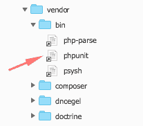T2】](https://res.cloudinary.com/practicaldev/image/fetch/s--enbTZwN_--/c_limit%2Cf_auto%2Cfl_progressive%2Cq_auto%2Cw_880/https://cdn-images-1.medium.com/max/207/1%2A_Phavx-ziWwZlODKCpIMBw.png)

使用时，我们需要包含路径

[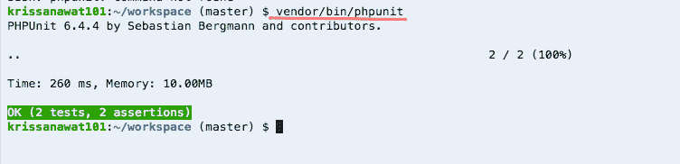T2】](https://res.cloudinary.com/practicaldev/image/fetch/s--r6ZxQLXr--/c_limit%2Cf_auto%2Cfl_progressive%2Cq_auto%2Cw_880/https://cdn-images-1.medium.com/max/752/1%2AxLlij2babZ7nAFyUiW46sA.png)

#### 别名 phpunit 路径

我打字很慢，所以我用别名 p ='vendor/bin/phpunit '设置了快捷方式

[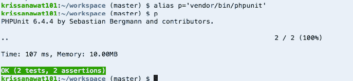T2】](https://res.cloudinary.com/practicaldev/image/fetch/s--CnYaBZde--/c_limit%2Cf_auto%2Cfl_progressive%2Cq_auto%2Cw_880/https://cdn-images-1.medium.com/max/687/1%2AL6opuvBBnMcsZMjL57Gj9g.png)

现在我们称之为 p

#### 设置 PHPUNIT

在测试环境中，我们需要使用 sqlite，而不是在数据库中创建一个真实的记录，然后将它保存在内存中，然后打开 phpunit.xml

[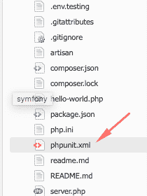T2】](https://res.cloudinary.com/practicaldev/image/fetch/s--h6Vf8v4W--/c_limit%2Cf_auto%2Cfl_progressive%2Cq_auto%2Cw_880/https://cdn-images-1.medium.com/max/210/1%2AJz8M67j0TZMqLA7ThV4SYg.png)

向下滚动到环境设置

首先将数据库连接设置为 SQLite

```
<env name=”DB_CONNECTION” value=”sqlite”/> 
```

并设置一个数据库为:内存:因为我们在内存中保存了一个记录

```
<env name=”DB_DATABASE” value=”:memory:”/> 
```

[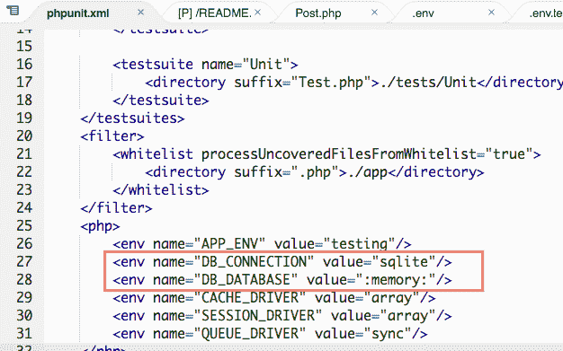T2】](https://res.cloudinary.com/practicaldev/image/fetch/s--QQBlvv-1--/c_limit%2Cf_auto%2Cfl_progressive%2Cq_auto%2Cw_880/https://cdn-images-1.medium.com/max/626/1%2AMuB1w8PaG3k5vOqy3nBGUA.png)

下一站，创建第一个测试

#### 为快速脚手架设置内置授权

当从头开始时，我们没有任何视图文件，因此我们使用内置认证来快速查看脚手架

试试 php 工匠制作:认证

现在我们有了一个简单的认证机制的布局

[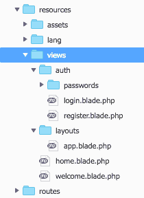T2】](https://res.cloudinary.com/practicaldev/image/fetch/s--Y0K3CFux--/c_limit%2Cf_auto%2Cfl_progressive%2Cq_auto%2Cw_880/https://cdn-images-1.medium.com/max/210/1%2ASdcT6HFm3UBXDWepwrCFag.png)

和简单的布局

#### 答 _ 客 _ 能 _ 观 _ 全 _ 线程

对于第一个测试，我必须使用 Artisan 快速创建一个代码片段

php artisan make:测试后测试

使用后文件仍然出现在

[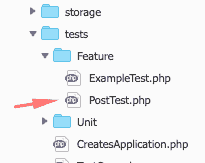T2】](https://res.cloudinary.com/practicaldev/image/fetch/s--fg_q4jW4--/c_limit%2Cf_auto%2Cfl_progressive%2Cq_auto%2Cw_880/https://cdn-images-1.medium.com/max/205/1%2AhzyKIJEDLWUQ1tc6zHrnXw.png)

打开这个

[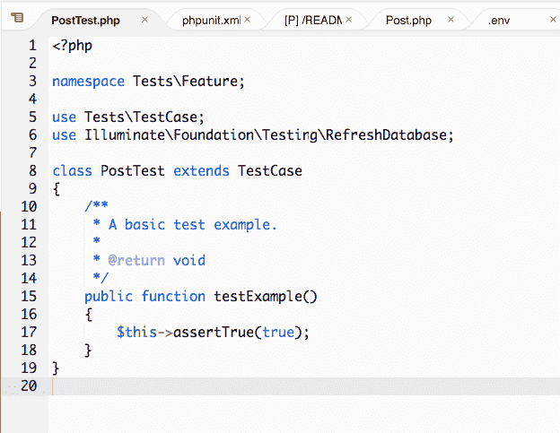T2】](https://res.cloudinary.com/practicaldev/image/fetch/s--nSgaY0Gl--/c_limit%2Cf_auto%2Cfl_progressive%2Cq_auto%2Cw_880/https://cdn-images-1.medium.com/max/624/1%2Ak6eQFk72RpZxSAK6lwcy3A.png)

第 3 行我们通过文件夹定义名称空间

第 5 行包含测试用例类

第 6 行包含 RefreshDatabase 特性用于每次调用测试时刷新数据库想象我们调用 php artisan migrate:每次调用测试时刷新因为它清除了所有条件

对于第一个函数，我们看到 testExample 断言 True 为真

### 测试访问端点

现在我们将函数名改为 a _ guset _ can _ access _ blog _ index

这样可以确保博客主页可以访问

```
public function a_guset_can_access_blog_index()
    {
    $response = $this->get('/blog'); //make GET access to blog route

    $response->assertStatus(200); //assert http status return is 200 
    } 
```

运行 PHPUnit

[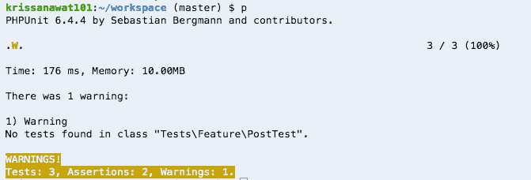T2】](https://res.cloudinary.com/practicaldev/image/fetch/s--2f0-lM7F--/c_limit%2Cf_auto%2Cfl_progressive%2Cq_auto%2Cw_880/https://cdn-images-1.medium.com/max/671/1%2A1mqwqJLQJfJYiX_4eaLglg.png)

没有，为什么没有找到一个测试？

尝试用 php 搜索单元警告测试未找到，并在堆栈溢出中找到答案

[由此答案](https://stackoverflow.com/a/27599293/733676)

> PHPUnit 唯一能识别为测试的方法是那些名称以**test**T3】开头的[方法。因此，您应该将 it_fetches_posts()方法重命名为 test_it_fetches_posts 或 ortestItFetchesPosts。camel case 命名是可选的，但是如果您稍后使用- testdox 选项，它会很有用。>同样，正如在其他回答中提到的，你也可以给任何方法添加](https://phpunit.de/manual/current/en/writing-tests-for-phpunit.html) [@test](https://dev.to/test) 注释，这将被 PHPUnit 视为一个测试。

这有两种方法可以解决使用 [@test](https://dev.to/test) 注释或者使用测试前缀

我选择前缀它的快捷方式

```
public function test_a_guset_can_access_blog_index() 
```

再试试 p

[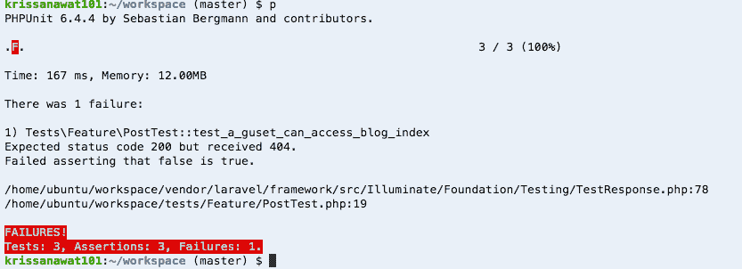T2】](https://res.cloudinary.com/practicaldev/image/fetch/s--BpkBgyAh--/c_limit%2Cf_auto%2Cfl_progressive%2Cq_auto%2Cw_880/https://cdn-images-1.medium.com/max/833/1%2AnxdevI0v6Vh24PEtx4kFoA.png)

404 的起因是

1.  博客的路径不存在
2.  帖子的控制者不存在
3.  该方法不存在

我必须试着一步一步解决

#### 创建博客路线

打开/route/web.php 并填充

```
Route::get(‘/blog’,’PostsController@index’); 
```

再次运行 p

[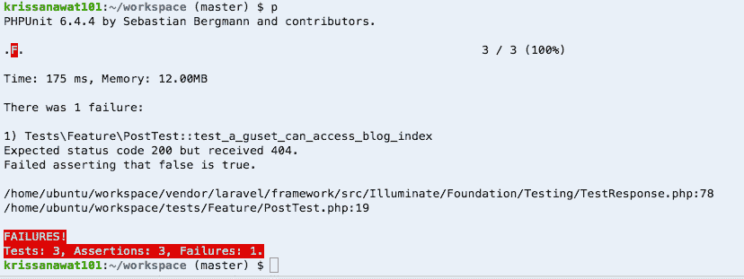T2】](https://res.cloudinary.com/practicaldev/image/fetch/s--aod32VeB--/c_limit%2Cf_auto%2Cfl_progressive%2Cq_auto%2Cw_880/https://cdn-images-1.medium.com/max/828/1%2AJbFWJq7jtYtHn_Sj9Wi2Ng.png)

这仍然是一个错误，因为 PostsController 不存在

尝试 PHP make:controller PostsController，然后仍然尝试 top

[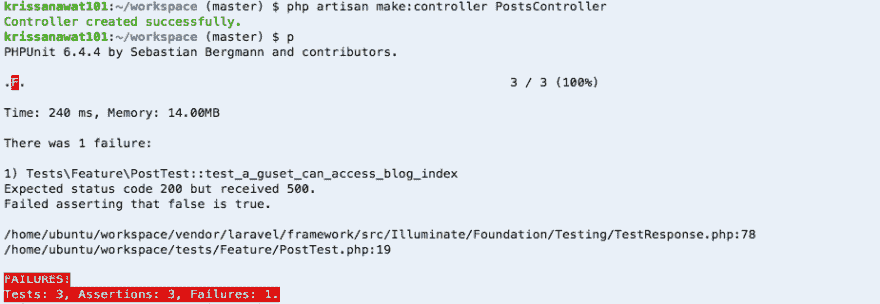T2】](https://res.cloudinary.com/practicaldev/image/fetch/s--5Ms4J87s--/c_limit%2Cf_auto%2Cfl_progressive%2Cq_auto%2Cw_880/https://cdn-images-1.medium.com/max/925/1%2AD1FC18xmnFoTMn8ZN8l31w.png)

是的，错误似乎从 404 变成了 500，最后我还是尝试了添加索引的方法

```
public function index(){
        return view('home');
} 
```

并暂时使用主视图，然后再次尝试 p

[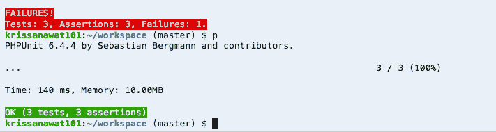T2】](https://res.cloudinary.com/practicaldev/image/fetch/s--1Y_pNimt--/c_limit%2Cf_auto%2Cfl_progressive%2Cq_auto%2Cw_880/https://cdn-images-1.medium.com/max/711/1%2ACb1lXn0E1l1tDagw1p5crQ.png)

那是工作

让我们在浏览器中查看，如果您使用 c9，请单击此处

[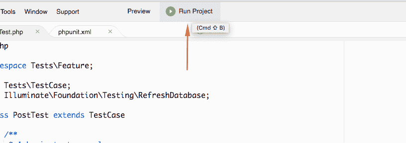T2】](https://res.cloudinary.com/practicaldev/image/fetch/s--QGqkpkDJ--/c_limit%2Cf_auto%2Cfl_progressive%2Cq_auto%2Cw_880/https://cdn-images-1.medium.com/max/816/1%2AC-tiKFLIWZ-DhdrOMXU0uQ.png)

终端即时显示服务器状态

[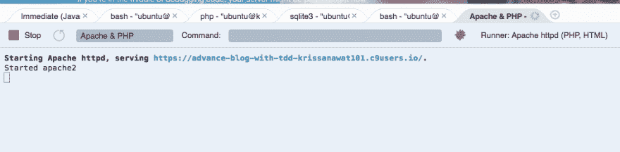T2】](https://res.cloudinary.com/practicaldev/image/fetch/s--hbZ6tAq7--/c_limit%2Cf_auto%2Cfl_progressive%2Cq_auto%2Cw_880/https://cdn-images-1.medium.com/max/1009/1%2A7SDJjgOmStObjRgFX6gzzg.png)

单击此链接并填写博客 URL

[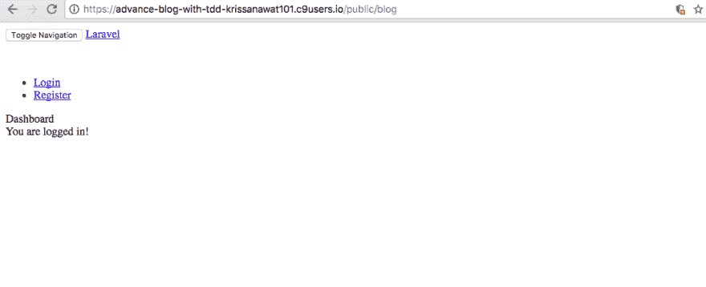T2】](https://res.cloudinary.com/practicaldev/image/fetch/s--DxkDINvm--/c_limit%2Cf_auto%2Cfl_progressive%2Cq_auto%2Cw_880/https://cdn-images-1.medium.com/max/1008/1%2AzWLbLOtZDnseP2k-skrEmQ.png)

这确实有效，但是 css，js 不起作用，因为它是一个公共文件夹

我试图在不删除公共文件夹的情况下调查这个问题，从[堆栈溢出](https://stackoverflow.com/a/32580688/733676)中找到这个答案

> 将 server.php 重命名为 index.php(无修改)>复制。htaccess 从公共文件夹到根文件夹(就像下面 rimon.ekjon 说的)>改变。对静态数据的访问如下:> rewrite engine On
> 
> rewrite cond % { REQUEST _ FILENAME }！-d
> T3<sup>重写器。\</sup> )/$ /$1 [L，R=301]
> 
> 重写 Cond %{REQUEST_URI}！(.css|。js|。png|。jpg|。gif | robots . txt)$[NC]
> 
> rewrite cond % { REQUEST _ FILENAME }！-d
> 
> 重写秒% {请求文件名}！-f
> 
> 重写器 index.php ^【l】
> 
> 重写器秒% {请求文件名}！-d
> 
> 重写秒% {请求文件名}！-f
> 
> 重写秒% {请求 _URI}！<sup>/public/</sup>
> 
> RewriteRule<sup>CSS | js | images</sup>/(。*)$ public/$1/$2 [L，NC] >如果需要任何其他**静态文件**，只需将扩展名添加到先前声明的列表中

我已经尝试过了！我们可以不公开使用博客路径

是我不懂的工作！为什么？因为我不会成为系统管理员

[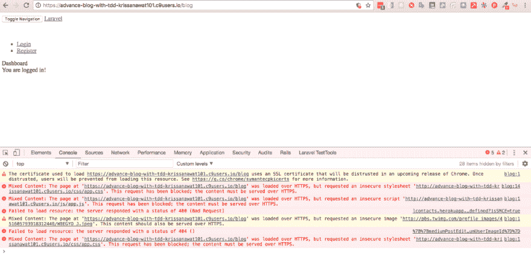T2】](https://res.cloudinary.com/practicaldev/image/fetch/s--xoR6zER9--/c_limit%2Cf_auto%2Cfl_progressive%2Cq_auto%2Cw_880/https://cdn-images-1.medium.com/max/1024/1%2A9k_ADw7ph2KlEnJsspMQOQ.png)

但是资产不能正确加载，因为一个域正在使用 https，我们稍后再解决

接下来，我们显示所有帖子

### 测试显示所有帖子

首先包含帖子模型 withUse App \ Post

并用
更新索引方法

```
public function index(Post $post){ // inject Post Model
        // query sort by created_at desc
        $posts = $post::latest()->get(); 
        // bind query result to view
         return view('post.index')->with(['posts'=>$posts]);
    } 
```

接下来，我们创建文件夹并查看 create post/index.blade.php

[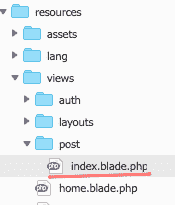T2】](https://res.cloudinary.com/practicaldev/image/fetch/s--HCGEF00j--/c_limit%2Cf_auto%2Cfl_progressive%2Cq_auto%2Cw_880/https://cdn-images-1.medium.com/max/175/1%2AxOWCTnoKH08BRi-s18_rug.png)

打开 home.blade.php，抓取所有 HTML 粘贴到 index.blade.php，并添加如下图所示的代码

[T2】](https://res.cloudinary.com/practicaldev/image/fetch/s---3uilcrx--/c_limit%2Cf_auto%2Cfl_progressive%2Cq_auto%2Cw_880/https://cdn-images-1.medium.com/max/835/1%2A3K_A3kYYEtwAwZonxQLcfw.png)

loop $文章显示在文章标签中

现在我们试着做一个测试

[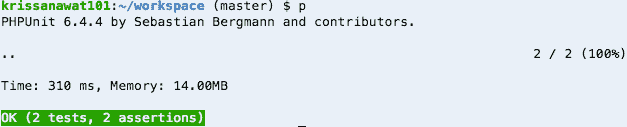T2】](https://res.cloudinary.com/practicaldev/image/fetch/s--DPS3b8AR--/c_limit%2Cf_auto%2Cfl_progressive%2Cq_auto%2Cw_880/https://cdn-images-1.medium.com/max/627/1%2ATcF-VY4HZSDbmPW6h8SGkg.png)

它通过了，因为测试没有比预期的 HTTP 状态 200 更复杂

现在我们在浏览器中查看

[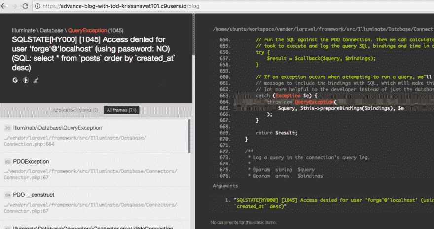T2】](https://res.cloudinary.com/practicaldev/image/fetch/s--bh_rvvFQ--/c_limit%2Cf_auto%2Cfl_progressive%2Cq_auto%2Cw_880/https://cdn-images-1.medium.com/max/1024/1%2AaF9-PSTwmav7Wr11iPQRPg.png)

因为 cloud9 apache 不读取 env.testing，laravel 内置服务器也不能在 cloud9 上运行

在这种情况下，我打开了快速解决方案。env 文件并将 mysql 改为 sqlite，如下所示

[T2】](https://res.cloudinary.com/practicaldev/image/fetch/s--kjVZ-JIm--/c_limit%2Cf_auto%2Cfl_progressive%2Cq_auto%2Cw_880/https://cdn-images-1.medium.com/max/784/1%2AauSVVwTzVZVRDqBYou82zg.png)

保存并再次刷新浏览器

[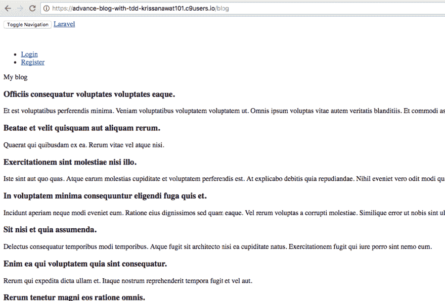T2】](https://res.cloudinary.com/practicaldev/image/fetch/s--1WG8U3X7--/c_limit%2Cf_auto%2Cfl_progressive%2Cq_auto%2Cw_880/https://cdn-images-1.medium.com/max/1015/1%2ATEx21VasbGnID3Z-sPZjlw.png)

是时候解决 https 资产问题了

打开 layouts/app.blade.php，像使用图像一样使用查找和替换

[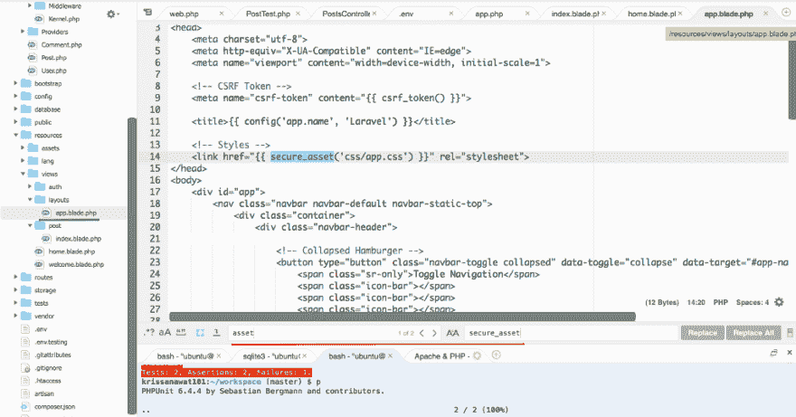T2】](https://res.cloudinary.com/practicaldev/image/fetch/s--uYOKNYGh--/c_limit%2Cf_auto%2Cfl_progressive%2Cq_auto%2Cw_880/https://cdn-images-1.medium.com/max/1024/1%2AcMRuDFmXnCq_ytwxZwZP7g.png)

然后保存并刷新

[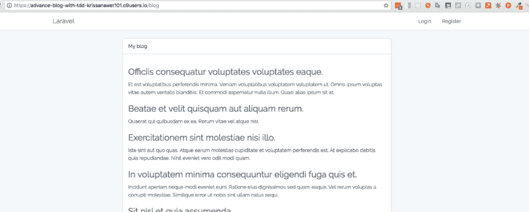T2】](https://res.cloudinary.com/practicaldev/image/fetch/s--W41tRMG4--/c_limit%2Cf_auto%2Cfl_progressive%2Cq_auto%2Cw_880/https://cdn-images-1.medium.com/max/1024/1%2A5gj5hTYhfohW1akI-eChlQ.png)

看起来好多了

让我们为了一点小聪明而进行改进测试

我假设你知道[什么是 BDD 用户故事](https://dannorth.net/whats-in-a-story/)然后写用户故事，当我们需要在创建
后看到文章标题出现时

```
public function test_a_guset_can_access_blog_index()
    {
        // Giving post object
       // When guest access blog url
       // Then I've see blog title that create before

} 
```

让我们填写测试代码

```
public function test_a_guset_can_access_blog_index()
    { // Giving post object
        $post = factory('App\Post')->create();//create post data
        // When guest access blog url
        $response = $this->get('/blog'); //visit blog homepage 
        // Then I've see blog title that create before
        $response->assertSee($post->title); // expect to see post 
    } 
```

尝试运行测试

[T2】](https://res.cloudinary.com/practicaldev/image/fetch/s--1dY8Hjz0--/c_limit%2Cf_auto%2Cfl_progressive%2Cq_auto%2Cw_880/https://cdn-images-1.medium.com/max/758/1%2AECcDkIK92Eg0HiK_G1M9qw.png)

这是下一步的工作，我要去测试，当我们显示单个职位

### 显示单个帖子

创建名为 test _ a _ guest _ can _ see _ single _ post 的测试函数

首先，我起草了 BDD 用户故事

```
public function test_a_guest_can_see_single_post(){
        // giving post data
        // when guest access blog/{id}
        // expect to see post title
    } 
```

然后填充代码

```
public function test_a_guest_can_see_single_post(){
        // giving post data
        $post = factory('App\Post')->create();
        // when guest access blog/{id}
        $response = $this->get('/blog/'.$post->id);
        // expect to see post title
        $response->assertSee($post->title);
    } 
```

保存并运行测试

[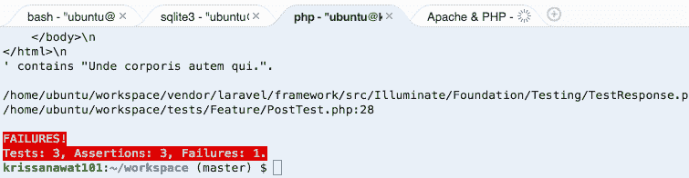T2】](https://res.cloudinary.com/practicaldev/image/fetch/s--ZPy70ANV--/c_limit%2Cf_auto%2Cfl_progressive%2Cq_auto%2Cw_880/https://cdn-images-1.medium.com/max/755/1%2ADvUymurqhoxcZ2SLDLqjTA.png)

是啊，失败

接下来，我计划创建路线，显示功能和显示视图

#### 创建展示路线

打开 route/web.php 并填充 route

[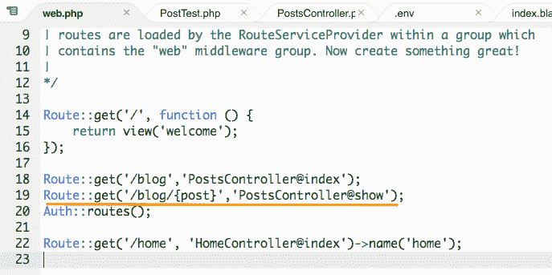T2】](https://res.cloudinary.com/practicaldev/image/fetch/s--gytPJI-F--/c_limit%2Cf_auto%2Cfl_progressive%2Cq_auto%2Cw_880/https://cdn-images-1.medium.com/max/687/1%2Aq2zjtwv-Zr8zJObnUekQ6A.png)

运行测试

[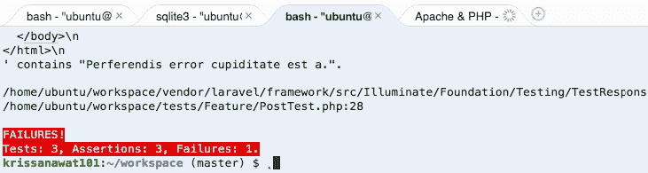T2】](https://res.cloudinary.com/practicaldev/image/fetch/s--vZNp69mB--/c_limit%2Cf_auto%2Cfl_progressive%2Cq_auto%2Cw_880/https://cdn-images-1.medium.com/max/731/1%2AZUjd0CMGiIX3-10s4i6BUw.png)

预期见面

现在创建显示方法

[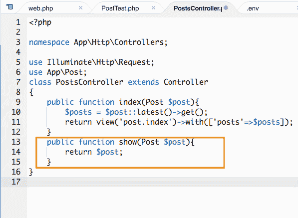T2】](https://res.cloudinary.com/practicaldev/image/fetch/s--FfZPFfMy--/c_limit%2Cf_auto%2Cfl_progressive%2Cq_auto%2Cw_880/https://cdn-images-1.medium.com/max/597/1%2AqzAvhAIMZ1aJCHrPiWA5Ng.png)

我们使用[模型绑定](https://laravel.com/docs/5.5/routing#route-model-binding)机制处理

运行测试

[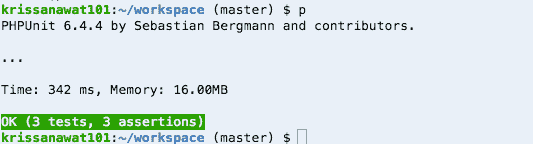T2】](https://res.cloudinary.com/practicaldev/image/fetch/s--t1TXFuh8--/c_limit%2Cf_auto%2Cfl_progressive%2Cq_auto%2Cw_880/https://cdn-images-1.medium.com/max/533/1%2ACuwaQN28A70NptqEissG2Q.png)

是浆糊为什么？打开浏览器

[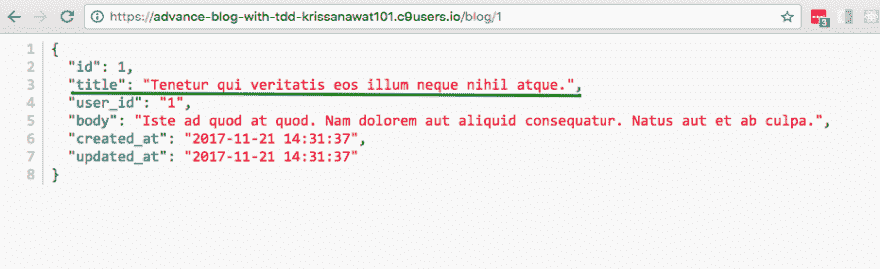T2】](https://res.cloudinary.com/practicaldev/image/fetch/s--3hPoU91J--/c_limit%2Cf_auto%2Cfl_progressive%2Cq_auto%2Cw_880/https://cdn-images-1.medium.com/max/931/1%2ALSQ5hKQ0pTKYHF2CnD7-qA.png)

我们期待看到它

我已经确定您不需要显示原始数据，因此，让我们修改显示功能

```
public function show(Post $post){
        return view('post.show')->with(['post'=>$post]);
    } 
```

接下来，我们创建显示视图

[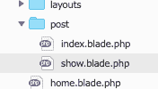T2】](https://res.cloudinary.com/practicaldev/image/fetch/s--ZqTmBiWE--/c_limit%2Cf_auto%2Cfl_progressive%2Cq_auto%2Cw_880/https://cdn-images-1.medium.com/max/176/1%2AcRNYJ-JySXZsnlBwVkmuKw.png)

从 show.blade.php 的 index.blade.php 浆糊里拿一个代码

和更新使标题成为文章标题，并消除形式循环

[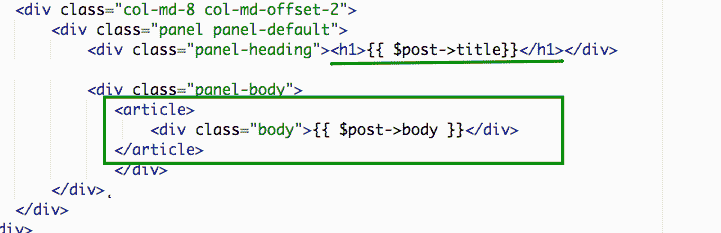T2】](https://res.cloudinary.com/practicaldev/image/fetch/s--4cxS7Y6j--/c_limit%2Cf_auto%2Cfl_progressive%2Cq_auto%2Cw_880/https://cdn-images-1.medium.com/max/721/1%2ASo3RY6a0vQgi_UFydhpS3Q.png)

只需保存并刷新浏览器

[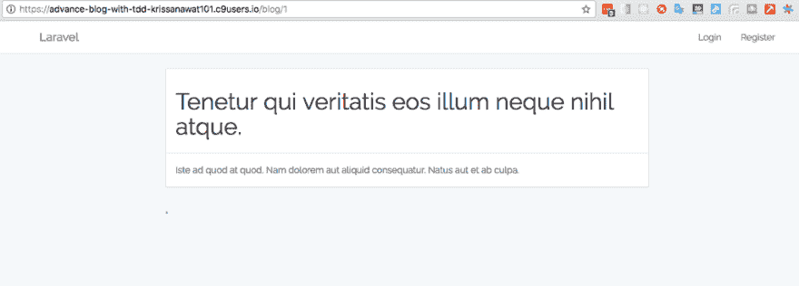T2】](https://res.cloudinary.com/practicaldev/image/fetch/s--6oIKIgKO--/c_limit%2Cf_auto%2Cfl_progressive%2Cq_auto%2Cw_880/https://cdn-images-1.medium.com/max/1024/1%2AGf5Sa5JEIuT7mQsTGRgOvg.png)

看起来不错，再做一次测试

[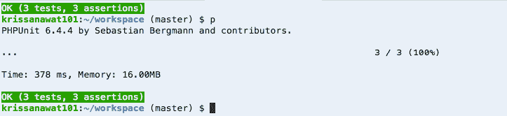T2】](https://res.cloudinary.com/practicaldev/image/fetch/s--QegiEFfu--/c_limit%2Cf_auto%2Cfl_progressive%2Cq_auto%2Cw_880/https://cdn-images-1.medium.com/max/723/1%2Ao9jf1F1mAdiHunDfrjEkpQ.png)

接下来，我们在博客索引中添加访问单篇文章的链接

[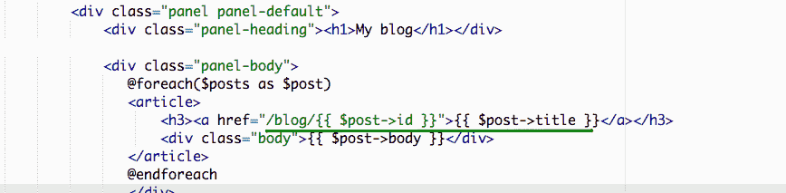T2】](https://res.cloudinary.com/practicaldev/image/fetch/s--2UIt6Nvi--/c_limit%2Cf_auto%2Cfl_progressive%2Cq_auto%2Cw_880/https://cdn-images-1.medium.com/max/868/1%2ACDNKrrzLErrvzbxR1nuSnA.png)

我们添加了一个链接，链接到“让我们在浏览器中测试”的单篇文章

[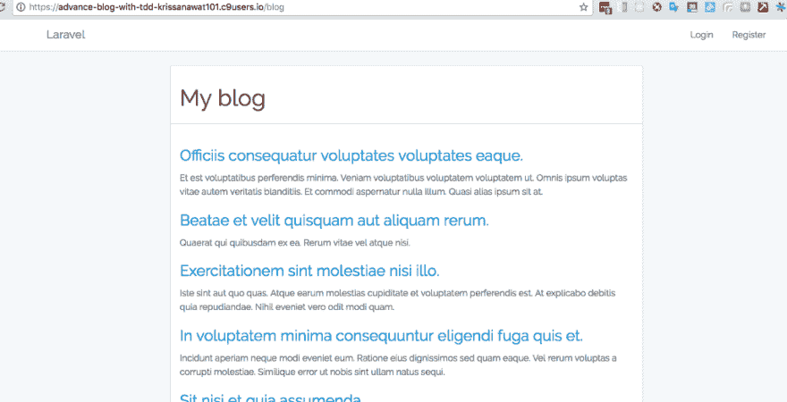T2】](https://res.cloudinary.com/practicaldev/image/fetch/s--Povh8tG5--/c_limit%2Cf_auto%2Cfl_progressive%2Cq_auto%2Cw_880/https://cdn-images-1.medium.com/max/1024/1%2A6fum1WTyUmVw9dzfjT8DlA.png)

完成我的感受

[https://medium . com/media/d 86879 FD 098964 ACF CB 8 c 713 abcb 8022/href](https://medium.com/media/d86879fd098964acfcb8c713abcb8022/href)

**如果你喜欢这个，请给我 50 个掌声，并点击跟随鼓励前进**

**这个** [**项目 Github 提交**](https://github.com/krissnawat/advance-blog-in-laravel-5.5-in-tdd/commit/70a70bc55e6a95efb9304a73aa18ea5fd591e9de) **就可以启动了**

* * *