# 使用 TDD 模式#4 在 Laravel 5.5 上构建高级博客用户可以提交评论

> 原文：<https://dev.to/kris/building-advance-blog-on-laravel-55-with-tdd-mode-4-user-can-submit-comment-bf8>

[T2】](https://res.cloudinary.com/practicaldev/image/fetch/s--G0e61Alp--/c_limit%2Cf_auto%2Cfl_progressive%2Cq_auto%2Cw_880/https://cdn-images-1.medium.com/max/1024/1%2AWoNi1iErxX_TEF3oBY3NRQ.png)

在前一集中，我们通过在本集中从一个特性开始再次创建 test first

来显示注释

用户可以提交评论

如果你遵循第一个帖子，我不会在测试用例中使用用户，因为需要认证状态

但现在我们不允许访客或匿名提交评论

#### 帖子可以添加评论

首先，我们进行小规模的测试，深入到单元级别，用 artisan 生成单元测试文件名 PostTest

php artisan make:测试 PostTest - unit

打开该文件，首先填写用户故事

```
public function test_a_post_can_add_a_comments()
    {
          //Giving a Post
         // Add a commemnt
        // Then post should have a comment

} 
```

接下来填写空白

```
public function test_a_post_can_add_a_comments()
    {
        //Giving a Post
        $post = factory('App\Post')->create();
        // Add a comemnt
        $post->storeComment([
                'body'=>'Testing',
                'user_id'=>1
        ]);
        // Then post should have comment
        $this->assertCount(1,$post->comment);
    } 
```

尝试测试

p 过滤器测试/Unit/PostTest.php

结果

[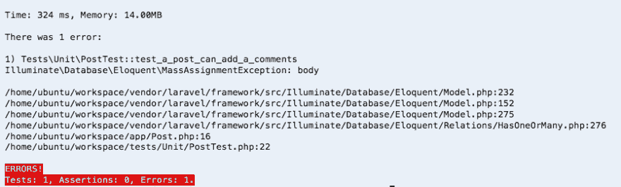T2】](https://res.cloudinary.com/practicaldev/image/fetch/s--eexLXOj9--/c_limit%2Cf_auto%2Cfl_progressive%2Cq_auto%2Cw_880/https://cdn-images-1.medium.com/max/897/1%2AiTDA90xpO_D6XsVAagswcQ.png)

好吧，这有道理

开放评论模式

[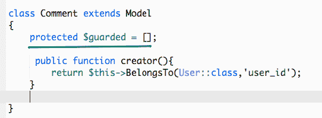T2】](https://res.cloudinary.com/practicaldev/image/fetch/s--kXb1QIF4--/c_limit%2Cf_auto%2Cfl_progressive%2Cq_auto%2Cw_880/https://cdn-images-1.medium.com/max/542/1%2ABXpEMMCC-j4r9Wr6Jk9n1Q.png)

填充$受保护

并再次运行单一测试

[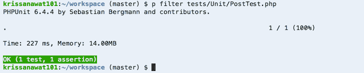T2】](https://res.cloudinary.com/practicaldev/image/fetch/s--_45UIDk5--/c_limit%2Cf_auto%2Cfl_progressive%2Cq_auto%2Cw_880/https://cdn-images-1.medium.com/max/728/1%2AC6QQgmk6FhvzHerrV7tP5Q.png)

我们有绿色

### 提交评论测试特性测试

接下来，我们将创建评论，但在大范围内

1.  创建连接到端点的路由
2.  创建注释对象并保存到数据库
3.  检查注释是否存在于显示页面中

唯一可以提交评论的用户是功能测试，因为它与其他功能一起工作。

不会将它们从显示名称中分离出来。

打开终端 php artisan make:测试提交注释

让我们生成用户故事

```
public function test_user_can_submit_comment(){

// Given a Guest
          // make guest to Authenticate user 
         // And Post is exist
        // And Giving comment object 
       // When the user submit comment to the post
      // Then their should see comment

} 
```

接下来填写空白处

```
public function test_user_can_submit_comment(){
         // Given a Guest
          $guest = factory('App\User')->create();
          // create Authenticate user 
         $user = $this->be($guest);
         // And Post is exist
         $post = factory('App\Post')->create();
         // And Giving comment object 
         $comment = factory('App\Comment')->make();
         // When the user submit comment to the post
    $this->post('/blog/'.$post->id.'/comment',$comment->toArray());
         // Then their should see comment
         $this->get('/blog/'.$post->id)->assertSee($comment->body);

} 
```

> 注意:在创建注释时，你已经看到了为什么我使用 make 而不是 create，因为 make 只创建对象不创建 DB 记录，我们在下一行[中使用对象创建真实记录以获得更多参考](https://laravel.com/docs/5.5/database-testing#using-factories)

现在我们有了一张地图，让我们跟着走

首先这应该是红色的

[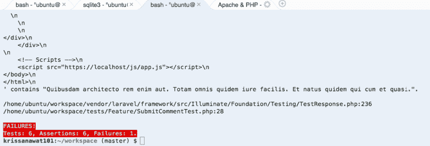T2】](https://res.cloudinary.com/practicaldev/image/fetch/s--xHDQIwKH--/c_limit%2Cf_auto%2Cfl_progressive%2Cq_auto%2Cw_880/https://cdn-images-1.medium.com/max/931/1%2A5My5SYDrGy3_oCELlTCVMw.png)

### 先创建路线

```
Route::post('/blog/{post}/comment','CommentController@store'); 
```

接下来创建端点，在 CommentController 中为调用 store comment
创建存储方法

```
use Illuminate\Http\Request;
use App\Post;
class CommentController extends Controller
{
      public function store(Post $post,Request $request){
            $post->storeComment([

                 'body'=>$request->get('body'),
                 'user_id'=> auth()->id()
            ]);
      }
} 
```

保存并再次测试

[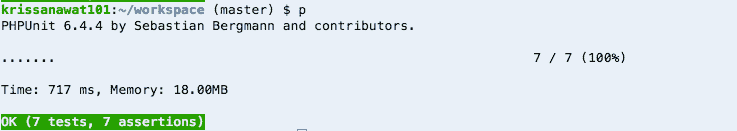T2】](https://res.cloudinary.com/practicaldev/image/fetch/s--iz_d_FU_--/c_limit%2Cf_auto%2Cfl_progressive%2Cq_auto%2Cw_880/https://cdn-images-1.medium.com/max/737/1%2AoqJw4YVln1lrhA0GxxFdiQ.png)

明白，我们看到绿色了

但是我已经修改了一些细节

#### 认证用户只能提交评论

我们需要阻止一个客人试图用添加认证中间件提交评论

注释控制器

```
public function _construct(){
           $this->middleware('auth');
       } 
```

为了确保我们添加一个测试来检查这个

[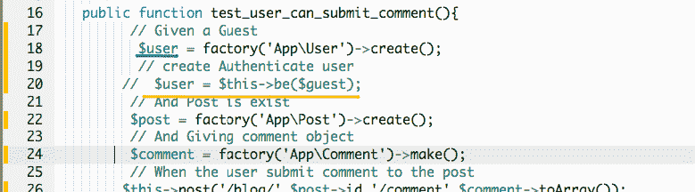T2】](https://res.cloudinary.com/practicaldev/image/fetch/s--lcHVrfXS--/c_limit%2Cf_auto%2Cfl_progressive%2Cq_auto%2Cw_880/https://cdn-images-1.medium.com/max/779/1%2AQKi2hFvzZbrCj-hyFGVpZg.png)

注释$this->be，并将$user 更改为未经身份验证的用户

试试 p

[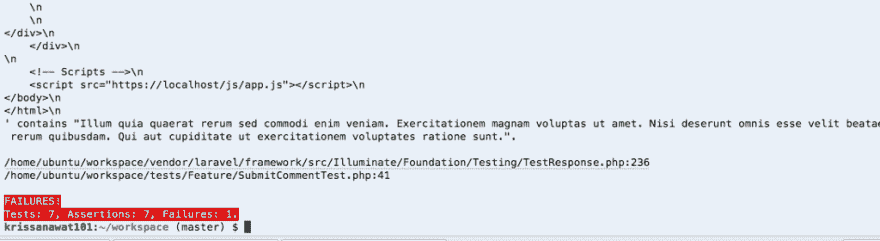T2】](https://res.cloudinary.com/practicaldev/image/fetch/s--FLO1c7uS--/c_limit%2Cf_auto%2Cfl_progressive%2Cq_auto%2Cw_880/https://cdn-images-1.medium.com/max/1024/1%2ArOLVtJTij0ekBgpeyn9DmA.png)

好的，这就是工作，让我来解释一下

当用户不验证并向端点发送请求时，它就不起作用

我们测试的下一步是调用获取原始帖子的方法来添加评论

我们期望看到我们以前创建的评论，但是没有创建

并尝试取消注释

[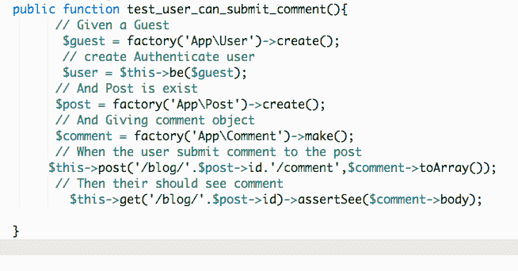T2】](https://res.cloudinary.com/practicaldev/image/fetch/s--f8ZAFfKU--/c_limit%2Cf_auto%2Cfl_progressive%2Cq_auto%2Cw_880/https://cdn-images-1.medium.com/max/654/1%2A0QNlBa7AeApZFtpkK0jwjA.png)

保存并再次测试

[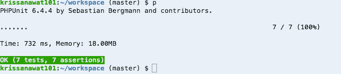T2】](https://res.cloudinary.com/practicaldev/image/fetch/s--cDOK0-eb--/c_limit%2Cf_auto%2Cfl_progressive%2Cq_auto%2Cw_880/https://cdn-images-1.medium.com/max/665/1%2AtaS2QfugKarabbvNACgJeg.png)

好了，让我们分开功能来检查客人是否不能提交评论

从测试前获取代码，但删除$ user = $ this-> be($ guest)；

```
function test_guest_can_not_submit_comment(){
        // Given a Guest
          $guest = factory('App\User')->create();
         // And Post is exist
         $post = factory('App\Post')->create();
         // And Giving comment object 
         $comment = factory('App\Comment')->make();
         // When the user submit comment to the post
          $this->post('/blog/'.$post->id.'/comment',$comment->toArray());
         // Then their should see comment
    $this->get('/blog/'.$post->id)->assertSee($comment->body);

    } 
```

再次测试

[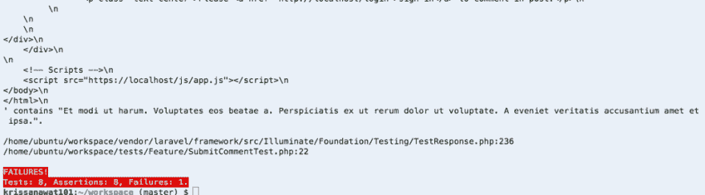T2】](https://res.cloudinary.com/practicaldev/image/fetch/s--Oh0-OZH6--/c_limit%2Cf_auto%2Cfl_progressive%2Cq_auto%2Cw_880/https://cdn-images-1.medium.com/max/1024/1%2AJXo_S_VfrGfpml91is1yoA.png)

如果下一次失败，使其变绿

```
function test_guest_can_not_submit_comment(){
        // Given a Guest
          $guest = factory('App\User')->create();
         // And Post is exist
         $post = factory('App\Post')->create();
         // And Giving comment object 
         $comment = factory('App\Comment')->make();
         // When the user submit comment to the post
          $this->post('/blog/'.$post->id.'/comment',$comment->toArray());
         // Then their should don't see comment
    $this->get('/blog/'.$post->id)->assertDontSee($comment->body);

    } 
```

重新运行测试

[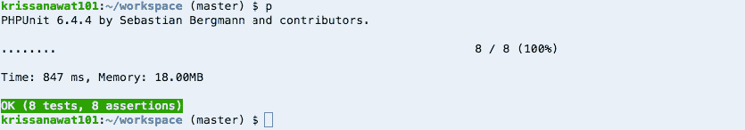T2】](https://res.cloudinary.com/practicaldev/image/fetch/s--8Dnie3hC--/c_limit%2Cf_auto%2Cfl_progressive%2Cq_auto%2Cw_880/https://cdn-images-1.medium.com/max/835/1%2AEd8uLz-MyLO4ZW53Alxvcg.png)

它是绿色的

我们完全在幕后工作。

### 在前端完成

现在是为这一集的结尾添加表格的时候了

首先，我给路线命名为

```
Route::post('/blog/{post}/comment','CommentController@store')->name('addcomment'); 
```

然后打开 post/show.blade.php

滚动到底部页面

复制下面的代码

```
@if (auth()->check())
             <div class="row">
                 <div class="col-md-8 col-md-offset-2">
                     <form method="POST" action="{{ route('addcomment',$post->id) }}">
                        {{ csrf_field() }}

                         <div class="form-group">
                             <textarea name="body" id="body" class="form-control" placeholder="Have something to say?" rows="5"></textarea>
                         </div>

                         <button type="submit" class="btn btn-default">Post</button>
                    </form>
                 </div>
             </div>
         @else
             <p class="text-center">Please <a href="{{ route('login') }}">sign in</a> to comment in post.</p>
         @endif 
```

并粘贴到此位置

[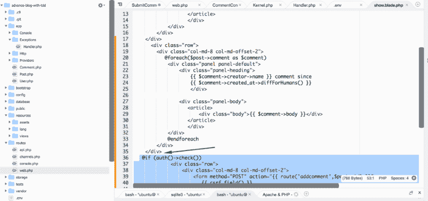T2】](https://res.cloudinary.com/practicaldev/image/fetch/s--G-jkLH_R--/c_limit%2Cf_auto%2Cfl_progressive%2Cq_auto%2Cw_880/https://cdn-images-1.medium.com/max/1024/1%2AhFHhuRD8C-M3-F1bGv_4Jg.png)

保存并进行下一步检查

[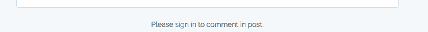T2】](https://res.cloudinary.com/practicaldev/image/fetch/s--5ZktYv67--/c_limit%2Cf_auto%2Cfl_progressive%2Cq_auto%2Cw_880/https://cdn-images-1.medium.com/max/839/1%2AhUu5TVUlspIemUoHG19OQA.png)

点击链接登录

[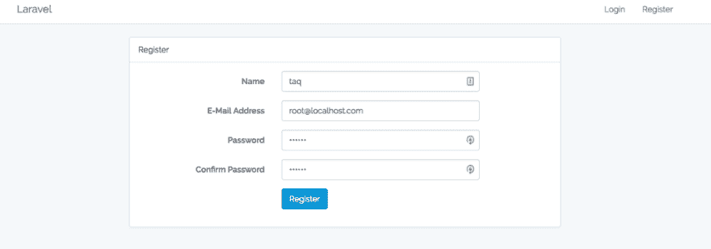T2】](https://res.cloudinary.com/practicaldev/image/fetch/s--xLJW4D_2--/c_limit%2Cf_auto%2Cfl_progressive%2Cq_auto%2Cw_880/https://cdn-images-1.medium.com/max/1024/1%2AWSSNFaGYPm1p44wIc1le1w.png)

登录后，去一些职位，并添加这个

[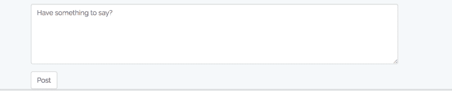T2】](https://res.cloudinary.com/practicaldev/image/fetch/s--AfKmgSKC--/c_limit%2Cf_auto%2Cfl_progressive%2Cq_auto%2Cw_880/https://cdn-images-1.medium.com/max/923/1%2AIFEwHsMWsOlp8yBJ_vb31g.png)

并提交您已重定向回此页面

[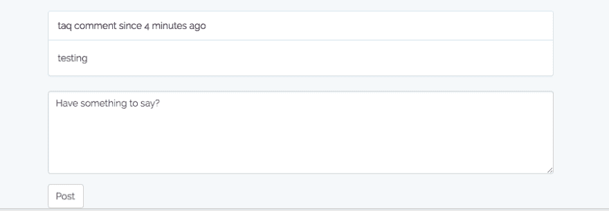T2】](https://res.cloudinary.com/practicaldev/image/fetch/s--CvjlFQFZ--/c_limit%2Cf_auto%2Cfl_progressive%2Cq_auto%2Cw_880/https://cdn-images-1.medium.com/max/902/1%2ACglAZ0IvyCCZIjOSt6JmIQ.png)

好的，几乎完全正常

### 奖金部分

#### 显示帖子创建者

我们知道评论创建者

[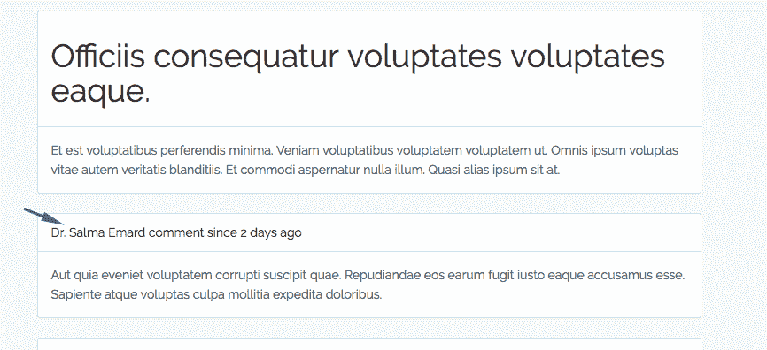T2】](https://res.cloudinary.com/practicaldev/image/fetch/s--iMcTsmz8--/c_limit%2Cf_auto%2Cfl_progressive%2Cq_auto%2Cw_880/https://cdn-images-1.medium.com/max/866/1%2Ac9OP_WbYPn_rNgJdV4562A.png)

但是我们不知道帖子的创建者是谁

让我们用 TDD 的方式显示它，先写测试

打开 tests/Unit/PostTest.php

添加函数 test_post_has_a_creator

```
function test_post_has_a_creator()
    {
        // Giving post 
        // expect found User who create post
    } 
```

填补空白

再次

```
function test_post_has_a_creator()
    {
        // Giving post 
        $post = factory('App\Post')->create();
        // expect found User who create post
        $this->assertInstanceOf('App\User', $post->creator);
    } 
```

让我们再测试一次

[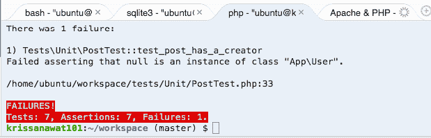T2】](https://res.cloudinary.com/practicaldev/image/fetch/s--Mcz5qznU--/c_limit%2Cf_auto%2Cfl_progressive%2Cq_auto%2Cw_880/https://cdn-images-1.medium.com/max/619/1%2AvZ9jHMantRnrJLUQZwyVSQ.png)

应该会失败

接下来，我们为 Post 模型添加关系

[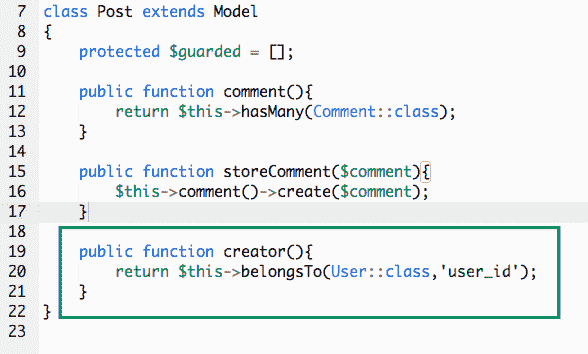T2】](https://res.cloudinary.com/practicaldev/image/fetch/s--RiT_ezIt--/c_limit%2Cf_auto%2Cfl_progressive%2Cq_auto%2Cw_880/https://cdn-images-1.medium.com/max/588/1%2A47klH1gUrJkHgzx2K6am5A.png)

再次运行测试

[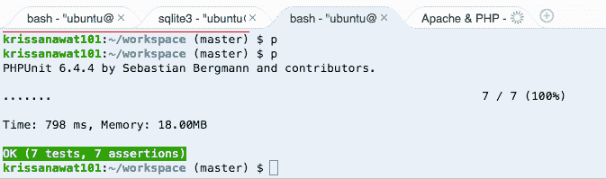T2】](https://res.cloudinary.com/practicaldev/image/fetch/s--SeWEKcGm--/c_limit%2Cf_auto%2Cfl_progressive%2Cq_auto%2Cw_880/https://cdn-images-1.medium.com/max/673/1%2Azf4Lno1xAJpg-BWXyTQnjw.png)

在帖子中显示添加到单个帖子

[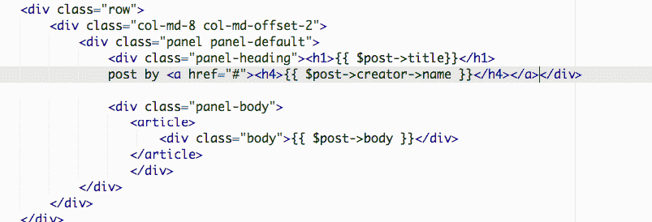T2】](https://res.cloudinary.com/practicaldev/image/fetch/s--aD62BdY7--/c_limit%2Cf_auto%2Cfl_progressive%2Cq_auto%2Cw_880/https://cdn-images-1.medium.com/max/803/1%2Aw0eDMVBZIBQhouQ_cL69IQ.png)

保存并刷新

[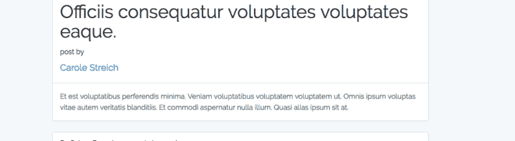T2】](https://res.cloudinary.com/practicaldev/image/fetch/s--JHiJoooc--/c_limit%2Cf_auto%2Cfl_progressive%2Cq_auto%2Cw_880/https://cdn-images-1.medium.com/max/1024/1%2AKkYjUAuyRDfiyzrpbfj2jQ.png)

完成

在我们结束这一集之前，我需要调整一些东西

使用添加主页菜单

[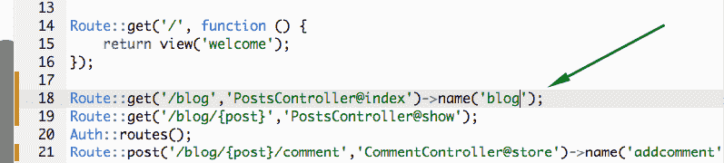T2】](https://res.cloudinary.com/practicaldev/image/fetch/s--SirtuI2F--/c_limit%2Cf_auto%2Cfl_progressive%2Cq_auto%2Cw_880/https://cdn-images-1.medium.com/max/797/1%2AkgTm3ccOzkfeD3H91mfRVw.png)

首先，我将名字添加到博客路径中

[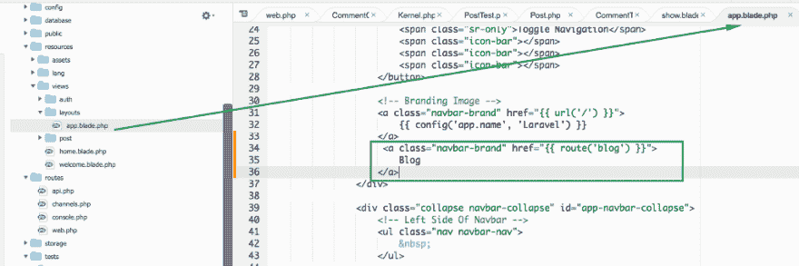T2】](https://res.cloudinary.com/practicaldev/image/fetch/s--ibSgoFVU--/c_limit%2Cf_auto%2Cfl_progressive%2Cq_auto%2Cw_880/https://cdn-images-1.medium.com/max/1024/1%2AQrS2K8_hxn-wz39NOuHAPg.png)

保存并刷新

[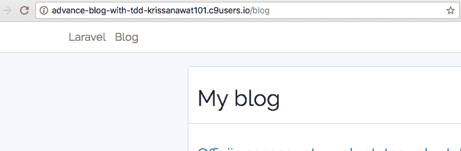T2】](https://res.cloudinary.com/practicaldev/image/fetch/s--CXkHo-xD--/c_limit%2Cf_auto%2Cfl_progressive%2Cq_auto%2Cw_880/https://cdn-images-1.medium.com/max/756/1%2AMC-O2GbFuL9t8Epe5Guxig.png)

获得博客菜单

希望你喜欢这个

**如果你喜欢这个，请给我 50 个掌声，并点击跟随鼓励前进**

**这个** [**项目 Github 提交**](https://github.com/krissnawat/advance-blog-in-laravel-5.5-in-tdd/commit/1523cb175b97dd7716c3af8b6743ad81d83c3b8e) **就可以启动了**

* * *