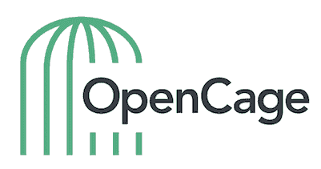
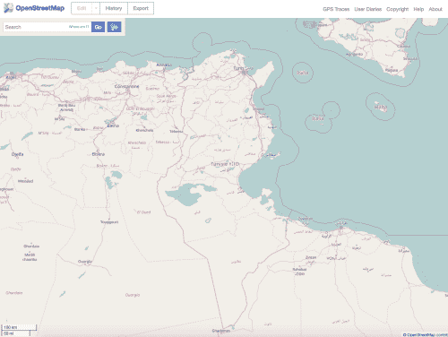
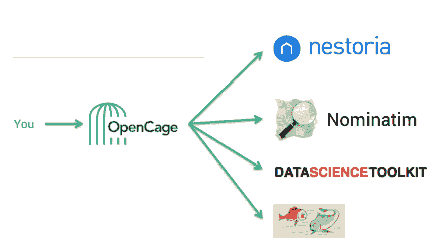

# 在开放数据上构建 API

> 原文：<https://dev.to/gwintrob/building-an-api-on-open-data>

> 欢迎来到 [GET PUT POST](https://tinyletter.com/getputpost) ，这是一份关于 API 的时事通讯。每一期都有对一家初创公司的采访，内容是关于他们的 API 和开发者在他们的平台上构建的想法。想在收件箱里看到最新的采访吗？ **[在此订阅。](https://tinyletter.com/getputpost)**

[本期](https://getputpost.co/building-an-api-on-open-data-3d6f8b915b2d)，我采访了 [OpenCage](https://geocoder.opencagedata.com/) 的联合创始人 [Ed Freyfogle](https://twitter.com/freyfogle) 。他们的 API 很容易将地址转换成坐标，而且不像谷歌和其他公司，它是建立在完全开放的数据集之上的。我们讨论了业务是如何开始的，他们对其他服务的粉丝请求，以及零碎的营销工作。

### 什么是 OpenCage？

OpenCage 是一项地理编码服务，融合了开放数据的所有优势。我们帮助开发人员以他们在使用专有数据服务时无法做到的方式创建解决方案，并致力于使地理编码尽可能简单。

[T2】](https://res.cloudinary.com/practicaldev/image/fetch/s--t601d29Z--/c_limit%2Cf_auto%2Cfl_progressive%2Cq_auto%2Cw_880/https://cdn-images-1.medium.com/max/401/1%2ANfVUM4Y3im00smTtxY4sZQ.png)

在我们开始之前，我有一家公司做网上房地产搜索。这个品牌叫做 Nestoria，我们建立了一个适用于大约十个国家的房地产搜索。

地理编码是将地址转换成地理位置的过程，反之亦然。在美国、英国和大多数主要欧洲国家，都有很好的地理编码工具。然而，在像印度和巴西这样有内斯托里亚参与的国家，这要困难得多。

我们建立了自己的地理编码服务，因为我们正在对数百万印度和巴西的房产进行地理编码。在这些国家，很难买到地理数据(即使有)。为了有效地构建我们的内部服务，我们必须使用开放数据。

2013 年，我们把地理编码技术变成了自己的品牌:OpenCage。Nestoria 在 2015 年被我们的一个竞争对手收购，我们将 OpenCage 剥离出来，成为它自己的公司。

### 当你飞跃到专门进行地理编码时，你的使用率是多少？

我们最初发布 OpenCage 是作为一项实验，并称之为 beta 服务。我们通过倾听用户的意见学到了很多，并得到了很好的反馈。最初，它是免费的，然后我们与使用它的人交谈，了解他们愿意为哪些服务付费，并根据反馈创建一项业务。

我们只是在增加了很多服务并使其更加可靠之后才引入定价。我们已经看到在使用和客户数量方面缓慢而稳定的增长。地理编码器的痛苦和快乐在于工作永远不会结束，因为这个世界是一个复杂和动态的地方。新的映射问题和用例不断出现。

对地理编码有巨大的需求。市场上有许多来自谷歌等专有公司的不同产品，理论上开发者可以在开放数据上构建自己的服务。然而，在这一点上，使用像我们这样的服务比从头开始构建更有效。

[T2】](https://res.cloudinary.com/practicaldev/image/fetch/s--RUtc3Q16--/c_limit%2Cf_auto%2Cfl_progressive%2Cq_auto%2Cw_880/https://cdn-images-1.medium.com/max/500/1%2AjcQ5a0gHww3NAe5u82w_jw.png)

### 有多少人使用 API？

我们提供几个不同的层级。成千上万的开发者加入了我们的免费层，其中一小部分在我们的高级层。

人们需要的地理编码类型多种多样。许多开发人员有一个项目，涉及一个需要进行地理编码的大型地址数据库，然后不再需要我们的服务。我们不能围绕这样的交互建立持续的业务，所以我们专注于对地理编码有持续需求的客户。

### API 的用例有哪些？

通常，人们都有一个需要转换成坐标的地址数据库。这是我们用例的基础。这些地址可能来自任何地方，从网上购物交易到患者记录。

一个增长领域是反向地理编码，特别是用于车辆跟踪。每辆新车都会持续记录其行程并收集坐标。客户希望将这些坐标转换成地址。

可以记录位置的设备的成本已经大幅下降，并且已经到了高端自行车通常具有位置跟踪功能的地步。问题是坐标对人类来说意义不大。

例如，当有人在西班牙租车时，该机构会询问客户是否要离开这个国家。如果他们同意，他们会付更多的钱。该机构在车上有一个跟踪装置，记录其旅程的坐标。机构会定期检查一辆车的数据，并需要将这些数据转换成关于这辆车是否已经进入法国的信息。

我们业务的很大一部分来自开发应用程序的开发者，在这些应用程序中，用户可以访问他们的位置数据。开发人员发现将这些坐标转换成人类术语很有用。

### 你有想突出显示的顾客吗？

车辆跟踪行业非常庞大，我们的许多大客户都在这个领域。一个例子是博世(一家在欧洲以电子产品供应商闻名的公司)。他们用我们来追踪集装箱。

地理编码并不特别吸引人，但对于从 A 地到 b 地的物流来说，它很重要。

### 如何营销 OpenCage？

由于 OpenCage 最初是另一家企业的一小部分，我们已经有了一些联系。这些是我们的第一批用户，他们通常来自在线房地产行业。

下一步是积极参与 OpenStreetMap 社区——一个由对地图感兴趣的人组成的全球社区。从技术的角度来看，它包括从字面上绘制整个世界到疯狂的细节水平。我们最初在伦敦赞助了一项 geo 活动，并从那里开始扩展。

<figure> 

<figcaption>来源: [YouTube](https://www.youtube.com/watch?v=Sx-oTUZ0m9s)</figcaption>

</figure>

人们搜索地理编码帮助，所以营销我们的产品意味着要善于搜索引擎优化，并在人们问关于地理编码的技术问题的地方。

通常人们对谷歌这样的专有供应商不满有三个原因。

首先，专有供应商在他们的国家没有用，这是许多欠发达市场的情况。第二，人们不喜欢他们的使用条款，这阻碍了开发者自己修复 bug。第三个原因是价格，大批量地理编码时价格会变得昂贵。我们更实惠，因为开放数据是免费的，而且我们的运营规模更小。

### 你的团队有多大？

我和我的联合创始人是唯一全职工作的人。根据项目，我们可能会带来自由职业者和承包商。

### 你如何帮助带来新客户？

我们有免费试用，让人们测试我们的产品。拥有优秀的文档也是很有必要的，这样开发人员就可以很容易地开始工作。

考虑谷歌地图的开发人员面临着各种各样杂乱和令人困惑的服务，很容易浪费时间阅读每个选项。没有这个领域的背景，很难做出选择。

这就是为什么我们的立场是明确的。我们很简单。我们只是做地理编码。

反过来，也有开发者认为可以用 OpenStreetMap 搭建自己的系统。事实上，地理编码所需的软件和底层数据都非常复杂。保持地理编码数据库最新并不容易。

### 你是如何对特性进行优先级排序的？

我们依赖客户反馈，主要关注支付账单的人。我们已经有了几个以这种方式产生的特征。

当有人要求一个功能时，我们的第一反应是“你会付钱给我们开发这个吗？”我们仍然经常向所有用户提供它，但是付费用户确实需要它

例如，我们去年夏天有一个客户在做医学研究。他有关于病人的数据，需要对他们的地址进行地理编码。他非常关心隐私，所以我们增加了一个新的隐私参数。这在很大程度上是一个自定义特性，但对其他人也很有用。

### 多说说你的采访系列。

我们的大部分数据来自于像 OpenStreetMap 这样有着巨大全球社区的资源。

世界各地的人们都在绘制他们当地社区和国家的地图。人们这样做有不同的动机，但其中一个动机是他们想把数据放入 OpenStreetMap，以便使用。我们接触这些社区，鼓励他们，并为他们做贡献。

我们没有庞大的预算，所以我们不能成为 OpenStreetMap 会议的三重金牌赞助商，但我们可以让人们了解 OpenStreetMap 社区。我们这样做的一个方法是在我们的博客上举办一个[采访系列](http://blog.opencagedata.com/tagged/interview)，我们采访来自世界各地的人，包括像突尼斯和哥斯达黎加这样的地方。

在世界上一些欠发达地区，没有地图，人们试图为这些国家制作地图。我们依托全球社区，为每个人提供一个可以交流论坛。

### 你希望人们在 OpenCage 上建造什么？

我们面临的一大挑战是——因为这是一项如此低级的服务——我们常常不知道人们到底是如何使用它的。我们只是看到查询进来，我们通常不知道最终产品是什么。我们通常只是非常复杂项目的一小部分。

最常见的用例是人们来到我们的网站，输入他们的家庭地址。在地图上，准确的坐标可能会偏离 20 米，这让一些人感到困惑。然而，我们的许多客户对精确不感兴趣。

例如，我们曾经有一个客户特别不希望精确。他们的用例是一个应用程序，人们可以制作视频并发送给朋友。当朋友收到视频时，这位客户希望显示发送者的位置，但由于隐私问题，不希望该位置非常精确。

开发人员可以构建的一个领域是基于坐标数据提供“注释”。我们可以添加关于时区、货币、国家代码的信息，以及其他可能有用的相关信息。

### 多说说你的筹码吧。

我们是不同开放地理编码器的简单包装器。当我们收到一个查询时，我们对查询进行一些验证和认证，然后将它发送给不同的服务。有些地理编码器是为特定国家设计的，但我们不会在每个查询中都使用它们。

我们接收结果，删除重复，排序，整理，添加注释，然后发送给用户。

我们有自己的服务器；我们不在云上。挑战在于我们要管理的庞大数据量——现在已经超过 1TB。租赁我们自己的服务器比使用 AWS 或基于云的方法更具成本效益。

我们的服务器很瘦，软件是用 Perl 编写的，Perl 非常擅长文本操作。我们进行验证和确认，然后向不同的地理编码器发送查询。使用我们的 API 的全部意义在于，我们的栈是什么并不重要。请求被分散和聚合。

[T2】](https://res.cloudinary.com/practicaldev/image/fetch/s--TZaCx-_---/c_limit%2Cf_auto%2Cfl_progressive%2Cq_auto%2Cw_880/https://cdn-images-1.medium.com/max/900/1%2ANreRhVQ6suqr76YbaYyx_Q.png)

我们有几乎每一种主要语言的库，以方便开发者与我们互动。我们编写并维护了其中的一些库，而社区成员提交了其他库。都是[开源](https://github.com/OpenCageData)。

### 当其中一项服务关闭或变慢时会发生什么？

他们中的一些人可能很慢。如果某个地理编码器没有响应，那么我们就依赖那些已经返回的。

我们面临的挑战之一是降低地理编码器速度的垃圾输入。有时用户想要对数据库进行地理编码，所以他们会在真正查看或清理数据之前编写一些 for 循环。

有时候用户只是通过抓取网页来获取数据。他们经常刮各种各样的垃圾，然后向我们开火。我们试图在这些信息到达地理编码服务之前捕捉到它们。

*想在收件箱里看到更多 API 访谈吗？*

[T2】](https://tinyletter.com/getputpost)

* * *

*本帖最初发表于[medium.com](https://getputpost.co/building-an-api-on-open-data-3d6f8b915b2d)T3】*