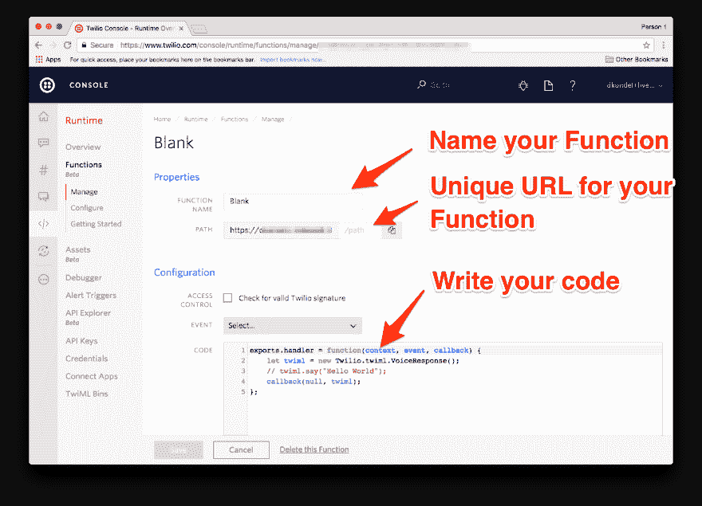
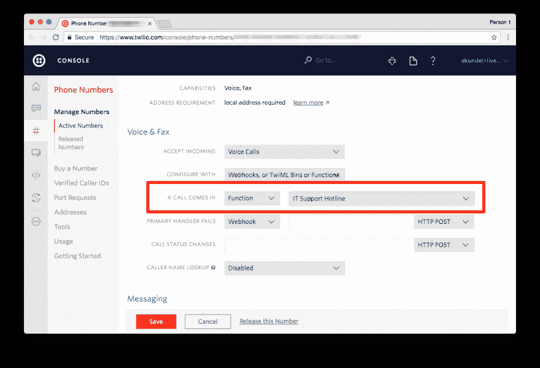

# 用 Twilio 函数和 JavaScript 构建 IT 群众应答机

> 原文：<https://dev.to/dkundel/building-the-it-crowd-answering-machine-with-twilio-functions-and-javascript>

*[用 Twilio 函数和 JavaScript 构建 IT 人群应答机](https://www.twilio.com/blog/2017/07/building-the-it-crowd-answering-machine-using-twilio-functions.html)最初发表于 2017 年 7 月 4 日 [Twilio 博客](https://www.twilio.com/blog)。*

* * *

我最喜欢的 IT 产品之一是他们的“Hello IT”机器。对于厌倦了一次又一次回答同样的 It 支持问题的懒人来说，这是一个完美的解决方案。有了 Twilio 功能和新的 T2 语音识别系统，我们只需几行代码就能打造出自己的版本。

如果你对 it 人群中的应答机不熟悉，请务必[看看这段 IT 活动的视频](https://www.youtube.com/watch?v=PtXtIivRRKQ)。

您也可以拨打以下电话号码之一查看最终结果:

*   在我们手下找一名随从
*   (415) 702-4376

在我们开始之前，请确保您有一个 Twilio 帐户。[免费报名](https://www.twilio.com/try-twilio)。

现在让我们开始编码吧！

[T2】](https://res.cloudinary.com/practicaldev/image/fetch/s--kKLc8BXG--/c_limit%2Cf_auto%2Cfl_progressive%2Cq_auto%2Cw_880/https://www.twilio.com/blog/wp-content/uploads/2017/07/9u-nebu3e4qL8G-_qBcUMw0hk7Ga5DQqyHXNfeBDSCsa3WMkscKAYWehJQZfEDcjn6G2kzzXacGjJ0eWDwvpDjBuhNmavXbYWK4jlOfrLZdB7JJQeiPOZ0DjDfnt0Cq4B4RAxika.png)

## 【你好它】

我们需要做的第一件事是创建一个新的 Twilio 函数来处理我们所有的请求。Twilio Functions 允许您直接在 Twilio 控制台中托管 Node.js 代码。你不需要启动自己的服务器。

要开始使用:

*   进入 Twilio 控制台的[运行时部分](https://www.twilio.com/console/runtime/overview)
*   点击[功能](https://www.twilio.com/console/runtime/functions/manage)
*   点击红色“+”并选择空白模板

您的屏幕应该是这样的:

[T2】](https://res.cloudinary.com/practicaldev/image/fetch/s--9rIsMaPL--/c_limit%2Cf_auto%2Cfl_progressive%2Cq_auto%2Cw_880/https://www.twilio.com/blog/wp-content/uploads/2017/07/ypsO9B0LZnKvuVuP-ylVhB3yGfmAPr-R3oindiEWxTBHSDEG1HTRQy18recs7By-FjEKUYbmSmyvB38tBMo4etbbT3E7e_y6pCg8MT-rNwAp223-jumasQAnHAVvVljRPHMoHZBr.png)

您看到的代码目前正在生成并返回一个空的 [TwiML](https://www.twilio.com/docs/api/twiml/) 响应。此外，我们可以选择命名我们的函数，并给它一个路径。每个帐户都有一个唯一的基本 URL，看起来像`fancy-badger.twil.io`，该路径用于区分您为您的帐户创建的功能。我将把我的命名为“IT 支持热线”，并将路径命名为`/it-support`。你可以给你的其他值，但要确保在整篇文章中相应地替换它。

在配置部分“传入语音呼叫”中选择事件，因为这是我们将使用此功能的事件。让我们从问候打电话的人“你好”开始。我们将选择英国口音，因为我们没有爱尔兰口音。所以你的热线听起来会更像莫斯接听而不是罗伊。将注释行改为以下代码:

```
exports.handler = function(context, event, callback) {
  let twiml = new Twilio.twiml.VoiceResponse();
  twiml.say({ voice: 'man', language: 'en-gb' }, 'Hello I.T.');
  callback(null, twiml);
}; 
```

确保保存您的功能。您可以通过在浏览器中找到您为此功能配置的 URL 来测试它是否有效。您应该会看到以下返回的代码:

```
<Response>
  <Say voice="man" language="en-gb">Hello I.T.</Say>
</Response> 
```

让我们将其配置为一个电话号码，以便能够对其进行全面测试。进入[电话号码部分](https://www.twilio.com/console/phone-numbers/incoming)，或者点击您想要配置的现有号码，或者[购买一个新的电话号码](https://www.twilio.com/console/phone-numbers/search)。进入配置屏幕后，在“语音&传真”部分选择“来电”值“功能”和 Twilio 功能的名称。

[T2】](https://res.cloudinary.com/practicaldev/image/fetch/s--anstBPbJ--/c_limit%2Cf_auto%2Cfl_progressive%2Cq_auto%2Cw_880/https://www.twilio.com/blog/wp-content/uploads/2017/07/CMrOly1uJrxfj7OssUp2QFm-d-qrn2qOMi9ExVXJ0uedwbb4wqghEic-DjgSH8wF1uMDzSXa55Rh7plJaceQnfQL5mkv798Ec2xfXMneDsQH_p5J7ont-BJTZfCCN5-PwKIrETTH.png)

保存更改并拨打您的电话号码。迎接你的应该是一个带着英国口音的男声说“Hello IT”。

[T2】](https://res.cloudinary.com/practicaldev/image/fetch/s--5Txeup5R--/c_limit%2Cf_auto%2Cfl_progressive%2Cq_auto%2Cw_880/https://www.twilio.com/blog/wp-content/uploads/2017/07/IwN_MiC7DQlX_aGN4zPkyv2OnXMI1648gsVfqZPCyLsIGh3ij8xIj-MZVx142sT_9IFiBAjz0jAGLahAfj4mpi7-RywFb-WLRrnB99fXEBJ0tuXsZDdqKb1sYh9lSBoGT9ZMn0G6.png)

## “你试过关机再开机吗？”

现在，让我们通过添加以下用户流来添加一些[语音识别](https://www.twilio.com/speech-recognition):

1.  用户会收到“你好”的问候
2.  系统等待用户说完他们所说的话
3.  系统会忽略所说的内容，并询问“您是否尝试过关闭并再次打开它？”
4.  如果用户在某处提到“谢谢”，我们会说“不客气，伙计！”。
5.  如果他们不说，我们再问同样的问题(因为很可能他们没有说过)。

为了使用语音识别，我们在 TwiML 中使用了[集合动词，并将输入设置为“speech”。我们还将把 action 属性设置为我们的 URL，这样当有结果时，Twilio 将再次调用这个函数，并附加一个查询参数，帮助我们以后添加更多的调用流。第一次调用这个函数时，用](https://www.twilio.com/docs/api/twiml/gather)[收集](https://www.twilio.com/docs/api/twiml/gather)的语音识别没有结果，所以我们返回问候。在随后对该函数的调用中，我们将获得一个`SpeechResult`参数，可作为`event.SpeechResult`访问，它包含 API 从语音中检索的文本。

适当更改您的功能代码:

```
exports.handler = function(context, event, callback) {
  let twiml = new Twilio.twiml.VoiceResponse();
  if (!event.SpeechResult) {
    twiml
      .gather({ input: 'speech', action: '/it-support?next=onoff' })
      .say({ voice: 'man', language: 'en-gb' }, 'Hello I.T.');
  } else if (event.SpeechResult.toLowerCase().indexOf('thank') !== -1) {
    twiml.say({ voice: 'man', language: 'en-gb' }, "You're welcome, mate.");
    twiml.hangup();
  } else {
    askOnOff(twiml);
  }
  callback(null, twiml);
};

function askOnOff(twiml) {
  twiml
    .gather({ input: 'speech', action: '/it-support' })
    .say(
      { voice: 'man', language: 'en-gb' },
      'Did you try turning it off and on again?'
    );
} 
```

保存功能中的更改，并再次拨打您的电话号码。它应该用“你好，它”来问候你，一旦你说了什么，它会一遍又一遍地问你是否试图关掉它，直到你说“谢谢”或“谢谢”。

[T2】](https://res.cloudinary.com/practicaldev/image/fetch/s--yWl8xpjh--/c_limit%2Cf_auto%2Cfl_progressive%2Cq_auto%2Cw_880/https://www.twilio.com/blog/wp-content/uploads/2017/07/ZxptNmL3bxUIenP7T2dadihimY_kgvSH9uueeYGwMQbk0ARQD4cSSBtCuU93qwwo7FnwJwP2nZBsCxwa2AOsSpa5v4Z7tVZ3vPh840aNS2Eva4vxvTMJ41-Z4yt-tbqH3fdNdFYs.png)

## “肯定插上了吗？”

一个重要的问题仍然是开放的。“肯定插上了吗？”。让我们补充一下，以防这个人对上一个问题回答“是”。将以下代码行添加到您的代码中:

```
exports.handler = function(context, event, callback) {
  let twiml = new Twilio.twiml.VoiceResponse();
  if (!event.SpeechResult) {
    twiml
      .gather({ input: 'speech', action: '/it-support?next=onoff' })
      .say({ voice: 'man', language: 'en-gb' }, 'Hello I.T.');
  } else if (event.SpeechResult.toLowerCase().indexOf('thank') !== -1) {
    twiml.say({ voice: 'man', language: 'en-gb' }, "You're welcome, mate.");
    twiml.hangup();
  } else if (event.next === 'plugged') {
    if (event.SpeechResult.toLowerCase().indexOf('yes') !== -1) {
      askPluggedIn(twiml);
    } else {
      askOnOff(twiml);
    }
  } else {
    askOnOff(twiml);
  }
  callback(null, twiml);
};

function askOnOff(twiml) {
  twiml
    .gather({ input: 'speech', action: '/it-support?next=plugged' })
    .say(
      { voice: 'man', language: 'en-gb' },
      'Did you try turning it off and on again?'
    );
}

function askPluggedIn(twiml) {
  twiml
    .gather({ input: 'speech', action: '/it-support' })
    .say({ voice: 'man', language: 'en-gb' }, 'Is it definitely plugged in?');
} 
```

不要忘记保存，您应该准备好再次去测试您的支持热线。

## 为他们做工作

我们已经完成了基本的电话答录机，但我们为什么不利用 Twilio 可编程语音来帮助来电者呢？我们可以在这里做一些非常复杂的事情，但现在让我们实际上再次询问他们的问题，并简单地将带有该问题的堆栈溢出搜索页面的链接发送给他们。

为此，我们还需要一个`gather`和一个发送短信的条件。将您的代码改为:

```
exports.handler = function(context, event, callback) {
  let twiml = new Twilio.twiml.VoiceResponse();
  if (!event.SpeechResult) {
    twiml
      .gather({ input: 'speech', action: '/it-support?next=onoff' })
      .say({ voice: 'man', language: 'en-gb' }, 'Hello I.T.');
  } else if (event.SpeechResult.toLowerCase().indexOf('thank') !== -1) {
    twiml.say({ voice: 'man', language: 'en-gb' }, "You're welcome, mate.");
    twiml.hangup();
  } else if (event.next === 'plugged') {
    if (event.SpeechResult.toLowerCase().indexOf('yes') !== -1) {
      askPluggedIn(twiml);
    } else {
      askOnOff(twiml);
    }
  } else if (event.next === 'problem') {
    askForProblem(twiml);
  } else if (event.next === 'solution') {
    const linkToStackOverflow =
      'https://stackoverflow.com/search?q=' +
      require('querystring').escape(event.SpeechResult);
    twiml.say(
      { voice: 'man', language: 'en-gb' },
      "Alright I found a few solutions. I'll send you an SMS with them. Bye."
    );
    twiml.sms(linkToStackOverflow);
  } else {
    askOnOff(twiml);
  }
  callback(null, twiml);
};

function askOnOff(twiml) {
  twiml
    .gather({ input: 'speech', action: '/it-support?next=plugged' })
    .say(
      { voice: 'man', language: 'en-gb' },
      'Did you try turning it off and on again?'
    );
}

function askPluggedIn(twiml) {
  twiml
    .gather({ input: 'speech', action: '/it-support?next=problem' })
    .say({ voice: 'man', language: 'en-gb' }, 'Is it definitely plugged in?');
}

function askForProblem(twiml) {
  twiml
    .gather({ input: 'speech', action: '/it-support?next=solution' })
    .say(
      { voice: 'man', language: 'en-gb' },
      'Alright what was your exact problem again?'
    );
} 
```

让您的电话号码再次振铃，并执行以下场景进行测试:

*   图书编目号码
*   回复“你好”
*   对关闭和再次打开的问题说“是”
*   对于插头是否插上的问题，说“是的，我插上了”
*   陈述一个你想寻找的问题
*   您应该会收到一条短信，其中包含堆栈溢出ðÿ'的链接

就是这样！不要忘记保存您的功能，一旦它重新启动，您的新 it 支持热线就可以分发给每个不断向您寻求帮助的人。

[T2】](https://i.giphy.com/media/XWRWrUOqs2Xpm/giphy.gif)

## 接下来是什么？

到目前为止，我们只使用了可编程语音的一些功能，这仅仅是开始。您可能还想了解一些其他功能:

*   使用 [`<Play />`](https://www.twilio.com/docs/api/twiml/play) 动词将 [`<Say />`](https://www.twilio.com/docs/api/twiml/say) 替换为来自 IT 人群的原始声音或您自己的录音，您可以将其存储在运行时的资产部分。
*   通过使用 StackOverflow 或 Google API 并发送链接到实际有用的结果，使用更智能的解决方案查找
*   通过电子邮件或 Slack 将实际问题发送给您。或许在你的系统里登记一张罚单？
*   将热线转接至[支持的其他语言之一](https://www.twilio.com/docs/api/twiml/gather#languagetags)。我很想听听你有什么样的想法，或者你是否建立了类似的东西，让你的生活更容易。如果您有任何问题，请给我发消息:

我很想听听你有什么样的想法，或者你是否建立了类似的东西，让你的生活更容易。如果您有任何问题，请给我发消息:

*   电子邮件:[dkundel@twilio.com](mailto:dkundel@twilio.com)
*   推特: [@dkundel](https://twitter.com/dkundel)
*   GitHub: [dkundel](https://github.com/dkundel)

[T2】](https://i.giphy.com/media/x5AlLBS6YmXUQ/giphy.gif)

* * *

*[用 Twilio 函数和 JavaScript 构建 IT 人群应答机](https://www.twilio.com/blog/2017/07/building-the-it-crowd-answering-machine-using-twilio-functions.html)最初发表于 2017 年 7 月 4 日 [Twilio 博客](https://www.twilio.com/blog)。*