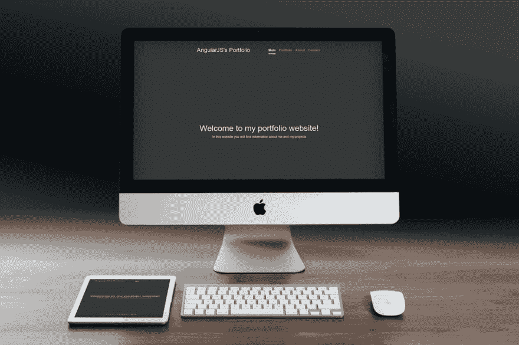
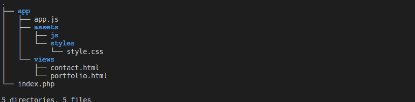
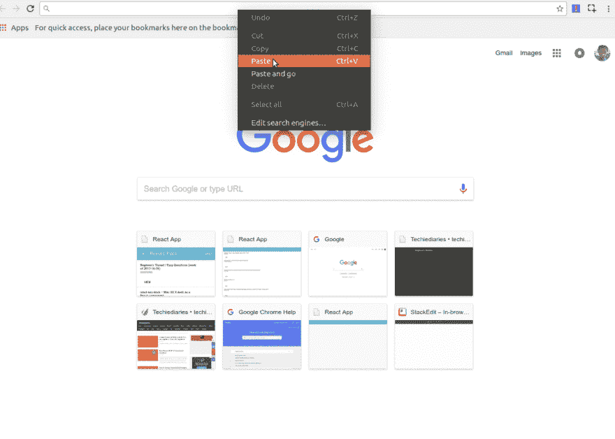
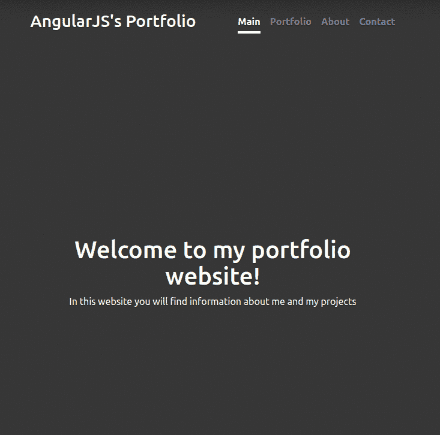

# 用 PHP 7 和 AngularJS 1.6+构建网站

> 原文：<https://dev.to/techiediaries/building-websites-with-php-7-and-angularjs-16-6f6>

[T2】](https://res.cloudinary.com/practicaldev/image/fetch/s--ALaWoXZH--/c_limit%2Cf_auto%2Cfl_progressive%2Cq_auto%2Cw_880/https://www.techiediaries.cimg/content/building-websites-php-angularjs.jpg)

在本教程中，你将一步一步地学习如何用简单的 PHP 7(接下来的教程将致力于高级框架，如 Symfony、Laravel 5 和 CodeIgniter)、MySQL 数据库、Bootstrap 4 和 AngularJS 框架来构建网站。

您将了解到 AngularJS，这是 Google 创建的 JavaScript 框架，涵盖了所有基础知识。您将学习如何使用 PHP 7、MySQL 和 AngularJS 1.6+从头开始构建一个简单的网站，接下来您将学习如何使用 PHP 7 API 在后端使用 AngularJS 在前端构建一个 CRUD web 应用程序。

*   AngularJS 简介
*   PHP 7 介绍(或 PHP 7 新特性)
*   Ajax 简介
*   教程和项目要求
*   PHP 7 和 AngularJS 的开发工具
*   第一个项目:用 PHP 7 和 AngularJS 1.6+建立一个单页应用程序(SPA)组合网站
    *   项目剖析(文件和文件夹)
    *   创造 index.php
    *   集成 Bootstrap 4 和 jQuery
    *   集成 AngularJS 1.6 和 AngularJS UI 路由器
    *   创建 AngularJS 应用程序模块(portfolioApp)
    *   使用 Angular UI 路由器添加路由(状态)和导航
    *   创建 HTML 模板或片段
    *   AngularJS 1.5+中的组件(而不是指令)
    *   创建 AngularJS 1.5+组件
    *   将状态直接链接到组件
*   第二个项目:用 PHP 7 和 AngularJS 1.6+构建一个 CRUD web 应用
    *   项目剖析
    *   如何整合角材料，Roboto 字体和自定义 CSS
    *   如何用 PHP 7 构建一个 CRUD API？
    *   如何用 AngularJS 获取数据？
    *   如何用 AngularJS 发布数据？
    *   如何用 AngularJS 创建或插入数据？
    *   如何用 AngularJS 读取或查找数据？
    *   如何用 AngularJS 删除数据？
    *   如何用 AngularJS 更新数据？
*   结论

## 安古拉吉斯简介

AngularJS 是 Google 创建的一个 JavaScript 框架，它允许你按照结构化的方法构建客户端 web 应用程序。它允许您使用普通 HTML 来编写模板，并通过编写可用作自定义 HTML 标签的组件或指令来扩展它。

AngularJS 是一个强大的框架，它利用了 MVC(**M**odel-**V**view-**C**controller)架构模式的变体。实际上，它是一个 MV*框架，是模型-视图的缩写——这意味着你可以在模型和视图之间创建任何类型的链接，如经典的控制器链接或模型视图，如 MVVM 模式等。模型是数据(即数据结构和变量或数据库)，视图是用户界面(即 HTML 模板)。

AngularJS 通过提供清晰简洁的语法(如`.controller()`和`.component()`等)帮助开发者轻松创建三个组件，即模型、视图或控制器。)然后负责透明地或者重新开始这些组件的交互，而不需要开发人员重新发明轮子。

AngularJS 允许开发人员使用普通的旧 HTML 来构建用户界面或视图，并通过编写 cutsom 标签来扩展 HTML 本身，这些标签可以像普通标签一样使用(如`<p>`或`<div>`)，使用指令。因此，AngularJS 鼓励代码重用，不要重复自己(枯燥)的概念，因为你可以编写一次指令，然后在项目或其他项目(组织为模块)的任何地方使用它们。

在 AngularJS 中，模型只是普通的旧 JavaScript 对象和变量，但有更多的功能，如**双向数据绑定**或俗称的**反应式编程**，这仅仅意味着当模型发生变化时，这些变化会自动反映在相关视图上，反之亦然。AngularJS 提供了特殊的对象，如`$scope`和`$rootScope`来连接模型和视图，这样一侧的变化就会在另一侧得到反映。

AngularJS 允许你用更少的代码做更多的事情，这样你就可以用更少的代码行创建一个全功能的带有数据绑定的 MVC web 应用。

AngularJS 代码非常易于维护，并且由于强大的特性，如**依赖注入**(或 DI)，它允许你创建服务，然后在任何你想使用它们的地方注入它们(即控制器和其他服务)。

## PHP 7 介绍(或者说 PHP 7 有哪些新特性？)

PHP 是构建网站和 web 应用程序最流行的服务器端语言。PHP 是一种脚本语言，由 Apache 等 web 服务器解释，可以嵌入到 HTML 中，然后在服务器上呈现。写这篇教程的时候 PHP 的更新版本是 **7.2** 。那么 PHP 7 有什么新特性呢？让我们来看看 5 大特点:

*   性能也叫速度。
*   更好的错误处理。
*   变量和函数的类型声明。
*   新的运营商，如飞船和零合并。

## Ajax 简介

AJAX 代表 **A** 同步 **Ja** vaScript 和 **X** ML，是一种使网页能够使用 JavaScript 从 web 服务器发送和接收数据而无需刷新的技术。

XML 代表 e **X** 可扩展的 **M** arkup **L** 语言，用于在互联网上或不同应用程序之间交换数据。异步意味着非阻塞，即当 Ajax 调用被发送时，你的网页继续正常工作，不需要等待数据或挂起，当数据被接收时，它得到显示。因此，概括一下，Ajax 是一种通过异步发送请求和获得响应，无需页面刷新，在 web 浏览器和 web 服务器之间进行通信的机制。

在 AngularJS 中，您可以使用 **$http** 服务来使用 Ajax。

## 教程和项目需求

本教程假设您已经设置好了 PHP 开发环境。如果没有！我们有一套专门针对这个主题的教程，所以一定要先遵循它们，这样你就可以为 PHP 和 AngularJS 开发准备好你的机器。

为了使用本教程的项目，您需要在您的开发机器上安装这些东西。

*   web 服务器:可以安装 Apache 或 Nginx(也可以使用内置的 PHP 7 服务器进行开发)。
*   PHP 7:你需要安装 PHP 7。
*   MySQL:您需要安装 MySQL 数据库管理系统，以便能够创建和使用数据库。

## PHP 7 和 AngularJS 的开发工具

## 第一个项目:用 PHP 7 和 AngularJS 1.6+搭建单页面应用(SPA)作品集网站

### 项目剖析(文件和文件夹)

我们的第一个项目有一个简单的目录结构

```
.
├── app
│ ├── app.js
│ ├── assets
│ │ ├── js
│ │ └── styles
│ │ └── style.css
│ └── views
│ ├── contact.html
│ └── portfolio.html
└── index.php 
```

Enter fullscreen mode Exit fullscreen mode

[T2】](https://res.cloudinary.com/practicaldev/image/fetch/s--zz64bdXe--/c_limit%2Cf_auto%2Cfl_progressive%2Cq_auto%2Cw_880/https://www.techiediaries.cimg/content/php7-angularjs16-project-structure.png)

*   *app* 文件夹包含所有客户端 app 源文件。
*   *app/assets* 文件包含样式和外部 JavaScript(如果有的话)文件。
*   *应用/视图*包含 AngularJS 应用的 HTML 视图或部分视图。
*   *app.js* 是 AngularJS 应用程序的主文件。
*   index 是我们项目的索引文件。

### 创造 index.php

创建一个`index.php`文件，然后复制并粘贴以下内容

```
<!doctype html>
<html>

<head> AngularJS's Portfolio </head>

<body></body>
</html> 
```

Enter fullscreen mode Exit fullscreen mode

### 集成 Bootstrap 4 和 jQuery

在`app/assets/styles`中创建一个`style.css`文件，然后复制粘贴以下样式:

```
/*
        * Globals
        */

        /* Links */

        a,
        a:focus,
        a:hover {
            color: #fff;
        }

        /* Custom default button */

        .btn-secondary,
        .btn-secondary:hover,
        .btn-secondary:focus {
            color: #333;
            text-shadow: none;
            /* Prevent inheritance from `body` */
            background-color: #fff;
            border: .05rem solid #fff;
        }

        /*
        * Base structure
        */

        html,
        body {
            height: 100%;
            background-color: #333;
        }

        body {
            color: #fff;
            text-align: center;
            text-shadow: 0 .05rem .1rem rgba(0, 0, 0, .5);
        }

        /* Extra markup and styles for table-esque vertical and horizontal centering */

        .site-wrapper {
            display: table;
            width: 100%;
            height: 100%;
            /* For at least Firefox */
            min-height: 100%;
            -webkit-box-shadow: inset 0 0 5rem rgba(0, 0, 0, .5);
            box-shadow: inset 0 0 5rem rgba(0, 0, 0, .5);
        }

        .site-wrapper-inner {
            display: table-cell;
            vertical-align: top;
        }

        .cover-container {
            margin-right: auto;
            margin-left: auto;
        }

        /* Padding for spacing */

        .inner {
            padding: 2rem;
        }

        /*
        * Header
        */

        .masthead {
            margin-bottom: 2rem;
        }

        .masthead-brand {
            margin-bottom: 0;
        }

        .nav-masthead .nav-link {
            padding: .25rem 0;
            font-weight: bold;
            color: rgba(255, 255, 255, .5);
            background-color: transparent;
            border-bottom: .25rem solid transparent;
        }

        .nav-masthead .nav-link:hover,
        .nav-masthead .nav-link:focus {
            border-bottom-color: rgba(255, 255, 255, .25);
        }

        .nav-masthead .nav-link+.nav-link {
            margin-left: 1rem;
        }

        .nav-masthead .active {
            color: #fff;
            border-bottom-color: #fff;
        }

        @media (min-width: 48em) {
            .masthead-brand {
                float: left;
            }
            .nav-masthead {
                float: right;
            }
        }

        /*
        * Cover
        */

        .cover {
            padding: 0 1.5rem;
        }

        .cover .btn-lg {
            padding: .75rem 1.25rem;
            font-weight: bold;
        }

        /*
        * Footer
        */

        .mastfoot {
            color: rgba(255, 255, 255, .5);
        }

        /*
        * Affix and center
        */

        @media (min-width: 40em) {
            /* Pull out the header and footer */
            .masthead {
                position: fixed;
                top: 0;
            }
            .mastfoot {
                position: fixed;
                bottom: 0;
            }
            /* Start the vertical centering */
            .site-wrapper-inner {
                vertical-align: middle;
            }
            /* Handle the widths */
            .masthead,
            .mastfoot,
            .cover-container {
                width: 100%;
                /* Must be percentage or pixels for horizontal alignment */
            }
        }

        @media (min-width: 62em) {
            .masthead,
            .mastfoot,
            .cover-container {
                width: 42rem;
            }
        } 
```

Enter fullscreen mode Exit fullscreen mode

然后更新`index.php`以包含来自 **MaxCDN** 和我们的`style.css`文件的**引导 4** 库。你也可以下载这个库并把它放在`app/assets/styles`文件夹中。请注意，Bootstrap 也需要包含 jQuery。

```
<!doctype html>
<html>

<head>

    <link rel="stylesheet" href="https://maxcdn.bootstrapcdn.com/bootstrap/4.0.0-alpha.6/css/bootstrap.min.css" integrity="sha384-rwoIResjU2yc3z8GV/NPeZWAv56rSmLldC3R/AZzGRnGxQQKnKkoFVhFQhNUwEyJ"
        crossorigin="anonymous">
    <link rel="stylesheet" href="app/assets/styles/style.css"/>    
</head>

<body>

    <div class="site-wrapper">

        <div class="site-wrapper-inner">

            <div class="cover-container">

                <div class="masthead clearfix">
                    <div class="inner">
                        <h3 class="masthead-brand">AngularJS's Portfolio</h3>
                        <nav class="nav nav-masthead">

                        <!-- NAVIGATION_PLACEHOLDER --> 
                        </nav>
                    </div>
                </div>

                <div class="inner cover">

                    <!-- UI_VIEW_PLACEHOLDER -->    

                </div>

                <div class="mastfoot">
                    <div class="inner">
                        <p>Cover template for
                            <a href="https://getbootstrap.com">Bootstrap</a>, by
                            <a href="https://twitter.com/mdo">@mdo</a>.</p>
                    </div>
                </div>

            </div>

        </div>

    </div>

    <ul>

    </ul>

    <script src="https://code.jquery.com/jquery-3.1.1.slim.min.js" integrity="sha384-A7FZj7v+d/sdmMqp/nOQwliLvUsJfDHW+k9Omg/a/EheAdgtzNs3hpfag6Ed950n"
        crossorigin="anonymous"></script>
    <script src="https://cdnjs.cloudflare.com/ajax/libs/tether/1.4.0/js/tether.min.js" integrity="sha384-DztdAPBWPRXSA/3eYEEUWrWCy7G5KFbe8fFjk5JAIxUYHKkDx6Qin1DkWx51bBrb"
        crossorigin="anonymous"></script>
    <script src="https://maxcdn.bootstrapcdn.com/bootstrap/4.0.0-alpha.6/js/bootstrap.min.js" integrity="sha384-vBWWzlZJ8ea9aCX4pEW3rVHjgjt7zpkNpZk+02D9phzyeVkE+jo0ieGizqPLForn"
        crossorigin="anonymous"></script>

</body>

</html> 
```

Enter fullscreen mode Exit fullscreen mode

### 集成 AngularJS 1.6 和 AngularJS UI 路由器

现在，我们需要包含 AngularJS 1.6 库和 UI 路由器，以将路由添加到我们的 SPA(单页应用程序)组合网站。

因此，请继续更新`index.php`以包含这些更改:

*   包括`</body>`之前 Google CDN 的 AngularJS 和 Angular UI 路由器库。你也可以下载并把它们放在`app/assets/js`文件夹中。不要忘了包括`app.js`，它将托管 AngularJS 应用程序。

```
<script src="https://ajax.googleapis.com/ajax/libs/angularjs/1.6.6/angular.min.js"></script>
    <script src="https://unpkg.com/@uirouter/angularjs/release/angular-ui-router.js"></script>
    <script src="app/app.js"></script> 
```

Enter fullscreen mode Exit fullscreen mode

*   用我们稍后将在`app/app.js`中创建的主要 AngularJS 模块的名称添加`ng-app`。这是引导 AngularJS 应用程序所必需的。

```
<body ng-app="portfolioApp"> 
```

Enter fullscreen mode Exit fullscreen mode

### 创建 AngularJS 应用模块(portfolioApp)

现在是时候创建实际的 Angular 应用程序了。在`app`文件夹中创建一个`app.js`文件，然后复制并粘贴下面的代码:

```
var portfolioApp = angular.module('portfolioApp', ['ui.router']); 
```

Enter fullscreen mode Exit fullscreen mode

### 使用 Angular UI 路由器添加路由(状态)和导航

现在让我们配置我们的应用程序，为 UI 路由器指定不同的应用程序状态。

```
portfolioApp.config(function ($stateProvider,$urlRouterProvider) {

    var mainState = {
        name: 'main',
        url: '/',
        template: '<h1>Welcome to my portfolio website!</h1><p>In this website you will find information about me and my projects</p>'
    }

    var portfolioState = {
        name: 'portfolio',
        url: '/portfolio',
        templateUrl: 'app/views/portfolio.html'
    }
    var contactState = {
        name: 'contact',
        url: '/contact',
        templateUrl: 'app/views/contact.html'
    }

    var aboutState = {
        name: 'about',
        url: '/about',
        template: "<h1>About Me</h1><p>I'm a web developer and entrepreneur with 3+ years of experience</p>"
    }

    $stateProvider.state(mainState);
    $stateProvider.state(portfolioState);
    $stateProvider.state(contactState);
    $stateProvider.state(aboutState);
    $urlRouterProvider.otherwise('/');

}); 
```

Enter fullscreen mode Exit fullscreen mode

在`<!-- NAVIGATION_PLACEHOLDER -->`下面粘贴以下链接添加导航:

```
<a class="nav-link" ui-sref="main" ui-sref-active="active">Main</a>
<a class="nav-link" ui-sref="portfolio" ui-sref-active="active">Portfolio</a>
<a class="nav-link" ui-sref="about" ui-sref-active="active">About</a>
<a class="nav-link" ui-sref="contact" ui-sref-active="active">Contact</a> 
```

Enter fullscreen mode Exit fullscreen mode

`ui-sref`自定义属性由 UI 路由器提供，它类似于`href`属性，但它链接到状态，而不是 URL。

在`<!-- UI_VIEW_PLACEHOLDER -->`下面粘贴下面的 UI 路由器指令:

```
<ui-view></ui-view> 
```

Enter fullscreen mode Exit fullscreen mode

在这个指令中，UI 路由器通过路由器的状态呈现链接到当前路由的 HTML 模板。

您也可以使用以下替代语法:

```
<div ui-view></div> 
```

Enter fullscreen mode Exit fullscreen mode

### 创建 HTML 模板或片段

接下来在`app/views/`的
中创建`portfolio.html`和`contact.html`

```
<h1>
    Contact
</h1>

<h1>
    My Portfolio
</h1> 
```

Enter fullscreen mode Exit fullscreen mode

我们在`views`中只创建了两个模板，因为我们在其他路线中使用了内嵌模板。

现在，您应该有一个简单的 SPA 和基本的路由。

您可以使用 PHP 内置服务器在本地为网站提供服务

```
php -S 127.0.0.1:8000 
```

Enter fullscreen mode Exit fullscreen mode

[T2】](https://res.cloudinary.com/practicaldev/image/fetch/s--Ma6CB91q--/c_limit%2Cf_auto%2Cfl_progressive%2Cq_66%2Cw_880/https://www.techiediaries.cimg/content/angularjs-php7-basic-nav.gif)

现在让我们看看更高级的 AngularJS 概念，即组件、控制器和服务。

### AngularJS 1.5+中的组件(代替指令)

在 AngularJS 1.5+中，你可以使用基于组件的架构来构建应用。组件是旧 AngularJS 指令的语法糖，具有通用的默认值和许多改进，允许您创建自己的自定义 HTML 元素。

组件模型鼓励关注点的分离、封装和最大的可重用性原则，您可以将您的应用程序构建为一组包含根组件和子组件的组件。

在本节中，我们将看到:

*   Angular 1.5 中引入的 AngularJS 组件。
*   如何在 Angular UI-Router 中直接链接 AngularJS 1.5+组件？
*   如何访问组件中已解析的状态数据？
*   如何在布线(父和子)元件之间进行通信？

AngularJS 1.5 组件是一段可重用的代码(JavaScript 和 HTML)，它封装了行为和视图。

*   组件是独立的，
*   组件有自己独立的范围，
*   组件不访问父组件`$scope`，
*   一个组件有许多生命周期事件。

组件通过输入(使用显式数据绑定)和输出(使用显式事件绑定)与其他组件通信。

这些是使用 AngulatJS 1.6+(或 1.5+)构建基于组件的应用程序需要遵循的步骤

首先，创建一个`.component()`，它有一个模板和一个控制器(通常在 UI-Router 状态定义中使用)。

通过链接到相应的组件来创建路线的状态定义。

为组件创建模板，并通过组件的`template`或`templateUrl`属性链接到它们。

在组件`controller`上声明变量和函数(使用`this`

使用`$ctrl`从组件模板中引用组件的控制器

使用单向数据绑定(即

AngularJS UI-Router 允许将状态/视图定义为 url、模板/模板 Url 和控制器的组合，或者 url 和组件的组合。

模板可以定义为原始模板(通过`template`属性)或模板路径(使用`templateUrl`属性)

### 创建 AngularJS 1.5+组件

这里有一个在 AngularJS
中定义状态的老方法的例子

```
.state('portfolio', {
  url: '/portfolio',
  templateUrl: 'views/portfolio.html',
  controller: 'PortfolioController',
  resolve: {
    projects: function(PortfolioService) {
      return PortfolioService.findAll();
    }
  }
}); 
```

Enter fullscreen mode Exit fullscreen mode

这仍然有效，但是因为我们使用现代组件模型方法，我们将使用组件来代替。

```
.state('portfolio', {
  url: '/portfolio',
  component: 'portfolio',
  resolve: {
    projects: function(PortfolioService) {
      return PortfolioService.findAll();
    }
  }
}); 
```

Enter fullscreen mode Exit fullscreen mode

模板和控制器在组件的定义中指定。

### 创建 AngularJS 1.5+组件

从我们的投资组合应用程序之前的结构中，我们可以看到我们可以创建 4 个组件。

*   *组合*组件链接到*组合*状态
*   *配置文件*组件链接到*关于*状态
*   *触点*组件链接到*触点*状态
*   *主*组件链接到*主*状态

目前，所有组件都将直接在应用程序上使用静态的硬编码数据。稍后将改变我们的代码，从 PHP 服务器获取动态数据。

这是我们的*投资组合*组成部分
的一个例子

```
.component('portfolio', {
        bindings: {

        },

        controller: function (PROJECTS) {

            //define component's behavior here by linking methods and variables to this.
            this.projects = PROJECTS;

            console.log(this.projects);
        },
        template: `
        <h1>Portfolio</h1>
        <div ng-repeat="project in $ctrl.projects"> 
            <h2 >

            </h2>
            <p>

            </p>
        </div>

    `
    }); 
```

Enter fullscreen mode Exit fullscreen mode

另外，不要忘记声明一个常量来保存项目。

```
portfolioApp.constant('PROJECTS',[

   {name:"Project 1" , description: "Project 1 description"},
   {name:"Project 2" , description:"Project 2 description"},

]); 
```

Enter fullscreen mode Exit fullscreen mode

您可以通过使用`$ctrl`而不使用`controllerAs`属性来访问模板中的控制器。

单向绑定(项目)被绑定到`$ctrl`。

您可以使用 ES6 多行字符串来定义多行模板。

您可以像使用任何其他 HTML 元素一样使用您的组件:

```
<portfolio projects="$parent.projects"></portfolio> 
```

Enter fullscreen mode Exit fullscreen mode

让我们创建*概要文件*组件

```
.component('profile', {
  bindings: {

  },

  controller: function() {
  },
  template: `
    <h1>Profile</h1>
    I'm a web developer and entrepreneur with 3+ years of experience.
  `
}); 
```

Enter fullscreen mode Exit fullscreen mode

让我们创建*联系人*组件

```
.component('contact', {
  bindings: {

  },

  controller: function() {
      this.contactMe = function(){
          alert("Thanks!");
      }
  },
  template: `
    <h1>Contact</h1>
    <form ng-submit="$ctrl.contactMe()" >
    <div class="form-group">
        <label for="yourName">Your Name</label>
        <input type="text" class="form-control" id="yourName" placeholder="Enter name">

        <label for="yourMessage">Your Message</label>
        <textarea style="height:100px;" class="form-control" id="yourMessage" placeholder="Enter message"></textarea>

        <label for="emailAddr">Your Email address</label>
        <input type="email" class="form-control" id="emailAddr" aria-describedby="emailHelp" placeholder="Enter email">
        <small id="emailHelp" class="form-text text-muted">We'll never share your email with anyone else.</small>
    </div>

    <button type="submit" class="btn btn-primary">Submit</button>
    </form>
  `
}); 
```

Enter fullscreen mode Exit fullscreen mode

让我们创建*主*组件

```
.component('main', {
  bindings: {

  },

  controller: function() {
  },
  template: `
    <h1>Welcome to my portfolio website!</h1>
    In this website you will find information about me and my projects
  `
}); 
```

Enter fullscreen mode Exit fullscreen mode

现在，由于应用程序并不复杂，我们可以在`app.js`中声明组件，没有任何问题。稍后我们将看到如何为每个组件创建一个 JavaScript 文件。

### 将状态直接链接到组件

我们可以声明性地使用任何组件，就像任何其他 HTML 标签一样指定其名称，但是在我们的例子中，因为所有组件都是顶级的，所以我们可以将它们直接链接到路由。

因此，继续在`app.js`中更新你的应用状态，以反映新的变化

```
var mainState = {
        name: 'main',
        url: '/',
        component : 'main'
    }

    var portfolioState = {
        name: 'portfolio',
        url: '/portfolio',
        component : 'portfolio'
    }
    var contactState = {
        name: 'contact',
        url: '/contact',
        component : 'contact'
    }

    var aboutState = {
        name: 'about',
        url: '/about',
        component : 'profile'
    } 
```

Enter fullscreen mode Exit fullscreen mode

[T2】](https://res.cloudinary.com/practicaldev/image/fetch/s--AbOO-mEF--/c_limit%2Cf_auto%2Cfl_progressive%2Cq_66%2Cw_880/https://www.techiediaries.cimg/content/angularjs-php7-basic-nav2.gif)

## 结论

在本教程中，我们创建了一个带有 PHP 7 后端的现代 AngularJS (1.5+)应用程序。

我们已经看到了组件、控制器、模板和服务等概念。我们还看到了如何使用 Angular UI-Router 为我们的 SPA 组合网站创建不同的路线。