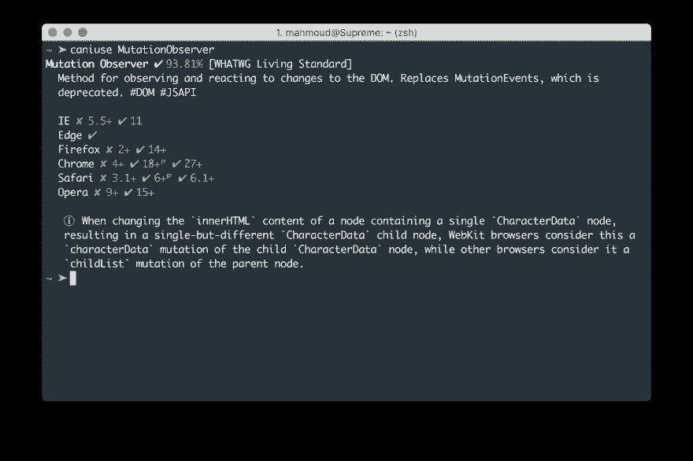

# 我可以使用的 cli 节点包

> 原文：<https://dev.to/mahmoudelmahdi/cli-node-package-for-caniuse-48b>

**命令行界面**用于[的节点包可以使用](https://caniuse.com)，一个浏览器支持表，用于在您的终端中支持前端 web 技术。

#### 安装

适用于 npm 和纱线的包装:

```
~ npm install caniuse-cli
# or 
~ yarn add caniuse-cli 
```

Enter fullscreen mode Exit fullscreen mode

#### 用法

[T2】](https://res.cloudinary.com/practicaldev/image/fetch/s--Am-mOvEc--/c_limit%2Cf_auto%2Cfl_progressive%2Cq_auto%2Cw_880/https://thepracticaldev.s3.amazonaws.com/i/ri5mt624s9x7hlb4ieb1.png)