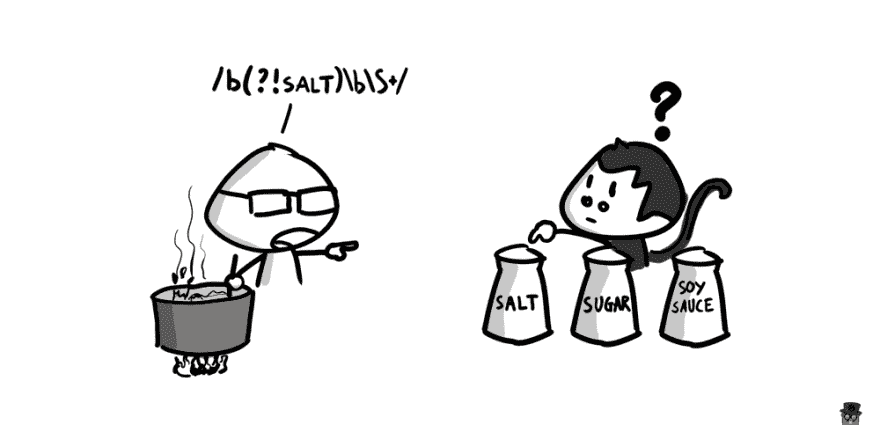

# 编码器的生活漫画 003:正则表达式

> 原文：<https://dev.to/huytd/coders-life-comic-003-regex-ab4>

在ðÿ˜‚项目中过度使用正则表达式的风险

[T2】](https://res.cloudinary.com/practicaldev/image/fetch/s--0q9wC5HK--/c_limit%2Cf_auto%2Cfl_progressive%2Cq_auto%2Cw_880/https://thepracticaldev.s3.amazonaws.com/i/v80sccjuqgcq71a22wpm.png)