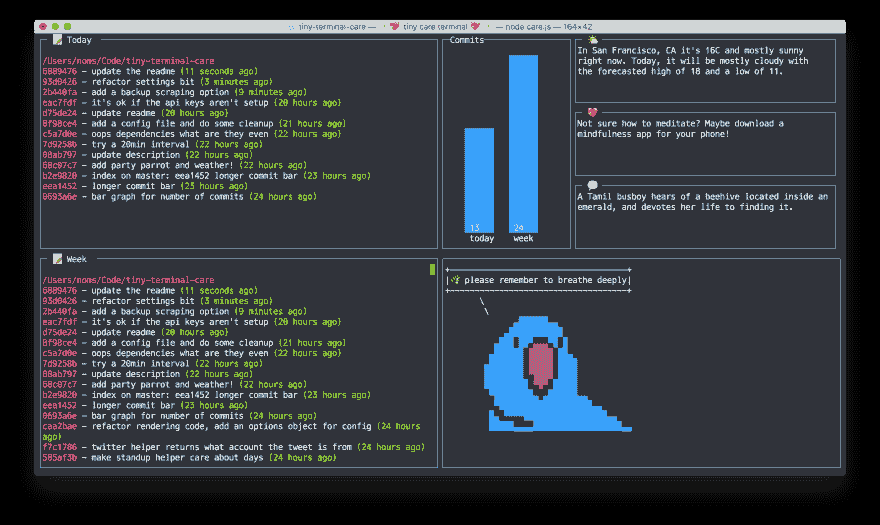

# 小心编码

> 原文：<https://dev.to/thetuftii/coding-with-care>

我喜欢认为自己是一个努力工作的人，每天工作 14 个小时，除此之外，我还从事软件开发工作，帮助我的未婚妻做机器人生意，并在当地的 BMX 俱乐部做社区志愿者。我很少完全放松和冷静下来。我是第一个承认这不健康的人，我经常担心自己会筋疲力尽，我不喜欢这种事情发生得太频繁了。

在 2017 年的前 4 个月，在一系列截止日期、周末活动、医院旅行、成为一名合格的自行车教练以及重新设计几个网站之后，我发现自己坐在医生的手术室里感觉不太好。由于我的医生来晚了，我在 [the Verge](http://www.theverge.com/2017/4/20/15331050/party-parrot-tweet-monica-dinculescu-terminal-self-care-github) 上看到了一篇有趣的文章，结合了正念和编码。
 
谷歌开发者 [Monica Dinculescu](https://twitter.com/notwaldorf) 设计了可爱的 [Tiny Care 终端](https://github.com/notwaldorf/tiny-care-terminal)，使用曾经很棒的 Party Parrot 来帮助将有用的正念语录和建议传递到你的终端窗口，温柔地提醒你在编码时要照顾好自己。

在某种程度上，我们都有一种负罪感，那就是焊接在我们的办公桌上，盯着 emacs(其他编辑也可用)看，看起来好像是永恒的，同时以一种尴尬的姿势瘫倒在一堆，喝下第 8 杯咖啡，徒劳地希望嗡嗡声会让我们更接近[鲍尔默巅峰](https://xkcd.com/323/)(不要喝酒和给孩子编码)，我们最终会修复困扰我们几天的任何错误。

[T2】](https://res.cloudinary.com/practicaldev/image/fetch/s--CWGA3Ax4--/c_limit%2Cf_auto%2Cfl_progressive%2Cq_auto%2Cw_880/https://imgs.xkcd.com/comics/ballmer_peak.png)

但是有了 [Party Parrot](http://cultofthepartyparrot.com/) 在身边提醒你深呼吸，练习一些正念技巧，给自己一个休息的机会，我们都可以更好地照顾自己，并试图从专业编码变得过于紧张的时候释放压力。最终感觉更好，编码更有效。虽然压力有时可能是一件有用的事情，但过多的压力会阻止我们清晰理性地思考，有可能为未来的自己制造错误。

微型关怀终端从三个 Twitter 机器人账户中提取提示，关怀机器人 [@tinycarebot](https://twitter.com/tinycarebot) 、 [@selfcare_bot](https://twitter.com/selfcare_bot) 和神秘的讲故事机器人 [@MagicRealismBot](https://twitter.com/magicrealismbot) ，并将它们与待办事项、已完成事项和提交清单一起显示在终端窗口中。如果您喜欢不同风格的邮件，您可以更改用于建议的 bot 帐户。虽然我们大多数人都有 Twitter 账户，但我们不会粘在我们的订阅上捕捉每一条发布的推文，所以收集一些有帮助的关心推文并把它们放在我们整天都在看的地方只是提醒我们从屏幕上抬起头来呼吸一秒钟。

由于我仍然坐在医生的候诊室里(她现在已经迟到了 50 分钟)，我还没有机会真正尝试这个小小的护理终端，但我一回到办公桌前就跑去 Github 拿它。不跑了...但是闲逛和深呼吸:)
 
还有人有什么不同的技巧可以在编码时放松吗？或者有助于缓解压力的日常工作？我很想在评论中听到他们。