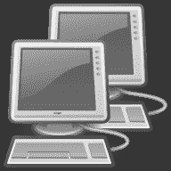

# 没有谷歌的编码

> 原文：<https://dev.to/fenbf/coding-without-google>

前段时间 Reddit 上出现了一篇耐人寻味的文章:[“有经验的程序员会经常使用 Google 吗？”](http://codeahoy.com/2016/04/30/do-experienced-programmers-use-google-frequently/)。作者讨论了专家程序员是否比新手程序员更经常使用 google。他提到使用谷歌其实是一件好事。它有助于找到最佳解决方案，验证想法，加速开发。如今，谷歌似乎是任何开发者工具箱中至关重要的一部分。那让我想起了过去的时光。

这篇文章最初发表在我的博客: [Bartek 的编码博客:没有 Google 的编码](http://www.bfilipek.com/2016/05/coding-without-google.html)

[T2】](https://res.cloudinary.com/practicaldev/image/fetch/s---5xnM5qq--/c_limit%2Cf_auto%2Cfl_progressive%2Cq_auto%2Cw_880/https://1.bp.blogspot.com/-o5-byLlo8TM/V0Z_nWLcvTI/AAAAAAAACp4/M1xxsCO7cOYL8JtGYBgjk4bvrMLm4Dz0gCKgB/s1600/pcbw.png)

## 一台旧电脑

当我大约 14 岁的时候(2000 年)，我得到了我的第一台电脑。当时的规格相当不错。如果我没记错的话，它是赛扬 500 兆赫，也许 256 兆内存，20gb 硬盘，丽娃 tnt2 万塔。更重要的是，没有网络连接！我的一些朋友得到了他们的 56k 调制解调器，但这并不常见。而且，那时候上网相对来说很贵...更不要说巨大的下载速度！:)

玩了一些游戏后，开始看一些编程书籍，尝试 C++语言。我实际上想创造游戏，而不是玩游戏...尤其是图形。没有互联网连接，我无法谷歌教程或解决方案。有那么可怕吗？

## 旧工作流程

那时候我是怎么熬过那些日子的！？老实说，没那么糟。

我使用的第一个编译器是 Borland C++和一个很好的 Windows IDE。我在 24 小时内买了 Jessie Liberty 的 C++，我立刻被那里能找到的所有编程思想吸引住了。我读了这本书，试图重现例子，修改它们，写下我的想法。第 19 章是关于列表数据结构的。我记得当我理解它背后的原理时，我为自己感到非常自豪！我可以专注于那本书和学习。

然后我开始做图形。首先，`<conio.h>`为主机应用程序提供了令人惊叹的色彩模式！在那之后，我从名为 **BGI** - [Borland 图形接口](https://en.wikipedia.org/wiki/Borland_Graphics_Interface)的库中发现了`<graphics.h>`头文件。现在，我真的可以玩单个像素，使用超过 16 种颜色！我了解了什么是更新循环模式，以及为什么它是如此强大的技术。在此之前，如果在这个过程中有一个导弹动画，我在屏幕上的宇宙飞船就会冻结。我可以只关注库。

一两年后我的工作流程更新了。我时常去网吧，我们在学校也有联系。最终，我为我的家用电脑买了一个调制解调器！我不会撒谎说我没有花太多时间没有效率。只是浏览网页。但与我们目前的状态相比，这仍然是一次有限的经历。一个小时的浏览费用仍然很高。没有脸书、推特或其他社交媒体。我经常下载带有教程的页面，以便以后可以离线阅读。

在某个时候，我偶然发现了一个很棒的库，叫做 Allegro！这是我开发经历中的又一个突破！我花了很多时间在图书馆写代码。在对 API 有点熟悉之后，我开始意识到我的想法——那时我有很多想法。相机移动的路径越来越复杂会有问题吗？我只是坐下来，试着理解这个问题，用很多纸，做实验...最后，它开始工作了。继续下去，直到所有的想法都处于一个体面的状态。你最近可以看到我对 Matrix 的[更新，这个演示是在半离线时代制作的。
**我可以专注于我的想法**。但是一些干扰开始出现。](http://www.bfilipek.com/2016/03/the-matrix-updated.html)

在 Allegro 之后我学习了 OpenGL 1.1/1.2。那时，我或多或少有完全的网络连接。我的工作流程没有根本改变。我可以专注于代码和图形。尽管如此，还是有很多在线激励措施。

部分离线的主要优势是什么？我可以更好地专注于我的任务。

## 新建工作流

今天会是什么样子？

我希望你不要这样做，但有时在我的业余时间，我会坐在我的电脑前，实现一些伟大的想法。然后，我没有这样做，而是浏览网络，查看状态。幸运的是，更多时候我试图阻止它，并开始我计划的任务(该任务仍然可以是一些在线活动)。

但是我们不要这么悲观！有了互联网，我可以接触到大量的好内容。一些奇怪技术需要的教程？在地址窗口输入就可以了。一个编程问题的解决方案？去 StackOverflow。需要一些编程/软件新闻:去 Reddit。

根据您使用的技术，您可能需要更多或更少的网络资源。例如，我不想象去一些离线的 MSDN 文档(我记得在 VS 的早期版本中安装了它！).现在我只需输入“msdn:……”并访问一个在线网站。

外面有成千上万的好东西，稍微抵制一下所有的干扰是值得的。我想知道如果我有今天的网络连接，我是否会学到同样的东西。

## 教训

在那些离线(或半离线)的日子里，我是不是慢了一些？ide 没有那么先进，所以当我想调用一个函数时，我可能需要查看它的文件头。在 IDE/Library 的帮助下，我可以在 pdf/chm 中快速找到它。所以并没有那么慢...

我相信我过去的线下经历是一件好事。我可以更好地专注于想法和代码。现在，有这么多的干扰，你需要更好的抵抗和自律。

**教训:**也许时不时断开连接，离线也是好的？我们能不能只编码，在流程中更快一点？

*   你想工作的时候会切断连接吗？
*   你是如何与网上的杂念做斗争的？

## 更多来自作者

Bartek 最近出版了一本书-[《C++ 17 详解》](https://leanpub.com/cpp17indetail?utm_source=devto&utm_campaign=offgoogle)可从@Leanpub 获得-与其阅读论文和 c++规范草案，不如用这本书以高效实用的方式学习新标准。