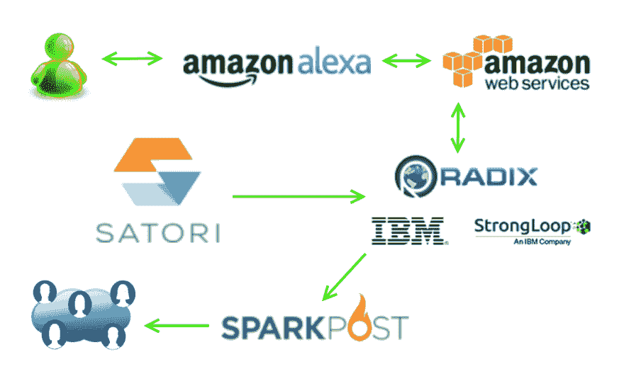

# 社区聚焦:用这种 Alexa 技能崛起和闪耀

> 原文：<https://dev.to/sparkpost/community-spotlight-rise-and-shine-with-this-alexa-skill>

### 不喜欢早上？这个 Alexa 技能有！

老实说，我不是一个早起的人。关于这一点，人们开起了玩笑，[咖啡聚会](https://twitter.com/mary_grace/status/892878594539528192)是常事，我可能让我的[搭档](https://twitter.com/jermops/status/831587966615056384)和我的一些[同事](https://twitter.com/aydrianh/status/843930609852530688)沉迷于咖啡……但那是另一个故事了。有一种东西让我不得不做所有家务，这让我想在被子里钻得更深。这样我可以兴奋地醒来，准备好面对新的一天。

输入 [MyMorning。在线](http://mymorning.online/)，来自 [AngelHack 硅谷](http://angelhack.com/angelhack-global-hackathon-series-silicon-valley/)的 SparkPost 大奖获得者。卢，拉图和乔恩一起建立了一个 Alexa 技能，解决了这个问题的一部分。

[T2】](https://res.cloudinary.com/practicaldev/image/fetch/s--t2x-wNYM--/c_limit%2Cf_auto%2Cfl_progressive%2Cq_auto%2Cw_880/https://media.sparkpost.com/uploads/2017/08/avi-mymorning.jpg)

### 告诉我更多

我和乔恩坐在一起，他是我的一个早晨。在线团队成员，在黑客马拉松后谈论他们的项目。

谁构成了我的早晨。线上团队？

我们是一个由来自不同背景的 3 名开发人员组成的团队。Lou 是 Android 和 Alexa 开发人员，Ratu 是应用工程师，而我(Jon)是全栈开发人员。

告诉我关于我的早晨！

我们努力设计一个免提应用程序，当人们试图开始新的一天时，它将缓解他们繁忙的早晨。我们试图将多种技术结合起来，将它们整合起来，这样它们就可以很容易地融合在一起。

请告诉我更多关于您选择集成的技术的信息。它们是什么？

我们使用 Satori 来获取实时流加密货币和 BART(湾区快速公交)数据。为了将 Alexa 链接到 Satori，我们使用 IBM 的 LoopBack 产品集成了一个自定义 API，该产品从一个由 Satori 流不断更新的数据库中获取最新信息。这使得 Alexa 的 Lambda 流能够在用户查询系统和 API 提供响应时正常运行。

我们通过 Wemo Wifi 迷你智能插头操作咖啡机的开/关控制器，使用 IFTTT 触发智能插头。

最后，我们使用 SparkPost 向 Crypto Club 发送了一封包含当前市场数据的电子邮件。SparkPost API 简单明了，可以轻松快速地适应。我们的早晨。Online project 能够快速设置发件人域和电子邮件分发列表，然后使用适当的 JSON 数据参数调用 SparkPost API。我们第一次测试的时候就成功了！我们希望通过加入一些 CSS 驱动的交互性来增强电子邮件，并就如何实现该功能咨询了 [Avi](https://twitter.com/theavigoldman) ，但我们没有时间了，所以这将在第二阶段进行。

[T2】](https://res.cloudinary.com/practicaldev/image/fetch/s--qHRNFfFM--/c_limit%2Cf_auto%2Cfl_progressive%2Cq_auto%2Cw_880/https://media.sparkpost.com/uploads/2017/08/flow.png)

在培养 Alexa 技能的过程中，你遇到了哪些挑战？

第一个挑战围绕着 Alexa 和 Satori 的整合。Satori 作为 streamer 产品的优势之一是它可以适应需要推送通知的应用程序。但是现成的 Alexa Lambda 平台不允许推送通知，至少从我们最初的研究来看是这样。我们认为可以通过定制的 AWS 客户端服务器设置来实现，但这需要更多的时间来构建。

第二个挑战是 Wemo WiFi 迷你智能插头。我们使用 IFTTT 来触发智能插头，尽管 IFTTT 命令一直发出，但 Wemo 产品并不总是打开。这些随机出现的问题总是很难解决，每个开发人员都不得不在某个时候处理它们。此外，在 AngelHack 事件中使用的两座建筑中，有一座建筑的插头无法连接到 WiFi，因此也产生了一些问题。在演示过程中，我们一直祈祷好运，因为在最终演示之前，我们没有足够的时间来确定这些问题的原因，幸运的是，一切都很好！

### Alexa，告诉我谁是赢家

我们喜欢我的早晨的创造力。线上团队。他们解决了大量的集成问题，并使用了如此多不同的 API 来将一切整合在一起。使用 [SparkPost](https://www.sparkpost.com/) 向他们的密码俱乐部发送每日更新简直是锦上添花！

你一直在玩什么项目？我们很想听听你是如何整合 SparkPost 的，并在博客上介绍你。请在下面留下评论或在[社区空闲时间](http://support.slack.com)联系我们。我们总是想听听你在做什么了不起的东西。

快乐修补！

*本帖最初发表于[sparkpost.com](https://www.sparkpost.com/blog/community-spotlight-alexa-skill/)T3】*