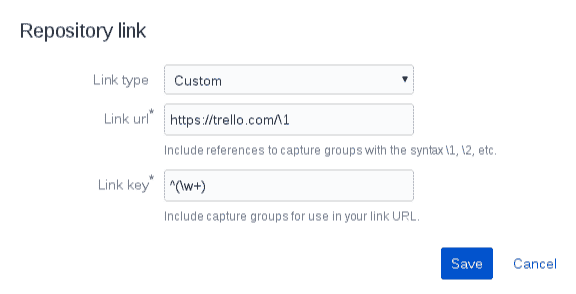

# 使用不同的问题跟踪器连接位存储桶提交消息

> 原文：<https://dev.to/rmnvsl/connect-bitbucket-commit-messages-with-different-issue-tracker-416>

Bitbucket 不仅可以链接问题和提交消息，还可以与外界联系。让我们看看如何使用不同的问题跟踪工具创建连接。

* * *

我经常喜欢浏览程序或应用程序的设置，尝试每一个可能的功能，看看有什么可以调整。在我工作的[公司](http://www.nesskdc.sk/)中，我们大量使用 Bitbucket 为我们地区的[非营利组织开发项目，同时也是我们存储自己公司生命支持应用程序的地方。](http://www.nesskdc.sk/en/community-support/ness-kdc-to-kosice/)

鉴于此，在我寻求增强的过程中，Bitbucket 也不例外。过了一会儿，我了解了**链接设置**，并开始深入研究如何在我们的开发过程中利用它。

## 一个问题跟踪者

首先我要说，我们不使用位桶来跟踪问题。开发人员经常需要与我们来自公共关系或人力资源部门的非技术同事讨论新的特性或增强，这样的工具对他们来说可能太多了。

正因为如此，我们与 Trello 达成了和解，这是一种更方便用户的方式，可以让所有参与者讨论所有项目的主题。简单地说，一张卡代表了我们开发人员的一个问题。

## 自定义链接

Bitbucket 可以像 Github 那样将提交消息与问题联系起来:

[T2】](https://res.cloudinary.com/practicaldev/image/fetch/s--UCch5qy2--/c_limit%2Cf_auto%2Cfl_progressive%2Cq_auto%2Cw_880/https://thepracticaldev.s3.amazonaws.com/i/87dlc7j21yea1xbdvyu5.png)

这很好，但是在我们与 Trello 的工作流程中不可用。不过，我们可以使用[链接到 web 服务](https://confluence.atlassian.com/bitbucket/link-to-a-web-service-283641959.html)设置，这可能不是 Bitbucket 广为人知的特性，并获得以下直接指向 Trello 卡的结果:

[T2】](https://res.cloudinary.com/practicaldev/image/fetch/s--XTZVtG5D--/c_limit%2Cf_auto%2Cfl_progressive%2Cq_auto%2Cw_880/https://thepracticaldev.s3.amazonaws.com/i/y7fu86qd69mvrd7t8kmz.png)

[T2】](https://res.cloudinary.com/practicaldev/image/fetch/s--eDFfKVdd--/c_limit%2Cf_auto%2Cfl_progressive%2Cq_auto%2Cw_880/https://thepracticaldev.s3.amazonaws.com/i/xu3w5qxloeo485zxs9fx.png)

好听，怎么实现？

你需要进入**库设置**并在**工作流**部分下找到**链接**。你可以看到已经有一个存在-位存储桶问题跟踪器-这正是它所说的。

要添加新链接，只需点击右上角的**添加新链接**，并在对话框中填入以下内容:

*   链接类型:自定义
*   链接 url: `https://trello.com/c/\1`
*   链接键:`^(\w+)`

链接键是一个正则表达式规则，它选择消息的第一个单词并将其组成一组。然后，它与链接 url 中的`\1`占位符进行交换，这将在消息中形成正确的链接。

[T2】](https://res.cloudinary.com/practicaldev/image/fetch/s--qM8d55rD--/c_limit%2Cf_auto%2Cfl_progressive%2Cq_auto%2Cw_880/https://thepracticaldev.s3.amazonaws.com/i/7opqd6n75j8fe3f20m0q.png)

> [了解更多关于 regex](http://www.regular-expressions.info/brackets.html) 以及如何使用括号进行分组的信息。你也可以[在线试试你的正则表达式规则](https://regex101.com/)。

如果您想在消息体中的某个地方有卡 ID，您可以将链接键更改为`#(\w+)`。现在每个以 *#符号*为前缀的单词都会包含一个链接。

当然，你可以使用不同的符号。请确保您有一个 ID，以便可以在邮件中的其他常规单词中识别该 ID。

您还可以添加更多的并发规则。

## 总之

一切都很好，但不够优雅。我有点失望的是，Trello [否决了选项](https://trello.com/c/sSldoiVf/46-deprecated-mentioning-cards-by-number-e-g-46-creates-hyperlinks)，该选项允许通过卡片编号来提及(从而链接)卡片，这肯定比复制粘贴卡片的整个 UUID 更容易记住和写入提交消息。

最终，我们选择了另一种解决方案。每个 pull 请求都在描述中携带整个 card 的 URL，这使我们很容易获得关于某个问题的信息，但不是在每个 commit 中。

你也有类似的情况吗？你使用不同的方法吗？如果是这样，我想听听你的解决方案是什么，或者你如何利用自定义链接选项。

## 更新

最近我注意到 Bitbucket integrations 里面有一个有趣的插件 Trello 的一个增强功能，允许你将存储库加入到电路板中。

[T2】](https://res.cloudinary.com/practicaldev/image/fetch/s--xPPTStcy--/c_limit%2Cf_auto%2Cfl_progressive%2Cq_auto%2Cw_880/https://thepracticaldev.s3.amazonaws.com/i/wndoiq9oamz4cddeimz8.png)

一旦您添加了一个(或多个)回购，您就能够从 Trello 的卡创建到提交、分支或拉请求的链接。甚至 PR 的状态也是可见的；例如，您可以直接看到谁给予了批准。我们很快就采用了这个特性。在他们的博客中阅读更多关于新的可能性[。](https://blog.trello.com/trello-power-ups-for-jira-bitbucket-confluence-hipchat)

* * *

*originally published at [romanvesely.com](https://romanvesely.com)*
