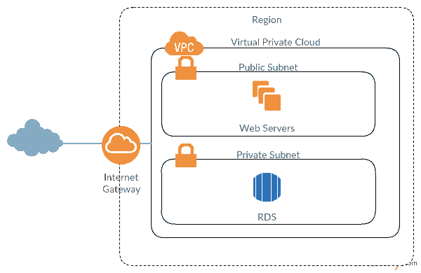

# 正在连接不可公开访问的 RDS 服务器

> 原文：<https://dev.to/caduribeiro/connecting-on-rds-server-that-is-not-publicly-accessible-392k>

让我们想象以下场景:

[T2】](https://res.cloudinary.com/practicaldev/image/fetch/s--yA-G2gtH--/c_limit%2Cf_auto%2Cfl_progressive%2Cq_auto%2Cw_880/https://cdn-images-1.medium.com/max/600/1%2AhywIXPeJfZtsmJylpYPhNw.png)

您在可以连接的公共子网上有 web 服务器，并且您的 RDS 实例托管在专用子网上。这样，您的数据库实例就不能通过互联网公开访问，您也不能将您的本地客户机与它连接。

不可能做 a:

```
mysql -u user -p -h RDS\_HOST 
```

要建立与数据库的连接，您需要使用您的公共 EC2 实例作为到 RDS 的桥梁。让我们做一个 SSH 隧道。

```
ssh -i /path/to/keypair.pem -NL 9000:RDS\_ENDPOINT:3306 ec2-user@EC2\_HOST -v 
```

*   **-I/path/to/key pair . PEM:***-I*选项将通知 ssh 将使用哪个密钥进行连接。如果你已经用 *ssh-add* 添加了你的密钥，这是没有必要的。-NL-N 不会打开与服务器的会话。它会建立隧道。我会设置端口转发。
*   **-NL : N** 不会打开与服务器的会话。它会建立隧道。我会设置端口转发。
*   **9000:RDS _ ENDPOINT:3306:***-L*选项会根据这个参数进行端口转发。第一个数字 *9000* 是您想要用来连接远程主机的本地端口。 *RDS_ENDPOINT* 是数据库实例的 RDS 主机。 *3306* 是您想要访问的远程主机的端口(3306 是 MySQL 的默认端口)。
*   **ec2-user@ec2_HOST :** 如何 ssh 你的公共 EC2 实例。
*   **-v :** 可选。这样，您将在终端上打印 ssh 日志。

这样，您现在可以使用本地客户端连接到您的私有 RDS 实例。

```
mysql -h 127.0.0.1 -P9000 -u RDS\_USER -p 
```

如果您的 EC2 实例也在私有子网上，您将需要设置一个 bastion 主机来实现桥接。Bastion host 是一个实例，它将被放置在一个公共子网上，并且可以使用 SSH 进行访问。您将使用相同的 SSH 隧道，只是更改了用于指向 bastion 主机的主机。

干杯🍻