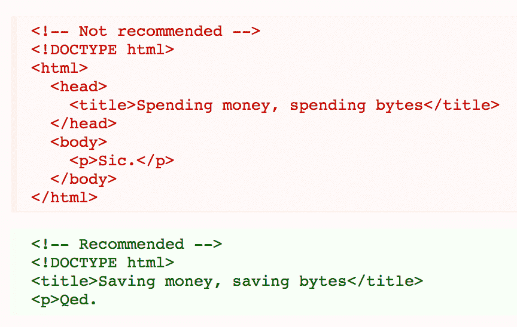

# 考虑页面大小优化中的权衡

> 原文：<https://dev.to/ben/considering-the-tradeoffs-in-page-size-optimization>

谷歌的风格指南建议[省略可选标签](https://google.github.io/styleguide/htmlcssguide.xml#Optional_Tags)，如`<head>`、`<body>`和结束标签如`
`。

> 出于文件大小优化和可扫描性的目的，请考虑省略可选标记。HTML5 规范定义了哪些标签可以省略。
> 
> (这种方法可能需要一个宽限期来建立一个更广泛的指导方针，因为它与 web 开发人员通常学到的东西有很大不同。出于一致性和简单性的原因，最好省略所有可选标签，而不仅仅是一个选择。)
> 
> [T2】](https://res.cloudinary.com/practicaldev/image/fetch/s--i1wEV-V6--/c_limit%2Cf_auto%2Cfl_progressive%2Cq_auto%2Cw_880/http://i.imgur.com/BQgjuos.png)

这是一个令人惊讶的建议，许多开发人员不同意。这是一种激进的方法，有许多潜在的缺点。以下是一些例子:

*   除了浏览器之外，不同的解析或抓取场景是未知的或不被考虑的。
*   新开发人员入职。还有一件事要记住。
*   代码美观/可读性。
*   不必要的优化。

这些观点双方都可以争论，我认为人们会倾向于将他们的个人品味或偏见注入到所有这些观点中。但这是最后一点，“不必要的优化”，我想解决。以节省几个字节的名义引入潜在的复杂性，在通过网络发送几十或几百千字节的情况下，似乎是完全不合理的。确实是。但这并不意味着这种策略永远不应该被采用。在很多 web 请求场景中，数学计算的结果是不同的。

不是每个 HTML 页面的实例都服务于相同的目的。如果我运行一个依赖丰富交互的客户端应用程序，我可能会在客户端进行大部分的渲染。在许多这样的场景中，初始的服务器端呈现是多余的，初始加载时发送的 HTML 通常只是一个外壳，用于为客户端代码提供基本的文档对象模型。在这种情况下，这是很常见的，这是有意义的，看看如何修剪每一个不必要的字节作为一次性优化。如果需要通过线路发送的 30%的字节可以不在行程中，我们应该尝试进行优化。如果你从服务器渲染一个视图，这些优化可能只能节省 3%的加载量，同时也为不同的解析环境引入了更多潜在的失败点，这是错误的选择。

这是研究大多数这类优化问题的模型。该网站最近放弃了 [New Relic](https://newrelic.com/) 的应用程序监控解决方案，因为它需要在页面头部注入几 KB 的 JavaScript，证明在不使用该工具的情况下很难测量性能。对于这个应用程序来说，这是正确的选择，因为我们采取了一些[非典型措施](https://dev.to/ben/this-website-is-basically-amp-html)来确保页面尽可能快速地呈现。新遗迹占了初始渲染的足够多的权重，所以值得放弃这个脚本。但如果你问我你是否应该这么做，我可能会回答“绝对不”。对我们来说，节省字节似乎是正确的选择，至少现在是这样。它不太可能是你的正确选择，除非你像我们一样设计你的 HTML 体验。

我对将这种优化作为构建步骤的一部分的方法持怀疑态度，就像 JavaScript 或 CSS 被缩小和压缩的方式一样。我认为你冒了这样的风险:假设某个标签的存在可以被 JavaScript 引用，但事实并非如此。我不想处理这种可能产生的运行时错误。这一点是有争议的，但在这种情况下，我宁愿编写将在生产中运行的标记，而不是编译它。

这个应用程序通常还会发出一个异步服务器请求来回答问题“有人登录了吗？”。由于没有请求其他信息，所以去掉响应的整个正文和所有多余的标题项是有意义的。当前的请求只返回 341 字节的数据，我相信这在将来会得到更大的改进。进行一次性优化是有意义的。

归结起来就是:不要因小失大。