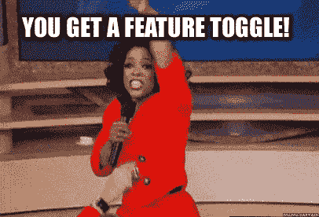

# 使用功能切换的连续交付

> 原文：<https://dev.to/samueleresca/continuos-delivery-using-feature-toggle>

[T2】](https://res.cloudinary.com/practicaldev/image/fetch/s--pshcpt57--/c_limit%2Cf_auto%2Cfl_progressive%2Cq_66%2Cw_880/https://cdn-images-1.medium.com/max/800/0%2ANQCGXeLeKNsJHAFt.gif)

> *一个**特征切换**，**特征开关**，**特征标志**，**特征翻转器**，**条件特征**等。)是软件开发中的一种技术，它试图为维护多个源代码分支(称为特性分支)提供一种替代方法，这样，即使在特性完成并准备发布之前，也可以对其进行测试。* -维基百科

特性切换是一种在连续交付工作流中推迟特性激活的强大方法。

## 特性切换的利弊

对于使用这种模式工作的开发人员来说，有一些优势，例如:所有的合并问题都消失了，并且通过 canary 发布或其他增量发布策略降低了部署风险。主要的**缺点**是特性标志使得代码更脆弱，更难测试，更难维护，更不安全。事实上，特性标志需要是短暂的，切换的主要目的是以最小的风险执行发布。一旦释放完成，需要移除触发器。

## 什么时候使用功能切换？

当您想要保持产品代码非常接近开发版本时，当业务没有准备好启用特性时，或者当您想要执行代码的金丝雀发布时，特性切换非常有用。重要提示:不要使用功能切换来启用不完整的代码。功能标志在代码中引入了很多复杂性。

## 功能切换组件

Feature toggling 模式通常由三个不同的组件实现:

*   **Toggle point:** 是调用 Toggle 路由器的组件；
*   **触发路由器:**包含检查某个触发点是否激活的逻辑。切换路由器读取切换配置以检测功能或简单地检测切换上下文。例如特殊的 cookie 或 HTTP 报头。
*   **切换配置:**包含激活/去激活切换点的信息。通常，切换配置是特定于环境的；

## 切换特征的类别切换可以通过使用不同的参数进行分类:特征的寿命和切换决策的动态性。

*   **发布切换:**——将特性发布与代码部署分开。发布切换允许将代码路径作为潜在代码发布到产品中；
*   **实验切换:**执行多变量或 A/B 测试。这种技术通常用于对电子商务系统的购买流程或按钮上的行动号召等进行数据驱动的优化。
*   **Ops toggles:**Ops toggles 相对来说是短命的——一旦对新特性的操作方面有了信心，该 toggle 就应该退休了；
*   **许可切换:**更改某些用户获得的功能或产品体验。例如，我们可能有一组“高级”功能，我们只为我们的付费客户打开；

## 切换配置

有不同的方法来更改和管理功能切换标志:

*   **编译:**标志值写在代码中，硬编码不允许动态重新配置 toggle
*   **File:** 您可以读取一个结构化文件中的切换配置，例如一个 JSON 文件——您现在可以通过简单地更改该文件而不是重新构建应用程序代码来重新配置切换；
*   **参数化:**切换配置作为命令行参数或查询字符串参数传递。您每次都需要传递配置；
*   **数据库:**您可以在数据库中存储配置。通常，它与某种形式的管理 UI 相结合，允许系统操作员、测试人员和产品经理查看和修改特性开关及其配置；

## 功能切换练习

这篇文章展示了如何使用 ASP.NET 来实现特性切换。

## 结论

特征切换是连续交付堆栈中非常有用的技术。我建议小心使用它，因为每个切换都会在我们的代码中引入技术债务。以下是一些关于功能切换有用链接:

*   [马丁·福勒-功能切换](https://martinfowler.com/bliki/FeatureToggle.html)
*   [特性切换是最糟糕的技术债务之一](http://swreflections.blogspot.it/2014/08/feature-toggles-are-one-of-worst-kinds.html)
*   [解耦展开和释放特征切换](https://abhishek-tiwari.com/post/decoupling-deployment-and-release-feature-toggles)

干杯:)