# 使用计数排序进行线性计数

> 原文：<https://dev.to/vaidehijoshi/counting-linearly-with-counting-sort>

如果有一个问题是每个开发人员每天都在问的，那一定是这个问题:有没有可能做得更好？几乎在每种情况下，我们似乎都会问自己这个问题的一些变体。通常，我们关心的是找到解决方案，然后把它从我们的头脑中拿出来，放到文本编辑器、白板或一张纸上。最终，我们开始将这个想法转化为代码，而代码在第一次的时候非常糟糕。

没关系。肯特·贝克的口头禅“让它工作，让它正确，让它快速”[就是因为这个原因而成立的。但是在某些时候，一旦我们成功了，做对了，我们会问自己:我能做得更快吗？我能做得更好吗？](http://wiki.c2.com/?MakeItWorkMakeItRightMakeItFast)

我喜欢整理东西，但在过去的几周里，我注意到了一个突出的问题——也许你也注意到了。高效排序真的很难！我们已经学会了很多不同的分类方法:确切地说，是六种不同的方法。大多数都有二次运行时间，少数有线性运行时间。但是，我们从来没有比这更好的了，不是吗？

这让我思考:有没有可能做得更好？事实证明，大多数时候，在排序算法的背景下，这个问题的答案是否定的。几乎不可能比 linearithmic runtime 或大 O 符号中的 O(n log n)做得更好。这里的关键词当然是*近*。因为，偶尔，我们*可以*做得更好。今天，我们终于要学会怎么做了！

### 数羊！呃，等等，我是说计数*排序！*

随着我们对排序算法的深入研究接近尾声，我们将稍微改变一下思路。到目前为止，我们已经看了很多基于比较的排序算法，但是我们要看的最后几个算法将会非常不同。首先，它们将比我们已经了解的那些更快，但是它们也限制了我们如何使用它们。

当我说“有限”的时候，我的意思是，我们在使用这些算法排序的元素类型上是有限的。但是当我们开始看一个例子时，这将更有意义。先来个定义吧！

第一个让我们迷惑不解的算法叫做 ***计数排序算法*** 。不要被这个名字所迷惑——它远没有听起来那么枯燥和数学化！

<figure>[](https://res.cloudinary.com/practicaldev/image/fetch/s--ymLBUOUE--/c_limit%2Cf_auto%2Cfl_progressive%2Cq_auto%2Cw_880/https://cdn-images-1.medium.com/max/1024/1%2AaMsSi7khOpDLX0-ysf3jRg.jpeg) 

<figcaption>计数排序:一个定义</figcaption>

</figure>

计数排序算法的独特之处在于它只能在整数上实现。这是限制这种算法可用性的一部分——也可能是您以前从未听说过或遇到过它的一部分原因！计数排序接受一系列要排序的整数。它使用整数的范围(例如，0-100 之间的整数范围)，并计算每个唯一数字在未排序的输入中出现的次数。

该算法利用了这样一个事实，即它预先知道要排序的元素的范围，以及所有元素都是整数的事实，并构建了一个“计数”数组，它使用该数组来合计在未排序的集合中出现了多少个数字。然后，它使用一些数学和部分散列函数将元素映射到复制的“count”数组中的键。

唷，好吧，这是一个很难理解的词。也许这并没有什么意义？如果没有，不要担心；我倾向于认为计数排序仅仅作为一个定义没有什么意义。在我们迄今为止了解的所有算法中，我认为这一个可能是最令人困惑的——除非你看到它在运行。

在我们深入一个例子之前，让我们快速地了解一下关于计数排序我们应该记住的关键事情。

<figure>[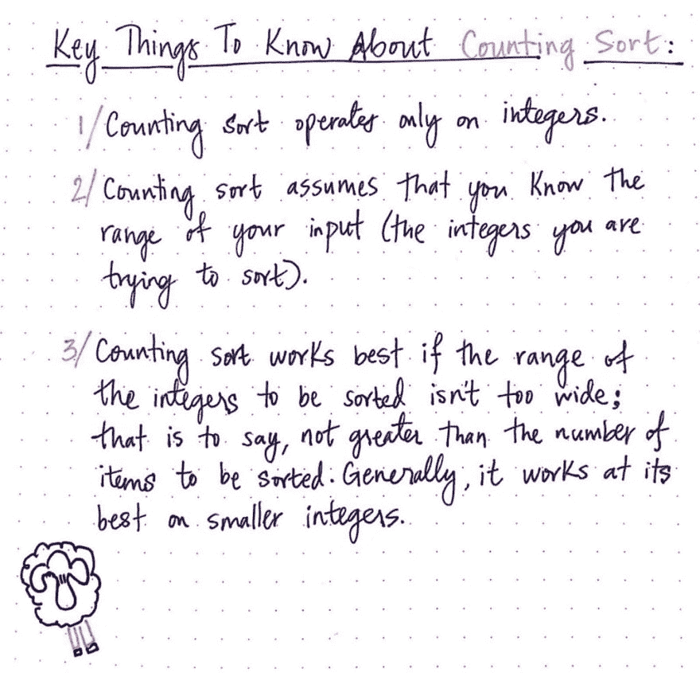](https://res.cloudinary.com/practicaldev/image/fetch/s--vjTtHmBU--/c_limit%2Cf_auto%2Cfl_progressive%2Cq_auto%2Cw_880/https://cdn-images-1.medium.com/max/1024/1%2AKpGNINJgkGUj_FKoQZezuQ.jpeg) 

<figcaption>数数要知道的关键事情排序</figcaption>

</figure>

首先也是最重要的，如果我们要排序的项目都是整数，我们应该只考虑使用或实现计数排序。

其次，我们需要确定我们知道输入整数的范围。正如我们将在接下来的几节中看到的，计数排序非常依赖于知道输入的范围；如果我们不知道我们输入的整数有多大有多小，我们就不能真正使用计数排序。

第三，即使我们知道我们输入的整数的范围，我们仍然需要想一想*我们的整数是什么*；也就是说，最小输入整数和最大输入整数之间的范围可能是多少。如果我们有 5 个元素要排序，但是输入值的范围在 0 到 10，000 之间，那么 counting sort 就不能很好地工作，因为它必须创建一个“count”数组。

了解这些规则很重要，但是通过一个例子它们会变得更加明显。所以，现在就来看一个吧！

### 计数我们看到的元素

我们知道我们只能在整数输入上实现计数排序，并且我们知道这些元素之间的范围应该很小。在下面的例子中，我们对一个只有八个元素的数组进行排序:[9，4，1，7，9，1，2，0]。注意有一些重复的值，这完全没问题！

<figure>[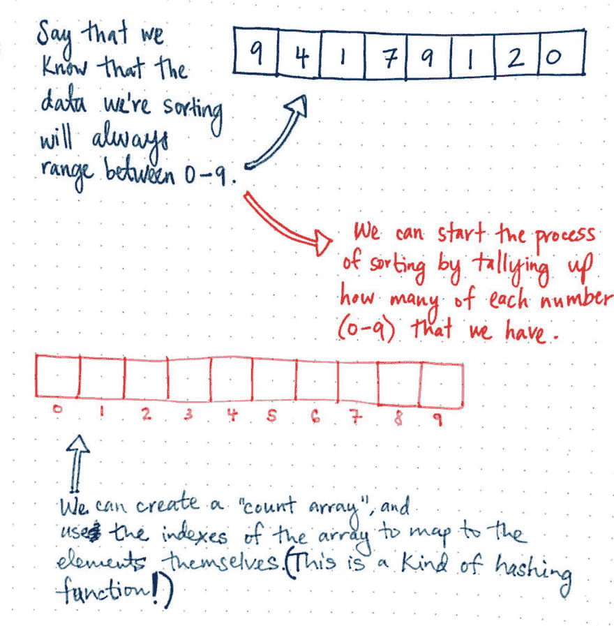](https://res.cloudinary.com/practicaldev/image/fetch/s--4Z5pSa2O--/c_limit%2Cf_auto%2Cfl_progressive%2Cq_auto%2Cw_880/https://cdn-images-1.medium.com/max/1024/1%2AhAS_hyFKlG2zm8BW0D1ymg.jpeg) 

<figcaption>做一个计数排序</figcaption>

</figure>

在这种情况下，我们知道我们正在排序的数据的范围总是在 0 到 9 之间。

我们将从创建“计数数组”开始，它以粉红色突出显示。记住，我们需要这个来计算输入数据中每个数字(0-9 之间)的数量。在我们完成清点工作后，我们将进行分类工作！

一旦我们创建了“计数数组”，我们将能够使用数组的索引来映射到元素本身。当我们初始化“计数数组”时，每个索引都从初始值 0 开始。然后，我们需要用未排序的输入数组中的元素填充“计数数组”。

<figure>[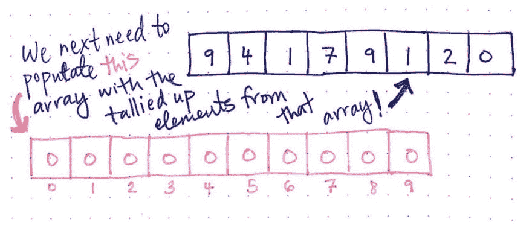](https://res.cloudinary.com/practicaldev/image/fetch/s--WJj02XOA--/c_limit%2Cf_auto%2Cfl_progressive%2Cq_auto%2Cw_880/https://cdn-images-1.medium.com/max/1024/1%2Ae8Gdu8emgMzYhDLtrC_bwQ.jpeg) 

<figcaption>用未排序的输入数组</figcaption>

</figure>

中的元素填充计数数组

那么，我们到底要怎么做呢？我们现在真正关心的是计算出一个数字在我们的输入数组中出现了多少次。换句话说，我们想知道数组中出现了多少个 0，多少个 1，多少个 2，多少个 3，等等，直到我们得到数字 9，这是我们输入数组中的最后一个最大值。做这项工作就像听起来一样简单:我们可以遍历数组，并记录我们看到某个数字的次数，直到遍历完整个输入数据集。

如果你已经读过关于[散列表](https://dev.to/vaidehijoshi/taking-hash-tables-off-the-shelf)和[散列函数](https://dev.to/vaidehijoshi/hashing-out-hash-functions)的内容，你可能已经能够猜到这将如何进行。让我们看看你是不是对的！为了使这一点更明显，我将数组重绘为垂直的，这样我们可以更清楚地看到散列的工作:

<figure>[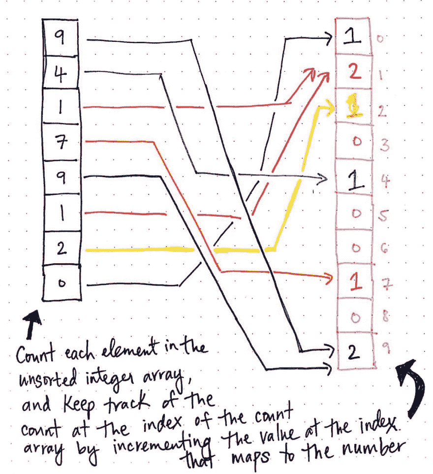](https://res.cloudinary.com/practicaldev/image/fetch/s--CRxVqhKL--/c_limit%2Cf_auto%2Cfl_progressive%2Cq_auto%2Cw_880/https://cdn-images-1.medium.com/max/1024/1%2AgkUSWvuDICvRhw005CXtiA.jpeg) 

<figcaption>将输入的数组值计数出来放入</figcaption>

</figure>

的“count-array”中

酷！注意我们是如何遍历未排序的数组的，并记录我们看到每个数字的次数。

例如，我们开始的第一个元素是数字 9。我们在 count 数组中找到索引 9，它当前被设置为 0，我们将它递增 1。然后我们继续看下一个元素:4。我们在计数数组中找到索引 4，并将其从 0 递增到 1。我们对接下来的两个元素做同样的事情:1 和 7。

最终，我们找到了 9 的另一个实例。因此，我们在计数数组中找到索引 9；请记住，我们已经看到了一个 9 的实例，因此 count 数组中索引 9 的值当前被设置为 1。但是不用担心！我们在这个数组中有副本，这很好——我们只是将它从 1 增加到 2。问题解决了。我们可以继续快乐地前进，直到遍历完整个输入数组。

实际上，当我们遍历未排序的整数数组时，我们对每个元素进行计数，并通过递增映射到适当数字的索引处的值来跟踪“计数数组”的相应索引处的计数。

太好了！现在我们有了一个计数数组，它记录了每个数字(范围从 0 到 9)在未排序的整数数组中出现的次数。

<figure>[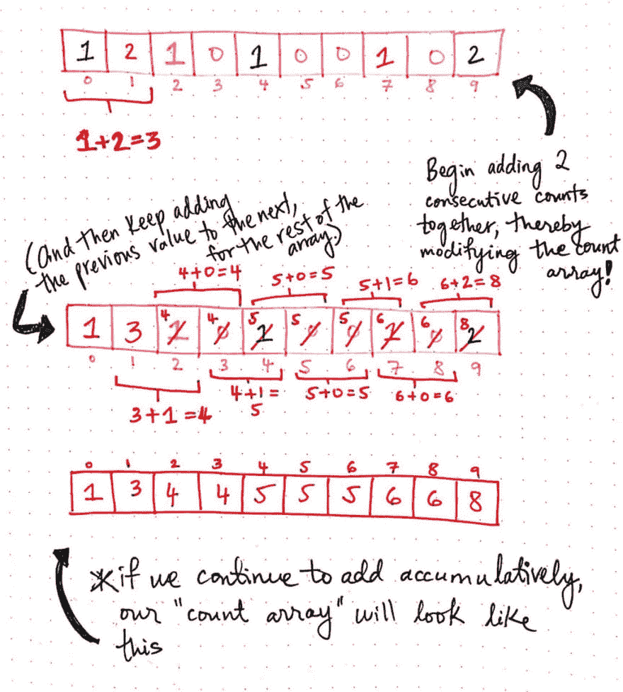](https://res.cloudinary.com/practicaldev/image/fetch/s--gX1SJeyj--/c_limit%2Cf_auto%2Cfl_progressive%2Cq_auto%2Cw_880/https://cdn-images-1.medium.com/max/1024/1%2ABwE_Lm7lqkD1LTu08Ggsog.jpeg) 

<figcaption>累加来变换我们的 count 数组</figcaption>

</figure>

下一步涉及到一些数学——但是不要担心，这不会太难！我们所需要做的就是在计数数组中累加每一对连续的值。

例如，我们将把 count 数组中索引 0 处的元素添加到索引 1 处的元素。在这种情况下，这两个元素是 1 和 2。由于 1 + 2 = 3，我们将把 1 个元素的索引更新为前一个元素的和。

对于数组的剩余部分，我们将通过将前一个索引的值添加到下一个来继续构建计数数组。当我们继续累加时，count 数组也随之转换。

我们的计数数组现在看起来像这样:[1，3，4，4，5，5，5，6，6，8]。

接下来，我们需要将数组移动一个索引。为了完成移位的工作，我们可以遍历数组，增加每个元素的索引。

将我们的计数数组移动一个索引后，它看起来像这样:

<figure>[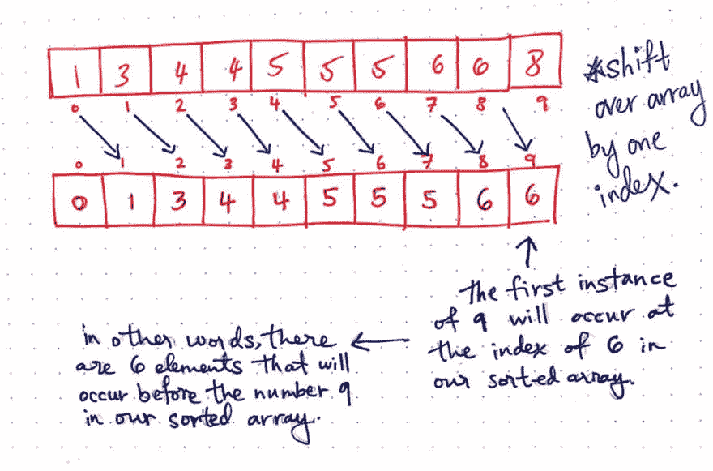](https://res.cloudinary.com/practicaldev/image/fetch/s--RXoSka58--/c_limit%2Cf_auto%2Cfl_progressive%2Cq_auto%2Cw_880/https://cdn-images-1.medium.com/max/1024/1%2AgDDj0iHNPUTsJrGnnUmZQw.jpeg) 

<figcaption>将计数数组向右移动一个索引</figcaption>

</figure>

移位后，我们的计数数组现在看起来像:[0，1，3，4，4，5，5，5，6，6]。如果我们更深入地思考这个问题，就会开始(希望)理解为什么这一步很重要。请记住，每个索引处的值告诉我们*该整数的第一个实例将出现在我们的排序数组中的*位置。例如，计数数组中索引 9 处的值是 6。换句话说，这告诉我们 9 的第一个实例将出现在排序数组的索引 6 处。另一种思考方式是，在我们排序的数组中，有*六个元素*会出现在数字 9 之前。

正如我通过自己的试验和错误发现的，如果我们跳过这一步，我们的数组可能仍然以排序的顺序结束，但我们将有一个额外的元素添加到它，它将只是稍微偏离。所以我们要特别小心，不要忘记换挡的步骤！

好了，现在我们到了最后一步:将计数数组转换成新的排序数组。我们要做的第一件事是创建一个新的数组来保存我们排序后的元素。一旦我们有了这些，我们就可以开始分类的工作了。在我们进行下一步时，让我们看看所有三个数组——原始数组、计数数组和新排序数组。

<figure>[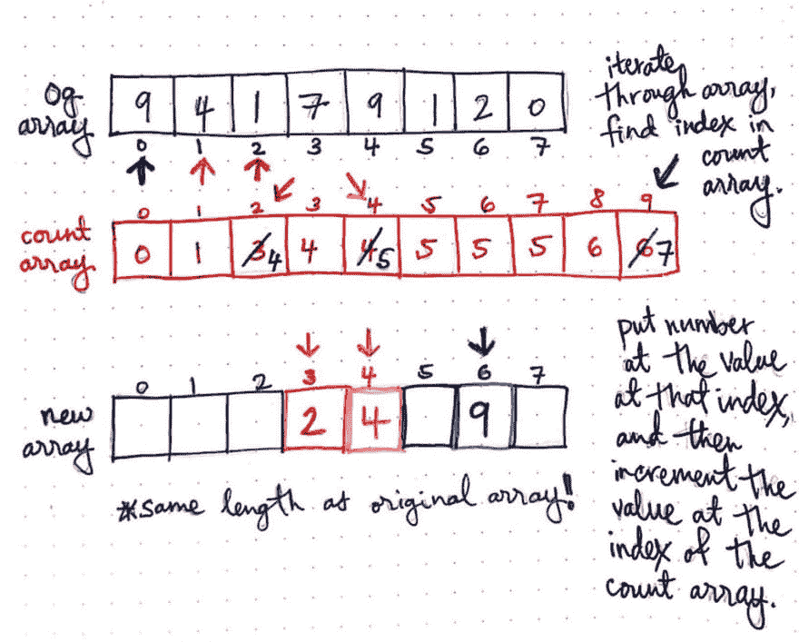](https://res.cloudinary.com/practicaldev/image/fetch/s--e7k2m2wk--/c_limit%2Cf_auto%2Cfl_progressive%2Cq_auto%2Cw_880/https://cdn-images-1.medium.com/max/1024/1%2AJDUtBNVSdcnPo13ZVjLJ-A.jpeg) 

<figcaption>将我们的计数数组转换为排序数组</figcaption>

</figure>

首先，我们想要遍历我们的原始数组，找到对应于我们正在查看的值的索引。然后，我们将查看该索引处的计数。

例如，我们开始查看原始数组中的第一个元素:9。我们将进入计数数组，找到索引 9，以及该索引处的值。在这种情况下，它是数字 6。

我们将在新数组中找到索引 6，并将 9 放在那里。最后，我们将递增 count 数组中相应索引处的值；你可以看到，在我们的计数数组中，我划掉了数字 6，用数字 7 代替了它。在对数字 9 的第一个实例排序后，我们执行这个增量步骤。

我们可以看到如何对数组中的下一对元素重复同样的步骤，以及每次排序时，如何在 count 数组中相应的索引处增加数字。为了能够对重复值进行排序，并且为了保持这些元素在未排序的数组中出现的顺序，增量步骤是至关重要的。

最终，如果我们在遍历整个数组时继续这样做，我们将得到一个新的排序后的数组，如下所示:

<figure>[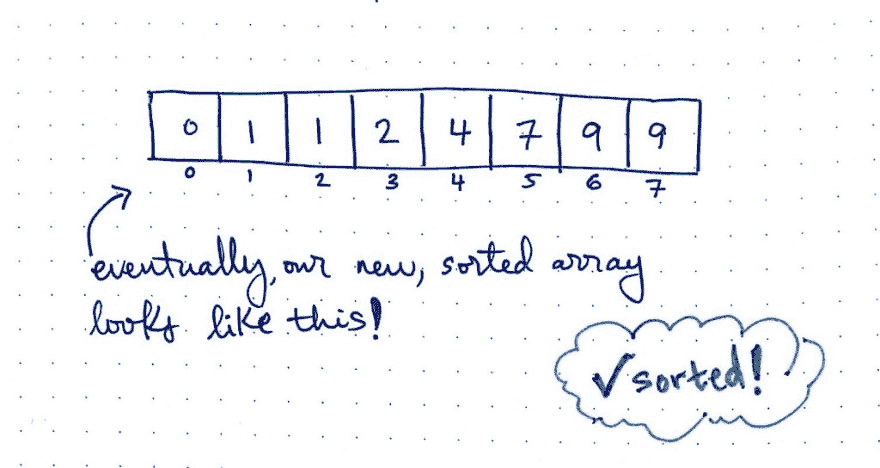](https://res.cloudinary.com/practicaldev/image/fetch/s--ZCZGhvLe--/c_limit%2Cf_auto%2Cfl_progressive%2Cq_auto%2Cw_880/https://cdn-images-1.medium.com/max/1024/1%2AhD9c_JW2GE7dw_BhO_RBZw.jpeg) 

<figcaption>数组:排序。情况:已处理！</figcaption>

</figure>

不错！我们的数组=已排序。我们的情况已经处理好了。干得好，队员们。

### 解构计数排序

好了，我们在上一节中已经非常详细地介绍了计数排序算法！在我们查看快速代码示例之前，让我们回顾一下计数排序的基本步骤。

<figure>[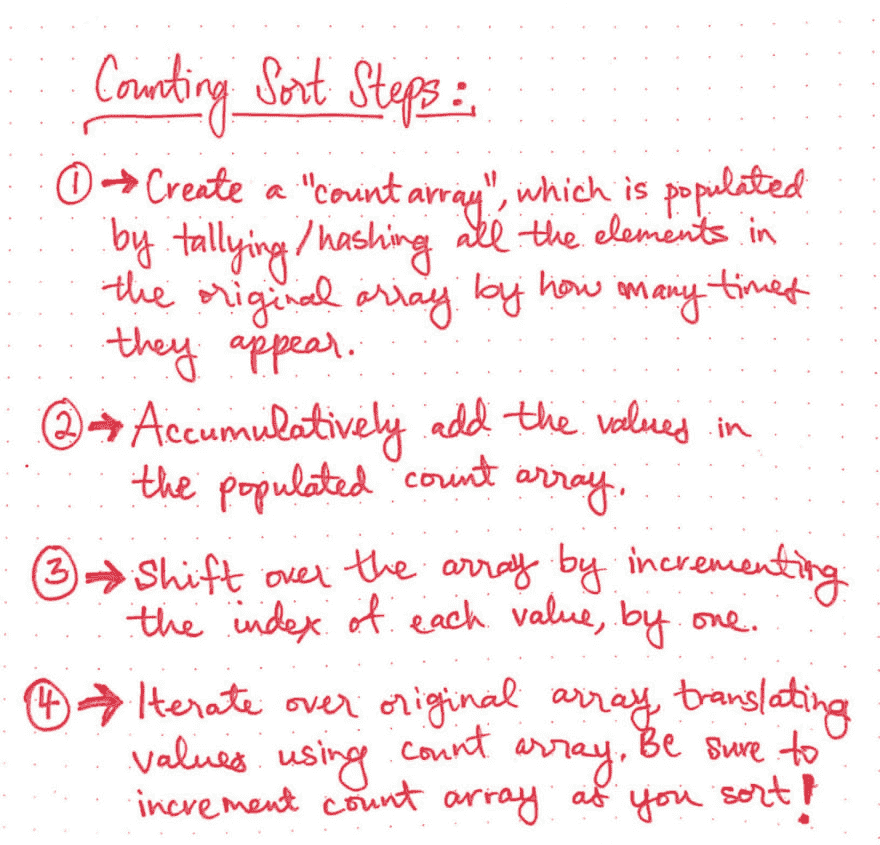](https://res.cloudinary.com/practicaldev/image/fetch/s--vtA1Gljg--/c_limit%2Cf_auto%2Cfl_progressive%2Cq_auto%2Cw_880/https://cdn-images-1.medium.com/max/1024/1%2Ap8qRnXJl9x5-SmbrV-_X6Q.jpeg) 

<figcaption>计数排序步骤</figcaption>

</figure>

1.  首先，我们必须创建一个“count array ”,我们将通过对原始数组中的所有元素进行合计(或散列),根据它们在未排序数组中出现的次数来填充它。
2.  接下来，我们将累加填充的 count 数组中的值，并在此过程中不断累积。
3.  然后，我们将通过将每个值的索引递增 1 来移动数组中的所有元素。
4.  最后，我们将创建一个新的排序数组，它的长度将与我们的原始数组相同。我们将迭代我们的原始数组，并通过使用计数数组将值转换到我们的新数组，随着我们继续排序，递增计数数组值。在这一步中，我们有效地使用了一个版本的[散列函数](https://dev.to/vaidehijoshi/hashing-out-hash-functions)，并使用我们的 count 数组作为一种方式，将未排序数组中的值转换为新的已排序数组。

好的，让我们看看这个算法的运行情况！下面是 Rosetta Code 的计数排序的 [JavaScript 实现](http://rosettacode.org/wiki/Sorting_algorithms/Counting_sort#JavaScript)的节略版。还记得我之前提到过我们需要知道输入数组中整数的范围吗？我们可以在下面的代码中看到原因；最大值和最小值通常是计数排序函数本身的参数，所以如果我们不知道这些值，我们(相当确切地说)就无法运行算法！

```
// Notice that we needed to know the max/min value in order to use counting sort at all!
function countingSort(array, minimumValue, maximumValue) {
  var i;
  var z = 0;
  var count = [];

  // Count the instances of each element.
  for (i = minimumValue; i <= maximumValue; i++) {
    count[i] = 0;
  }

  // We now have a placeholder array that we'll use to keep
  // track of which element will be sorted into each index.
  console.log(count);

  // Build up our index count array.
  for (i=0; i < array.length; i++) {
    count[array[i]]++;
  }

  console.log(count);

  // Modify array and move elements into their sorted location.
  for (i = minimumValue; i <= maximumValue; i++) {
    while (count[i]-- > 0) {
      console.log('item at index ' + z + ' is: ', array[z]);

      array[z++] = i;

      console.log('moving item ' + i + ' to correct location');
    }
  }

  console.log("Hooray! Array is now sorted!");

  return array;
} 
```

好，让我们运行这段代码，看看会发生什么。我添加了一些 console.log 来使这里实际发生的事情更加明显。我们将尝试对我们在示例中使用的完全相同的数组进行排序:[9，4，1，7，9，1，2，0]。注意，我们传入 0 作为最小值，9 作为最大值，这是我们试图排序的整数的范围。

```
var array = [9,4,1,7,9,1,2,0]
countingSort(array, 0, 9)

> (10) [0, 0, 0, 0, 0, 0, 0, 0, 0, 0]
> (10) [1, 2, 1, 0, 1, 0, 0, 1, 0, 2]
> item at index 0 is:  9
> moving item 0 to correct location
> item at index 1 is:  4
> moving item 1 to correct location
> item at index 2 is:  1
> moving item 1 to correct location
> item at index 3 is:  7
> moving item 2 to correct location
> item at index 4 is:  9
> moving item 4 to correct location
> item at index 5 is:  1
> moving item 7 to correct location
> item at index 6 is:  2
> moving item 9 to correct location
> item at index 7 is:  0
> moving item 9 to correct location
> Hooray! Array is now sorted!
>> (8) [0, 1, 1, 2, 4, 7, 9, 9] 
```

有意思！我们可以看到计数数组在第一次初始化时被注销，我们可以在完成计数工作后看到它。注意，我们*的确*需要创建一个新的数组 count 来跟踪我们的计数。然而，与[冒泡排序](https://dev.to/vaidehijoshi/bubbling-up-with-bubble-sorts)甚至[快速排序](https://dev.to/vaidehijoshi/pivoting-to-understand-quicksort-part-2)不同，当我们将排序后的项目追加到原始数组中时，我们每次做的工作量是相同的，并且我们只需要对每个元素迭代一次。您可以在第 24–32 行的循环中看到对数组的单次迭代。

这就是为什么计数排序*如此* *有效的例证。*

尽管我们需要一些额外的空间来存放计数数组，并且我们必须对计数数组进行一些稍微复杂的操作，但是这个算法所花费的总时间在很大程度上是线性的。换句话说，这个算法的时间复杂度直接取决于我们要排序多少个元素。

<figure>[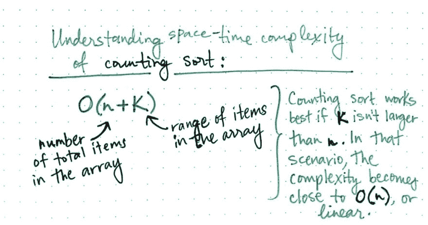](https://res.cloudinary.com/practicaldev/image/fetch/s--ljHaaV2p--/c_limit%2Cf_auto%2Cfl_progressive%2Cq_auto%2Cw_880/https://cdn-images-1.medium.com/max/1024/1%2AliCFxCuwWgJYh3ALb2I2og.jpeg) 

<figcaption>理解计数的时空复杂性</figcaption>

</figure>

这也解释了为什么我们的未排序数组的范围和输入大小如此重要！计数排序的空间复杂度直接取决于我们要排序的整数的范围。记住，我们创建一个计数数组作为这个算法的结果，我们的范围越大(例如，0–9，或 1–100，甚至 0–10，000！)，我们的计数数组就越大。如果我们只想对 5 或 10 个元素进行排序，这可能会非常糟糕，但是为了做到这一点，我们必须创建一个大规模的数组！在这种情况下，计数排序将是非常糟糕的消息。

事实上，计数排序的时空复杂度实际上是要排序的元素数量 *n* 和最大和最小元素之间的范围，或 *k* 的组合。计数排序的真正大 O 记法是 *O(n + k)* 。然而，计数排序通常只在 *k* 不大于 *n* 时使用；换句话说，如果输入值的范围不大于要排序的值的数量。在这种情况下，计数排序的复杂性更接近于 *O(n)* ，这使它成为一种线性排序算法。

那么计数排序与我们迄今为止探索过的其他排序算法相比还有什么不同呢？

<figure>[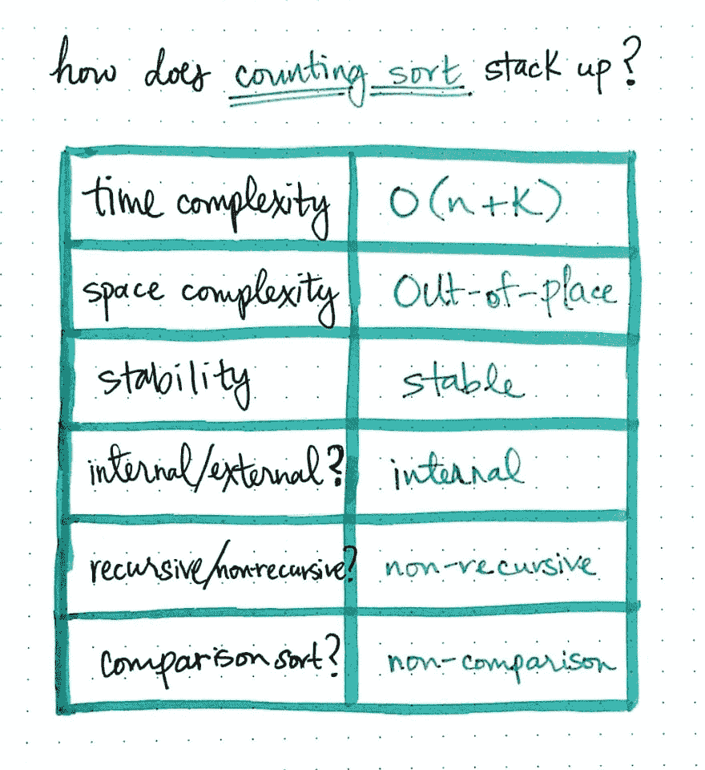](https://res.cloudinary.com/practicaldev/image/fetch/s--9GYPpXYG--/c_limit%2Cf_auto%2Cfl_progressive%2Cq_auto%2Cw_880/https://cdn-images-1.medium.com/max/1024/1%2AWF6wIkOUtDqxSlt4oBSTVQ.jpeg) 

<figcaption>计数排序如何累加？</figcaption>

</figure>

嗯，我们已经知道，当正确实现时，计数排序运行在接近*的线性时间内。因为该算法需要一个重复的数组(并不总是在原始数组上操作)，所以它被归类为一个 ***不合适的*** 算法。然而，它确实设法保持了元素在原始数组中出现时的顺序，使其成为一个 ***稳定的*** 排序算法。这最终变得非常重要和有用，并且是计数排序算法的另一个优点。它也不需要任何外部存储器，可以对 ***内部*** 存储器中的少量数据进行排序。最后，计数排序与我们看到的其他算法不同，它是一种 ***非比较*** 算法。既然我们已经知道它的实现是迭代的，我们知道它是 ***非递归*** 。*

 *你可能不会发现自己在实践中经常使用计数排序，但是知道线性排序是可能的是有好处的:只要你知道什么时候使用它。计数快乐！

### 资源

尽管我们可能不会经常使用计数排序，但这种特定算法的基础知识会经常出现，特别是因为它是少数几个可以在线性时间内运行的算法之一。了解它在长期内是如何工作的是有帮助的，如果你想了解更多，有一些很好的资源深入到我们今天学习的步骤背后的数学。通过下面的链接开始计数吧！

1.  [计数排序](http://www.growingwiththeweb.com/2014/05/counting-sort.html)，与网络一起成长
2.  [计数排序](http://www.geeksforgeeks.org/counting-sort/)，GeeksForGeeks
3.  [线性排序](http://faculty.ycp.edu/~dbabcock/PastCourses/cs360/lectures/lecture09.html)，大卫·s·巴布科克
4.  [按线性时间排序(幻灯片)](https://web.cse.ohio-state.edu/~crawfis/cse680/Slides/CSE680-08LinearSorting.pptx)罗杰·克劳菲斯教授
5.  [计数排序可视化](https://www.cs.usfca.edu/~galles/visualization/CountingSort.html)，大卫·加勒教授
6.  麻省理工学院计算机科学系计数排序
7.  [分钟计数排序](https://www.youtube.com/watch?v=OKd534EWcdk&t=76s)，CS 道场

* * *

*本帖最初发表于[medium.com](https://medium.com/basecs/counting-linearly-with-counting-sort-cd8516ae09b3)T3】**