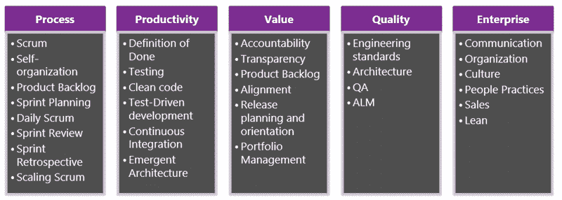

# 创建您自己的组织敏捷性之路

> 原文：<https://dev.to/nkdagility/create-your-own-path-to-organisational-agility-3fjn>

其他的扩展敏捷框架采用了一种千篇一律的方法来实现组织的敏捷。虽然我承认他们可能曾经在某个地方工作过，但是同样的方法在你的组织中工作的可能性很小。他们的创建是为了让一个独特的公司从他们现有的状态到他们个人的愿景。为了增加成功的可能性，你需要一个框架，引导你以渐进和定制的方式朝着自己的愿景改变你的组织。千篇一律的方法对你不起作用。

## TL；速度三角形定位法(dead reckoning)

如果我们承认我们通往敏捷性的道路是独一无二的，并且总是与众不同，我们可以利用[基于证据的变革敏捷性指南](https://www.scrum.org/resources/agility-guide-evidence-based-change)来帮助指导我们实现更大程度的组织和业务敏捷性。我们可以使用已经用 Scrum 创造了如此多的产品价值的同样的想法，并利用它们来创造组织价值。

创建您的组织变革积压和组织变革团队，并创建您自己的敏捷之路。然后培训你组织中的每一个人，让他们识别出你组织中价值传递的障碍，只有那些做这项工作的人才能识别出这些障碍。

## 创造你自己的组织敏捷性之路

每个组织，实际上是每个部门，都有一点不同，你需要调整你的方法来适应你的文化。清晰的愿景和渐进的驱动力是实施改进的起点。

去年，我一直在与一些公司合作，帮助他们更好地实现 ALM 和 DevOps 愿景。在我的世界里，DevOps 由您的流程、实践和工具组成，您使用它们来交付您的产品愿景并实现一定程度的业务敏捷性。您的组织获得的敏捷性越大，您相对于竞争对手的竞争优势就越大。在今天的市场中，没有效率低、浪费多、变革慢的组织存在的空间。只要你在构建你的企业用来赚钱的软件，这无疑是正确的。不管你是在卖软件，还是软件管理着仓库，让你把货物交付给客户。您依赖该软件的功能和特性来开展业务。

创建改进方向的第一步是[创建组织改进愿景](https://dev.to/nkdagility/professional-organisational-change-at-the-ghana-police-service-3i3i)。想想你想去哪里，然后写下来。不要只考虑短期或中期，这将是你最终目标的活的愿景。试着想想你想要实现的“是什么”和“为什么”，而不是“如何实现”。你想要设定方向，而不是限制那些朝着愿景努力的人的创造力。然后，需要将这一愿景传达给组织中的每个人。每个人都需要明白，你支持那个愿景，并计划实现它。

> “向您想要的文化和流程前进的最大阻力是您现有的文化和流程”

你还需要沟通，并经常接受改变需要时间。特别是在企业中，向你想要的文化和过程前进的最大阻力是你拥有的文化和过程。事实上，如果你在实现你的愿景的过程中是真正迭代的，那么当你的组织文化适应这些变化时，实现愿景的路线可能会改变很多次。实现愿景所需的时间与你在追求过程中获得的支持直接相关。自下而上的支持并不是实现业务敏捷性所需的组织变革类型所需要的全部。你需要管理层的全力支持，而不仅仅是通常的口头承诺。他们需要在变革过程中采取行动，毕竟，这是他们的公司，如果他们对提高效率和击败竞争对手不感兴趣，那么你为什么要这样做呢？

如果您获得了自上而下的参与，您通常可以通过避开一些常见的阻力来加速向更高程度的业务敏捷性的转移。各级公众的认同消除了许多经常伴随混乱变化的愿景反诘。

> “Scrum 被证明在一半的时间内交付两倍的功能”
> 
> ——杰夫·萨瑟兰， [Scrum:在一半的时间内做两倍工作的艺术](http://nkdalm.net/Scrum-TwiceTheWork)

现在我们有了自己的愿景，我们需要能够实现它。一次又一次，Scrum 在世界范围内被证明了，并且始终如一地，在一半的时间内交付两倍的功能，承诺它不仅可以用于交付一个产品，也可以在你的组织内交付改变。

[T2】](https://res.cloudinary.com/practicaldev/image/fetch/s--09iBsjrV--/c_limit%2Cf_auto%2Cfl_progressive%2Cq_auto%2Cw_880/http://nakedalmweb.wpengine.com/wp-content/uploads/2015/02/image.png)

为了实现我们的愿景，我们需要一个持续的改进周期，以便:

1.  使用我们可能需要为我们的组织量身定制的通用指标来衡量我们正在获得的组织价值
2.  诊断我们组织的能力并确定需要改进的地方
3.  基于直接证据结合组织能力进行改进

这个过程允许我们创建一个组织改进待办事项，同时在我们创造更多组织价值的时候留下动态变化的空间。我们可以很容易地将重点转移到其他领域，以更少的投资提供更多的价值。你应该只关注你实现愿景的最初几步，以尽可能长时间地保持你的改变能力。

## 组织变革团队——指导联盟

此时，如果您还没有阅读[基于证据的变更敏捷性指南](https://www.scrum.org/resources/agility-guide-evidence-based-change)，那么您应该阅读该指南，因为理解本文档中的概念是理解这种方法的必要条件。您需要理解您的工程实践将需要跟上您的文化和过程变化的步伐。你不能让这三个支柱中的任何一个滞后，否则你的变革步伐将会放缓，甚至停滞。

以可持续和一致的速度前进的关键是由工程、商业化和投资组合团队的高级代表组成的指导联盟。这个指导联盟就是变革团队，它将完成组织变革积压工作。您的组织变更待办事项应该反映您现在所处的位置和您想要实现的愿景之间的差异，指导联盟将负责处理该待办事项，并向变更负责人展示组织内的改进。这些角色和职责，就像 Scrum 团队一样，是成功的关键。

**指导联盟–**将带领您的组织前进并实施变革的一群人。

*   **变更负责人**:负责组织变更待办事项的个人。可能是首席执行官或高级产品负责人。
*   **变更团队**:负责交付组织变更待办事项的团队。这个团队应该让他们需要的每个人来激活他们所承担的项目。
*   **流程经理**:负责确保每个人在框架范围内都有效的人。

如果您的组织很大，那么我们可能希望按照以下实践领域的路线打破我们的指导联盟，并有一个单独和相关的指导冲突，负责该领域并与其他领域一起工作以实现愿景。

[T2】](https://res.cloudinary.com/practicaldev/image/fetch/s--3N-3l8eY--/c_limit%2Cf_auto%2Cfl_progressive%2Cq_auto%2Cw_880/http://nakedalmweb.wpengine.com/wp-content/uploads/2015/02/image1.png)

当你有一个大企业，或者仅仅是这个企业的一个大部分时，确保你在上面确定的每个实践领域中取得进展是至关重要的。有时，这意味着你需要为每个诊断实践领域建立一个独立的、集中的指导联盟。这将使每个学科平行地进步。

*   流程通常由你的 Scrum Masters 拥有，它可能是你的传统 PMO 的一部分，应该包含你的团队实现 Scrum 框架的所有关键驱动因素。
*   **生产力**–你的工程团队将是这个领域中最相关和最有效的成员。
*   **价值**–价值是产品所有者的一个关键因素，因此他们的组织应该成为这个指导联盟的主要成员。
*   **质量**-你的商业化团队可能是这里的一个关键参与者，工程实践在活动列表中排在前列，工程参与也是有意义的。
*   **企业**–该领域应归您的领导和销售团队所有。这是你关注需要发生的高层组织文化转变的地方。

以上关于域名的成员资格和责任的想法绝不是严格的，应该仅仅作为一个建议。在这个过程中，我们承认每个组织都是不同的，我们需要调整我们实施这个组织变革框架的方式，以适应不同的情况。

每个组织变革团队将负责每月向您的组织交付可衡量的改进。虽然这看起来不可逾越，但它关乎规模和重点。将这些大的变化分解成可以实现的事情，并展示有价值的改进。变更计划将帮助我们关注和监控改进的速度。

当我们朝着我们的愿景前进时，在每一步之后，我们可能需要改进、重构或完全重做我们的组织变革计划，以使可实现的组织价值最大化。另一个对此有帮助的实践是实践社区。让一组有组织的工程师在你的团队中分享他们的知识，将有助于每个团队吸收这些变化，并随着这些变化改进他们的工程实践。如果你在这些社区投入时间，你会看到每个人的知识和技能都有显著的提高。

## 避免破坏，培训你的所有利益相关者

你不应该低估组织中未受过教育的成员的能力，无论他们处于什么水平，都有可能破坏并经常破坏变革过程。你的所有员工都是任何组织变革的利益相关者，没有利益相关者的支持，你很难做任何事情。除此之外，你最大的挑战之一将是确保你的信息和敏捷信息不会被每一次讲述冲淡。虽然在管理层可能对敏捷和精益以及如何实施它们有着敏锐的理解，但现实是信息传递得越远，信息就越不可能保持完整。想想像电话游戏这样简单的事情；信息有多容易被扭曲。然后想想你的变革信息有多复杂。

如果你有一个核心信息，比如 Scrum，你可以告诉世界各地的人，你可以满足人们的需求，把信息改成他们想听的。因此，与其把注意力放在海报和小册子上，不如花时间在研习班里学习同样的东西更有价值。尤其是如果你能让各种各样的人参加这些课程。

我遇到的最有效的敏捷转换都有一致的、基础广泛的共同培训。无论你是通过内部创建的课程还是通过专业培训，每个人对敏捷原则和 Scrum 框架有相同的理解都是有价值的。当我没有为组织这样做时，它已经明显地授权和激励了在那里工作的人们，并开始向敏捷迈进。这就是为什么创建了专业的 Scrum 基础课程，用于组织中所有级别的培训。我让每个人，从仓库里开铲车的家伙，到公司的 CEO，都在同一个房间里工作，组成团队来交付工作软件。这种对经验主义和软件开发复杂性的理解对于让人们朝着正确的方向前进是非常宝贵的。

## 让您的利益相关者创建组织变更待办事项

专业 Scrum 基础课程的另一个成果是作为组织变革的反馈。有谁比那些在各个层次实际工作的人，以及刚刚学习 Scrum 的人更适合创建 Backlog 项目呢？他们对 Scrum 的知识记忆犹新，这对于识别你当前组织向新模式过渡的障碍是非常完美的。课程的最后几个小时是一个研讨会，让你的所有利益相关者思考需要做哪些改变才能转向新的方式。

当每个员工都是利益相关者时，你如何为你的组织变革创建待办事项？

帖子[创造你自己的组织敏捷之路](https://nkdagility.com/organisational-change-create-path/)最早出现在[马丁·辛舍尔伍德-裸体敏捷有限公司](https://nkdagility.com)上。