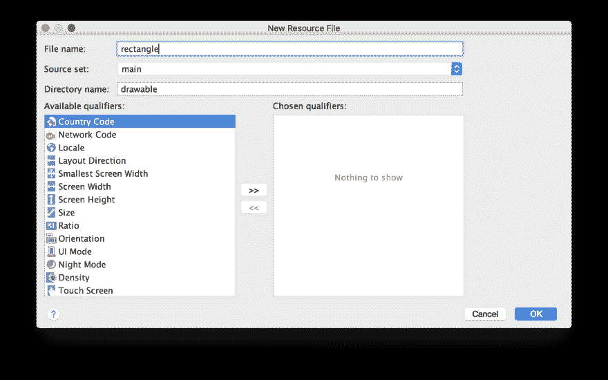
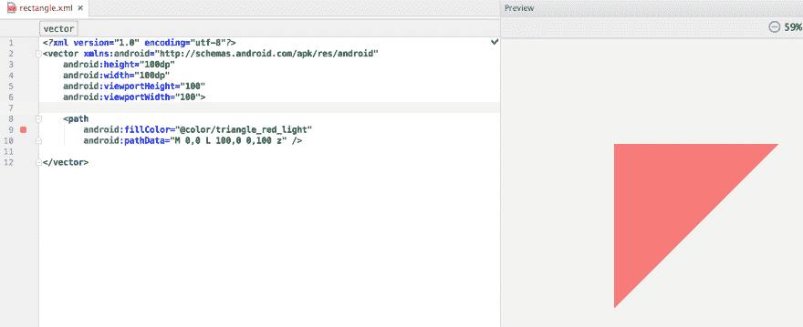
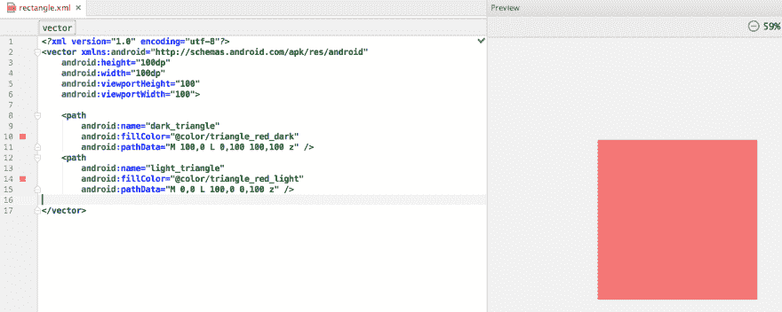
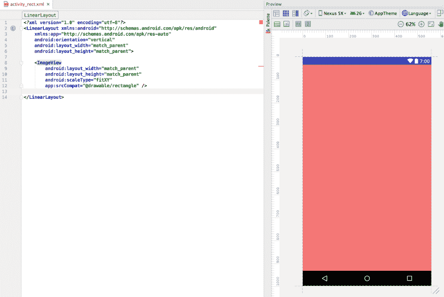

# 在 Android Studio 中创建简单的矢量绘图

> 原文：<https://dev.to/brightdevs/creating-simple-vector-drawables-in-android-studio-bbm>

使用矢量绘图通常比位图图像好得多，原因有两个:它们缩放而不丢失清晰度，并且您只需要一个适合所有屏幕密度的资源文件。

有时候我发现在 Android Studio 中使用 [SVG 路径](https://www.w3.org/TR/SVG/paths.html)手工创建矢量绘图很有用。

如果你还不熟悉，让我给你看一个例子。

[T2】](https://res.cloudinary.com/practicaldev/image/fetch/s--jhCCzuU_--/c_limit%2Cf_auto%2Cfl_progressive%2Cq_auto%2Cw_880/https://thepracticaldev.s3.amazonaws.com/i/mq0a93pknskv1ur1qouy.jpg)

# 举例

我将创建一个由两个颜色不同的相邻三角形组成的矩形，如下所示:

[T2】](https://res.cloudinary.com/practicaldev/image/fetch/s--1Q-HOJTf--/c_limit%2Cf_auto%2Cfl_progressive%2Cq_auto%2Cw_880/https://thepracticaldev.s3.amazonaws.com/i/5cjd1yz8y2ocbteghdes.png)

## 第一步:创建可绘制文件

[T2】](https://res.cloudinary.com/practicaldev/image/fetch/s--tkeFWwEW--/c_limit%2Cf_auto%2Cfl_progressive%2Cq_auto%2Cw_880/https://thepracticaldev.s3.amazonaws.com/i/tqcs6fhqgmy3rhurzjhu.png)

## 第二步:设置可画尺寸

```
<?xml version="1.0" encoding="utf-8"?>
<vector xmlns:android="http://schemas.android.com/apk/res/android"
    android:height="100dp"
    android:width="100dp"
    android:viewportHeight="100"
    android:viewportWidth="100">

</vector> 
```

Enter fullscreen mode Exit fullscreen mode

`android:width`和`android:height`属性定义了 drawable 的固有大小，所以当您以后使用宽度和高度为`wrap_content`的 drawable 时，这非常重要，比如:

```
<?xml version="1.0" encoding="utf-8"?>
<ImageView
        android:src="@drawable/rectangle"
        android:layout_width="wrap_content"
        android:layout_height="wrap_content" /> 
```

Enter fullscreen mode Exit fullscreen mode

`android:viewportWidth`和`android:viewportHeight`属性对我们来说更重要，因为它们定义了绘制路径的画布大小。

## 第三步:画第一个三角形

让我们用第一个三角形填充一半的正方形画布，绘制一条穿过其顶点的路径: **A** 、 **B** 和 **C** 。

请注意坐标—画布的左上角是(0，0)，右下角是(100，100)，这是因为我们设置了`android:viewportWidth="100"`和`android:viewportHeight="100"`。

！【第一个三角形([https://thepractical dev . S3 . Amazon AWS . com/I/H4 gxfvddqhp 68 iirdcab . png](https://thepracticaldev.s3.amazonaws.com/i/h4gxfvddqhp68iirdcab.png))

你可以在`vector` :
里面加一个`path`来画一个路径

```
<path
    android:fillColor="[your color (e.g. from resources or RGB Hex)]"
    android:pathData="[SVG path commands]" /> 
```

Enter fullscreen mode Exit fullscreen mode

这里我们需要以下 SVG 命令:

*   **米** —绝对**移动到**
*   **L** —绝对**线到**
*   **z** — **闭合路径**

绘制三角形包括:

1.  从 **A=(0，0)** : `M 0,0`开始一条路径
2.  画一条线到 **B=(100，0)** : `L 100,0`
3.  画一条线到 **C=(0，100)** : `L 0,100`
4.  关闭路径:`z`

我们也可以使用 relative **lineto ( `l` )** 命令来代替，并提供连接这些点的向量，如下所示:

*   从 **A** 到 **B** : `l 100,0`
*   从 **B** 到 **C** : `l -100,100`

同样值得注意的是，如果您连续多次使用同一个命令，可以在后续命令中消除命令字母。所以最后的命令看起来是这样的:`M 0,0 L 100,0 0,100 z`

让我们把它放在可绘制文件中:

```
<?xml version="1.0" encoding="utf-8"?>
<vector xmlns:android="http://schemas.android.com/apk/res/android"
    android:height="100dp"
    android:width="100dp"
    android:viewportHeight="100"
    android:viewportWidth="100">

    <path
        android:fillColor="@color/triangle_red_light"
        android:pathData="M 0,0 L 100,0 0,100 z" />

</vector> 
```

Enter fullscreen mode Exit fullscreen mode

我们可以在预览面板中看到三角形:

[T2】](https://res.cloudinary.com/practicaldev/image/fetch/s--OWcVpuxP--/c_limit%2Cf_auto%2Cfl_progressive%2Cq_auto%2Cw_880/https://thepracticaldev.s3.amazonaws.com/i/t6w9380nyz35604u8ldr.png)

## 第四步:画第二个三角形

因为我们已经知道如何绘制路径，所以创建另一个三角形非常简单。它的顶点是:

*   **B=(100，0)**
*   **C=(0，100)**
*   **D=(100，100)**

所以路径命令是:`M 100,0 L 0,100 100,100 z`

产生的 XML 现在看起来像这样:

```
<?xml version="1.0" encoding="utf-8"?>
<vector xmlns:android="http://schemas.android.com/apk/res/android"
    android:height="100dp"
    android:width="100dp"
    android:viewportHeight="100"
    android:viewportWidth="100">

    <path
        android:name="dark_triangle"
        android:fillColor="@color/triangle_red_dark"
        android:pathData="M 100,0 L 0,100 100,100 z" />

    <path
        android:name="light_triangle"
        android:fillColor="@color/triangle_red_light"
        android:pathData="M 0,0 L 100,0 0,100 z" />

</vector> 
```

Enter fullscreen mode Exit fullscreen mode

提示:你可以命名路径，这样当你的绘图变得更复杂时，就更容易找到它们。

[T2】](https://res.cloudinary.com/practicaldev/image/fetch/s--NSX6ITtm--/c_limit%2Cf_auto%2Cfl_progressive%2Cq_auto%2Cw_880/https://thepracticaldev.s3.amazonaws.com/i/ue1yzn5bdll5dl33fi4e.png)

## 第五步:使用带有 ImageView 的 drawable

现在我们可以使用 drawable。正如你所看到的，通过使用`android:layout_width`、`android:layout_height`和`android:scaleType`属性可以很容易地对其进行缩放。

```
<?xml version="1.0" encoding="utf-8"?>
<LinearLayout xmlns:android="http://schemas.android.com/apk/res/android"
    xmlns:app="http://schemas.android.com/apk/res-auto"
    android:orientation="vertical"
    android:layout_width="match_parent"
    android:layout_height="match_parent">

    <ImageView
        android:layout_width="match_parent"
        android:layout_height="match_parent"
        android:scaleType="fitXY"
        app:srcCompat="@drawable/rectangle" />

</LinearLayout> 
```

Enter fullscreen mode Exit fullscreen mode

[T2】](https://res.cloudinary.com/practicaldev/image/fetch/s--Kx1IYTM_--/c_limit%2Cf_auto%2Cfl_progressive%2Cq_auto%2Cw_880/https://thepracticaldev.s3.amazonaws.com/i/masdcrzx7d095adnrpbj.png)

最初发布于 [brightinventions.pl](https://brightinventions.pl/blog/)

作者 Andrzej Zabost，光明发明
[博客](https://azabost.com/)，[电子邮件](//andrzej.zabost@brightinventions.pl)的安卓开发者

### 进一步阅读

*   [https://developer . Android . com/training/material/drawables . html # VectorDrawables](https://developer.android.com/training/material/drawables.html#VectorDrawables)
*   [https://developer . Android . com/reference/Android/graphics/drawable/vectordrawable . html](https://developer.android.com/reference/android/graphics/drawable/VectorDrawable.html)