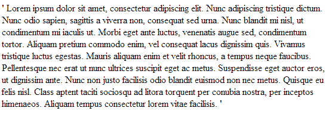

# CSS:在伪元素之前和之后

> 原文：<https://dev.to/mandarbadve/css-before-and-after-pseudo-element>

*本帖最初发表于[blog.mandarbadve.com](http://blog.mandarbadve.com/2014/02/02/css-pseudo-element/)T3】*

元素前后的前后插入内容。

下面我们来看一个例子。

下面是 HTML:

```
<p>
Lorem ipsum dolor sit amet, consectetur adipiscing elit. Nunc adipiscing tristique dictum. Nunc odio sapien, sagittis a viverra non, consequat sed urna. Nunc blandit mi nisl, ut condimentum mi iaculis ut. Morbi eget ante luctus, venenatis augue sed, condimentum tortor. Aliquam pretium commodo enim, vel consequat lacus dignissim quis. Vivamus tristique luctus egestas. Mauris aliquam enim et velit rhoncus, a tempus neque faucibus. Pellentesque nec erat ut nunc ultrices suscipit eget ac metus. Suspendisse eget auctor eros, ut dignissim ante. Nunc non justo facilisis odio blandit euismod non nec metus. Quisque eu felis nisl. Class aptent taciti sociosqu ad litora torquent per conubia nostra, per inceptos himenaeos. Aliquam tempus consectetur lorem vitae facilisis.
</p> 
```

Enter fullscreen mode Exit fullscreen mode

这是 CSS

```
p:before
{
    content:"'";
    font-weight:bold;
}
 p:after
{
    content:"'";
    font-weight:bold;
} 
```

Enter fullscreen mode Exit fullscreen mode

在上面的 css 中，我们在 p 元素上应用了:before 和:after。我们将内容设置为单引号，字体的粗细设置为粗体。

这是 p 元素如何呈现到浏览器中。

[T2】](https://i0.wp.com/blog.mandarbadve.com/wp-content/uploads/2014/02/beforeandafter.png)

您将看到单引号出现在 p 元素内容的前后。

你可以在这里看到活生生的例子[http://jsfiddle.net/mandarBadve/3ye7E/](http://jsfiddle.net/mandarBadve/3ye7E/)