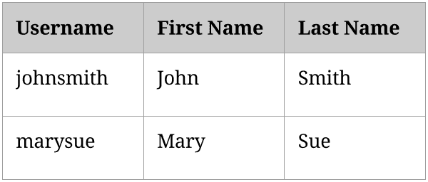
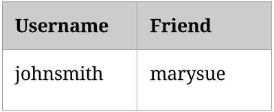
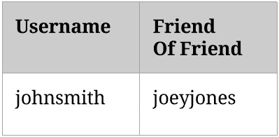
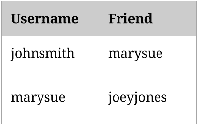

# 数据建模对产品经理来说很重要

> 原文：<https://dev.to/pbeekums/data-modeling-is-important-for-product-managers>

数据建模在[高级软件开发基础课程中占有突出的位置。](https://professorbeekums.com/lessons/workingwithsoftware/list)入门课有一大块是专门讲这个的。第二课专门讲这个。未来的课程计划在上面。我也将在某个时候创建一个完整的课程。

它之所以如此突出，是因为它在软件开发中非常重要。这也不仅仅是针对开发者的。参与开发产品的每个人都应该在某种程度上理解它。这对产品经理来说尤其重要。

为了理解为什么，让我们暂时忽略数据建模这个术语。最好的产品经理对用户流有很强的理解。他们知道用户为什么要购买一个产品，也知道用户为什么会选择使用这个产品。他们需要知道用户正在获得价值，以便这些用户不断回来。

这需要对用户与产品的每一个主要交互都有深刻的理解。这些交互中的每一个都有来自用户的动作和来自产品的结果。这些交互中的每一个都需要为用户提供价值。**这些互动中的每一个也都是基于某种数据的。**

一个电子商务网站有产品数据。它向用户提供产品的描述、价格、图片和评论。每一个都向用户提供了他们是否想购买的信息。这就是他们的价值。许多电子商务网站也会将用户本身存储为数据。订单历史也是数据，可以用来向用户提供他们可能喜欢的其他产品的推荐。

社交网络也有用户数据。它还存储用户之间的关系和用户之间的通信。这两种东西都是数据类型。

搜索引擎也需要数据。他们需要了解各种网站的内容，以便为用户搜索提供高质量的结果。他们可以通过存储更多的数据来获得更好的结果:用户实际点击的结果。这使得搜索引擎能够提炼结果，因为他们现在知道用户认为什么是相关的。

如果你厌倦了我列出所有的数据:很好！

一切都是一个数据点。这使得它不仅仅是一个技术细节。这是一种表现产品是什么和它做什么的方式。

数据的存储方式恰好也是软件开发人员编写代码的基础。如果开发人员不能很好地组织他们的数据，这个基础将会非常不稳固。这使得数据模型成为产品经理的工作和开发人员的工作之间奇妙的重叠。它提供了一种在任何东西被构建之前可视化产品的通用方法，从而实现了更好的沟通。

一个很好的例子是我在脸书应用程序工作时提出的一个功能。该功能需要检索用户及其朋友的信息，最重要的是他们朋友的朋友的信息。第二级分离增加了巨大的成本。看看数据就能说明原因。

我们可以将用户存储为一种类型的数据，其中每个用户都是一个数据点。

[T2】](https://res.cloudinary.com/practicaldev/image/fetch/s--_hkFNvIT--/c_limit%2Cf_auto%2Cfl_progressive%2Cq_auto%2Cw_880/https://blog.professorbeekums.com/img/2017/4/user.png)

然后，我们可以将两个用户之间的友谊存储为另一种类型的数据。用户的每个朋友都是一个数据点:

[T2】](https://res.cloudinary.com/practicaldev/image/fetch/s--CE07QJBR--/c_limit%2Cf_auto%2Cfl_progressive%2Cq_auto%2Cw_880/https://blog.professorbeekums.com/img/2017/4/friendship.png)

朋友的朋友呢？我们可以选择像这样存储另一种类型的数据:

[T2】](https://res.cloudinary.com/practicaldev/image/fetch/s--7og9hwEK--/c_limit%2Cf_auto%2Cfl_progressive%2Cq_auto%2Cw_880/https://blog.professorbeekums.com/img/2017/4/friendoffriend.png)

这引发了许多问题，其中之一就是你该如何对待朋友的朋友的朋友？还是朋友的朋友的朋友的朋友？每一个分离度都会增加另一种我们必须考虑的数据类型。

然而，我们可以用关系的单一数据类型来处理所有这些。如果你存储了约翰和玛丽是朋友的事实，那么你可以通过查看玛丽的朋友得到约翰的朋友的朋友。

[T2】](https://res.cloudinary.com/practicaldev/image/fetch/s--cEz6pPZs--/c_limit%2Cf_auto%2Cfl_progressive%2Cq_auto%2Cw_880/https://blog.professorbeekums.com/img/2017/4/morefriends.png)

所以这听起来很容易。提议的功能有什么问题？

一个人在脸书上的朋友数量变化很大。有些人只有几十个朋友。但是有些有几百或几千个。这就是我们的问题所在。如果约翰有 1000 个朋友，他的每个朋友也有 1000 个朋友，那么我们现在有**百万个数据点**需要考虑！这并不是 100%正确，但是通常更大的数字意味着更大的开发成本，因为开发人员需要编写更多的代码来优化特性。

处理一百万个数据点不是一个不可克服的问题，但是它可能是一个昂贵的问题。如果特性是产品的核心部分，那就超级值得开发。如果它只是一些看起来很酷的东西，并且只为用户提供少量的价值，那么它就变得不值得了。

多个公司和多个产品之间的竞争意味着每个公司都需要高效。他们需要以最小的功能开发投资为用户提供最大的价值。

在上面的例子中，这个特性只是简单地和整个团队讨论了一下，然后由于投资回报不佳而被砍掉了。让团队中的每个人都了解数据是如何工作的，这使得这种富有成效的对话成为可能。

但是我们必须考虑另一个成本。一个产品经理的时间是非常宝贵的。在与开发人员讨论一个特性之前，人们会花多少时间来规划它？几个小时？几天？

对数据有深刻理解的产品经理天生就知道什么时候一些东西的实现会很昂贵。他们可以在花费精力充实与开发人员对话的想法之前排除它。他们可能不知道如何编写代码来实现某个功能，但他们仍然可以通过思考数据如何工作来计算投资回报。

了解数据建模的产品经理会更好地了解他们的产品，更好地与开发人员沟通，更好地了解他们想法的成本/收益。

*本帖最初发表于[blog.professorbeekums.com](https://blog.professorbeekums.com/data-modeling-product-managers/)T3】*