# 使用 Apache Zeppelin 的数据可视化–教程

> 原文：<https://dev.to/scalegrid/data-visualization-using-apache-zeppelin--tutorial-340>

在当今世界，数据正以指数级的速度生成，以至于分析师预测，到 2025 年，我们的全球数据创造量将增长[10 倍。企业现在正在收集影响其公司的所有内部系统和外部来源的数据；随之而来的是不断增长的分析数据的需求，以深入了解如何使用数据来改善和增强他们的业务决策。Apache Zeppelin 是一个开源数据分析和可视化平台，它可以帮助我们实现这一目标。](http://www.information-age.com/data-forecast-grow-10-fold-2025-123465538/)

在本文中，您将学习如何为 [MongoDB](https://www.mongodb.com/) 和 [MySQL](https://www.mysql.com/) 添加自定义解释器，以及如何使用它来查询和可视化集合数据。首先，让我们从 Apache Zeppelin 及其特性集的概述开始:

# 什么是阿帕奇齐柏林飞艇？

[Apache Zeppelin](https://zeppelin.apache.org/) 是一款开源、基于网络的“笔记本”，支持交互式数据分析和协作文档。该笔记本集成了分布式通用数据处理系统，如 [Apache Spark](https://spark.apache.org/) (大规模数据处理)、 [Apache Flink](https://flink.apache.org/) (流处理框架)和许多其他系统。Apache Zeppelin 允许您在浏览器中使用 SQL、Scala、R 或 Python 制作漂亮的、数据驱动的交互式文档。

[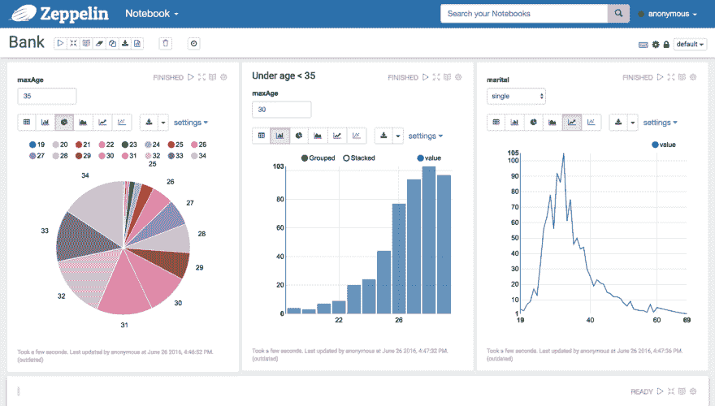T2】](https://res.cloudinary.com/practicaldev/image/fetch/s--G_psVNm7--/c_limit%2Cf_auto%2Cfl_progressive%2Cq_auto%2Cw_880/https://scalegrid.io/blog/wp-content/uploads/2017/10/pasted-image-0.png)

## 特性

### 交互界面

Apache Zeppelin 有一个交互式界面，让您可以立即看到您的分析结果，并与您的创作保持即时联系:

[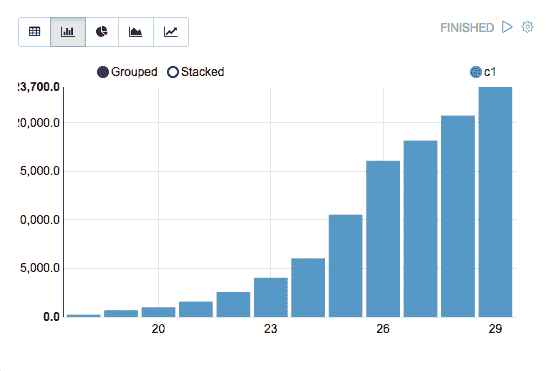T2】](https://scalegrid.io/blog/wp-content/uploads/2017/10/pasted-image-0-1.png)

### 集成

集成许多不同的开源、大数据工具，如 Apache projects Spark、Flink、Hive、Ignite、Lens 和 Tajo。

### 浏览器笔记本

创建在您的浏览器中运行的笔记本(在您的机器上和远程),并尝试不同类型的图表来浏览您的数据集:

[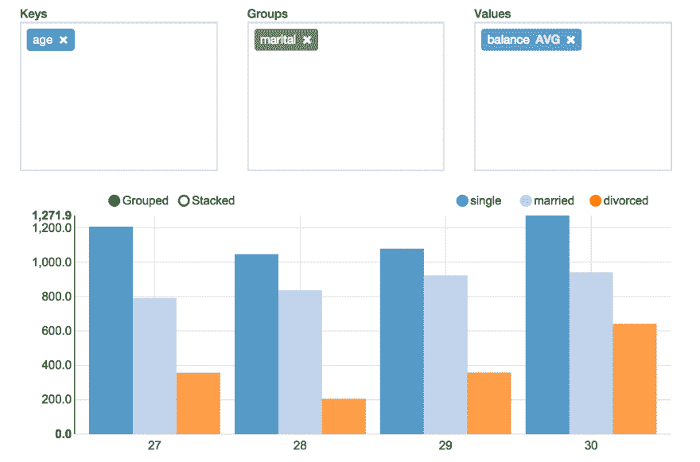T2】](https://scalegrid.io/blog/wp-content/uploads/2017/10/pasted-image-0-2.png)

[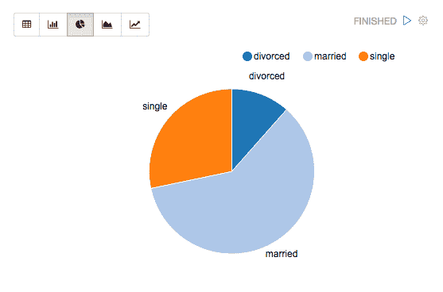T2】](https://res.cloudinary.com/practicaldev/image/fetch/s--EVCY8tLZ--/c_limit%2Cf_auto%2Cfl_progressive%2Cq_auto%2Cw_880/https://scalegrid.io/blog/wp-content/uploads/2017/10/pasted-image-0-3.png)

### 动态表单

在您的笔记本上动态创建输入表单。

[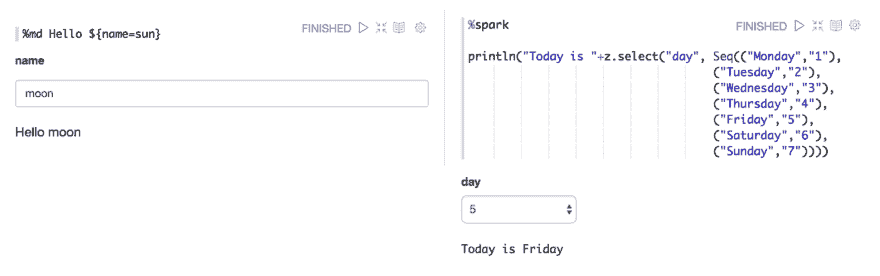T2】](https://scalegrid.io/blog/wp-content/uploads/2017/10/pasted-image-0-5.png)

### 协作&分享

一个多样化且充满活力的开发人员社区让您可以访问不断添加的新数据源，并通过他们的开源 Apache 2.0 许可证进行分发。

[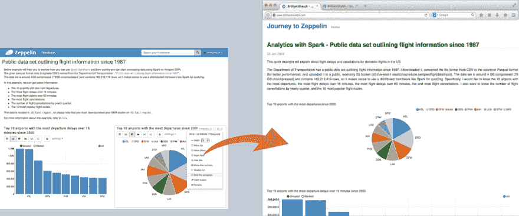T2】](https://scalegrid.io/blog/wp-content/uploads/2017/10/pasted-image-0-7.png)

### 解释器

Apache Zeppelin 解释器概念允许任何语言/数据处理后端插入 Zeppelin。目前，Apache Zeppelin 支持许多解释器，如 Apache Spark、Python、JDBC、Markdown 和 Shell。

[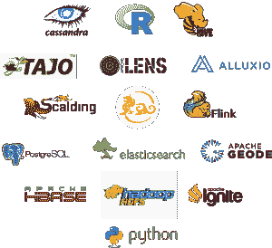T2】](https://scalegrid.io/blog/wp-content/uploads/2017/10/pasted-image-0-8.png)

现在，让我们开始为 MongoDB 和 MySQL 创建自定义解释器。

# 添加一个 MySQL 解释器

在 Apache Zeppelin 平台中，转到右上方的下拉菜单，并点击解释器:

[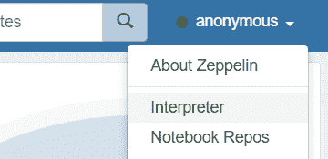T2】](https://scalegrid.io/blog/wp-content/uploads/2017/10/pasted-image-0-9.png)

您可以在这里找到所有口译员的列表。我们需要为 MySQL 创建一个新的，所以点击右上角的“创建”按钮:

[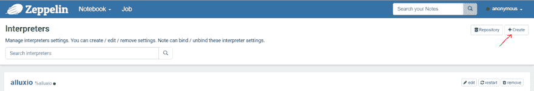T2】](https://scalegrid.io/blog/wp-content/uploads/2017/10/pasted-image-0-10.png)

为解释器输入一个可识别的名称(如 mysql ),并选择“分组为 JDBC ”:

[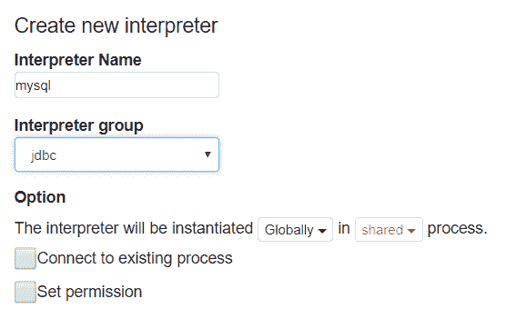T2】](https://scalegrid.io/blog/wp-content/uploads/2017/10/pasted-image-0-11.png)

保留所有默认选项，但输入所需的详细信息，并确保建立到 MySQL 服务器的连接:

[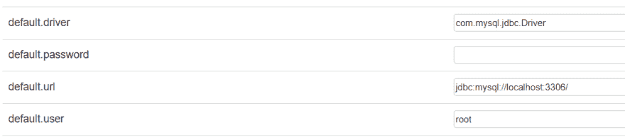T2】](https://scalegrid.io/blog/wp-content/uploads/2017/10/pasted-image-0-12.png)

我们还需要在 MySQL 连接器 JAR 中添加一个定制的工件，这样 Zeppelin 就知道从哪里执行它。在这里下载连接器[，将它放在解释器/jdbc 文件夹中，然后提供工件的确切路径:](https://dev.mysql.com/downloads/connector/j/3.1.html)

[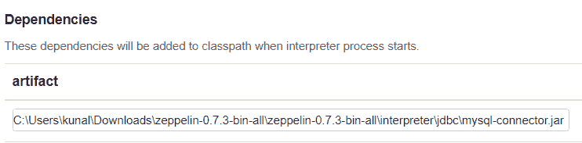T2】](https://scalegrid.io/blog/wp-content/uploads/2017/10/pasted-image-0-13.png)

就是这样！为了测试我们的解释器，我们需要创建一个新的注释。但是首先，让我们设置我们的 MongoDB 解释器。

# 添加一个 MongoDB 解释器

回到你的翻译页面，点击“创建”按钮。我们将使用这个开源的 MongoDB 解释器,所以接下来您需要下载。zip 文件，并将其重命名为. jar。

然后，转到 interpreters/，创建一个 mongodb/文件夹，并粘贴。jar 到文件夹中。

[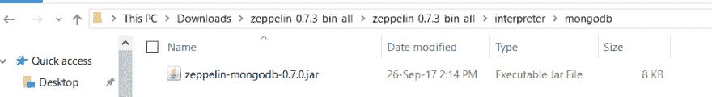T2】](https://scalegrid.io/blog/wp-content/uploads/2017/10/pasted-image-0-14.png)

现在您将拥有一个名为 mongodb 的新解释器组。转到您的解释器页面，输入一个友好的名称，比如 mongodb，然后在解释器组下拉菜单中选择 mongodb。

[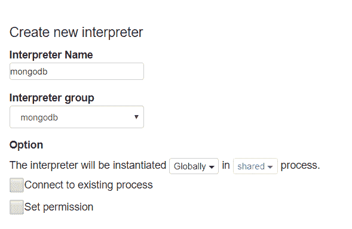T2】](https://scalegrid.io/blog/wp-content/uploads/2017/10/pasted-image-0-15.png)

现在，让我们在“Properties”中输入新创建的 ScaleGrid MongoDB 集群的详细信息，该属性位于集群详细信息页面的 Overview/Machines 部分。

[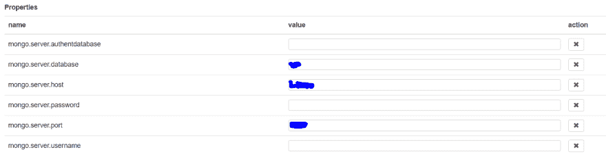T2】](https://scalegrid.io/blog/wp-content/uploads/2017/10/pasted-image-0-16.png)

我们完事了。现在是测试我们新创建的解释器的时候了。

# 创建齐柏林飞船音符

为了运行有助于数据可视化的查询，我们需要创建注释。从 Zeppelin 标题面板中，点按“笔记本”，然后点按“创建新便笺”:

[T2】](https://scalegrid.io/blog/wp-content/uploads/2017/10/pasted-image-0-17.png)

确保笔记本标题显示连接状态，如右上角的绿点所示:

[T2】](https://scalegrid.io/blog/wp-content/uploads/2017/10/pasted-image-0-18.png)

创建便笺时，会出现一个对话框让您输入更多信息。选择默认解释器作为我们新创建的 mysql，然后单击“创建注释”。

[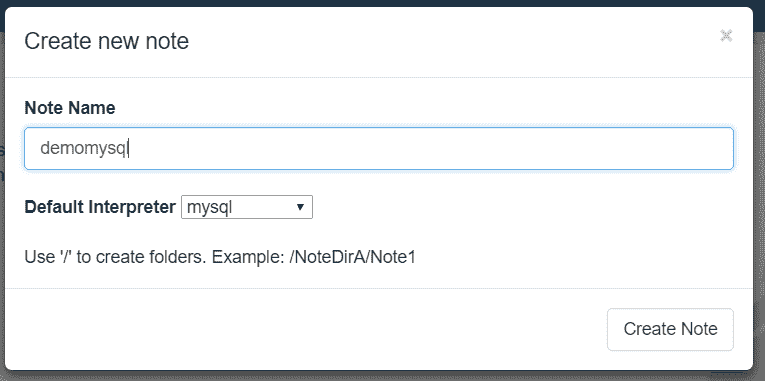T2】](https://scalegrid.io/blog/wp-content/uploads/2017/10/pasted-image-0-19.png)

# 对票据运行查询

在我们运行任何查询之前，我们还需要提到我们将为笔记使用的解释器的类型。我们可以用“%mysql”开始我们的笔记。这将告诉 Zeppelin 在注释中期待 MySQL 查询。

[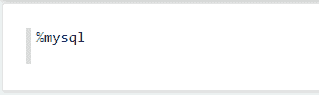T2】](https://scalegrid.io/blog/wp-content/uploads/2017/10/pasted-image-0-20.png)

现在，我们准备好查询我们的数据库。出于这个例子的目的，我将使用我的 WordPress 安装，它包含一个典型的 wp_options 表来查询和可视化它的数据。

[T2】](https://scalegrid.io/blog/wp-content/uploads/2017/10/pasted-image-0-21.png)

有用！现在，您可以单击各种图表，以不同的图形格式显示数据。

[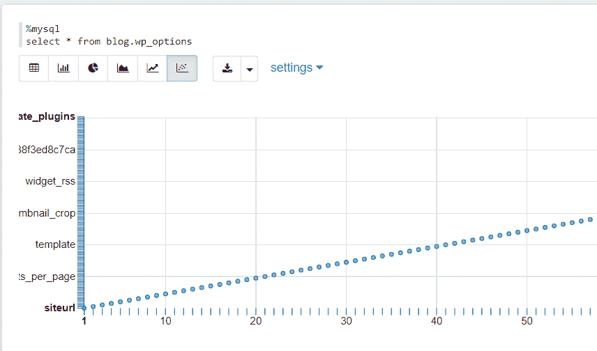T2】](https://scalegrid.io/blog/wp-content/uploads/2017/10/pasted-image-0-22.png)

类似地，对于 MongoDB，确保在 MongoDB 集群中有数据。您可以通过进入 Admin 选项卡并运行 Mongo 查询来添加一些。

下面是笔记中一些 MongoDB 数据的例子:

[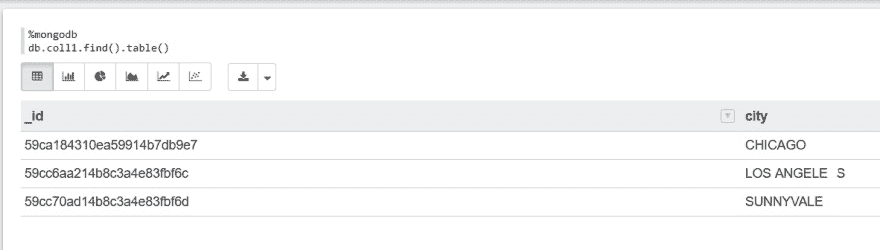T2】](https://scalegrid.io/blog/wp-content/uploads/2017/10/Inkedpasted-image-0-23_LI.jpg)

# 分享笔记的链接

既然您的数据已经准备好进行可视化和查询，您可能想向您的团队展示一下。通过创建笔记的可共享链接，您可以非常轻松地做到这一点:

[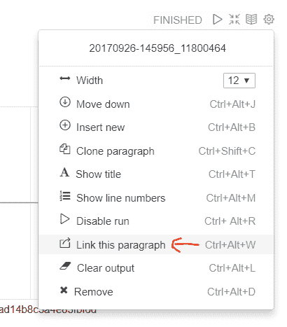T2】](https://scalegrid.io/blog/wp-content/uploads/2017/10/pasted-image-0-24.png)

任何人都可以查看此可共享链接，您也可以选择仅共享特定图表的链接:

[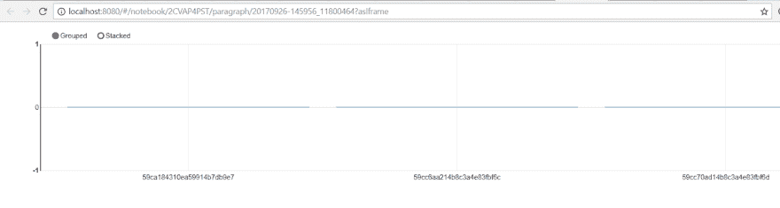T2】](https://scalegrid.io/blog/wp-content/uploads/2017/10/pasted-image-0-25.png)

# 阿帕奇齐柏林飞艇结论

Apache Zeppelin 是一个非常有用的工具，它允许团队使用许多不同的可视化选项、表格和可共享的协作链接来管理和分析数据。

您还可以探索通过 MongoDB GUI 可视化您的数据的其他方法，包括前四种: [MongoDB Compass、Robomongo、Studio 3T 和 MongoBooster](https://scalegrid.io/blog/which-is-the-best-mongodb-gui/) 。

以下是一些帮助您入门的链接:

[下载阿帕奇齐柏林飞艇](https://zeppelin.apache.org/download.html)

[MongoDB 解释器](https://github.com/bbonnin/zeppelin-mongodb-interpreter)

[MySQL 连接器](https://dev.mysql.com/downloads/connector/j/3.1.html)

和往常一样，如果你做了一些很棒的东西，一定要发微博给我们

如果您需要 Redis 托管和管理方面的帮助，请通过 [support@scalegrid.io](mailto:support@scalegrid.io) 联系我们以获取更多信息。