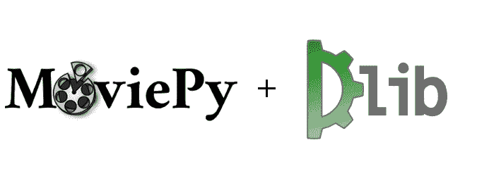
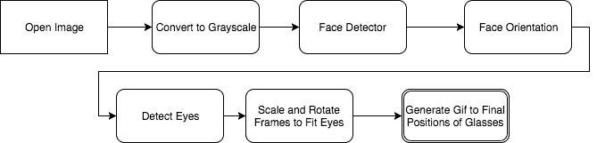
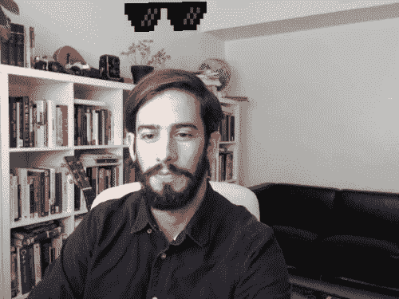

# 用 Python 处理人脸检测

> 原文：<https://dev.to/burningion/deal-with-it-in-python-with-face-detection-chi>

[处理它](http://knowyourmeme.com/memes/deal-with-it)是一个迷因，眼镜从屏幕上飞到用户的脸上。这种迷因的最佳实例以一种独特的方式做到了这一点。

今天我们将写一个自动热图生成器，使用任何静态的人脸图像作为输入。这段代码为 meme API 或者使用视频输入构建自己的动画版本提供了一个很好的起点。

我从埃里克·塔赫里(Erik Taheri)和他的浏览器(T2)JavaScript 版本(T3)那里得到了这篇文章的灵感。

作为奖励，在文章的最后，我还提供了一个版本，可以使用 OpenCV 通过网络摄像头实时实现这种效果。

## 人脸检测和 Gif 制作的工具

[T2】](https://res.cloudinary.com/practicaldev/image/fetch/s--oNjTPojR--/c_limit%2Cf_auto%2Cfl_progressive%2Cq_auto%2Cw_880/https://thepracticaldev.s3.amazonaws.com/i/dwnhn3hq8h784ptvnhfc.png)

我们将使用 Dlib 的`get_frontal_face_detector`，以及我们在 [Snapchat 镜头](/blog/building-a-snapchat-lens-effect-in-python/)文章中使用的 [68 点形状预测模型](https://github.com/davisking/dlib-models)。

我们的程序将接受一个命令行参数，即输入图像。然后，它将使用 Dlib 中的人脸检测算法来查看是否有人脸。如果有，它将为每张脸创建一个结束位置，眼镜应该在那里结束。

然后，我们需要缩放和旋转我们的眼镜，以适应每个人的脸。我们将使用从 Dlib 的 68 点模型返回的点集来找到眼睛的质心，以及它们之间空间的旋转。

在我们找到眼镜的最终位置和旋转方向后，我们可以制作一个 gif 动画，让眼镜从屏幕的顶部出现。我们将使用 MoviePy 和一个`make_frame`函数来绘制它。

## 架构自动 gif

[T2】](https://res.cloudinary.com/practicaldev/image/fetch/s--0xOvHrzY--/c_limit%2Cf_auto%2Cfl_progressive%2Cq_auto%2Cw_880/https://thepracticaldev.s3.amazonaws.com/i/sl4yvndw4cci2j9yc8ml.png)

该应用程序的架构相当简单。我们首先接收一个图像，然后将其转换为灰度 NumPy 数组。一旦我们得到了这些，我们就可以将检测到的人脸传递到我们的人脸方向预测模型中。

通过返回的脸部方向，我们可以选择出眼睛，并缩放和旋转我们的眼镜框以适应人的脸部。

我们可以积累一组面孔和它们的最终位置，将它们附加到一个列表中。

最后，有了这个列表，我们就可以使用 MoviePy 创建一个 draw 例程，然后生成我们的动画 gif。

## 编写代码

计划好代码架构后，接下来我们需要一步一步地构建代码。

我们将首先导入所有工具，并从命令行获取一个图像:

```
import dlib
from PIL import Image
import argparse

from imutils import face_utils
import numpy as np

import moviepy.editor as mpy

parser = argparse.ArgumentParser()
parser.add_argument("-image", required=True, help="path to input image")
args = parser.parse_args() 
```

有了这个，我们就可以调整我们的图像大小以适应更小的宽度，这样我们的 gif 就不会变得很大，并导入我们的面部检测器和形状预测器。

我们也可以打开眼镜和文本粘贴到我们的形象。

在这一点上，我们还应该检测在图像中是否检测到任何人脸。如果没有，我们应该立即退出。

```
detector = dlib.get_frontal_face_detector()
predictor = dlib.shape_predictor('shape_predictor_68.dat')

# resize to a max_width to keep gif size small max_width = 500

# open our image, convert to rgba img = Image.open(args.image).convert('RGBA')

# two images we'll need, glasses and deal with it text deal = Image.open("deals.png")
text = Image.open('text.png')

if img.size[0] > max_width:
    scaled_height = int(max_width * img.size[1] / img.size[0])
    img.thumbnail((max_width, scaled_height))

img_gray = np.array(img.convert('L')) # need grayscale for dlib face detection 
rects = detector(img_gray, 0)

if len(rects) == 0:
    print("No faces found, exiting.")
    exit()

print("%i faces found in source image. processing into gif now." % len(rects)) 
```

太好了！现在，我们可以对检测到的每张脸进行循环，并建立一个缩放和旋转眼镜的列表，以及它们的最终位置。

```
faces = []

for rect in rects:
    face = {}
    print(rect.top(), rect.right(), rect.bottom(), rect.left())
    shades_width = rect.right() - rect.left()

    # predictor used to detect orientation in place where current face is
    shape = predictor(img_gray, rect)
    shape = face_utils.shape_to_np(shape)

    # grab the outlines of each eye from the input image
    leftEye = shape[36:42]
    rightEye = shape[42:48]

    # compute the center of mass for each eye
    leftEyeCenter = leftEye.mean(axis=0).astype("int")
    rightEyeCenter = rightEye.mean(axis=0).astype("int")

    # compute the angle between the eye centroids
    dY = leftEyeCenter[1] - rightEyeCenter[1] 
    dX = leftEyeCenter[0] - rightEyeCenter[0]
    angle = np.rad2deg(np.arctan2(dY, dX)) 

    # resize glasses to fit face width
    current_deal = deal.resize((shades_width, int(shades_width * deal.size[1] / deal.size[0])),
                               resample=Image.LANCZOS)
    # rotate and flip to fit eye centers
    current_deal = current_deal.rotate(angle, expand=True)
    current_deal = current_deal.transpose(Image.FLIP_TOP_BOTTOM)

    # add the scaled image to a list, shift the final position to the
    # left of the leftmost eye
    face['glasses_image'] = current_deal
    left_eye_x = leftEye[0,0] - shades_width // 4
    left_eye_y = leftEye[0,1] - shades_width // 6
    face['final_pos'] = (left_eye_x, left_eye_y)
    faces.append(face) 
```

有了我们的最终位置以及我们的缩放和旋转眼镜，我们就可以把我们的电影放在一起了。我们将为整个 gif 设置一个持续时间，以及停止眼镜下降的时间，这样我们就可以在屏幕上显示交易文本。

```
# how long our gif should be duration = 4

def make_frame(t):
    draw_img = img.convert('RGBA') # returns copy of original image 
    if t == 0: # no glasses first image
        return np.asarray(draw_img)

    for face in faces: 
        if t <= duration - 2: # leave 2 seconds for text
            current_x = int(face['final_pos'][0]) # start from proper x
            current_y = int(face['final_pos'][1] * t / (duration - 2)) # move to position w/ 2 secs to spare
            draw_img.paste(face['glasses_image'], (current_x, current_y) , face['glasses_image'])
        else: # draw the text for last 2 seconds
            draw_img.paste(face['glasses_image'], face['final_pos'], face['glasses_image'])
            draw_img.paste(text, (75, draw_img.height // 2 - 32), text)

    return np.asarray(draw_img) 
```

你会注意到我在文本覆盖中使用了图像，而不是 Pillow 内置的文本绘制功能。我这样做是因为 Pillow 没有内置的文本笔画功能。如果没有笔画，文本在较亮的图像上会变得难以辨认。

最后，我们需要在 MoviePy 中创建一个`VideoClip`对象，并传递我们的动画生成帧和 fps。

```
animation = mpy.VideoClip(make_frame, duration=duration)
animation.write_gif("deal.gif", fps=4) 
```

有了这个，我们就完事了！

## 实时制作迷因动画

[T2】](https://res.cloudinary.com/practicaldev/image/fetch/s--iycKfguL--/c_limit%2Cf_auto%2Cfl_progressive%2Cq_66%2Cw_880/https://thepracticaldev.s3.amazonaws.com/i/pi4gqwgo41dvdezqibpx.gif)

既然我们已经有了生成 gif 的基础集，修改我们的代码来实时处理网络摄像头并不困难。

我们可以使用 OpenCV 作为源图像，并使用计数器跟踪动画，而不是从命令行加载源图像。完成这项工作的新代码非常简单，真正的要点是:

```
 # I got lazy, didn't want to bother with transparent pngs in opencv
        # this is probably slower than it should be
        if dealing:
            if current_animation < glasses_on:
                current_y = int(current_animation / glasses_on * left_eye_y)
                img.paste(current_deal, (left_eye_x, current_y), current_deal)
            else:
                img.paste(current_deal, (left_eye_x, left_eye_y), current_deal)
                img.paste(text, (75, img.height // 2 - 32), text)

    if dealing:
        current_animation += 1
        if current_animation > animation_length:
            dealing = False
            current_animation = 0
        else:
            frame = cv2.cvtColor(np.asarray(img), cv2.COLOR_RGB2BGR)
   cv2.imshow("deal generator", frame)
   key = cv2.waitKey(1) & 0xFF
    if key == ord("q"):
        break

    if key == ord("d"):
        dealing = not dealing 
```

这将创建一个计数器，并逐步查看已经进行了多少帧来记录时间。利用这一点，我们可以将我们的眼镜动画到它们的最终位置。我们观察用户是否按下`d`键来处理它，当他们按下时，我们开始我们的动画。

你可以在 [Github](https://github.com/burningion/automatic-memes) 上阅读剩余的代码。

## 何去何从

我们已经成功构建了一个程序的第一部分，它可以被用作自动生成迷因的 API。

通过将我们的程序与 Flask 之类的东西连接起来，我们可以显示一个网页，允许用户上传他们自己的图像，并获得完整的迷因。

有了 youtube-dl 这样的东西，我们可以让用户粘贴 YouTube url 视频来自动生成迷因。

如果你错过了，代码可以在 [Github](https://github.com/burningion/automatic-memes) 获得。

如果你对更多类似的项目感兴趣，请在 [Make Art with Python](https://www.makeartwithpython.com/signup) 上注册一个账户。当你这样做的时候，你会免费得到我新书的前三章，并且你会帮助我继续做这样的项目。