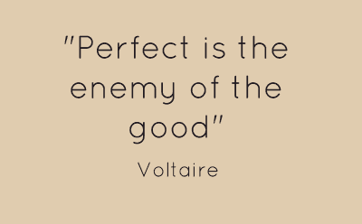

# 决策实践与国际象棋的比喻。

> 原文：<https://dev.to/aniketsmk/decisionmaking-practise-with-a-parable-of-chess-a41>

<figure> 

<figcaption>图片来自 [Dailyem](https://dailyem.wordpress.com/2013/04/01/proverb-of-the-day-perfect-is-the-enemy-of-good/)</figcaption>

</figure>

像其他事情一样，通过练习，你会变得更擅长决策。你是否曾经有过一个艰难的决定，并且无休止地思考该选择哪一个？

回想起来，你有没有意识到，如果你做出一个决定并坚持下去，在前进的过程中修正错误，你会过得更好？这是一个快速练习的好方法，你只需要一个棋盘。

这就是为什么国际象棋是一个伟大的代理。

> 在**每走三步**后，有超过**900 万个**不同的可能位置。在**四次**移动之后，每一次都有超过**2880 亿个**不同的可能位置。不同的移动游戏的数量远远大于可观测宇宙中的电子数量。— [象棋海报](http://www.chess-poster.com/english/notes_and_facts/did_you_know.htm)

听起来像是真实世界的小规模近似。

### 所以你要这么做。

开始一盘棋，在最多 15 秒内走完每一步。在这段时间里，考虑棋盘、你的优势和劣势、策略和结局，最重要的是行动。

你会犯错误，你会丢棋子，你会意识到你没有时间去想它们，因为你必须迈出下一步。你只有时间从你的错误中吸取教训，却没有足够的时间去哀悼。

> 你只有时间从你的错误中吸取教训，却没有足够的时间去哀悼。

你每隔 15 秒就这样做一次，直到游戏结束。你会意识到你需要考虑的事情并没有那么多。如果你专注于你的观点，你会发现重要的事情很少而且很明显。你们的策略走到了一起，你们知识上的差距稍微缩小了。有目的地练习，你会提高你的游戏/生意/编程。

当游戏结束时，你有丰富的经验可以回顾和学习，让你在下一次成为更好的玩家。

希望这能帮助你了解你自己，你的对手，并帮助你下好这盘人生的棋。

祝你好运，练习愉快！

* * *

*P.S:没有伙伴还好，这个速度，和自己玩也行！你没时间作弊了。【T2*

在下面评论你的想法和主意，你的决定的故事以及它们的结果。

也可以在推特上找到我，电话号码是 [@AniketSMK](https://twitter.com/AniketSMK)