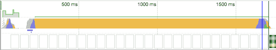
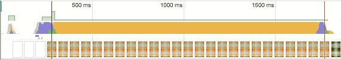
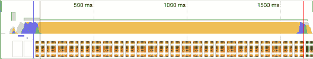
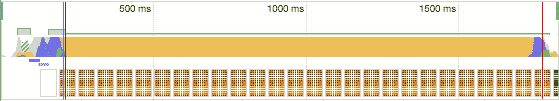

# 延迟脚本以加快渲染速度

> 原文：<https://dev.to/borisschapira/defer-scripts-to-speed-up-rendering-3pml>

艺术家不是唯一遭受空白页面之苦的人，你的用户也是。他们的挫折感会导致他们过早地放弃你的页面。有几种技术可以帮助您加快渲染速度并避免这个问题。其中之一是推迟 JavaScript 文件的解析。

现代浏览器被设计成能更快地呈现页面。例如，当页面出现时，它们扫描页面，寻找稍后呈现页面时需要的资源的 URL(图像、CSS，但更具体地说，是 JavaScript 文件)。这在 Chrome 和 Safari 中称为[预加载扫描](https://plus.google.com/+IlyaGrigorik/posts/8AwRUE7wqAE)，在 Firefox 中称为[推测解析](https://developer.mozilla.org/en-US/docs/Web/HTML/Optimizing_your_pages_for_speculative_parsing)，在 Internet Explorer 中称为前瞻下载。此功能允许浏览器在构建自己的 HTML 代码模型、文档对象模型(DOM)和 CSS 代码模型(CSSOM)时开始获取资源。

由于 Javascript 的原因，这不是一个连续的过程。因为这些脚本可能会修改 HTML 元素及其样式，所以浏览器在每次获取和解析 Javascript 文件时都会停止构建 DOM。之后，浏览器等待 CSSOM 结构的中断来执行脚本。因为 DOM 和 CSSOM 是呈现的支柱:没有 DOM 和 CSSOM，就没有呈现。

在本文中，我们将重点讨论如何改进 JavaScript 文件的渲染时间。

<figure>

[T2】](https://res.cloudinary.com/practicaldev/image/fetch/s--0levpbji--/c_limit%2Cf_auto%2Cfl_progressive%2Cq_auto%2Cw_880/https://thepracticaldev.s3.amazonaws.com/i/tf35qmmnscbuhya6rewz.png)

<figcaption>

即使 DOM(蓝色)的构造大部分发生在 JavaScript(黄色)执行之前，它也只会在执行之后结束。在这种脚本加载的“默认”配置中，DOM 构建得非常晚。显示被延迟。

</figcaption>

</figure>

## 区分关键和非关键 JS

为了减少渲染时间，您必须尽可能推迟 JavaScript 文件的解析。但是如果你试一试，你会发现事情并不像看起来那么简单。

您的 JavaScript 文件可能包含几种类型的代码部分，您可能需要尽快加载其中的一些:JavaScript 业务特定的代码(例如，分析)，具有强烈视觉冲击力的库，对第三方脚本的依赖性，您不能推迟…

这些 JS 代码行被称为“关键 JavaScript”。将它们分组到一个可识别的文件中，通常称为 *critical.js* 。像任何 JS 文件一样，浏览器在执行它之前必须获取、解析和评估它。

即使您进行了所有的优化来减少需要通过网络传输的数据量(在客户端和服务器端从文件中清除未使用的代码、缩小、压缩、缓存)，浏览器仍然需要解析和评估 JavaScript。由于这个步骤[花费了](https://medium.com/dev-channel/the-cost-of-javascript-84009f51e99e) [大量的时间](https://medium.com/dev-channel/the-cost-of-javascript-84009f51e99e)，你必须尽可能地保持你的关键 JS 文件的流线型。

所有其他的脚本都应该被延迟，异步，或者移动到页脚，有时几件事情同时发生。让我们来看看这些不同的技术。

## 将非关键脚本移动到页面底部

推迟浏览器解析 JavaScript 文件的一个非常简单直观的方法是将声明放在 HTML 页面的末尾，就在`</body>`标签之前。这样做的话，浏览器将不会知道任何脚本，直到它几乎构建了整个 DOM。

尽管这种技术似乎适用于大多数情况，但它有一个严重的缺点。它不仅延迟了脚本评估，还延迟了它们的下载，这排除了它对大型脚本的使用。此外，如果您的资源不是由 HTTP/2 提供服务的，或者来自外部域，那么您还会在检索时间上增加大量的解析时间。

显然，由于这种技术发生在 DOM 构造的最后，我们也提醒您[不要求助于使用 document.write](https://blog.dareboost.com/en/2016/09/avoid-using-document-write-scripts-injection/) 的脚本，因为浏览器必须完全重新构建它。

<figure>

[T2】](https://res.cloudinary.com/practicaldev/image/fetch/s--4Fmjr550--/c_limit%2Cf_auto%2Cfl_progressive%2Cq_auto%2Cw_880/https://thepracticaldev.s3.amazonaws.com/i/9tiusoarxkfa35crtpms.png)

<figcaption>

通过将脚本推回到页面的末尾，显示区域的完成要快得多，但并不确定(JavaScript 的执行改变了一部分内容)

</figcaption>

</figure>

## 注入一个动态`<script>`标签怎么样？

如上所述，延迟下载脚本并不总是解决问题的办法。您可能更喜欢使 is **异步**:脚本被立即检索，而这个阶段不会阻塞 DOM 的构造。一旦可用，DOM 的构建就会被中断，以便浏览器解析和评估其内容。

一种方法是不在页面的源代码中声明这个脚本，而是使用另一个脚本将它直接注入 DOM。这种技术称为动态脚本标记，是大多数第三方服务的支柱。

这种技术的一个主要优点是您可以选择何时注入脚本。如果想立即注入，可以使用立即调用的函数表达式:

```
<script>
   (function () {
       var e = document.createElement('script');
       e.src = 'https://mydomain.com/script.js';
       e.async = true; // See the following explanation
       document.head.insertBefore(e, document.head.childNodes[document.head.childNodes.length - 1].nextSibling);
   }());
</script> 
```

Enter fullscreen mode Exit fullscreen mode

但是您也可以延迟注入，以便它仅在特定事件被触发时发生。下面是如何在 DOM 准备好的时候注入脚本:

```
<script>
   // IE9+
   function ready(fn) {
       if (document.attachEvent ? document.readyState === "complete" : document.readyState !== "loading") {
           fn();
       } else {
           document.addEventListener('DOMContentLoaded', fn);
       }
   }

   ready(function () {
       var e = document.createElement('script');
       e.src = '[https://mydomain.com/script.js](https://mydomain.com/script.js)';
       e.async = true; // See the following explanation
       document.head.insertBefore(e, document.head.childNodes[document.head.childNodes.length - 1].nextSibling);
   });
</script> 
```

Enter fullscreen mode Exit fullscreen mode

您可能会对使用复杂的 insertBefore 而不是简单的 appendChild 感到惊讶。我邀请您阅读 Paul Irish 的“ [Surefire DOM 元素插入](https://www.paulirish.com/2011/surefire-dom-element-insertion/)”。

尽管这种技术看起来很有趣，但它也有缺点。首先，以这种方式注入的脚本不再按照注入的顺序进行评估。所以你不能用这种技术来注入几个互相需要的脚本。

其次，动态脚本标签不是完全异步的。正如简介中所解释的，浏览器确保在执行注入脚本的 JS 代码之前，CSS 对象模型[的构建已经完成。因此，该脚本不会立即执行。为了向浏览器解释无需等待构建 CSSOM 就可以加载脚本，您必须向脚本添加`async`属性。](https://www.igvita.com/2014/05/20/script-injected-async-scripts-considered-harmful/)

但是要小心:一个脚本，即使有 async 属性，也总是被认为是一个页面资源。因此,`window.onload`事件将被它的执行所延迟。如果其他脚本依赖于此事件，您应该预料到延迟。

<figure>

[T2】](https://res.cloudinary.com/practicaldev/image/fetch/s--WLbhSU4B--/c_limit%2Cf_auto%2Cfl_progressive%2Cq_auto%2Cw_880/https://thepracticaldev.s3.amazonaws.com/i/i28oe9eub9wymsvq5wbm.png)

<figcaption>

掌握得好的话，动态标签注入是最有效的技术之一，可以快速构建 DOM 并几乎立即显示。但是，请注意，这些脚本不是按顺序执行的！

</figcaption>

</figure>

## `async``defer`，或者两者兼而有之

`async`和`defer`是 HTML5 标准化的两个属性。它们允许您在加载脚本时修改浏览器的默认行为。

如果`async`属性存在，那么脚本会被尽快获取，然后执行。不保留`async`脚本的声明顺序:脚本一旦可用就会被执行。但是请注意，即使脚本检索不会停止 DOM 构造，它们的执行也会停止。

<figure>

[T2】](https://res.cloudinary.com/practicaldev/image/fetch/s--IrEr8uFU--/c_limit%2Cf_auto%2Cfl_progressive%2Cq_auto%2Cw_880/https://thepracticaldev.s3.amazonaws.com/i/g46f31oicilj6abng1hh.png)

<figcaption>

这里，再一次，非常渐进的加载。另一方面，对于动态脚本，我们丢失了 JS 的执行顺序。

</figcaption>

</figure>

如果`defer`属性存在，脚本将尽快被获取，但是浏览器将在执行它之前等待 DOM 树完成。由于现在大多数浏览器都实现了预加载器，所以带有“defer”属性的脚本的行为与放在 HTML 内容末尾的脚本的行为非常相似。

<figure>

[T2】](https://res.cloudinary.com/practicaldev/image/fetch/s--KJF7OyCL--/c_limit%2Cf_auto%2Cfl_progressive%2Cq_auto%2Cw_880/https://thepracticaldev.s3.amazonaws.com/i/qwjoqlpln53pd3eyuqh8.png)

<figcaption>

这种可选的可视化模式有助于完全理解 DOM(蓝色)和脚本(黄色)的同时评估。即使稍后执行脚本，也可以节省一些时间。

</figcaption>

</figure>

至于一起使用`async`和`defer`，这不是很有用，除了一个用例，遗留支持:

> 即使指定了[异步](https://www.w3.org/TR/html/semantics-scripting.html#element-attrdef-script-async)属性，也可以指定[延迟](https://www.w3.org/TR/html/semantics-scripting.html#element-attrdef-script-defer)属性，以使仅支持[延迟](https://www.w3.org/TR/html/semantics-scripting.html#element-attrdef-script-defer)(而不支持[异步](https://www.w3.org/TR/html/semantics-scripting.html#element-attrdef-script-async))的传统 Web 浏览器退回到[延迟](https://www.w3.org/TR/html/semantics-scripting.html#element-attrdef-script-defer)行为，而不是默认的阻塞行为。
> <cite>[HTML 5.1 第二版，W3C 推荐 2017 年 10 月 3 日](https://www.w3.org/TR/html/semantics-scripting.html#element-attrdef-script-async)</cite>

## 加载 JavaScript 文件:取回控制权，即使在第三方脚本上

我们已经看到不缺少异步恢复和执行脚本的技术。尽管如此，有些脚本仍然需要声明为同步的，比如 A/B 测试脚本，它们有时会有意地阻止渲染，以便在脚本对内容进行定制之前对用户隐藏内容(因为这些脚本经常会修改站点的视觉效果，所以阻止 DOM 和 CSSOM 是有意义的)。

即使在这种情况下，你也不必失去控制。我们鼓励您选择考虑到 web 性能的解决方案。一些严肃的演员，如 Google Optimize、Kameleoon 或 Optimizely，会限制分配给恢复和执行脚本的时间。如果超过此时间，浏览器将中止 A/B 脚本回收或执行。不要犹豫，将这个超时时间减少到最低限度，以确保您的访问者的体验质量。