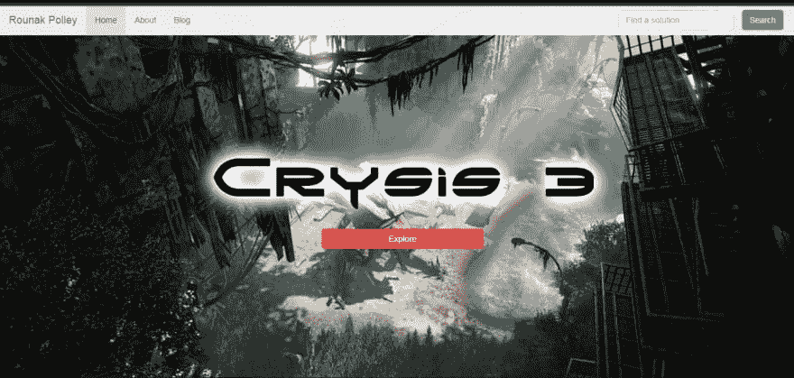

# 设计简单的主页

> 原文：<https://dev.to/rounakpolley/designing-of-a-simple-home-page>

[T2】](https://res.cloudinary.com/practicaldev/image/fetch/s--Hl4SHMUq--/c_limit%2Cf_auto%2Cfl_progressive%2Cq_auto%2Cw_880/https://thepracticaldev.s3.amazonaws.com/i/20o6mrz0t1783qb63mgd.PNG)

参见 [CodePen](https://codepen.io) 上 Rounak Polley ( [@cfjr](https://codepen.io/cfjr) )的 Pen [简单主页](https://codepen.io/cfjr/pen/xLpJax/)。

首先，主页看起来没有特定的方式，这完全取决于个人品味和创建网站的目的。即使一些特征倾向于或多或少保持不变。像所有的主页一样，有一个导航栏，一个英雄区，号召行动按钮，华丽的背景图片，也许还有一句标语。

所以，我们首先需要决定在我们的主页上需要多少内容。根据这一点，我们可以确定在导航栏中我们需要多少个标签，我们需要一个搜索框或者一个下拉列表等等。其他决定因素是行动号召按钮(如登录、注册、探索等)。

在决定了所有的“基本要求”之后，仍然有一些简单而又酷的效果，我们可以用它们来使我们的**主页**看起来很棒，并且可以在几乎所有的设计场景中使用。我将在这里描述其中的一些。

# 导航条

我们主页最重要的部分。有时，我们希望导航条贴在页面的顶部，或者改变导航条链接的字体大小(例如，顶部的字体大小最初较大，随着用户向下滚动，字体逐渐变小，等等)。

```
$(document).scroll(function() 
    {
            scroll_position = $(this).scrollTop(); //current vertical position of the scroll bar 
            if(scroll_position > threshold)
            {   
                //style of navbar after crossing 'threshold'
            } 
            else 
            {   
                //style of navbar before crossing 'threshold'
            }
     }); 
```

这里，`threshold`可以是一个像素值或者类似于`$('#threshold__element_id').offset().top`的值，这样跨越一个特定的元素就会触发样式的变化。
使用 *Bootstrap* 框架让生活变得更加轻松，因为我们可以轻松地将导航条调整为移动设备的*汉堡菜单*按钮。注意:为了获得更渐变的效果，我们可以使用`if`T3..`else`逐步改变造型。

# 背景

当然，一个漂亮且合适的背景图像或图形可以很好地添加一个微妙的效果，比如视差效果。当滚动时背景图像以不同于前景内容的速度移动，并且背景图像平滑变换时的视差效果。
诀窍是保持前景内容的高度比实际视点高度小得多。

# 滚动辅助或自动滚动

这也是很常见的，因为大多数网页都有一些按钮或图标，比如“顶部”或“返回顶部”。这可以通过使用锚定元件`<a href="#target_id">Auto Scroll</a>`很容易地完成。
但是这使得滚动变得很突然，我们可以做的是通过添加一个简单的动画到所需元素的点击事件处理程序中来使它变得更优雅。
`$('html, body').animate({ scrollTop: $('#scroll_to_id').offset().top }, 1000);`
1000 不过是动画以毫秒(即 1s)为单位的时间段。

完整的代码和解释...

参见 [CodePen](https://codepen.io) 上 Rounak Polley ( [@cfjr](https://codepen.io/cfjr) )的 Pen [简单主页](https://codepen.io/cfjr/pen/xLpJax/)。