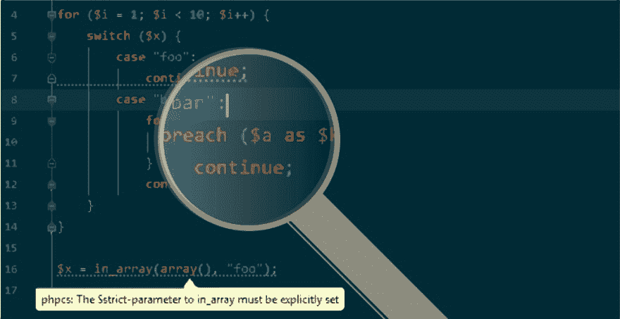

# 使用 PHP_CodeSniffer 检测 PHP 代码中隐藏的 bug

> 原文：<https://dev.to/moxio/detecting-hidden-bugs-in-php-code-using-phpcodesniffer-2kf7>

[T2】](https://res.cloudinary.com/practicaldev/image/fetch/s--za78XQBt--/c_limit%2Cf_auto%2Cfl_progressive%2Cq_auto%2Cw_880/https://cdn-images-1.medium.com/max/1024/1%2AbZImz4zCSge6Cb1uO5gQGA.jpeg)

尽管 PHP 作为一种编程语言为我们提供了很好的服务，但我们不能否认它的一些行为可能会非常令人惊讶。如果没有意识到这些缺陷，这很容易导致 PHP 代码中隐藏的错误。事实上，我们自己也遇到过这些问题，但我们会努力采取措施防止再次遇到这些问题。在这篇文章中，我们将探讨 PHP 中的两个潜在陷阱，以及如何使用我们的 PHP_CodeSniffer 开源嗅探集合来检测和避免这些陷阱。

### 愚弄我一次，不要脸

快速，下面的代码是做什么的？

```
<?php 
$chars = str_split("The quick brown fox jumps over the lazy dog."); foreach ($chars as $char) {
    switch (strtoupper($char)) {
        case "A": 
        case "E": 
        case "I": 
        case "O": 
        case "U": 
        case "Y": 
            continue; 
    }

print $char; 
} 
```

想到这段代码片段会打印出去掉了所有元音的输入字符串也就不奇怪了。然而，它实际上只是打印原始字符串，包括元音([自己看](https://3v4l.org/qBcK4))。这种行为是由于 PHP [出于 continue 的目的，将](http://php.net/manual/en/control-structures.continue.php) [switch 语句视为循环结构](http://php.net/manual/en/control-structures.continue.php)造成的。continue 因此跳转到 switch 语句的末尾(而不是 foreach 主体的末尾),并且仍然打印所有元音字母。如果我们想跳过上面例子中的元音，我们必须使用 continue 2 跳转到 foreach-body 的末尾。

我最近在一段代码中发现了这个 bug 的有趣行为。尽管我以前见过类似上面的例子，因此应该知道这种复杂性，但我仍然花了太多时间试图找出为什么我的代码没有产生预期的结果。

### 愚弄我两次，可耻的是我

为了防止再次被这种怪癖所困扰，我们决定实现一些东西来自动检测上述情况，并警告我们它的意外行为。为此，我们选择为 [PHP_CodeSniffer](https://github.com/squizlabs/PHP_CodeSniffer) 编写一个定制的 *sniff* ，我们已经使用它来执行编码标准。PHP_CodeSniffer 使用的基于标记和范围的方法使得检查顶级 continue 语句的所有 switch-case(即不在嵌套循环结构中)并查看它们是否有数字“level”参数变得容易。我们不允许任何没有明确循环次数的 continue 语句跳过:

```
<?php
for ($i = 1; $i < 10; $i++) {
    switch ($x) {
        case "foo": 
            continue; // NOT OK, probably a bug 
        case "bar": 
            foreach ($a as $k => $v) {
                continue; // OK, inside a nested 'foreach' 
            }
            continue 2; // OK, explicit 'level'-argument 
    } 
} 
```

这就警告我们像上面这样潜在的隐藏错误。如果我们从 PHP_CodeSniffer 得到一个错误，但 continue 的行为实际上是我们想要的(尽管我无法想象为什么在这种情况下不使用 break)，我们总是可以用 continue 1 替换 continue，以确认我们已经考虑过这种情况并抑制错误。

### 忽悠我三次，…

如果这是使用 PHP 时唯一隐藏的陷阱就好了…由于非严格比较带来的所有问题，我们已经有了一个检查来执行严格比较操作符(===等。)而不是它们的非严格对应物(==等等。).但是，仍然有一些 PHP 函数会让你惊讶于默认的非严格比较行为，比如 [in_array](https://twitter.com/fabpot/status/460707769990266880) 和 array_search。

这就是为什么我们还实现了一个 PHP_CodeSniffer sniff，它要求显式设置这些函数的$ strict-parameter:

```
<?php 
in_array("foo", [0]); // NOT OK, might introduce hidden bugs in_array("foo", [0], true); // OK, strict comparison
in_array("foo", [0], false); // OK, you have probably thought about this 
```

虽然我们仍然可以选择非严格的行为，但这应该可以防止我们在没有明确要求的情况下处理复杂的非严格比较。

### …开源发布

为了帮助 PHP 社区的其他人避免这些陷阱，我们决定开源我们的 PHP _ code sniffer sniffers。使用 [Composer 包](https://packagist.org/packages/moxio/php-codesniffer-sniffs)，可以很容易地将它们作为开发依赖项添加到其他项目中，或者作为独立的规则集，或者通过将它们集成到您自己的 PHP_CodeSniffer 标准中。

我们有更多的 PHP 陷阱需要检查，所以请继续关注我们(通过在 [Twitter](https://twitter.com/moxio) 上关注我们或者订阅我们的 [RSS 提要](https://www.moxio.com/rss/blog))以获得更多的嗅探！

*最初发表于*[*【www.moxio.com】*](https://www.moxio.com/blog/10/detecting-hidden-bugs-in-php-code-using-php-codesniffer)*。*

* * *