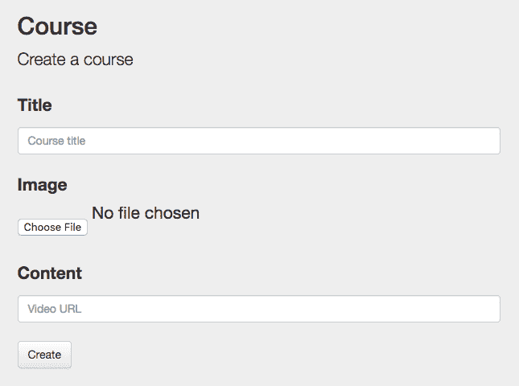

# 开发人员取消编程:事件来源补充入门

> 原文：<https://dev.to/barryosull/developer-deprogramming-getting-started-in-event-sourcing-a8>

当我开始构建基于事件的应用程序时，有两件事我希望我知道。

1.  在构建或设计任何东西之前，无论多么“简单”,都要和领域专家交流
2.  永远从事件开始，不要从 UI 开始，不管它有多“简单”

当我们忽略上述内容，只是向前迈进时，我们总是以基于 CRUD 的事件结束。这些事件十有八九不会反映实际的业务流程，相反，它们会妨碍开发，使开发更加困难和缓慢。

# 积垢的问题

[CRUD](https://en.wikipedia.org/wiki/Create,_read,_update_and_delete) 代表创建/读取/更新/删除。大多数数据库都是在 CRUD 模型上运行的，比如 MySQL 或 MongoDB。您从数据库中读取一个模型，更改一个值，然后更新数据库中的记录。这一切都相当简单。

CRUD 是我们作为开发人员训练自己思考的方式。作为我们日常工作的一部分，我们将规格转换成表格，然后将我们对这些数据的所有操作建模为 CRUD。见鬼，我们的大部分 ui 都是以基于 CRUD 的形式来表达的，所以难怪我们对这个概念如此着迷。

问题是，领域专家不会用粗俗的术语说话，那是我们的语言，不是他们的。每当我们在没有与领域专家交流的情况下构建解决方案时，我们都会使用我们最熟悉的语言自己填补知识空白。我们最终将我们的事件建模为 CRUD 操作，即使它与业务本身的语言或流程完全不匹配。正如下面的故事所展示的那样，这最终导致了巨大的麻烦。

# 弄错的例子

这个故事取材于过去的经验，一些细节有所改变，但核心信息是一样的。

我们是一个开发在线培训产品的小团队。我们有多个独立的服务，其中一个有一个叫做`Course`的概念。

```
Course
    title: Trust Building Tutorial
    image: https://i.ytimg.com/vi/WbVhL5LLfBA/maxresdefault.jpg
    content: https://www.youtube.com/watch?v=dQw4w9WgXcQ 
```

A `Course`是某个话题的培训视频。从概念上讲，这是一个非常简单的对象，它有一个标题、一张图片和内容。这些属性也很简单，`title`是非空字符串，`image`和`content`都是通过 GUI 上传的文件的 URL。所以我们决定让`Course`成为一个集合，它有一个简单的生命周期并且是自包含的。一切都好。

首先，我们从 UI 模型开始，分解它们的预期行为。

[T2】](https://res.cloudinary.com/practicaldev/image/fetch/s--9etDv70V--/c_limit%2Cf_auto%2Cfl_progressive%2Cq_auto%2Cw_880/https://thepracticaldev.s3.amazonaws.com/i/he90aojp384p261t0ju5.png)

我们看到用户可以创建、更新和删除课程(你可以看到 CRUD 语言已经开始使用)。因此，我们提出了以下命令和事件。

#### 命令:

*   创建课程
*   更新课程
*   删除课程

#### 事件:

*   课程已创建
*   课程更新
*   课程已删除

## 这是怎么了？

这看起来很简单，但是仔细看，你会发现这个设计中的漏洞。

### 1。没有足够的上下文

首先，它没有告诉我们任何有趣的事情。当然，课程更新了，但是实际上更新了什么呢？标题变了吗，形象变了吗？任何关心标题更改的服务都必须跟踪该标题的历史记录，以便检查它是否发生了更改。这么简单的任务要做很多工作。

### 2。改变起来很昂贵

以上事件比较脆。如果“课程”改变了形状，例如添加了一个描述，那么您必须升级每个“课程创建”和“课程更新”事件，并更新每个使用该事件的服务。仅仅给一门课程添加描述就要做很多额外的工作。

### 3。不一致的语言

当我们听取领域专家的意见时，我们注意到没有一个人说他们已经“创建了一门课程”。相反，他们说他们已经“增加了一门课程”。这是一个微妙的变化，但它清楚地表明我们创造了自己的语言，而不是使用他们的语言。现在，开发和业务团队会使用不同的语言来描述相同的东西，这导致了混乱和不必要的争论。*

## 为什么会这样？

我们，像大多数刚开始从事事件源开发的开发者一样，仍然在 CRUD 方面思考。基于 UI，我们知道命令的类型和它们需要的数据，所以我们认为我们已经有足够的细节来开始实现。到了实际创建事件的时候，我们使用我们的命令作为指导，将它们转换成过去式，并将它们称为事件。一对一的映射，这是我们在没有和领域专家交谈的情况下完全虚构的。

简而言之，我们从 UI 开始，而我们应该从域事件开始。难怪是错的。哎呀。

# 事件实际上应该是怎样的？

为了回答这个问题，我们不得不与领域专家交谈，弄清楚他们认为什么是重要的。在这样做的时候，我们需要忽略我们已经建立的模型，因为它是基于我们自己的语言，而不是业务。

所以我们采访了他们，问他们“当你管理一门课程时，你会怎么做？”对他们来说什么是重要的。然后我们翻转问题，问他们“对别人来说什么是重要的？”，他们告诉谁某些类型的变化？

这是一次大开眼界的练习。专家告诉我们，每当增加或更改课程时，他们都会告诉营销和代码转换团队。深入研究，我们问他们实际上对那些团队说了什么，什么时候说的。

事实证明，营销团队需要知道课程当前的名称和形象，或者如果课程被删除，他们不关心其他任何事情。

相反，代码转换团队关心的是内容，其他什么都不关心。

同样，在他们的语言中，创建一个标题/图片/内容和更新它之间没有区别，这种区别是我们自己创造的(基于我们自己对 CRUD 概念的内化)。

这会导致以下事件和命令。

#### 事件:

*   课程已添加
*   课程标题集
*   课程图像集
*   课程内容集
*   课程已移除

#### 命令:

*   AddCourse
*   改变航向
*   移除课程

## 为什么这样比较好？

现在让我们看看这些事件与旧事件相比如何。

### 1。大量的上下文

对于新事件，营销和转码团队/服务只需监听他们关心的事件。他们不再需要筛选事件来判断变化对他们是否重要，这使得整个系统更加简单。这是[告诉，不要问原则](https://martinfowler.com/bliki/TellDontAsk.html)的事件驱动示例。

### 2。容易改变

以上述假设情况为例，我们想给课程添加一个描述。我们不会更新现有的事件，而是将此事件建模为一个新的、谨慎的业务变化。所以我们将简单地添加一个名为`CourseDescriptionSet`的新事件。这种改变相对容易实现，并且它只影响集合，不需要事件升级者。这种变化也不会影响任何外部服务，它们可以继续使用现有的`Course`事件。因此我们的系统不容易改变。这实际上是[开/关原理](https://en.wikipedia.org/wiki/Open/closed_principle)在起作用。

### 3。一致的语言

开发人员和领域专家在相同的粒度上使用相同的语言。这种共同的理解在代码中被明确地建模，使得它更容易理解。这将使未来的互动更加简单，并最大限度地减少误解。

# 结论

经过一点探索，我们设法使`Course`集合对我们的系统整体上更有用，比基本的 CRUD 实现公开了更丰富的功能。

简而言之，与领域专家交谈。不管你是否正在开发一个基于事件的应用程序(尽管它真的很有帮助)，和他们谈谈。这将让你超越基本的 CRUD 实现，因此你可以构建有用的、可理解的软件。记住，一个有序列图的充实的 UI 不能代替与专家的真正对话。所以不要假设你明白问题所在，保持谦逊并提出问题，这将为你节省大量的时间。

## 在和领域专家交谈时的一个旁白

值得注意的是，我们必须更深入地研究领域专家的答案，才能真正理解哪些事件是重要的。当向他人解释过程时，人们会直观地压缩过程，有时会省略信息以保持简单。这就是为什么你需要详细探究他们的答案来提取隐藏的领域概念。基本上，不断询问他们，直到他们给出一致的答案(不过要做得漂亮)。

如果你想了解更多关于面试领域专家的信息，请留下评论，我很乐意与你交谈。如果有足够多的人感兴趣，我会写一篇关于它的文章(众包文章！).