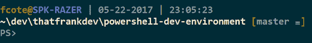

# Windows 上的开发人员工具:更清晰的 PowerShell 配置文件

> 原文：<https://dev.to/thatfrankdev/developer-tooling-on-windows-a-cleaner-powershell-profile>

# Windows 上的开发人员工具:更清晰的 PowerShell 配置文件

*我最初于[42 lignes l ' heure](http://42lignes.com/code/un-profil-powershell-propre)T3 用法语发表了这篇文章*

如果你一直在和我讨论代码，PowerShell 可能会在某个时候出现。在 2006 年 PowerShell 推出之前，Windows 上的开发人员如果想尝试命令行，就必须使用 good old BATCH (cmd.exe)。当然，人们可以设法用它完成一些事情，并以某种方式处理它的所有棘手部分，但事实是 BATCH 远不是一个伟大的工具。

进入 PowerShell，通过批量解决让开发人员痛苦的几个痛点，我们走得更远。其中之一是缺乏对概要文件脚本的本地支持。这就是这篇文章的内容。

这个快速指南建议了一个简单的方法来创建一个可重用的、结构化的和演进的 PowerShell 配置文件。

## 为我们的脚本创建一个 Git 存储库

这是存储概要文件脚本的明显方式。我个人选择了 GitHub，但是有很多选择。 [Gitlab](https://gitlab.com) 和 [Bitbucket](https://bitbucket.org/) 都提供免费的私有库，如果这对你很重要的话。

### 知识库结构

```
powershell-dev-environment/
├── src/
│   ├── profile.ps1
│   ├── _imports.ps1
│   ├── _prompt.ps1
│   └── _ui.ps1
└── install.ps1 
```

Enter fullscreen mode Exit fullscreen mode

## 进入点

文件`profile.ps1`是我们概要文件的入口点。

```
# profile.ps1  $env:devProfileDir  =  $PSScriptRoot  .  "$env:devProfileDir\_imports.ps1";  .  "$env:devProfileDir\_ui.ps1";  .  "$env:devProfileDir\_prompt.ps1"; 
```

Enter fullscreen mode Exit fullscreen mode

注意，我们定义了`$env:devProfileDir`，一个环境变量，它将存储我们脚本的位置。它可能有用。

文件`_imports.ps1`用于加载我们希望在 PowerShell 会话中可用的所有第三方模块。

```
# _imports.ps1  Import-Module  posh-git  # an so on... 
```

Enter fullscreen mode Exit fullscreen mode

这里要小心，有些模块可能需要很长时间才能加载(是的，我完全是在看着你 [Carbon](http://get-carbon.org/) )，所以要对你选择包含在这个文件中的内容有所选择。

## 颜色

终端显示颜色在`_ui.ps1`
中配置

```
# _ui.ps1  $console  =  $host.UI.RawUI  $console.ForegroundColor  =  "white"  $console.BackgroundColor  =  "black"  $colors  =  $host.PrivateData  $colors.VerboseForegroundColor  =  "white"  $colors.VerboseBackgroundColor  =  "blue"  $colors.WarningForegroundColor  =  "yellow"  $colors.WarningBackgroundColor  =  "darkgreen"  $colors.ErrorForegroundColor  =  "white"  $colors.ErrorBackgroundColor  =  "red"  Clear-Host 
```

Enter fullscreen mode Exit fullscreen mode

## 提示功能

提示功能是一种特殊的“保留”PowerShell 功能。它的执行是为了呈现命令行提示符。一旦您在个人资料中定义了它，您就可以完全控制提示的外观。下面是我的:

```
# _prompt.ps1  function  Prompt  {  $realLASTEXITCODE  =  $LASTEXITCODE  $Host.UI.RawUI.ForegroundColor  =  $GitPromptSettings.DefaultForegroundColor  Write-Host  Write-Host  "$ENV:USERNAME@"  -NoNewline  -ForegroundColor  DarkYellow  Write-Host  "$ENV:COMPUTERNAME"  -ForegroundColor  Magenta  -NoNewline  Write-Host  (Get-Date  -Format  " | MM/dd/yyyy | HH:MM:ss")  -ForegroundColor  DarkGray  Write-Host  $($(Get-Location)  -replace  ($env:USERPROFILE).Replace('\','\\'),  "~")  -NoNewline  -ForegroundColor  Gray  Write-VcsStatus  Write-Host  $global:LASTEXITCODE  =  $realLASTEXITCODE  return  ""  } 
```

Enter fullscreen mode Exit fullscreen mode

这是它在终端中的样子:

[T2】](https://res.cloudinary.com/practicaldev/image/fetch/s--51pyWLIP--/c_limit%2Cf_auto%2Cfl_progressive%2Cq_auto%2Cw_880/https://4.bp.blogspot.com/-okseuC5zGMw/WSQZLLHGO6I/AAAAAAAAADE/IUAV-9_sxMcVmFn3p640XzbVguBBozNvgCKgB/s640/prompt_sample.png)

## 在 PowerShell 会话启动时执行配置文件脚本

如果你和我一样，你喜欢把所有的库放在同一个地方。因此，您新创建的存储库的路径可能类似于`c:\users\me\dev\powershell-dev-environment`，并且您可能希望保持这种方式。

有一个内置的`$profile`变量存储当前用户的 PowerShell 配置文件的路径。它通常指向类似于`C:\Users\Me\Documents\WindowsPowerShell\Microsoft.PowerShell_profile.ps1`的东西。当这个文件存在时，Powershel 将在每个新的会话中自动执行它。

问题是我们不能改变这条路。我们唯一的选择是从那里直接调用我们的配置文件。我们只需通过添加调用我们脚本的下面一行代码来进入这个文件:

```
.  "c:\users\me\dev\powershell-dev-environment\src\profile.ps1" 
```

Enter fullscreen mode Exit fullscreen mode

## 因为我们都太懒了:一点安装脚本

前面的步骤可以很容易地用下面的位自动完成:

```
# install.ps1  $installedHint  =  "#https://github.com/thatfrankdev/powershell-dev-environment"  $installed  =  $false  if(-not  (Test-Path  $profile)){  New-Item  $profile  }  else{  $installed  =  (Select-String  -Path  $profile  -pattern  $installedHint  |  Measure-Object).Count  -gt  0  }  if(-not  $installed){  Add-Content  $profile  ""  Add-Content  $profile  ". `"$PSScriptRoot\src\profile.ps1`"  $installedHint"  powershell.exe  } 
```

Enter fullscreen mode Exit fullscreen mode

# 下一步

我们现在有了多用途的基础结构。这只是一个开始...

在下一篇文章中，我将探索一些方便的助手功能，它们可以极大地改善你的日常工作流程。

* * *

感谢阅读，希望你喜欢:)

英语是我的第二语言，所以请告诉我你是否发现了打字错误、语法错误或任何可能使这篇文章难以阅读的地方。我一直在努力做得更好。