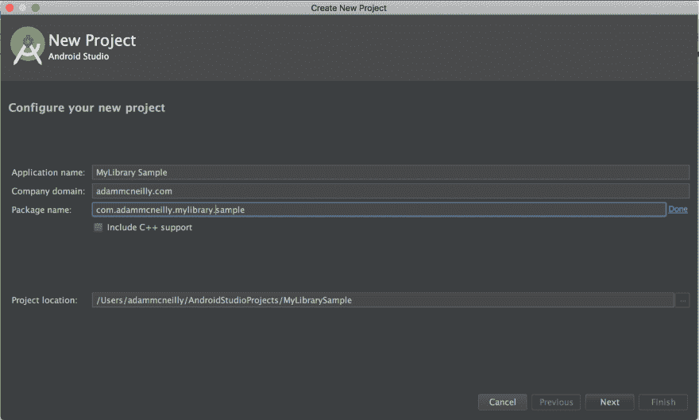
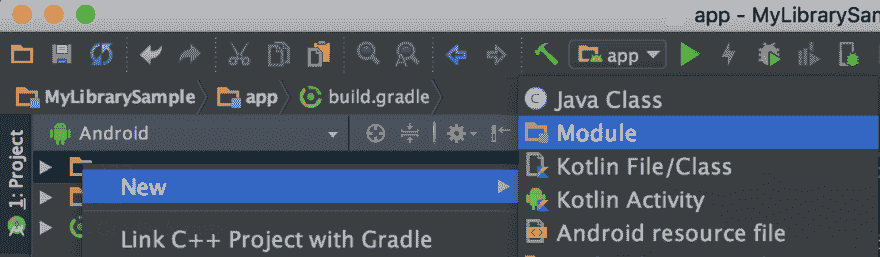
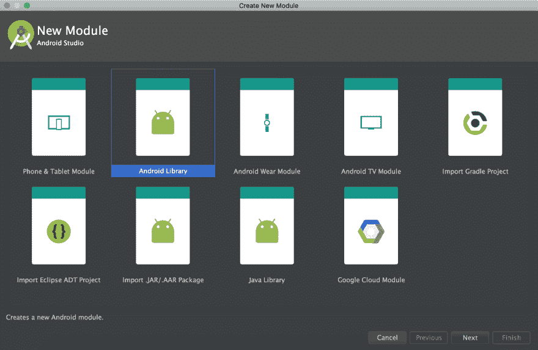
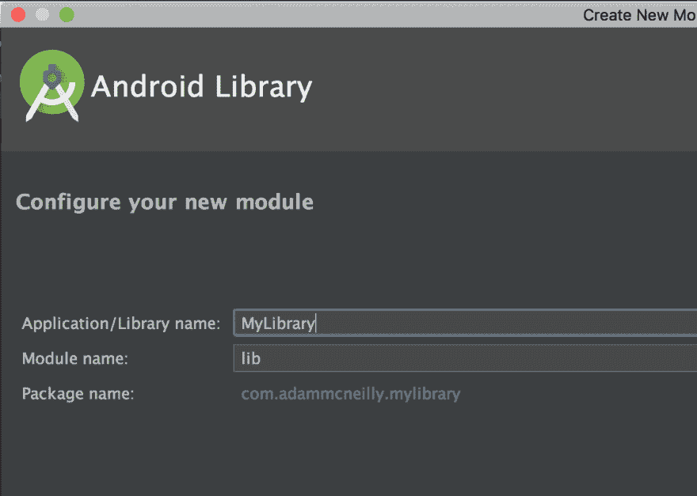
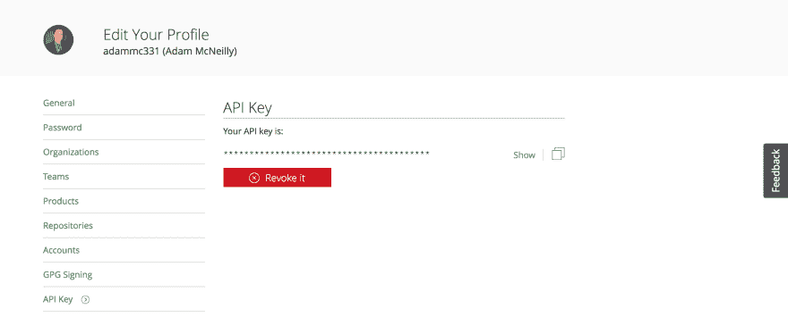
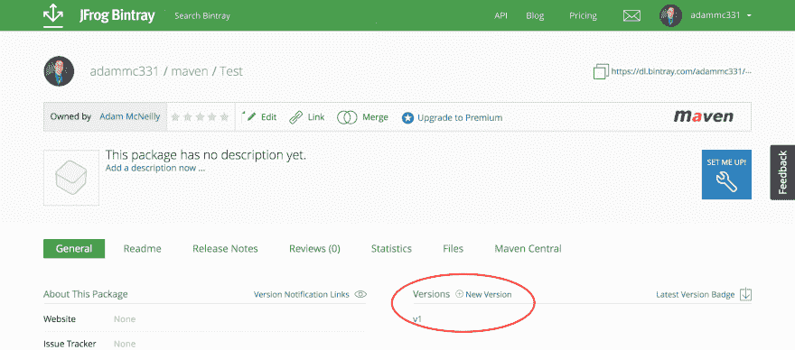
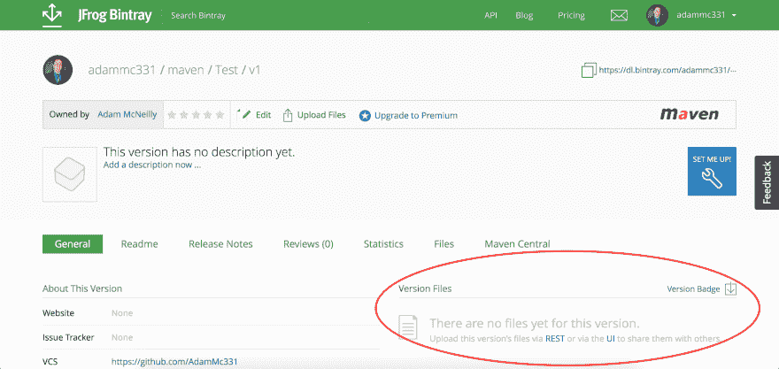
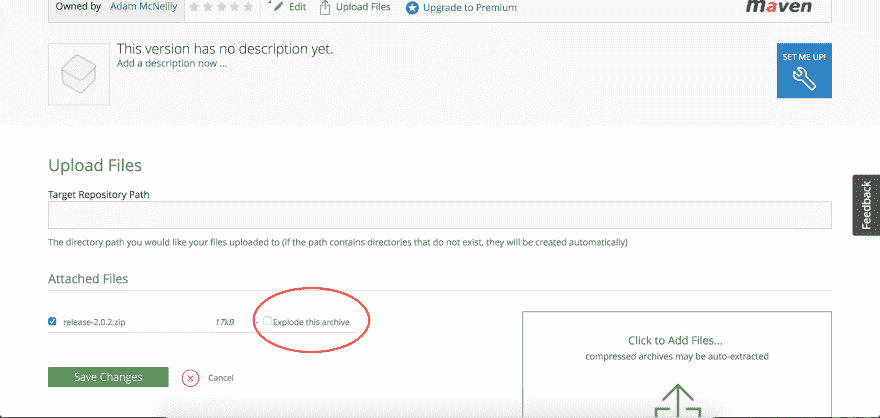
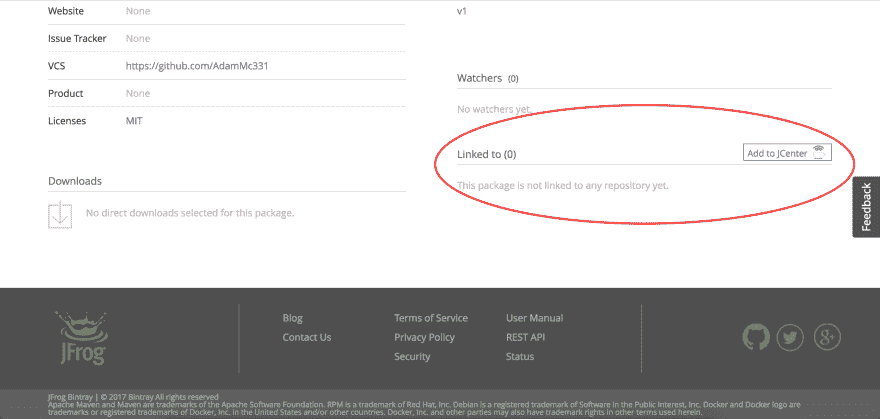

# 开发和发布 Android 库

> 原文：<https://dev.to/adammc331/developing-and-publishing-android-libraries-db>

原载于[安卓精华](https://androidessence.com/android/developing-and-publishing-android-libraries/)。

第三方库是移动应用开发的重要组成部分。流行的工具如 Retrofit、RxJava、Picasso 和许多其他工具阻止了 Android 开发人员在每次我们需要通过网络、异步或加载图像时重新发明轮子。

然而，开发和发布这些库可能会让许多人望而生畏。我认为发生这种情况有很多原因——担心跟不上维护、被超越，或者有时认为没有人会使用你的代码。我对这些想法有很多想法，但我会把它们留到另一篇博文中。在这一篇中，我们将一步一步地介绍如何创建一个库并将其发布到 JCenter。

# 创建图库模块

## App 模块

不幸的是，Android Studio 不支持在一开始就创建一个库模块。这意味着您必须首先创建您的应用程序模块。我更喜欢这样做的方式是像往常一样通过新建项目向导，但是我通过在末尾添加`.sample`来调整我的包名。

[T2】](https://res.cloudinary.com/practicaldev/image/fetch/s--qXbhi_4o--/c_limit%2Cf_auto%2Cfl_progressive%2Cq_auto%2Cw_880/https://thepracticaldev.s3.amazonaws.com/i/gecieobi61iqfoxeapwu.png)

然后，您可以像往常一样使用所有必要的首选项完成安装向导。

## 库模块

现在您已经有了一个带有 app 模块的工作项目，您可以右键单击项目结构并选择“New -> Module”来创建您的库模块。这将与您的示例应用程序具有相同的包名，但是在包的末尾没有`.sample`。下面的截图演示了这个流程:

[T2】](https://res.cloudinary.com/practicaldev/image/fetch/s--XzgodqQz--/c_limit%2Cf_auto%2Cfl_progressive%2Cq_auto%2Cw_880/https://thepracticaldev.s3.amazonaws.com/i/1a080ylr5puwazjphyu1.png)

[T2】](https://res.cloudinary.com/practicaldev/image/fetch/s--OABgMgFw--/c_limit%2Cf_auto%2Cfl_progressive%2Cq_auto%2Cw_880/https://thepracticaldev.s3.amazonaws.com/i/spabryoztzi6ptnnbnl0.png)

[T2】](https://res.cloudinary.com/practicaldev/image/fetch/s--RuYIlk00--/c_limit%2Cf_auto%2Cfl_progressive%2Cq_auto%2Cw_880/https://thepracticaldev.s3.amazonaws.com/i/lzq4ky1olsj9etwfcf9k.png)

# 从应用程序中引用库

要在应用程序中使用库代码，您只需修改应用程序的`build.gradle`文件中的依赖关系:

```
 compile project(":lib") 
```

Enter fullscreen mode Exit fullscreen mode

现在，您可以使用您在库中编写的任何模型/视图/实用函数，并在您的应用程序中使用它们，因此您可以向未来的用户提供一些示例使用。

# 建库

我最初是通过我的朋友 Eric 的一篇[帖子了解到出版的，但在这里我将主要观点传达给你。](http://room-15.github.io/blog/2015/11/05/How-to-publish-a-library-to-jcenter/)

## 创建 Bintray 账户

Bintray 是一个软件分发服务，你可以用它来推送你的库。您可以在这里创建一个账户[，如果您愿意，可以使用 GitHub 认证。](https://bintray.com/)

## 库配置

在你的库模块的`build.gradle`文件中，你需要添加一些代码。首先，在插件行的顶部和下方，定义库信息。这是我的一个例子:

```
 ext {
        PUBLISH_GROUP_ID = 'com.adammcneilly'
        PUBLISH_ARTIFACT_ID = 'recyclerviewutils'
        PUBLISH_VERSION = '2.0.2'
    } 
```

Enter fullscreen mode Exit fullscreen mode

每个部分的说明:

*   组 Id 是您的包名。
*   工件 Id 是库的名称。
*   发布版本是您的当前版本。

为了提供一个熟悉的例子，为了导入上面的库，我将编写:

```
 compile 'com.adammcneilly:recyclerviewutils:2.0.2' 
```

Enter fullscreen mode Exit fullscreen mode

另外，在`build.gradle`文件的底部，您需要包含这一行:

```
 apply from: 'https://raw.githubusercontent.com/blundell/release-android-library/master/android-release-aar.gradle' 
```

Enter fullscreen mode Exit fullscreen mode

## 项目配置

一旦您将必要的代码添加到您的库的构建文件中，我们还需要在项目级别上修改`build.gradle`文件，添加以下依赖项:

```
 dependencies {
        classpath 'com.android.tools.build:gradle:2.3.3'
        classpath 'com.jfrog.bintray.gradle:gradle-bintray-plugin:1.2'
        classpath 'com.github.dcendents:android-maven-plugin:1.2'
    } 
```

Enter fullscreen mode Exit fullscreen mode

请注意，您的 gradle 版本号可能会在撰写本文时发生变化。第一行可能已经在 Android Studio 生成项目时的文件中了。

## Bintray API 设置

接下来你需要修改你的`local.properties`文件来包含你的 Bintray 信息:

```
 bintray.user=bintrayUserName
    bintray.apikey=abc123ApiKey 
```

Enter fullscreen mode Exit fullscreen mode

您的用户名是您创建帐户时使用的名称。要找到你的 API 密匙，登录 bintray，点击右上角的头像，选择编辑个人资料。在左侧菜单中有一个 API 键标签，您可以在那里找到它:

[T2】](https://res.cloudinary.com/practicaldev/image/fetch/s--Llb0YuL3--/c_limit%2Cf_auto%2Cfl_progressive%2Cq_auto%2Cw_880/https://thepracticaldev.s3.amazonaws.com/i/os3jl2n7mhe2thv75tz9.png)

## 生成发布 zip

最后，您需要生成将被上传到 Bintray 的 zip 文件。你可以在 Android Studio 的终端上运行:

```
 ./gradlew clean build generateRelease 
```

Enter fullscreen mode Exit fullscreen mode

现在，您将在 lib/build 文件夹中找到一个名为`release-x.y.z.zip`的文件，其中包含了您需要上传的所有内容。

## Bintray 上传

一旦生成了 zip 文件，剩下的步骤就是冗长的上传:

1.  登录到 Bintray。
2.  选择您的 maven 资源库。
3.  单击“添加新包”按钮。
4.  输入所需信息，然后单击提交。
5.  选择这个包，在右边你会看到一个添加新版本的按钮。
6.  输入所有附加信息，然后点击提交。
7.  选择该版本，并使用右边的文件上传程序。确保选择“分解此归档文件”。 
8.  你完了！人们现在可以从您的 maven repo 访问您的项目。如果您想将它链接到 Jcenter，选择您的包，您会在右下角看到一个“链接到 Jcenter”选项。