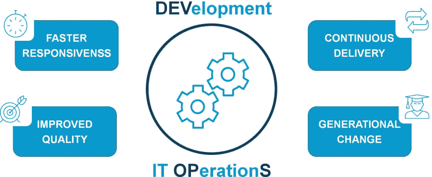
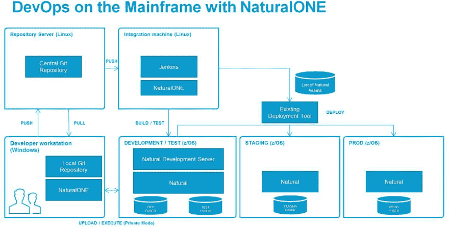

# 大型机开发运维服务

> 原文：<https://dev.to/techcommunity/devops-for-the-mainframe-md2>

DevOps 已经不仅仅是一个最新、最流行的词语，而是成为了主流。如今，它受到了行业分析师、营销人员、博客作者、软件开发人员的关注，更重要的是，受到了大大小小企业的 it 部门的关注。为什么？DevOps 通过更快、更可靠地向客户交付创新，帮助企业参与竞争。了解大型机如何成为开发运维对话的一部分。

| 2018 年第一期 | [ 下载 PDFT4】](http://techcommunity.softwareag.com/ecosystem/download/techniques/2018-issue1/SAG_Devops_for_the_Mainframe_TECHniques_Jan18_WEB.pdf) |
| --- | --- |

## 什么是 DevOps，为什么要关心？

偶尔有人问我 DevOps 是不是可以买的工具。要是有那么简单就好了。DevOps 实际上是关于组织变革的。它是开发和 It 操作在整个软件生命周期中一起工作的实践，从设计到开发过程再到生产。这不仅需要行为和文化上的改变，还需要流程的实施和新工具链的使用来将它们整合在一起。

DevOps 方法的主要目标是更快地开发和部署创新，以满足您的客户或委托人的需求。但是速度不能以质量为代价。正如一位领先的行业分析师所言:“DevOps 强调开发和运营团队的协作、自动化和集成，从而带来更高质量的更频繁发布”。 **1**

T4】

**图 1** :开发运维的优势

首席信息官渴望使用 DevOps，以便通过利用敏捷开发更快地响应业务线(LOB)需求。当开发是敏捷的时，小团队在迭代的工作周期中交互地工作，关注于向客户交付价值。通过拆除层级的围墙，团队之间有了透明度，确保了更好的协调。协调变更管理和开发流程也允许首席信息官更好地扩展开发团队。

是的，你可能会说，“我们的 Java 团队和新开发人员正在使用 DevOps，但我们是大型机团队，所以这与我们无关。”恕我不能苟同。大型机团队可以在您组织的开发运维流程中扮演不可或缺的角色。不要让你的首席信息官忽视你的团队的参与能力。

## 为什么 DevOps 与大型机相关？

DevOps 的一个关键特性是持续部署——这意味着测试是自动化的，并且可以立即部署到生产环境中。谷歌和亚马逊就是这样做的——他们以每天 20，000 次部署的速度对实时应用进行修改。据估计，“亚马逊每 11.6 秒部署一次。” **2** 他们是开发运维的先驱，需要速度来满足市场的动态需求。在这种环境下，变化的速度是惊人的。

在大型机世界中，这种极快的变化速度是不现实的。但是这并不排除大型机团队参与开发运维。虽然大型机开发人员没有随意实施变更的文化，当然也不会不断地抛弃变更，但他们可以从 DevOps 的许多原则中受益，例如基于存储库的开发和持续集成(CI)。如果大型机团队能够达到使用 DevOps 每周进行部署的状态，这将是瀑布模型的一大优势，瀑布模型需要几个月的时间并锁定流程。

## 基于仓库的开发支持并行开发

虽然听起来很简单，但认识到像 Git 这样的存储库领先于源代码，这是大型机开发人员思维方式的一个巨大变化。所有的变更现在都被提交到这个存储库中，并从那里分发到相应的环境中。开发人员必须将源代码从存储库中取出，在本地工作区实现和更改代码，然后在远程开发环境中以私有和隔离的模式执行和测试。以自然编程语言为例，真理的单一来源现在是储存库，而不再是融合器。开发在基于 Eclipse 的平台上进行，比如 NaturalONE。私有模式支持并行执行的工作，允许开发人员彼此独立地测试和执行他们的实现。源代码库支持“分支”,即多个团队处理代码的多个分支，然后在完成时合并这些分支。在当今典型的大型机环境中，如果没有 DevOps，您必须锁定模块，其他人无法进行更改。等待解锁会降低效率和生产力。通过并行处理一个存储库，您不会被阻塞。

如果所有这些代码都是并行开发的，并且相互冲突，接下来会发生什么？幸运的是，最后，在源代码管理系统的合并功能的帮助下，所有这些都被合并了。在提交和推送您的更改之后，CI 确保您的应用程序可以在将您的更改合并到共享开发环境中的情况下构建。

## CI 确保应用构建成功

“DevOps 的基石是持续集成(CI)，这是一种由 Grady Booch 设计和命名的技术，它不断地将团队中所有开发人员的源代码更新合并到一条共享主线中。这种持续的合并可以防止开发人员的软件项目本地副本在其他人添加新代码时偏离太远，从而避免灾难性的合并冲突。实际上，CI 包括一个中央服务器，当开发人员提交所有新的源代码变更并从头开始构建软件应用程序时，它会不断地获取这些变更，并将过程中的任何失败通知给团队。如果发现失败，开发团队应该在进行任何额外的代码更改之前重新关注并修复构建。虽然这看起来可能是破坏性的，但在实践中，它将开发团队的注意力集中在单一的稳定性度量上:软件的工作自动化构建。” **3**

任何修改都以隔离的私有模式上传和编译。一旦开发人员完成了某个特性的工作，他就可以通过将变更提交到存储库中来让其他人使用这些变更。通过 CI，新的变更从存储库转移到中央开发环境。它确保我们的应用程序构建成功，并且应该运行单元测试来证明所有功能仍然给定。

[T2】](https://res.cloudinary.com/practicaldev/image/fetch/s--S7HT_rJq--/c_limit%2Cf_auto%2Cfl_progressive%2Cq_auto%2Cw_880/http://techcommunity.softwareag.com/documents/10157/9398481/fig2-devopsmainframe.jpg/3d89327f-c853-41b2-a990-3d08b1cdc4b6%3Ft%3D1516112785552)

**图 2** :使用 NaturalONE 在主机上开发操作系统

## 开发运维成功需要持续测试

面对以惊人的速度交付的日益复杂的应用程序，软件测试人员有可能成为决定开发运维计划成败的瓶颈。要实现完整的 DevOps，测试流程必须自动化，并转变为连续进行。这将极大地减少测试所需的工作量。测试还必须是协作性的，以确保质量，同时减少交付新功能所需的时间。

幸运的是，市场上有许多工具可以提供帮助。像 Java 开发人员一样，使用 Natural 的大型机开发人员也可以使用 NaturalONE 和诸如 Jenkins 这样的 CI 工具来建立和自动化单元测试。所有模块都可以连续测试，以确保质量，甚至可以使用新推出的基于自然屏幕的测试器对自然程序进行全面测试。对于 Natural mainframe 开发人员来说，NaturalONE 工具，如运行时测试的概要分析和代码覆盖，是对测试过程的补充。这些工具确保交付的组件的性能满足业务需求，并且单元测试的代码覆盖率足够高。

## 项目和变更管理必须协同进行

最后但同样重要的是，有效的项目和变更管理是在您的组织中建立 DevOps 的关键组成部分。在 DevOps 中，一个好的实践是，如果没有与项目或变更管理工具中的适当任务相联系，就不应该发生任何开发和变更。因此，即使在开发运维的开始，项目和变更管理仍然存在，所有的活动都应该支持现有的任务。每一个源代码变更，每一次构建和部署都应该被跟踪，当然，应该完全自动化。这将使您对组织的整个开发生命周期完全透明。

对于运行任务关键型应用程序的大型机开发人员来说，风险很高。您需要正确的工具来有效地协调和管理您系统的开发生命周期。幸运的是，如果你使用像 NaturalONE 这样的基于 Eclipse 的平台，你可以利用许多开源和第三方工具来帮助管理你的项目。NaturalONE 集成了所有带有 Eclipse 插件的工具，如 Atlassian 吉拉和开源工具 Redmine。

## 大型机开发运维的优势

从 CIO 到应用程序开发人员，实现 DevOps 意味着更快、更高效地交付更好的代码。通过自动化过程和利用 Eclipse 和基于存储库的工具进行并行开发，生产力得到了提高。

变更管理记录包含所有变更的历史记录、版本比较和回滚到先前版本的能力，透明度也大大提高。有了 CI，测试工作减少了，而部署的质量提高了。

首席信息官希望推行 DevOps 的最有力的理由之一是，这将有助于降低因技术工人退休(劳动力的代际变化)而导致的业务中断风险。这一点尤其正确，尤其是在大型机上仍然使用 Natural 的 IT 部门。

NaturalONE 是 Natural 的推荐开发环境，因为它完全集成了 Java 开发人员熟悉的 DevOps 工具链，这些开发人员也会喜欢 NaturalONE 熟悉的图形用户界面(GUI)和向导。

因为 NaturalONE 是基于 Eclipse 的，所以您可以在一个跨所有编程语言的平台上实现标准化。您可以高效地对员工进行交叉培训，将资源部署到最需要的地方，而且是在接到通知的瞬间。你会发现招募新的程序员会更容易，他们会欣赏 NaturalONE 对敏捷开发和 CI 的协作性 DevOps 支持。

有趣的是，运行在大型机上的自然应用程序也可以非常成功地运行在开放系统平台上。事实上，全世界大约一半的自然应用程序运行在 Linux、UNIX 或 Windows (LUW)上。例如，如果您的公司正在考虑将自然应用程序迁移到 Linux，那么您实现的 DevOps 方法可以完全以同样的方式应用到您新的开放系统环境中。这甚至是朝着这个方向前进的有价值的第一步。

## 使用 NaturalONE 为您的大型机快速启动 DevOps

如果你在大型机上运行 Natural，我强烈建议你试试 NaturalONE。NaturalONE 采用 DevOps 开发方法，使您能够更快地开发新的应用程序和更新现有的自然应用程序，以满足不断变化的业务需求并降低应用程序开发成本。

NaturalONE 可以在 Linux 或 Windows 上运行，并且因为它是基于 Eclipse 的，所以很容易与多种基于 Eclipse 的工具集成。由于可以在一个平台上执行工作，而不必在其基础平台上打开附带的应用程序，因此 Natural 以及 Java 或 COBOL 的开发人员可以在单个界面上使用一系列开发人员生产力工具，在多个平台上高效地协作和工作。NaturalONE 非常适合开发在大型机、Linux、UNIX 和 Windows 上本机运行的应用程序。

NaturalONE 可以通过自动、交互式测试和调试工具加快新应用的交付。开源版本管理工具允许团队开发，因此开发人员可以独立编写、测试和执行程序，同时在团队存储库中共享项目的源代码。像 Java 开发人员一样，大型机开发人员可以使用诸如 Jenkins 这样的开源工具来建立和自动化单元测试。NaturalONE 工具，如运行时测试概要，补充了测试过程，并确保交付的组件的性能满足业务需求。

从 NaturalONE 中，您可以通过远程连接到您的大型机或 LUW 环境来使用 Construct、EntireX、Predict 和许多其他工具。例如，使用自然数据定义模块的集成数据浏览器进行预测数据字典维护和浏览数据。

 在[www.NaturalONE.com](http://techcommunity.softwareag.com/ecosystem/communities/public/adanat/products/naturalone/downloads-community-edition/index.html)免费试用 NaturalONE

利用 NaturalONE 将您的大型机带入 DevOps 对话。这种基于 Eclipse 的集成开发环境(IDE)允许开发人员编码、测试和维护应用程序，将自然对象作为服务公开，创建富互联网应用程序(RIA)和 web 界面，并从一个环境中管理完整的 DevOps 生命周期，因此您可以更快地更新和部署新的应用程序，并提高质量，以立即满足您的客户。

## 关于作者

Zvonimir Ivanetic 是软件公司的高级 Adabas &天生的客户成功架构师。他在 Software AG 工作了 10 多年，担任 Adabas &自然应用程序的集成和现代化以及分布式可扩展 web 应用程序开发的顾问。随着 Adabas & Natural 2050+议程的推出，Zvonimir 作为架构师加入了全球核心团队，支持所有客户向数字架构转型，优化其基础设施，并为其宝贵的 Adabas & Natural 应用带来创新。

## 关于阿达巴斯&自然 2050+年

无数组织依赖 Adabas & Natural 平台来实现其任务关键型和业务关键型应用。借助 Adabas & Natural 2050+议程，Software AG 全力支持客户利用数字化带来的创新潜力。从技能到连接，再到 DevOps 开发和经济高效的平台，Software AG 正在引领下一代的发展方向。

在 http://2050.softwareag.com 了解更多信息

* * *

1.  首席信息官指南 DevOps，点播视频-随时随地观看。从[https://www.gartner.com/webinar/3165618](https://www.gartner.com/webinar/3165618)取回

2.  黑客新闻。从[https://news.ycombinator.com/item?id=2971521](https://news.ycombinator.com/item?id=2971521)取回。乔治·劳顿(2013 年 9 月 5 日)。亚马逊如何跨越到 DevOps 文化？检索自[http://service virtual ization . com/how-Amazon-make-the-leap-to-a-devo PS-culture/](http://servicevirtualization.com/how-amazon-made-the-leap-to-a-devops-culture/)

3.  亚伦·科伊斯(2015 年 1 月 26 日)。DevOps 中的持续集成。检索自[https://insights . sei . CMU . edu/devo PS/2015/01/continuous-integration-in-devo PS-1 . html](https://insights.sei.cmu.edu/devops/2015/01/continuous-integration-in-devops-1.html)