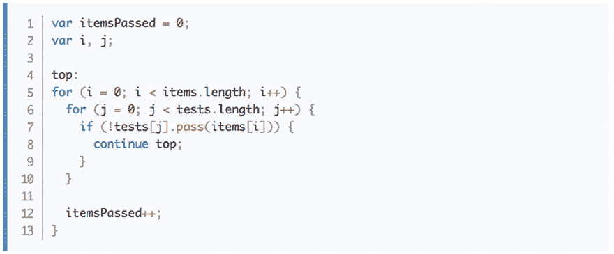

# 你知道 JavaScript 从 ES3 开始就有标签了吗？！？

> 原文：<https://dev.to/dimitarnestorov/did-you-know-javascript-has-labels-since-es3>

[标签- JavaScript MDN](https://developer.mozilla.org/en/docs/Web/JavaScript/Reference/Statements/label)

本质上，它类似于 *goto* ，但只适用于循环和标记块。

[T2】](https://res.cloudinary.com/practicaldev/image/fetch/s--CNEIB4fr--/c_limit%2Cf_auto%2Cfl_progressive%2Cq_auto%2Cw_880/https://thepracticaldev.s3.amazonaws.com/i/2fz3eq68f9ft0pr461cv.png)

我很好奇你能想到的使用标签最糟糕的例子是什么？

或者有没有一个非常有用的方法来使用它们？

可能性是无限的！