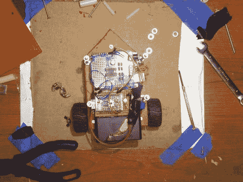
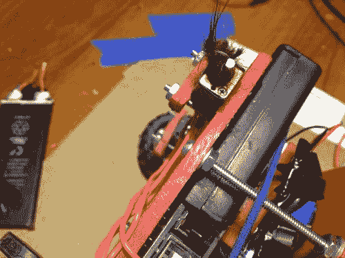
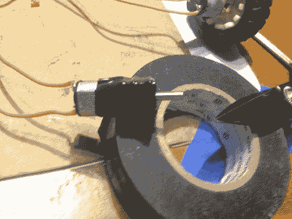

# 圆点咀嚼者

> 原文：<https://dev.to/ladvien/dot-muncher-2888>

我把这个小家伙扔给了我的儿子塞拉斯，因为他想玩爸爸的“Wobot”关于他没有太多可说的，他是我撒谎的一个大杂烩:

*   HDPE 在一元店 2 块钱买的(我猜就是两元店。)
*   3-6v 400 RPM 齿轮传动微型马达:8 美元
*   来自易贝的两个轮子:2 美元
*   4-40 螺栓、螺母和垫圈(本地):4 美元
*   arduino Uno:9.85 美元
*   Ardumoto 盾:11 美元
*   蓝牙 4.0 模块:9 美元
*   4 x NiHM 谎称:0 美元
*   1 次免费周日上午

总计:36.85 美元

第一次迭代可能需要一个小时。

但是，在我把这个小家伙扔在一起之后，有一些调整。我马上注意到我得到了这个“哦，上帝！不要掉！”每次塞拉斯抱起他的时候。心理学是我的职业，我坐在沙发上分析它:P

我想让我的儿子和我在一起，这样我可以教他如何生活。我知道男性通常需要合作的任务才能在他们的关系中感到安全。因此，如果我经常不开心，我的儿子就会玩弄我的兴趣成果，他不会和我分享利益。这是一个简单的强化问题。塞拉斯来到我的实验室。塞拉斯受到斥责。因此，进入我的实验室的行为受到惩罚(负强化)，从而减少。这意味着，为了让塞拉斯分享我的兴趣，从而让我们更亲密，我需要找到一个解决我对他捡起机器人的认知失调的方法。

像大多数事情一样，我把范围缩小到了钱。我会变得紧张，因为我知道机器人很脆弱。它混合了 5 伏和 3.3 伏的元件，还在使用试验板和跳线，**我担心他会掉下来，它会坏，我会赔钱。**

我不能要求一个三岁的孩子不要拿起机器人；对年轻男性来说，触觉体验是首要的，这是他感兴趣的一种表现，也是我想要的。我不能降低零件的成本。这让我只有一个选择* *: [稳健](http://en.wikipedia.org/wiki/Structural_robustness)。**

我隐约记得这是系统理论的一个关键组成部分，但它是我经常忽视的一个部分。所以，我做了一些从未接触过科学的人会做的事，我加了很多螺栓。

**“过程”视频:**

警告:我儿子穿衬衫比马修·麦康纳还糟糕。嘿，我们尽力了，男孩只是为他的肚子感到骄傲。

[https://www.youtube.com/embed/Qrwr_evhUgg](https://www.youtube.com/embed/Qrwr_evhUgg)

在当地的五金店，我买了一些 4-40 螺栓和螺母，并开始改造小机器人。

 最后，我真的没有做任何花里胡哨的事，就那样视而不见了。我在电池塑料盒上钻孔，对准机器人底座上的孔，然后用螺栓固定在一起。我第一次使用 Arduino Uno 的安装孔，用螺栓将它固定在底座上。然后我为这个小家伙“设计”了一个兜帽。从匹配高密度聚乙烯，确保螺栓下来。最后，我用绝缘胶带封住了马达齿轮，并在里面滴了几滴油。我注意到这个关于齿轮传动的微型马达，它们收集头发并且*将*剥去齿轮。

最后，我没有做任何二年级学生会感到自豪的事情，但我确实强迫自己从臀部高度把它放下五次，以确保我忘记了“哦，Shiii-nobi 忍者！”感觉。在心理学中，我们称之为[系统脱敏](http://en.wikipedia.org/wiki/Systematic_desensitization)。或者其他同样重要的声音。

[T2】](https://res.cloudinary.com/practicaldev/image/fetch/s--gNMZJwbH--/c_limit%2Cf_auto%2Cfl_progressive%2Cq_auto%2Cw_880/https://ladvien.cimg/IMG_0075.jpg)

它收集了太多的毛发，轮胎都爆掉了。

Bleh.

 我小心翼翼地不要把电机包得太厚，因为我觉得这样会减少热交换。