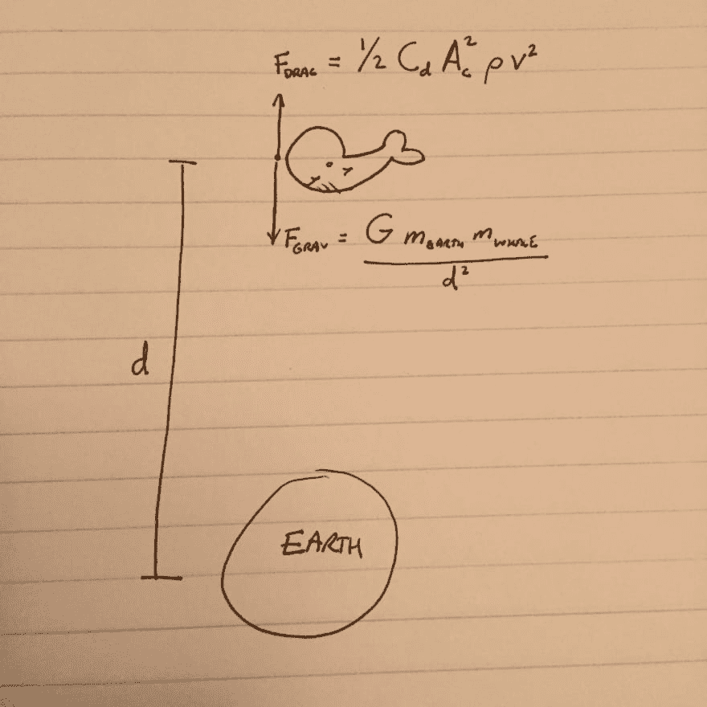
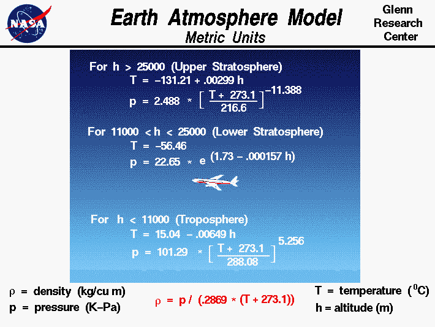
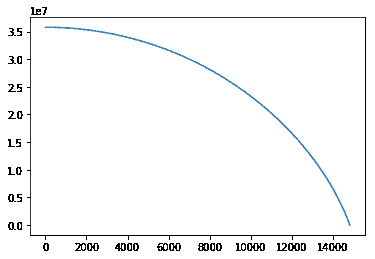
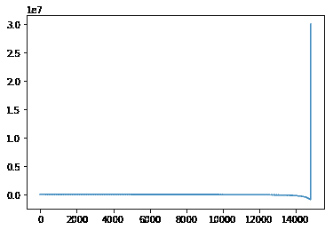
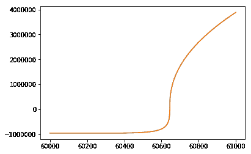

# 道格拉斯·亚当斯鲸

> 原文：<https://dev.to/rpalo/douglas-adamss-whale>

## [T1】简介](#intro)

我认为找到你的背景或经历有助于你在任何特定群体中脱颖而出的方法是很重要的。如果您能准确定位这些领域，团队就能优化其工具集，并更好地了解谁最适合某项特定任务。就我个人而言，虽然编程是我最喜欢的消遣之一，但我有机械工程学位和一些教授微积分和物理的经验。正因为如此，我想我会分享一些我知道每个人都有一些问题的领域的见解:道格拉斯·亚当斯的*银河系漫游指南*中的鲸鱼。

你会问，什么鲸鱼？在第 18 章中，两枚导弹分别被随机转换成一条鲸鱼和一盆盆栽植物。以下是摘录:

> 另一件被遗忘的事情是，一条抹香鲸很有可能突然出现在一个外星球表面几英里的地方。由于这对于鲸鱼来说并不是一个自然存在的位置，在它不得不接受不再是鲸鱼的事实之前，这只可怜无辜的动物几乎没有时间来接受它作为鲸鱼的身份。这是一份完整的记录，记录了它从生命开始到结束的思想。
> 啊……发生什么事了？它想。
> [...]
> 还有哇！嘿！这是什么东西突然非常快地向我走来？非常非常快。又大又平又圆，它需要一个听起来又大又宽的名字，像…嗷…圆…圆…地！就是这样！这是一个好名字——地面！
> 不知道它会不会和我做朋友？其余的，在一阵突然的湿砰声之后，是一片寂静。

这段摘录让我不禁要问:我们能模拟它吗？在 Python 的一点帮助下，我们可以找到答案。我写这篇文章时，假设读者对基本编程原理以及英制和公制之间的区别有一定的了解，但除此之外没有什么物理学背景。虽然我通常更习惯使用英制单位，如英尺和磅，但这次我将坚持使用公制单位，为了我们的国际朋友的理智，也因为数学计算起来更容易一些。

## 卷入的势力

让我们从这里起作用的力开始。基本上，我唯一要担心的两个问题是作用在鲸鱼身上的重力和鲸鱼下落时受到的阻力。让我们假设这头鲸鱼正从地球同步轨道(太空中的轨道，可以让它跟上地球旋转的步伐)坠落——大约为 [3.5786 x 10^7 米高度](https://en.wikipedia.org/wiki/Geostationary_orbit)。对于那些感兴趣的人，我将在这里放入唯一真正深入的等式。

[T2】](https://res.cloudinary.com/practicaldev/image/fetch/s--YCe_KA_r--/c_limit%2Cf_auto%2Cfl_progressive%2Cq_auto%2Cw_880/http://assertnotmagic.com/img/whale-sketch.JPG)

将方程式转换成代码并不是非常困难。我们只需要先填写上面的一些变量。由于获取外星球和外鲸的数据更加困难，让我们使用地球和地球上的蓝鲸。地球的质量大致为 [5.97 x 10^24 kg](https://en.wikipedia.org/wiki/Earth) ，其半径约为[637 万米](https://en.wikipedia.org/wiki/Earth)。蓝鲸生活在大约 80-120 公吨的区域[。为了数学更好，我们用 100 (100，000 kg)。有趣的事实:已知最大的恐龙体重约为 90 公吨！不管怎样，有了这些常数，还有万有引力常数-](https://en.wikipedia.org/wiki/Blue_whale)[6.674 x 10^-11 m^3/千克 s^2](https://en.wikipedia.org/wiki/Gravitational_constant) -让我们把它变成代码。

```
def gravity(altitude):
    """Returns the force of gravity [N] at a given altitude [m]"""
    earth_mass = 5.972e24 # [kg]
    earth_radius = 6.367e6 # [m]
    whale_mass = 100000 # [kg]
    universal_grav_constant = 6.67384e-11 # [m^3/kg s^2] 
    radius = altitude + earth_radius # [m]
    # Assumption: the 'radius' of the whale is negligible compared to
    # the other sizes involved 
    # Here's the important bit:
    result = universal_grav_constant * whale_mass * earth_mass/(radius**2)
    return result 
```

Enter fullscreen mode Exit fullscreen mode

变装变得更有趣了。因为关于腹部朝下趴着的鲸鱼的空气动力学特征的数据少得惊人，我们假设鲸鱼是头朝下向地面俯冲的。[这篇文章](http://jeb.biologists.org/content/jexbio/214/1/131.full.pdf)充满了信息性的好东西，比如一条游动的鲸鱼的阻力系数(0.05)和近似的投影横截面积(10 m^2)。投影的横截面积有点像光线迎面照在鲸鱼身上时，鲸鱼投下的影子的大小。

值得注意的是，大气的密度随着海拔的升高而降低，但并不是一种很好的线性方式。我们需要在代码中模拟以下关系(大约):

[T2】](https://res.cloudinary.com/practicaldev/image/fetch/s--8ojqFsvu--/c_limit%2Cf_auto%2Cfl_progressive%2Cq_66%2Cw_880/http://assertnotmagic.com/img/whale-density.gif)

为了保持你的兴趣，我将做一些手工处理，并省去那些代码。

下面是拖动的代码:

```
def drag(altitude, velocity):
    """Given altitude [m] and velocity [m/s], outputs the force of drag [N]"""
    whale_drag_coefficient = 0.05 # [unitless]
    whale_crossectional_area = 10 # [m^2]
    result = .5 * whale_drag_coefficient * density(altitude) # VIGOROUS HAND-WAVING!
    result *= whale_crossectional_area * velociy**2

     # Drag always is opposite of the direction of motion.
     # i.e. if whale falls down, drag is up and vice versa
    if velocity > 0:
        result *= -1
    return result 
```

Enter fullscreen mode Exit fullscreen mode

太好了！在我们得到结果之前还有两步。首先是获得鲸鱼的加速度。`F = m * a`好老。

```
def net_acceleration(altitude, velocity):
    """Sums all forces to calculate a net acceleration for next step."""
    gravity_force = gravity(altitude) # [N]
    drag_force = drag(altitude, velocity) # [N]
    net_force = drag_force - gravity_force # [N] assuming gravity is down. 
    # Since F=ma, a = F/m!
    acceleration = net_force / WHALE_MASS # [m/s^2]
    return acceleration 
```

Enter fullscreen mode Exit fullscreen mode

## 模拟

现在我们需要模拟整个坠落过程。我们将通过逐个获取每个数据点来做到这一点。如果我们知道给定时间的高度和速度，我们可以用上面的函数求出加速度。为了从给定的加速度得到下一个速度和位置，我们需要下面的函数:

```
def integrate(acceleration, current_velocity, current_altitude, timestep):
    """Gets future velocity and position from a given acceleration"""
    new_velocity = current_velocity + acceleration * timestep # Sort of a y = mx + b situation
    new_altitude = current_altitude + current_velocity * timestep # Same, but for altitude
    return new_velocity, new_position 
```

Enter fullscreen mode Exit fullscreen mode

这组代码可能是最不直观的，但它基本上可以归结为这样一个想法:如果你以每小时 20 英里的速度行驶 6 个小时，那么你总共行驶了 120 英里(20 * 6)。废话连篇的科学挥舞。这里可以看到完整的代码和注释[。我还在清理它并分解出常量。我们去找鲸鱼吧。](https://github.com/rpalo/whale-drop)

## 结果

```
from matplotlib import pyplot as plt
import pandas as pd

results = pd.read_csv("results.csv", header=0)
plt.plot(results["Time"], results["Height"])
plt.show() 
```

Enter fullscreen mode Exit fullscreen mode

[T2】](https://res.cloudinary.com/practicaldev/image/fetch/s--masgcJBL--/c_limit%2Cf_auto%2Cfl_progressive%2Cq_auto%2Cw_880/http://assertnotmagic.com/img/whale-height-plot.png)

看起来和我们预期的差不多。首先他起床了。然后他下来了，很快。那又怎样？让我们看看他感受到的力量。

```
results["Force"] = results["Acceleration"] * 100000 # whale mass [kg] plt.plot(results["Time"], results["Force"])
plt.show() 
```

Enter fullscreen mode Exit fullscreen mode

[T2】](https://res.cloudinary.com/practicaldev/image/fetch/s--gOfQCuiO--/c_limit%2Cf_auto%2Cfl_progressive%2Cq_auto%2Cw_880/http://assertnotmagic.com/img/whale-force-time-plot.png)

哇哦。让我们更好地看看那个钉子。注意，这次我画的是力对指数，而不是时间。这是为了获得更开阔的视野。

[T2】](https://res.cloudinary.com/practicaldev/image/fetch/s--fc42tnVw--/c_limit%2Cf_auto%2Cfl_progressive%2Cq_auto%2Cw_880/http://assertnotmagic.com/img/whale-force-impact.png)

你可以看到他感觉到一些疯狂的向下的重力，直到砰的一声！检查鲸鱼在这一点附近的高度表明，他在我们分割平流层上部和下部的地方: [~25000 米](https://www.grc.nasa.gov/WWW/K-12/airplane/atmosmet.html)。基本上，我们的鲸鱼是在我们的大气层上做鬼脸。实际上，我很确定，如果我们的鲸鱼没有被烧掉，我们会有一个局部的鲸鱼大爆炸和鲸鱼雨。

所以现在就这样了。你大概只能忍受这些了。对于未来的工作，我建议评估阻力产生的热量，并估计空中海洋哺乳动物的燃点，以了解他是先解体还是先爆炸。太可怕了？是啊，可能吧。别担心。他在下山的路上玩得非常开心。

> 没关系，嘿，这真的很令人兴奋，有这么多要了解的，有这么多要期待的，我期待得头晕目眩！-鲸鱼