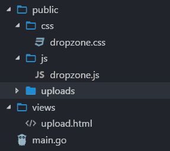
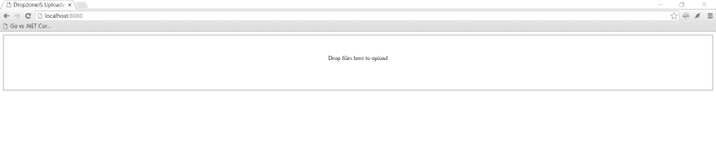

# 如何使用 DropzoneJS 和 Go 构建文件上传表单

> 原文：<https://dev.to/kataras/dropzonejs--go-series---part-1-474>

这是 DropzoneJS + Go 系列的第 1 部分，共 2 部分。

*   [第 1 部分:如何构建文件上传表单](https://dev.to/kataras/dropzonejs--go-series---part-1-474)
*   [第 2 部分:如何显示服务器上的现有文件](https://dev.to/kataras/dropzonejs--go-series---part-2-4n1)

# DropzoneJS + Go:如何构建文件上传表单

DropzoneJS 是一个开源库，提供图像预览的拖放文件上传。这是一个很棒的 JavaScript 库，实际上它甚至不依赖于 JQuery。
在本教程中，我们正在使用 DropzoneJS 构建一个多文件上传表单，后端将由 Go 和 [Iris](https://iris-go.com) 处理。

## 目录

*   [准备](#preparation)
*   [使用 DropzoneJS](#work-with-dropzonejs)
*   [与 Go 一起工作](#work-with-go)

## 准备

1.  下载 [Go(Golang)](https://golang.org/dl) ，按照图中所示设置您的电脑，然后继续 2。
2.  安装[光圈](https://github.com/kataras/iris)；打开终端并执行`go get github.com/kataras/iris/v12@latest`
3.  从[这个 URL](https://raw.githubusercontent.com/enyo/dropzone/master/dist/dropzone.js) 下载 DropzoneJS。DropzoneJS 不依赖 JQuery，你不用担心升级 JQuery 版本会破坏你的应用。
4.  如果你想要一些已经制作好的 css，可以从这个 URL 下载 dropzone.css。
5.  创建一个文件夹”。/public/uploads”，这是用于存储上传的文件。
6.  创建一个文件”。/views/upload.html”，这是针对前端表单页面的。
7.  创建一个文件”。/main.go "，这是为了处理后端文件上传过程。

准备后，您的文件夹和文件结构应该如下所示:

[T2】](https://res.cloudinary.com/practicaldev/image/fetch/s--OkvG3mKe--/c_limit%2Cf_auto%2Cfl_progressive%2Cq_auto%2Cw_880/https://github.com/kataras/iris/raw/master/_examples/tutorial/dropzonejs/folder_structure.png)

## 使用 DropzoneJS

打开文件”。/views/upload.html”并创建一个 DropzoneJs 表单。

将下面的内容复制到”。/views/upload.html”，我们将逐个检查每一行代码。

```
<!-- /views/upload.html -->
<html>

<head>
    DropzoneJS Uploader

    <!-- 1 -->
    <link href="/public/css/dropzone.css" type="text/css" rel="stylesheet" />

    <!-- 2 -->
    <script src="/public/js/dropzone.js"></script>
</head>

<body>

    <!-- 3 -->
    <form action="/upload" method="POST" class="dropzone" id="my-dropzone">
        <div class="fallback">
            <input name="file" type="file" multiple />
            <input type="submit" value="Upload" />
        </div>
    </form>
</body>

</html> 
```

Enter fullscreen mode Exit fullscreen mode

1.  包括 CSS 样式表。
2.  包括 DropzoneJS JavaScript 库。
3.  用 css 类“dropzone”创建一个上传表单，“action”是路由路径“/upload”。请注意，我们确实为回退模式创建了一个输入字段。这都是 DropzoneJS 库自己处理的。我们需要做的就是将 css 类“dropzone”分配给表单。默认情况下，DropzoneJS 会找到所有带有“dropzone”类的表单，并自动将自己附加到它上面。

## 工作用围棋

现在你已经到了教程的最后一部分。在本节中，我们将存储从 DropzoneJS 发送到。/public/uploads”文件夹。

打开“main.go”复制下面的代码:

```
// main.go

package main

import (
    "os"
    "io"
    "strings"

    "github.com/kataras/iris/v12"
)

const uploadsDir = "./public/uploads/"

func main() {
    app := iris.New()

    // Register templates
    app.RegisterView(iris.HTML("./views", ".html"))

    // Make the /public route path to statically serve the ./public/... contents
    app.HandleDir("/public", "./public")

    // Render the actual form
    // GET: http://localhost:8080
    app.Get("/", func(ctx iris.Context) {
        ctx.View("upload.html")
    })

    // Upload the file to the server
    // POST: http://localhost:8080/upload
    app.Post("/upload", iris.LimitRequestBodySize(10<<20), func(ctx iris.Context) {
        // Get the file from the dropzone request
        file, info, err := ctx.FormFile("file")
        if err != nil {
            ctx.StatusCode(iris.StatusInternalServerError)
            ctx.Application().Logger().Warnf("Error while uploading: %v", err.Error())
            return
        }

        defer file.Close()
        fname := info.Filename

        // Create a file with the same name
        // assuming that you have a folder named 'uploads'
        out, err := os.OpenFile(uploadsDir+fname,
            os.O_WRONLY|os.O_CREATE, 0666)

        if err != nil {
            ctx.StatusCode(iris.StatusInternalServerError)
            ctx.Application().Logger().Warnf("Error while preparing the new file: %v", err.Error())
            return
        }
        defer out.Close()

        io.Copy(out, file)
    })

    // Start the server at http://localhost:8080
    app.Run(iris.Addr(":8080"))
} 
```

Enter fullscreen mode Exit fullscreen mode

1.  创建新的 Iris 应用程序。
2.  从“视图”文件夹中注册并加载模板。
3.  使“/public”路由路径静态地服务于。/公共/...文件夹的内容
4.  创建一个为上传表单服务的路由。
5.  创建一个路由来处理 DropzoneJS 表单中的 POST 表单数据
6.  为目标文件夹声明一个变量。
7.  如果文件被发送到页面，将文件对象存储到一个临时“file”变量中。
8.  根据 uploads dir+上传文件的名称将上传的文件移动到目标位置。

### 运行服务器

打开当前项目文件夹下的终端，执行:

```
$ go run main.go
Now listening on: http://0.0.0.0:8080
Application started. Press CTRL+C to shut down. 
```

Enter fullscreen mode Exit fullscreen mode

现在进入浏览器，导航到 [http://localhost:8080](http://localhost:8080) ，你应该能看到如下页面:

[](https://res.cloudinary.com/practicaldev/image/fetch/s--0jRWYRHK--/c_limit%2Cf_auto%2Cfl_progressive%2Cq_auto%2Cw_880/https://github.com/kataras/iris/raw/master/_examples/tutorial/dropzonejs/no_files.png)
[T6】](https://res.cloudinary.com/practicaldev/image/fetch/s--cn2_bp7r--/c_limit%2Cf_auto%2Cfl_progressive%2Cq_auto%2Cw_880/https://github.com/kataras/iris/raw/master/_examples/tutorial/dropzonejs/with_files.png)